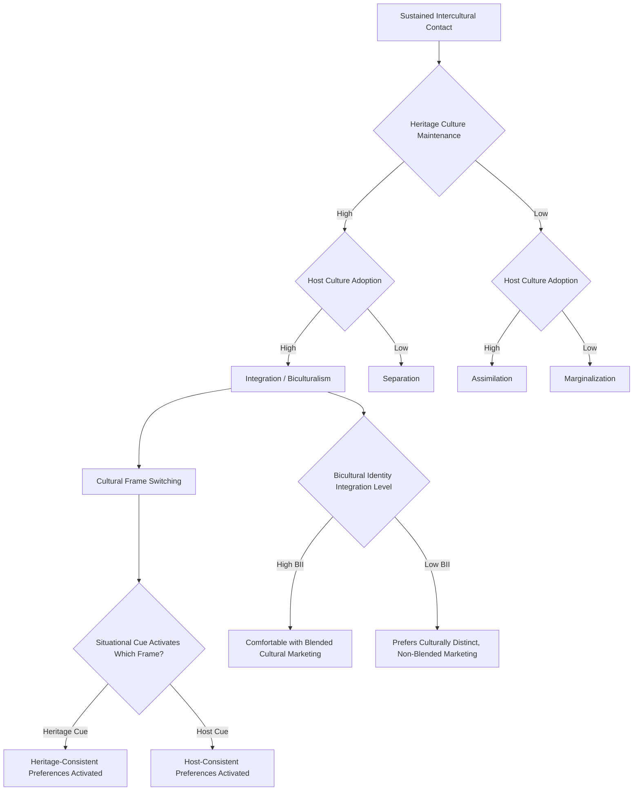

## Acculturation and Biculturalism in Consumption

### Definitions and Theoretical Foundation

Acculturation refers to the process by which individuals or groups adopt the attitudes, values, and behaviors of a culture different from their culture of origin, typically as a result of sustained contact between cultures through migration, colonization, or extended intercultural exposure. In consumer behavior research, acculturation specifically examines how this process shapes consumption patterns, brand preferences, media use, and marketplace behavior among immigrant and minority populations.

**Biculturalism** describes a specific acculturation outcome in which an individual maintains meaningful engagement with both their heritage culture and the host/mainstream culture simultaneously, developing the capacity to navigate and draw upon both cultural frameworks depending on context, rather than fully replacing one culture with the other.

### Berry's Fourfold Acculturation Model

John Berry's (1997) foundational framework, widely applied in consumer acculturation research, classifies acculturation outcomes along two independent dimensions: the degree to which an individual maintains their heritage culture, and the degree to which they adopt the host culture.

| Strategy | Heritage Culture Maintenance | Host Culture Adoption | Consumption Pattern |
| --- | --- | --- | --- |
| Assimilation | Low | High | Strong preference for host-culture brands, media, and consumption norms; heritage-culture products largely abandoned |
| Separation | High | Low | Strong preference for heritage-culture brands, media, and consumption norms; host-culture products largely avoided or minimally adopted |
| Integration (Biculturalism) | High | High | Selective, context-dependent consumption drawing on both cultural repertoires; often the most complex and marketing-relevant pattern |
| Marginalization | Low | Low | Reduced engagement with either cultural consumption framework; least common and most contested classification in contemporary research |

**Key Points**

- **Integration/biculturalism** is generally the most commonly observed and most extensively studied outcome in contemporary migration contexts, particularly in societies with multicultural policy orientations, though prevalence varies substantially by host society context, generational cohort, and specific origin-host cultural distance
- The Berry model's four-category framework has been critiqued in more recent acculturation research for oversimplifying what is often a more fluid, situational, and multidimensional process rather than a fixed categorical outcome; consumer acculturation researchers increasingly favor models that treat acculturation as a continuous, context-dependent, and potentially domain-specific process (an individual might integrate in food consumption while separating in media consumption, for example) [Inference: the degree to which acculturation strategy is domain-specific versus a consistent trait-like orientation across consumption categories is an active area of research without full consensus]

### Cultural Frame Switching

A key theoretical contribution to bicultural consumer research is **cultural frame switching** (Hong et al., 2000): the phenomenon by which bicultural individuals shift between culturally-specific cognitive frameworks, values, and behavioral responses depending on situational cues that activate one cultural identity or the other.

**Key Points**

- Frame switching can be triggered by relatively subtle situational or environmental cues, including language of communication, presence of specific cultural symbols or imagery, social context (interacting with heritage-culture versus host-culture individuals), or even priming through exposure to culturally-specific stimuli in an experimental or marketing context
- This has direct marketing implications: exposure to heritage-culture-specific advertising cues (language, symbols, culturally-specific narrative structures) can activate heritage-cultural values and preferences even among highly assimilated or host-culture-oriented bicultural consumers, at least temporarily
- The strength and consistency of frame-switching effects vary across individuals based on factors including the degree of biculturalism achieved, generational status (first-generation immigrants versus second-generation and beyond), and the specific cultural distance between heritage and host cultures [Inference: while frame-switching as a general phenomenon is well-documented in cultural psychology and consumer research, the magnitude of its effect on specific purchase behavior varies by study, product category, and population, and should not be assumed to produce large or reliable effects in every marketing application]

### Bicultural Identity Integration (BII)

Benet-Martínez and Haritatos's (2005) construct of **Bicultural Identity Integration** measures the degree to which bicultural individuals perceive their heritage and host cultural identities as compatible and integrated versus conflicting and difficult to reconcile:

- **High BII**: heritage and host identities are experienced as compatible, complementary, and integrated into a coherent sense of self; individuals with high BII tend to move fluidly between cultural frames without significant psychological tension
- **Low BII**: heritage and host identities are experienced as being in conflict or difficult to reconcile, sometimes producing psychological tension when navigating situations that activate both cultural frames simultaneously

This distinction matters for marketing because high-BII and low-BII bicultural consumers may respond differently to marketing that explicitly blends or juxtaposes heritage and host cultural elements: high-BII consumers may find such blended messaging appealing and identity-affirming, while low-BII consumers may find it uncomfortable or dissonance-inducing [Inference: this differential response pattern is theoretically predicted by the BII framework and has empirical support in some studies, but the consistency of this effect across different marketing contexts and cultural pairings requires case-by-case consideration].

### Generational Differences in Acculturation and Consumption

**Key Points**

- **First-generation immigrants** (those who themselves migrated) typically show more variable acculturation patterns depending on age at migration, length of residence, and reason for migration, often maintaining stronger heritage-culture consumption patterns, particularly for identity-central and nostalgia-linked categories (food, media, religious/cultural products)
- **Second-generation and later-generation** descendants of immigrants typically show higher rates of biculturalism or assimilation, having been socialized substantially within the host culture from birth while often maintaining some heritage-culture connection through family and community ties
- Straight-line assimilation models (predicting steady generational progression toward full host-culture assimilation) have been challenged by "segmented assimilation" research, which documents more variable generational trajectories depending on socioeconomic context, discrimination experiences, and the specific host community's relationship to the heritage culture [Inference: segmented assimilation patterns are documented in sociological research primarily in specific national contexts, and generalizing specific trajectory predictions across all migration contexts requires caution]

### Language as an Acculturation and Marketing Variable

- Language use and preference is one of the most extensively studied and marketing-actionable acculturation indicators, since language choice directly determines media consumption patterns, advertising receptiveness, and often functions as a proxy for broader acculturation orientation
- Heritage-language advertising can serve a dual function: reaching less-acculturated heritage-language-dominant consumers directly, while also functioning as an identity-affirming frame-switching cue for bicultural consumers who are host-language dominant in daily life but retain strong heritage cultural identification
- Code-switching within marketing communications (deliberately blending heritage and host language within a single message) has been used as a technique to signal specifically to bicultural audiences, though effectiveness depends heavily on execution quality and the specific linguistic community's own natural code-switching norms [Inference: the effectiveness of marketing code-switching varies by execution authenticity and specific bicultural community norms, and poorly executed attempts can be perceived as inauthentic or exploitative rather than identity-affirming]

### Practical Applications in Marketing

**Example**

A food and beverage brand targeting a bicultural immigrant community could apply this framework as follows:

- Recognize that **food consumption is often one of the most heritage-culture-retentive categories** even among highly host-culture-assimilated bicultural consumers, since food carries strong nostalgic and identity-affirming value, meaning heritage-authentic product lines may find receptive audiences even among consumers who are otherwise highly assimilated in other consumption domains
- Design marketing that leverages **frame-switching cues** appropriately: heritage-culture visual and linguistic elements can activate heritage cultural values and increase receptiveness, but execution must be handled with genuine cultural competence to avoid superficial or stereotyped representation that could alienate the target community
- Consider **BII-informed message design**: offering both heritage-forward and host-forward product or messaging variants may serve different bicultural sub-segments more effectively than a single blended approach, particularly given the variation in comfort with cultural blending across the BII spectrum
- Account for **generational segmentation** within the broader community, recognizing that first-generation and later-generation members of the same heritage community may have meaningfully different consumption patterns, media habits, and receptiveness to heritage-culture versus host-culture-oriented marketing

### Measurement Approaches

- **Acculturation scales**: validated multi-item instruments (e.g., adaptations of the Suinn-Lew Asian Self-Identity Acculturation Scale, or similar instruments developed for other specific population contexts) measuring language use, media consumption, social affiliation, and value orientation across heritage and host cultural dimensions
- **Bicultural Identity Integration Scale (BIIS)**: measuring the compatibility versus conflict dimension of bicultural identity, used to predict differential response to culturally-blended versus culturally-distinct marketing approaches
- **Behavioral consumption tracking by domain**: examining acculturation patterns separately across specific consumption domains (food, media, financial products, religious/cultural goods) rather than assuming a single acculturation score applies uniformly across all consumption behavior
- **Experimental priming studies**: using cultural cue exposure (imagery, language, symbols) in controlled experimental settings to directly test frame-switching effects on specific brand attitude or purchase intention outcomes relevant to a given marketing application

### Boundary Conditions and Limitations

**Key Points**

- Acculturation and biculturalism patterns vary enormously across specific heritage-host cultural pairings, migration contexts, host society reception and inclusion policies, and individual circumstances; general frameworks provide structure but should not substitute for population-specific research given this substantial heterogeneity
- Acculturation is increasingly recognized as **domain-specific and dynamic** rather than a single fixed trait, meaning marketers should avoid assuming a single acculturation classification predicts behavior uniformly across all product categories and life contexts for a given individual or population segment
- Marketing that engages heritage cultural identity carries meaningful risk of superficial, stereotyped, or tokenistic representation if not developed with genuine cultural competence and, ideally, direct input from the target community; such missteps can generate significant backlash given the identity-sensitive nature of acculturation-related marketing
- The digital and media environment has altered classical acculturation dynamics substantially, since digital connectivity allows sustained heritage-culture media and social engagement even after physical migration, potentially altering the pace and pattern of acculturation relative to pre-digital migration cohorts [Inference: the specific effect of digital connectivity on acculturation trajectories relative to historical pre-digital migration patterns is an active and evolving area of research without full consensus on its long-term magnitude]

### Acculturation Strategy and Consumption Pathway

### Berry's Acculturation Model Grid (svg_diagram)

<svg xmlns="http://www.w3.org/2000/svg" viewBox="0 0 700 420">
<text x="350" y="28" text-anchor="middle" font-size="18" font-weight="bold" fill="#1a1a1a">Berry's Acculturation Model Grid (svg_diagram)</text>
<line x1="150" y1="70" x2="150" y2="370" stroke="#333" stroke-width="1.5" />
<line x1="150" y1="220" x2="620" y2="220" stroke="#333" stroke-width="1.5" />

<text x="267" y="60" text-anchor="middle" font-size="12" font-weight="bold" fill="#333">Low Host Adoption</text>

<text x="500" y="60" text-anchor="middle" font-size="12" font-weight="bold" fill="#333">High Host Adoption</text>

<text x="100" y="145" text-anchor="middle" font-size="12" font-weight="bold" fill="#333" transform="rotate(-90 100 145)">High Heritage</text>

<text x="100" y="295" text-anchor="middle" font-size="12" font-weight="bold" fill="#333" transform="rotate(-90 100 295)">Low Heritage</text>

<rect x="150" y="70" width="235" height="150" fill="#e3f2fd" stroke="#1565c0" />
<text x="267" y="150" text-anchor="middle" font-size="13" font-weight="bold" fill="#0d47a1">Separation</text>
<rect x="385" y="70" width="235" height="150" fill="#c8e6c9" stroke="#2e7d32" />
<text x="500" y="150" text-anchor="middle" font-size="13" font-weight="bold" fill="#1b5e20">Integration</text>
<text x="500" y="168" text-anchor="middle" font-size="10" fill="#1b5e20">(Biculturalism)</text>
<rect x="150" y="220" width="235" height="150" fill="#f3e5f5" stroke="#6a1b9a" />
<text x="267" y="300" text-anchor="middle" font-size="13" font-weight="bold" fill="#4a148c">Marginalization</text>
<rect x="385" y="220" width="235" height="150" fill="#fff3e0" stroke="#ef6c00" />
<text x="500" y="300" text-anchor="middle" font-size="13" font-weight="bold" fill="#e65100">Assimilation</text>
</svg>

### Next Steps

- **Related Topics**:
  - Cultural frame switching and situational identity activation
  - Bicultural Identity Integration and marketing response
  - Cultural values frameworks in cross-cultural segmentation
  - High-context versus low-context communication
  - Ethnic marketing and culturally competent advertising practices
  - Language and code-switching in advertising strategy
  - Generational cohort effects in immigrant consumer behavior