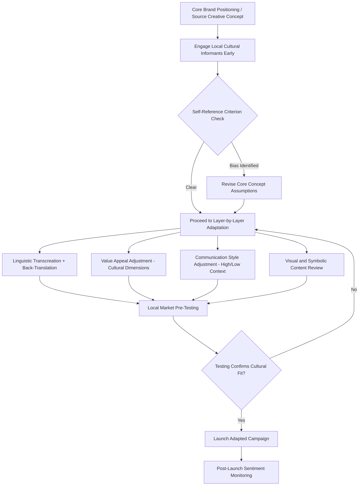

## Adapting Messaging Across Cultural Contexts

### Strategic Framework: Standardization vs. Adaptation

The central strategic tension in cross-cultural messaging is the classical **standardization versus adaptation debate** in international marketing, dating to Levitt's (1983) influential argument for global standardization versus subsequent scholarship demonstrating the persistent value of localized adaptation.

**Key Points**

- **Standardization** argues for a single, globally consistent message and creative execution, offering cost efficiency, consistent global brand identity, and simplified management, historically justified partly by claims of accelerating global cultural convergence
- **Adaptation** argues for tailoring messaging, creative execution, and even product positioning to local cultural, linguistic, and market conditions, justified by persistent cultural value differences (per frameworks such as Hofstede's and Schwartz's) and documented performance differences between standardized and localized campaigns in numerous studies
- Contemporary practice generally favors a **"glocalization"** middle path: maintaining a standardized core brand strategy, positioning, and visual identity while adapting specific creative executions, language, imagery, and messaging emphasis to local cultural contexts — treating standardization and adaptation as complementary rather than mutually exclusive strategies operating at different levels of the marketing system

### Layers of Cultural Adaptation

Cross-cultural messaging adaptation can be usefully organized across several distinct layers, each requiring different degrees and types of adjustment:

| Layer | What Requires Adaptation | Relevant Framework |
| --- | --- | --- |
| Linguistic | Direct translation, idiom, tone, formality register | Language-specific expertise, avoiding literal translation errors |
| Values and appeals | Which value dimensions the message emphasizes (individual vs. group benefit, tradition vs. innovation) | Hofstede's dimensions, Schwartz's basic values |
| Communication style | Directness/indirectness, explicit claims vs. implied meaning | High-context vs. low-context framework |
| Symbolic and visual content | Color meaning, imagery, gesture, symbol interpretation | Semiotic and cultural symbol research |
| Humor and narrative structure | What is considered funny, appropriate, or narratively satisfying | Cultural narrative and comedic convention research |
| Regulatory and normative content | Legal restrictions, social norms around specific claims or depictions | Local regulatory review, cultural sensitivity review |

### Linguistic Adaptation: Beyond Direct Translation

**Key Points**

- **Back-translation** (translating content to the target language, then independently translating it back to the source language to check for meaning drift) is a widely used quality-control technique in cross-cultural marketing research and message adaptation, though it does not by itself guarantee cultural appropriateness of tone, register, or connotation
- **Transcreation** (a term used in the localization industry) describes the process of adapting a message's creative intent and emotional impact for a target market rather than performing literal translation, often requiring substantial departure from the source-language wording to achieve equivalent persuasive and emotional effect
- Idiomatic expressions, wordplay, and culturally-specific references frequently do not translate directly and require either creative reinvention or complete replacement with functionally equivalent local references, since literal translation can produce confusing, meaningless, or unintentionally comedic results
- Brand and product naming requires specific phonetic and semantic screening in target languages, given well-documented historical cases of brand names carrying unintended negative or embarrassing connotations when transferred without adequate linguistic and cultural review

### Adapting Value Appeals

Building on cultural values frameworks (Hofstede, Schwartz, GLOBE), message content should shift its core value appeal depending on the target market's cultural orientation:

**Example**

A skincare brand launching a global campaign around a single product benefit (e.g., long-lasting hydration) could adapt its value appeal as follows:

- In a **high-individualism** market: emphasize personal self-expression and individual benefit ("your skin, your confidence")
- In a **high-collectivism** market: emphasize how the benefit supports social presentation and family/group-relevant outcomes ("look your best for the people who matter")
- In a **high-uncertainty-avoidance** market: emphasize clinical testing, dermatological endorsement, and detailed efficacy data to reduce perceived risk
- In a **low-uncertainty-avoidance** market: emphasize novelty, innovation, and experiential appeal with lighter reliance on exhaustive substantiation

### Adapting Communication Style

Drawing on the high-context/low-context framework, creative execution style should shift accordingly:

**Key Points**

- In **high-context markets**, adapted creative typically favors symbolic, atmospheric, and implication-driven storytelling, allowing the audience to actively construct meaning; explicit, hard-sell claims can feel culturally jarring or unsophisticated
- In **low-context markets**, adapted creative typically favors direct, explicit claims and clear calls to action, since audiences generally expect messages to be self-contained and unambiguous rather than requiring interpretive effort
- Directness of comparative claims against competitors also varies culturally; direct comparative advertising (naming and critiquing competitors explicitly) is both more culturally accepted and, in some markets, more legally permissible than in others, requiring both cultural and regulatory review before adaptation

### Symbolic and Visual Content Adaptation

**Key Points**

- **Color symbolism varies substantially across cultures**: colors associated with celebration, mourning, luck, or caution differ across cultural contexts, and campaign visual design should be reviewed against target-market-specific color association research rather than assuming universal color meaning
- **Gesture and body language depicted in imagery** can carry different, sometimes offensive, meanings across cultures, requiring visual content review beyond the verbal message alone
- **Numeric symbolism** (numbers considered lucky, unlucky, or otherwise culturally significant) can affect pricing display, product bundling, and even creative execution details (e.g., number of people or objects shown in an image) in specific markets
- Imagery depicting family structure, gender roles, religious symbols, and social relationships requires particular sensitivity, since these depictions can either resonate strongly with local audiences or generate significant offense if inconsistent with local norms and expectations

### Humor and Narrative Adaptation

- Humor is widely recognized as one of the most difficult creative elements to adapt cross-culturally, since comedic conventions (what makes something funny, appropriate targets for humor, acceptable absurdity or exaggeration levels) vary substantially and often do not translate through direct localization
- Narrative structure preferences (e.g., preference for explicit moral resolution versus ambiguous or open-ended narratives, preference for individual-hero versus collective-protagonist storytelling) can also vary culturally, connecting to the broader storytelling and narrative transportation theory discussed elsewhere, and adapted creative may need to restructure narrative arcs rather than simply re-voicing existing content

### The Self-Reference Criterion and Common Adaptation Pitfalls

**Key Points**

- Lee's (1966) **self-reference criterion** describes the common and largely unconscious tendency for marketers to evaluate foreign market messaging through the lens of their own cultural assumptions, frequently leading to inappropriate assumptions about what will resonate, offend, or persuade in an unfamiliar cultural context
- Mitigating self-reference criterion bias requires structured processes: involving local market experts and native cultural informants directly in message development (rather than only in final-stage translation review), conducting local market testing before launch, and explicitly documenting and challenging cultural assumptions embedded in the original source-market creative concept
- A common and costly adaptation failure pattern involves treating localization as a late-stage translation task applied to an already-finalized source-market creative concept, rather than involving cultural adaptation considerations from the earliest stages of message and creative strategy development

### Digital and Algorithmic Considerations in Cross-Cultural Messaging

- **Sentiment analysis and content moderation systems** trained primarily on data from one cultural/linguistic context may misclassify or mishandle content from other cultural contexts, particularly those with higher-context or more indirect communication norms, requiring careful validation before deploying automated content systems across culturally diverse markets [Inference: this is a documented general limitation of natural language processing systems trained on culturally and linguistically non-representative data, though the specific magnitude of misclassification risk varies by system and language pair]
- Algorithmically personalized advertising delivery introduces an additional layer of cultural adaptation consideration, since algorithmic targeting systems may inadvertently reinforce cultural stereotypes or fail to account for within-market cultural heterogeneity (e.g., diaspora and bicultural populations within a given national market) if not deliberately designed with cultural nuance in mind

### Practical Application Workflow

**Example**

A global consumer packaged goods brand planning a new product launch across multiple international markets could apply this framework through a structured process:

1. Develop a **standardized core brand positioning and creative concept** at headquarters, informed by cultural values research across target markets to avoid embedding source-market-specific cultural assumptions from the outset
2. Engage **local market teams and native cultural informants early** in creative development, rather than only for final translation, to identify potential self-reference criterion issues before creative concepts are finalized
3. Conduct **linguistic transcreation** (not literal translation) for verbal content, with back-translation quality checks and dedicated review for brand/product naming
4. Conduct **visual and symbolic content review** specific to each target market, checking color symbolism, imagery appropriateness, and gesture/body language depicted
5. Adjust **communication style and value appeal emphasis** according to the target market's positioning on relevant cultural values dimensions (individualism/collectivism, uncertainty avoidance, high/low-context)
6. Conduct **local market pre-testing** of adapted creative before full launch, using local consumer panels to validate cultural appropriateness and persuasive effectiveness

### Measurement Approaches

- **Pre-launch local market testing**: qualitative and quantitative testing of adapted creative concepts with local consumer panels, assessing comprehension, cultural appropriateness, and persuasive effectiveness before full campaign launch
- **Back-translation and linguistic quality audits**: systematic checking of translated and transcreated content for meaning drift, unintended connotation, and idiomatic accuracy
- **Post-launch sentiment and reception tracking**: monitoring social media sentiment, customer service feedback, and press coverage in each market following launch to identify unanticipated cultural reception issues requiring rapid response
- **Cross-market creative performance comparison**: comparing engagement, conversion, and brand lift metrics across markets running standardized versus adapted creative versions, where feasible, to empirically validate the relative effectiveness of adaptation investment for a specific brand and category

### Boundary Conditions and Limitations

**Key Points**

- The appropriate degree of adaptation varies by product category, brand positioning strategy, and specific market cultural distance from the source market; there is no universally correct standardization-adaptation ratio, and the decision requires category- and brand-specific judgment informed by the frameworks discussed rather than a fixed formula
- Over-adaptation risks diluting global brand consistency and can, in some cases, appear inauthentic or pandering if executed without genuine cultural competence, just as under-adaptation risks cultural insensitivity or simple failure to resonate
- Cultural adaptation frameworks describe general tendencies and provide structured starting hypotheses, not deterministic rules; within-market heterogeneity (regional, generational, subcultural) means even well-researched national-level adaptation may require further refinement for specific target segments within a market
- Rapid cultural change, particularly among digitally-connected younger cohorts, means adaptation strategies developed from cultural research at one point in time should be periodically revisited rather than treated as permanently fixed guidance [Inference: the pace of relevant cultural shift varies by market and dimension, and periodic re-validation frequency should be calibrated to the specific market's rate of observed cultural and demographic change]

### Cross-Cultural Message Adaptation Workflow

### Standardization-Adaptation Spectrum (svg_diagram)

<svg xmlns="http://www.w3.org/2000/svg" viewBox="0 0 800 260">
<text x="400" y="26" text-anchor="middle" font-size="18" font-weight="bold" fill="#1a1a1a">Standardization-Adaptation Spectrum (svg_diagram)</text>
<rect x="60" y="110" width="680" height="50" rx="25" fill="url(#stdgrad)" stroke="#333" stroke-width="1.5" />

<text x="130" y="100" text-anchor="middle" font-size="13" font-weight="bold" fill="`#0d47a1`">Full Standardization</text>

<text x="670" y="100" text-anchor="middle" font-size="13" font-weight="bold" fill="`#e65100`">Full Adaptation</text>

<circle cx="400" cy="135" r="9" fill="#37474f" />
<text x="400" y="185" text-anchor="middle" font-size="12" font-weight="bold" fill="#333">Glocalization</text>
<text x="400" y="203" text-anchor="middle" font-size="10" fill="#555">Standard core positioning,</text>
<text x="400" y="217" text-anchor="middle" font-size="10" fill="#555">locally adapted execution</text>
</svg>

### Next Steps

- **Related Topics**:
  - Cultural values frameworks (Hofstede, GLOBE, Schwartz)
  - High-context versus low-context communication
  - Global brand standardization vs. localization strategy
  - Self-reference criterion and cross-cultural marketing bias
  - Transcreation and localization industry practices
  - Symbolic and color meaning in cross-cultural visual design
  - Acculturation and biculturalism in consumption