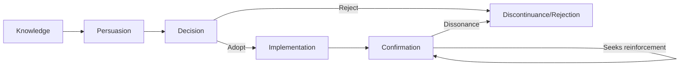

## Rogers' Diffusion of Innovation Model

### Overview

Rogers' Diffusion of Innovation (DOI) theory, formalized by Everett Rogers in *Diffusion of Innovations* (1962, now in its 5th edition), explains how, why, and at what rate new ideas, products, or technologies spread through a population. It is one of the foundational frameworks in marketing, communications, and behavioral science for understanding adoption behavior over time.

The model rests on four core elements:

1. **Innovation** — an idea, practice, or object perceived as new by an individual or unit of adoption
2. **Communication channels** — the means by which information about the innovation spreads (mass media vs. interpersonal)
3. **Time** — the temporal dimension across the innovation-decision process, adopter categorization, and rate of adoption
4. **Social system** — the set of interrelated units (individuals, groups, organizations) engaged in joint problem-solving toward a common goal

### The Adopter Categories

Rogers segments a population into five adopter categories based on **innovativeness** — the degree to which an individual adopts new ideas relative to others in the system. This segmentation follows a normal (bell curve) distribution when plotted against time.

| Category | % of Population | Psychological Profile |
| --- | --- | --- |
| Innovators | 2.5% | Venturesome, risk-tolerant, technically curious, financially resilient enough to absorb losses from failed innovations |
| Early Adopters | 13.5% | Opinion leaders, socially integrated, respected within the local system, judicious risk-takers |
| Early Majority | 34% | Deliberate, adopt just before the average member, rarely hold leadership positions but interact frequently with peers |
| Late Majority | 34% | Skeptical, adopt due to economic necessity or peer pressure, cautious about uncertainty |
| Laggards | 16% | Traditional, isolated within the social system, decision-making oriented to the past, resistant to change agents |

**Key Points**

- The distribution is statistical (mean and standard deviation of adoption time), not a strict headcount rule
- Category boundaries are defined by standard deviations from the mean adoption time ($\bar{x} \pm \text{SD}$)
- Marketing strategy typically differs sharply by category — e.g., innovators respond to novelty messaging, late majority responds to social proof and risk-reduction messaging

### The Bell Curve and S-Curve (svg_diagram)

The adopter distribution (bell curve, frequency over time) and cumulative adoption (S-curve) are companion visualizations of the same underlying process.

<svg xmlns="http://www.w3.org/2000/svg" viewBox="0 0 760 420">
<text x="380" y="24" text-anchor="middle" font-size="16" font-weight="bold" fill="#1a1a1a">Diffusion of Innovation: Bell Curve vs S-Curve (svg_diagram)</text>

<line x1="60" y1="360" x2="700" y2="360" stroke="#333" stroke-width="1.5" />
<line x1="60" y1="360" x2="60" y2="60" stroke="#333" stroke-width="1.5" />
<text x="380" y="395" text-anchor="middle" font-size="12" fill="#333">Time</text>
<text x="30" y="210" text-anchor="middle" font-size="12" fill="#333" transform="rotate(-90 30 210)">Adopters</text>

<path d="M 60 355 C 150 355, 180 300, 220 260 C 260 220, 280 90, 340 80 C 400 90, 420 220, 460 260 C 500 300, 550 340, 640 352 L 700 355" fill="none" stroke="`#2563eb`" stroke-width="2.5" />

<path d="M 60 355 C 150 355, 200 350, 240 330 C 300 300, 320 180, 380 130 C 440 90, 500 75, 580 70 C 630 68, 670 65, 700 65" fill="none" stroke="`#dc2626`" stroke-width="2.5" stroke-dasharray="0" />

<line x1="150" y1="60" x2="150" y2="360" stroke="#999" stroke-width="1" stroke-dasharray="4,4" />
<line x1="255" y1="60" x2="255" y2="360" stroke="#999" stroke-width="1" stroke-dasharray="4,4" />
<line x1="425" y1="60" x2="425" y2="360" stroke="#999" stroke-width="1" stroke-dasharray="4,4" />
<line x1="595" y1="60" x2="595" y2="360" stroke="#999" stroke-width="1" stroke-dasharray="4,4" />

<text x="105" y="378" text-anchor="middle" font-size="10" fill="`#1a1a1a`">Innovators</text>

<text x="105" y="390" text-anchor="middle" font-size="9" fill="#666">2.5%</text>

<text x="202" y="378" text-anchor="middle" font-size="10" fill="`#1a1a1a`">Early Adopters</text>

<text x="202" y="390" text-anchor="middle" font-size="9" fill="#666">13.5%</text>

<text x="340" y="378" text-anchor="middle" font-size="10" fill="`#1a1a1a`">Early Majority</text>

<text x="340" y="390" text-anchor="middle" font-size="9" fill="#666">34%</text>

<text x="510" y="378" text-anchor="middle" font-size="10" fill="`#1a1a1a`">Late Majority</text>

<text x="510" y="390" text-anchor="middle" font-size="9" fill="#666">34%</text>

<text x="648" y="378" text-anchor="middle" font-size="10" fill="`#1a1a1a`">Laggards</text>

<text x="648" y="390" text-anchor="middle" font-size="9" fill="#666">16%</text>

<rect x="500" y="90" width="14" height="3" fill="#2563eb" />
<text x="520" y="94" font-size="11" fill="#1a1a1a">Adoption frequency (bell)</text>
<rect x="500" y="110" width="14" height="3" fill="#dc2626" />
<text x="520" y="114" font-size="11" fill="#1a1a1a">Cumulative adoption (S-curve)</text>
</svg>

### The Innovation-Decision Process

At the individual level, Rogers models adoption as a five-stage process, not a single decision event:

1. **Knowledge** — the individual is exposed to the innovation's existence and gains some understanding of how it functions
2. **Persuasion** — the individual forms a favorable or unfavorable attitude toward the innovation (affective stage, heavily influenced by peer opinion and interpersonal networks)
3. **Decision** — the individual engages in activities leading to a choice to adopt or reject
4. **Implementation** — the individual puts the innovation to use; practical problems of "how to" are resolved here
5. **Confirmation** — the individual seeks reinforcement for the decision already made; reversal can occur if conflicting messages are encountered (discontinuance)

**Key Points**

- Persuasion is distinct from Decision — attitude formation does not guarantee behavioral commitment
- Discontinuance takes two forms: **replacement discontinuance** (adopting a superior alternative) and **disenchantment discontinuance** (dissatisfaction with performance)
- This stage model underlies later frameworks like the Hierarchy of Effects and Technology Acceptance Model (TAM)

### Five Perceived Attributes of Innovations

Rogers identifies five characteristics, as perceived by potential adopters (not objective/engineering characteristics), that explain 49–87% of variance in adoption rate across various studies [Unverified — variance figures depend on study and innovation type]:

| Attribute | Definition | Marketing Implication |
| --- | --- | --- |
| **Relative Advantage** | Degree to which an innovation is perceived as better than the idea it supersedes | Emphasize measurable superiority (cost, status, convenience, satisfaction) |
| **Compatibility** | Degree of perceived consistency with existing values, past experiences, and needs of adopters | Frame product to align with existing habits/beliefs rather than requiring wholesale behavior change |
| **Complexity** | Degree to which an innovation is perceived as difficult to understand and use | Simplify onboarding; complexity is inversely related to adoption rate |
| **Trialability** | Degree to which an innovation can be experimented with on a limited basis | Offer free trials, samples, freemium tiers, demo units |
| **Observability** | Degree to which results of an innovation are visible to others | Design for visible use (badges, public sharing, visible product design) to trigger social proof |

**Example**

A SaaS company launching an AI writing assistant can map its go-to-market directly onto these five attributes: relative advantage (faster drafting vs. manual writing), compatibility (works inside existing tools like Google Docs), complexity (minimized via a simple sidebar UI instead of a new standalone app), trialability (a free 14-day trial), and observability (shareable "written with AI-assist" output that colleagues notice).

### Communication Channels and Opinion Leadership

Rogers distinguishes:

- **Mass media channels** — efficient for creating *awareness-knowledge* (informing large audiences quickly) but weaker at changing attitudes
- **Interpersonal channels** — more effective for *persuasion*, especially when the source is perceived as similar to the receiver (**homophily**)

This gives rise to the **two-step flow of communication** concept (originally from Lazarsfeld, integrated into DOI): mass media influences **opinion leaders**, who then influence the broader social system through interpersonal networks. Opinion leaders are typically drawn from the Early Adopter category — sufficiently similar to the mainstream to be trusted (homophilous) but exposed early enough to novelty to have unique information (a degree of heterophily).

### Rate of Adoption and the Chasm Concept

The **rate of adoption** is the relative speed with which an innovation is adopted by members of a social system, typically measured as the time required for a given percentage of the system to adopt.

[Inference] Later marketing theorists, notably Geoffrey Moore in *Crossing the Chasm* (1991), identified a discontinuity ("the chasm") between Early Adopters and Early Majority specifically for discontinuous/disruptive technology products — the psychographic gap between visionaries (early adopters) and pragmatists (early majority) is large enough that momentum built in the early segments does not automatically transfer to the majority market. This is an extension of, not a component of, Rogers' original model, but it is commonly taught alongside DOI in marketing curricula.

### Critiques and Limitations

- **Pro-innovation bias**: the model implicitly assumes adoption is desirable and rejection/discontinuance is a failure state, which can bias research design
- **Individual-blame bias**: places responsibility for non-adoption on the individual (e.g., "laggard" framing) rather than systemic/structural barriers (access, affordability, infrastructure)
- **Recall problem**: much diffusion research relies on retrospective self-report of when adoption occurred, introducing recall bias
- **Equality issues**: diffusion often widens socioeconomic gaps, since innovators/early adopters tend to have more resources, potentially increasing the gap between them and later categories

### Practical Application in Marketing Strategy

**Next Steps**

- Segment go-to-market messaging by adopter category rather than using one message for the entire market
- Identify and cultivate opinion leaders/early adopters as a deliberate channel strategy (seeding programs, ambassador programs, beta cohorts)
- Audit the product/offer against the five perceived attributes before launch; complexity and low trialability are the most common self-inflicted adoption barriers
- Use the S-curve position to calibrate marketing spend — early-stage spend should prioritize awareness-knowledge and opinion-leader capture; later-stage spend should prioritize risk-reduction and social proof for the majority segments

**Related Topics**

- Geoffrey Moore's Crossing the Chasm and the Technology Adoption Life Cycle
- Two-Step Flow Theory of Communication (Lazarsfeld & Katz)
- Technology Acceptance Model (TAM) and Perceived Usefulness/Ease of Use
- Social Proof and Herd Behavior in consumer psychology
- Network Effects and Critical Mass Theory
- Homophily and Heterophily in interpersonal influence networks
- Bass Diffusion Model (mathematical/econometric formalization of DOI)