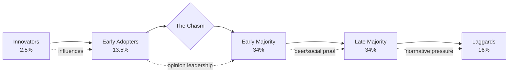

## Adopter Categories and the Adoption Curve

### Overview

Diffusion of Innovation (DOI) theory, formalized by Everett Rogers in *Diffusion of Innovations* (1962), describes how, why, and at what rate new ideas, products, or technologies spread through a population. The adoption curve segments a market into five behaviorally distinct groups based on when they adopt an innovation relative to others in their social system. Adoption is treated as a communication process governed by social system dynamics, not merely an individual purchase decision.

**Key Points**

- Adoption timing follows an approximately normal (bell-curve) distribution when plotted against time
- Cumulative adoption over time produces an S-shaped (sigmoid) curve
- Segments are defined by standard deviations from the mean adoption time, not by arbitrary percentage splits
- Each category has distinct psychographic, social, and risk-tolerance profiles requiring different marketing approaches

---

### The Five Adopter Categories

#### 1. Innovators (~2.5%)

Innovators are the first to adopt an innovation. They are defined by venturesomeness — willingness to accept risk, including financial loss, product failure, or social ostracism from championing something unproven.

- **Psychographic profile**: High risk tolerance, substantial financial resources (able to absorb losses from failed adoptions), cosmopolitan social relationships that often extend beyond the local social system, comfort with technical/scientific complexity
- **Information sources**: Scientific publications, other innovators (often in geographically dispersed networks), direct manufacturer contact
- **Marketing implication**: Innovators are not necessarily opinion leaders within the local social system — their cosmopolitan orientation can make them seen as eccentric or disconnected by mainstream members. Marketing to this group should emphasize novelty, technical specifications, and exclusivity rather than social proof.

#### 2. Early Adopters (~13.5%)

Early Adopters are the most integrated members of the local social system relative to any other category. They hold the highest degree of opinion leadership in most social systems.

- **Psychographic profile**: Respected, socially integrated, judicious risk-takers (unlike Innovators, they evaluate before committing), serve as role models for the Early Majority
- **Information sources**: Trade publications, professional networks, peer recommendations from other respected local figures
- **Marketing implication**: This is the highest-leverage segment for word-of-mouth strategy. Reducing perceived uncertainty for this group (via case studies, demos, credible endorsements) has outsized downstream effects because the Early Majority explicitly looks to this group before adopting. Geoffrey Moore's *Crossing the Chasm* (1991) identifies the gap between Early Adopters and Early Majority as the highest-risk transition point for a product.

#### 3. Early Majority (~34%)

The Early Majority adopts just before the average member of the social system. They deliberate for a longer period before adopting than Innovators or Early Adopters.

- **Psychographic profile**: Interact frequently with peers but rarely hold formal opinion-leadership positions; pragmatic rather than visionary; require evidence of proven value
- **Information sources**: Peer recommendations, mainstream media, comparative reviews, case studies from similar organizations/individuals
- **Marketing implication**: Messaging should shift from "innovative and exclusive" to "proven and reliable." Social proof (adoption counts, testimonials, market share data) is disproportionately persuasive here compared to novelty framing.

#### 4. Late Majority (~34%)

The Late Majority adopts just after the average member, approaching an innovation with skepticism and caution. Adoption is often driven by economic necessity or increasing social pressure from peer adoption norms.

- **Psychographic profile**: Skeptical, below-average social status typically, limited financial slack (adoption often waits until price drops or risk is eliminated), responsive to normative pressure ("everyone else is doing it")
- **Information sources**: Peers within the Late Majority and Early Majority, less influenced by media or expert opinion, more influenced by direct observation of peers' outcomes
- **Marketing implication**: Emphasize risk elimination, cost parity/advantage, ease of use, and normalize adoption as the standard/default choice rather than a differentiated one.

#### 5. Laggards (~16%)

Laggards are the last to adopt, if they adopt at all. Their reference point is frequently traditional or historical rather than forward-looking.

- **Psychographic profile**: Traditional value orientation, near-isolate position in social networks (limited exposure to change agents), often lower socioeconomic resources, high suspicion of innovations and change agents
- **Information sources**: Neighbors and friends with similarly traditional views; largely insulated from mass media innovation messaging
- **Marketing implication**: Traditional marketing has low ROI on this segment. Adoption, when it occurs, tends to be driven by the innovation itself becoming obsolete-avoidance necessity (e.g., a legacy system being discontinued) rather than persuasion.

---

### Statistical Basis for Category Boundaries

Rogers derived the category cutoffs by treating adoption time as a normally distributed variable and segmenting by standard deviation ($\sigma$) from the mean adoption time ($\bar{x}$):

| Category | Range | Approx. % of Population |
| --- | --- | --- |
| Innovators | $< \bar{x} - 2\sigma$ | 2.5% |
| Early Adopters | $\bar{x} - 2\sigma$ to $\bar{x} - \sigma$ | 13.5% |
| Early Majority | $\bar{x} - \sigma$ to $\bar{x}$ | 34% |
| Late Majority | $\bar{x}$ to $\bar{x} + \sigma$ | 34% |
| Laggards | $> \bar{x} + \sigma$ | 16% |

[Inference] These percentages are theoretical approximations derived from assuming normality; empirical adoption curves for specific products frequently deviate from a perfect normal distribution due to factors like network effects, pricing changes, or regulatory shocks.

---

### The Adoption Curve (Frequency Distribution)

The following diagram shows the standard bell-curve representation of adopter categories against a timeline, with the corresponding cumulative S-curve beneath it conceptually.

<svg xmlns="http://www.w3.org/2000/svg" viewBox="0 0 900 480" font-family="Helvetica, Arial, sans-serif">
<text x="450" y="30" text-anchor="middle" font-size="20" font-weight="bold" fill="#1a1a1a">Diffusion of Innovation Adoption Curve (svg_diagram)</text>

<line x1="80" y1="400" x2="850" y2="400" stroke="#333" stroke-width="2" />
<line x1="80" y1="400" x2="80" y2="60" stroke="#333" stroke-width="2" />
<text x="465" y="440" text-anchor="middle" font-size="14" fill="#333">Time of Adoption →</text>
<text x="30" y="230" text-anchor="middle" font-size="14" fill="#333" transform="rotate(-90 30 230)">Number of Adopters</text>

<path d="M 80 400 Q 130 400 150 380 Q 170 340 190 300 Q 220 240 260 190 Q 300 140 340 110 Q 380 90 420 80 L 420 400 Z" fill="#2E86AB" fill-opacity="0.75" />
<path d="M 190 300 Q 220 240 260 190 Q 300 140 340 110 Q 380 90 420 80 Q 460 90 500 110 Q 540 140 580 190 L 580 400 L 190 400 Z" fill="#48A9A6" fill-opacity="0.45" />

<rect x="80" y="60" width="55" height="340" fill="#E63946" fill-opacity="0.15" />
<rect x="135" y="60" width="115" height="340" fill="#F4A261" fill-opacity="0.15" />
<rect x="250" y="60" width="185" height="340" fill="#2A9D8F" fill-opacity="0.15" />
<rect x="435" y="60" width="185" height="340" fill="#457B9D" fill-opacity="0.15" />
<rect x="620" y="60" width="150" height="340" fill="#6D6875" fill-opacity="0.15" />

<path d="M 80 398 C 150 395, 180 360, 220 280 C 260 195, 330 90, 420 75 C 510 90, 580 195, 620 280 C 660 360, 690 395, 760 398" fill="none" stroke="`#1a1a1a`" stroke-width="2.5" />

<text x="107" y="390" text-anchor="middle" font-size="11" fill="`#1a1a1a`" font-weight="bold">Innovators</text>

<text x="107" y="404" text-anchor="middle" font-size="10" fill="#333">2.5%</text>

<text x="192" y="390" text-anchor="middle" font-size="11" fill="`#1a1a1a`" font-weight="bold">Early</text>

<text x="192" y="402" text-anchor="middle" font-size="11" fill="`#1a1a1a`" font-weight="bold">Adopters</text>

<text x="192" y="414" text-anchor="middle" font-size="10" fill="#333">13.5%</text>

<text x="342" y="390" text-anchor="middle" font-size="12" fill="`#1a1a1a`" font-weight="bold">Early Majority</text>

<text x="342" y="404" text-anchor="middle" font-size="10" fill="#333">34%</text>

<text x="527" y="390" text-anchor="middle" font-size="12" fill="`#1a1a1a`" font-weight="bold">Late Majority</text>

<text x="527" y="404" text-anchor="middle" font-size="10" fill="#333">34%</text>

<text x="695" y="390" text-anchor="middle" font-size="12" fill="`#1a1a1a`" font-weight="bold">Laggards</text>

<text x="695" y="404" text-anchor="middle" font-size="10" fill="#333">16%</text>

<line x1="250" y1="60" x2="250" y2="400" stroke="#D62828" stroke-width="2" stroke-dasharray="6,4" />
<text x="250" y="50" text-anchor="middle" font-size="11" fill="#D62828" font-weight="bold">"The Chasm"</text>

<line x1="420" y1="60" x2="420" y2="400" stroke="#333" stroke-width="1" stroke-dasharray="3,3" />
<text x="420" y="440" text-anchor="middle" font-size="11" fill="#333">x̄ (mean)</text>
</svg>

---

### Cumulative Adoption (S-Curve) Logic

The cumulative percentage of adopters over time, $F(t)$, corresponds to the cumulative distribution function of the underlying (approximately normal) adoption-time density:

$$F(t) = \int_{-\infty}^{t} f(\tau)\,d\tau$$

where $f(\tau)$ is the adoption density function represented by the bell curve above. Because the density is unimodal and roughly symmetric, $F(t)$ produces the characteristic flat-start, steep-middle, flat-end S-shape: slow initial uptake (Innovators, Early Adopters), rapid acceleration through the Majority segments, and a long tail as Laggards adopt.

---

### Crossing the Chasm (Moore's Extension)

Geoffrey Moore's model refines Rogers's curve for high-tech / discontinuous-innovation markets by identifying a **gap ("the chasm")** between Early Adopters and the Early Majority.

- Early Adopters buy based on vision and competitive advantage from being first; they tolerate bugs and incompleteness
- Early Majority buy based on proven practicality and want a complete, low-risk solution with references from within their own peer/industry context
- Because Early Adopters are poor references for the pragmatist Early Majority (different buying criteria, sometimes different industries), products can stall after initial buzz

**Marketing implication**: Moore recommends a "bowling pin" strategy — dominate a single, narrow niche market segment completely to generate credible same-industry references, then use that foothold to expand into adjacent niches, rather than attempting broad simultaneous marketing across the whole Early Majority.

[Speculation] The chasm concept, while widely cited in B2B technology marketing, has weaker empirical support outside high-tech/discontinuous-innovation contexts and may not generalize cleanly to low-involvement consumer goods.

---

### Five Perceived Attributes Driving Adoption Rate

Rogers identifies five innovation characteristics that determine how quickly diffusion occurs across all categories:

1. **Relative Advantage** — degree to which the innovation is perceived as better than what it supersedes
2. **Compatibility** — consistency with existing values, past experiences, and needs of potential adopters
3. **Complexity** — degree of difficulty in understanding/using the innovation (inversely related to adoption speed)
4. **Trialability** — degree to which the innovation can be experimented with on a limited basis
5. **Observability** — degree to which results are visible to others

**Example**

A SaaS company launching a new analytics dashboard can accelerate diffusion by: offering a free trial tier (Trialability), ensuring the UI mirrors familiar spreadsheet conventions (Compatibility), publishing visible customer logos and public case studies (Observability), and quantifying time-saved metrics in marketing copy (Relative Advantage).

---

### Practical Segmentation Application in Marketing

| Category | Primary Message Frame | Channel Fit | CAC/Conversion Behavior |
| --- | --- | --- | --- |
| Innovators | "First to have it" | Direct outreach, technical forums, PR | Low CAC sensitivity, high churn risk if buggy |
| Early Adopters | "Competitive edge" | Thought-leadership content, influencer/analyst relations | High LTV, strong referral source |
| Early Majority | "Proven, safe choice" | Case studies, comparison content, retargeting | Moderate CAC, conversion needs social proof |
| Late Majority | "Everyone's switched" | Price promotions, mainstream advertising | High CAC sensitivity, price-driven |
| Laggards | "Necessary replacement" | Legacy-system sunset notices, direct sales | Very high CAC, often requires forced migration |

[Unverified] Exact CAC and conversion figures vary substantially by industry, product category, and competitive context; the directional relationships shown here reflect general marketing consensus rather than a specific benchmarked dataset.

---

### Common Critiques and Limitations

- **Ecological validity**: Original research was conducted largely on agricultural innovations (e.g., hybrid seed corn adoption in Iowa) in the mid-20th century; consumer technology contexts may not perfectly replicate the same social dynamics
- **Category boundaries as artifacts of methodology**: The standard-deviation cutoffs are a modeling convenience, not an empirically discovered natural boundary — real populations may not adopt in a strictly normal distribution
- **Static category assumption**: Individuals are not fixed permanently in one category across all innovation types; someone may be an Innovator for one product category (e.g., mobile apps) and a Laggard for another (e.g., financial products)
- **Network effects distortion**: For innovations with strong network effects (e.g., social platforms, two-sided marketplaces), adoption dynamics can deviate significantly from the classical bell curve due to critical mass thresholds

---

**Related Topics**

- Perceived attributes of innovations (relative advantage, compatibility, complexity, trialability, observability) in depth
- Opinion leadership and two-step flow theory
- Crossing the Chasm and the technology adoption life cycle (Moore)
- Network effects and critical mass in platform adoption
- Bass Diffusion Model (mathematical alternative to Rogers's curve)
- Innovation-decision process stages (knowledge, persuasion, decision, implementation, confirmation)
- Segmentation strategy design for multi-category go-to-market plans