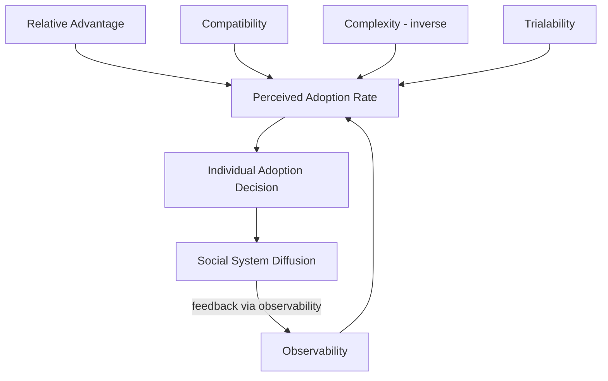

## Perceived Attributes of Innovations

### Overview

Rogers's Diffusion of Innovations framework holds that the *rate of adoption* of a new product, service, or idea is not primarily determined by its objective technical merit, but by how potential adopters **perceive** it along five attribute dimensions: Relative Advantage, Compatibility, Complexity, Trialability, and Observability. Research across hundreds of diffusion studies attributes 49–87% of the variance in adoption rate to these five perceived attributes combined, making this framework one of the highest-leverage psychological models for innovation marketing.

**Key Points**

- Perception, not objective fact, drives adoption speed — an objectively superior product can diffuse slower than an inferior one if perceived attributes are unfavorable
- The five attributes are independent but interacting; marketing strategy typically must address multiple simultaneously
- Attributes are adopter-segment-relative — an attribute perceived as an advantage by Innovators (e.g., cutting-edge complexity) may be perceived as a liability by the Late Majority

---

### 1. Relative Advantage

The degree to which an innovation is perceived as better than the idea, product, or practice it supersedes.

- **Sub-dimensions**: Economic profitability, social prestige conferred, convenience/time savings, satisfaction/immediate reward
- **Measurement proxy**: Often operationalized in adoption research via perceived cost-benefit ratio versus incumbent solution
- **Psychological mechanism**: Relative advantage functions largely through loss-aversion and status-quo-bias override — the perceived gain must be large enough to overcome the friction cost of switching (see Prospect Theory, Kahneman & Tversky, 1979)

**Example**

Contactless payment cards diffused rapidly in markets where the relative advantage (transaction speed) was highly visible at the point of use (a few seconds saved per transaction, repeated daily), compared to innovations with relative advantages that only materialize after long time horizons (e.g., retirement savings products), which diffuse more slowly despite larger absolute benefit.

---

### 2. Compatibility

The degree to which an innovation is perceived as consistent with existing values, past experiences, and needs of potential adopters.

- **Sub-dimensions**:
  - *Value compatibility* — alignment with sociocultural beliefs and norms
  - *Experiential compatibility* — fit with previously adopted ideas or tools
  - *Needs compatibility* — alignment with a felt, articulated need
- **Psychological mechanism**: Low compatibility requires the adopter to undergo a preliminary value or belief shift before the innovation itself can be adopted — an extra cognitive step that slows diffusion regardless of relative advantage

**Example**

Plant-based meat alternatives marketed with taste/texture parity messaging ("tastes just like beef") target experiential compatibility, allowing adopters to slot the product into existing behavioral routines (grilling, taco night) without requiring a values shift, versus messaging centered purely on environmental ethics, which requires values realignment first.

---

### 3. Complexity

The degree to which an innovation is perceived as difficult to understand and use. Unlike the other four attributes, Complexity is *inversely* related to adoption rate.

- **Sub-dimensions**: Conceptual complexity (is the underlying idea hard to grasp?), operational complexity (is the interface/procedure hard to execute?)
- **Psychological mechanism**: Complexity increases perceived self-efficacy risk — the adopter's confidence in their own ability to successfully use the innovation (closely related to Bandura's self-efficacy construct)
- **Marketing lever**: Onboarding flows, tutorials, progressive disclosure of features, and simplified initial use cases all function as complexity-reduction mechanisms independent of any change to the underlying product

**Example**

Early spreadsheet software (VisiCalc, Lotus 1-2-3) diffused into business use substantially faster than earlier programmable business computing tools because the grid-and-formula metaphor mapped onto an already-familiar mental model (paper ledgers), lowering perceived operational complexity despite comparable underlying computational power.

---

### 4. Trialability

The degree to which an innovation can be experimented with on a limited basis before a full commitment decision.

- **Sub-dimensions**: Divisibility (can it be tried in small units — a sample, a free tier, a trial period?), reversibility (can the adopter easily revert if unsatisfied?)
- **Psychological mechanism**: Trialability reduces perceived risk under uncertainty by converting an irreversible high-stakes decision into a reversible low-stakes one, lowering the threshold required for the adoption decision
- **Marketing lever**: Freemium models, free trials, sample sizes, money-back guarantees, and pilot programs are all direct implementations of trialability enhancement

**Example**

SaaS companies offering a 14-day free trial with no credit card required lower the trialability barrier further than those requiring card details upfront (which introduces a financial commitment signal that partially negates the psychological benefit of "trial").

---

### 5. Observability

The degree to which the results of an innovation are visible to others.

- **Sub-dimensions**: Visibility of the artifact itself (is it seen by others?), visibility of the outcome (are the results/benefits seen by others, even if the artifact is not?)
- **Psychological mechanism**: High observability accelerates diffusion through social proof and imitation dynamics, effectively converting each adopter into an unpaid marketing channel (word-of-mouth, visible use)
- **Marketing lever**: Design choices that increase public visibility of use (branded packaging, visible hardware design, shareable outputs) directly increase the observability attribute independent of functional changes

**Example**

Wearable fitness trackers with visible on-wrist design diffused faster in gym/social contexts than functionally similar but less visible alternatives (e.g., clip-on pedometers worn under clothing), because the artifact itself served as a walking advertisement.

---

### Relationship to Adopter Categories

Perceived attribute weighting shifts systematically across the adoption curve:

| Attribute | Innovators/Early Adopters | Early/Late Majority | Laggards |
| --- | --- | --- | --- |
| Relative Advantage | Valued for novelty/status | Valued for proven ROI | Valued only if switching becomes unavoidable |
| Compatibility | Low weight (tolerate value shifts) | High weight (want existing-fit) | Very high weight (resist any value shift) |
| Complexity | Low sensitivity (high self-efficacy) | Moderate-high sensitivity | Very high sensitivity |
| Trialability | Low need (already risk-tolerant) | High need (reduces adoption barrier) | Moderate (trial alone often insufficient) |
| Observability | Seek to be seen first | Seek confirmation via peers already using it | Low relevance (isolated networks) |

---

### Integrated Model Diagram

---

### Attribute Interaction Effects

The five attributes do not operate independently in practice; common interaction patterns include:

- **Complexity × Trialability**: High complexity can be substantially offset by high trialability — allowing risk-free experimentation compensates for a steep learning curve (e.g., video game demos)
- **Compatibility × Relative Advantage**: An innovation with low compatibility requires disproportionately higher relative advantage to justify the values/behavior shift cost — this is why radically disruptive innovations often require order-of-magnitude (not incremental) advantage to diffuse
- **Observability × Relative Advantage**: When relative advantage is intangible or delayed (e.g., long-term health/financial products), artificially engineered observability (badges, certificates, social sharing features) can partially substitute for the missing organic visibility

[Inference] These interaction effects are logically derived from the underlying constructs and are widely referenced in applied marketing literature, but Rogers's original formulation treats the five attributes as largely additive predictors rather than formally specifying interaction terms; the multiplicative/compensatory relationships described above are practitioner extensions rather than part of the original empirical model.

---

### Application Framework for Marketing Strategy

**Next Steps**

1. Audit the innovation against all five attributes independently — score each as perceived-strong, perceived-neutral, or perceived-weak from the target segment's viewpoint (not the firm's internal viewpoint)
2. Prioritize interventions on the weakest-scoring attribute(s) first, since a single severely negative attribute can suppress adoption regardless of strength elsewhere
3. Segment-match messaging emphasis using the adopter-category weighting table above
4. Design trialability mechanisms early in the go-to-market process, since trialability is typically the cheapest attribute to engineer relative to its adoption-rate impact
5. Build observability into the product/service design itself (not just the marketing), since designed-in visibility compounds through organic peer networks at near-zero marginal cost

---

**Related Topics**

- Adopter categories and the adoption curve
- Innovation-decision process (knowledge, persuasion, decision, implementation, confirmation stages)
- Prospect Theory and loss aversion in switching-cost perception
- Self-efficacy theory (Bandura) and perceived complexity
- Social proof and observability-driven word-of-mouth mechanics
- Freemium and trial-based pricing model design
- Crossing the Chasm and segment-specific value proposition design