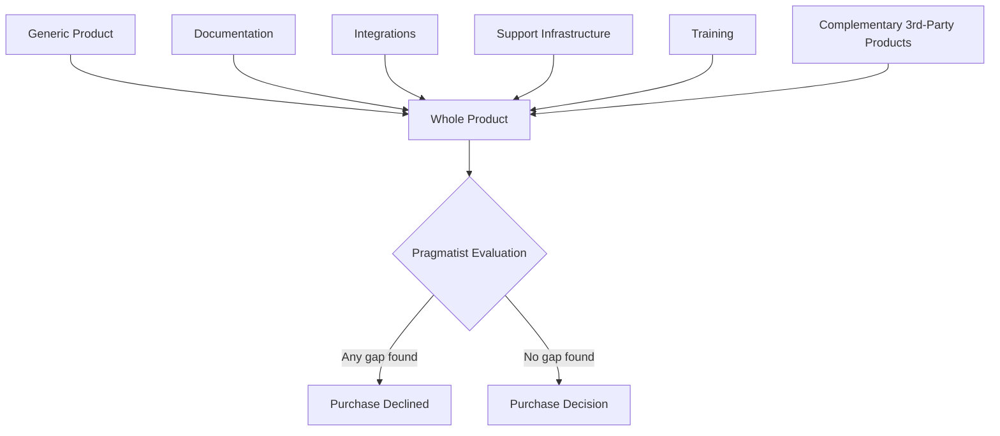

## Crossing the Chasm and Early-Majority Resistance

### Overview

Geoffrey Moore's *Crossing the Chasm* (1991) extends Rogers's Diffusion of Innovations model specifically for **discontinuous innovations** — products requiring a significant change in behavior or infrastructure from adopters, typically in high-tech B2B and B2C markets. Moore's central argument is that the smooth bell-curve transition assumed by Rogers breaks down at one specific point: the transition from Early Adopters to Early Majority. This gap, termed "the chasm," is where most technology products fail commercially, even after apparently successful early traction.

**Key Points**

- The chasm exists because Early Adopters and Early Majority buy for fundamentally different, sometimes opposing, reasons
- Failure typically manifests as a plateau or decline in sales growth immediately following initial visionary-customer success
- Crossing requires a deliberate, narrow-focus strategy rather than continued broad-market marketing

---

### Why the Chasm Exists: Divergent Buying Psychology

| Dimension | Early Adopters (Visionaries) | Early Majority (Pragmatists) |
| --- | --- | --- |
| Core motivation | Competitive advantage from being first; strategic transformation | Productivity improvement within existing operations |
| Risk orientation | Actively seek revolutionary, unproven solutions | Actively avoid unproven solutions; want evolutionary improvement |
| Reference sought | None required — willing to be the reference case themselves | Requires references from same-industry peers already using the product successfully |
| Tolerance for incompleteness | High — will accept custom engineering, missing features, bugs | Low — expect a complete, polished, supported solution |
| Vendor relationship | Wants a partner for co-development and customization | Wants a reliable, low-risk vendor who has "done this before" |
| Budget behavior | Often funds pilots/projects outside standard procurement | Requires standard procurement approval, often ROI-justified |

[Inference] These profiles represent generalized behavioral archetypes drawn from Moore's qualitative case-study synthesis rather than a strictly quantified psychometric instrument; individual buyers within either segment will vary.

The critical failure mode: **Early Adopters make poor references for the Early Majority.** A pragmatist evaluating a new enterprise software platform is unpersuaded by a visionary customer's testimonial precisely because that customer's willingness to tolerate risk and incompleteness signals exactly the profile the pragmatist does not trust.

---

### Diagram: The Chasm Relative to the Adoption Curve

<svg xmlns="http://www.w3.org/2000/svg" viewBox="0 0 900 420" font-family="Helvetica, Arial, sans-serif">
<text x="450" y="30" text-anchor="middle" font-size="20" font-weight="bold" fill="#1a1a1a">Crossing the Chasm Model (svg_diagram)</text>
<line x1="80" y1="360" x2="850" y2="360" stroke="#333" stroke-width="2" />
<line x1="80" y1="360" x2="80" y2="60" stroke="#333" stroke-width="2" />
<text x="465" y="400" text-anchor="middle" font-size="14" fill="#333">Time / Market Maturity →</text>
<path d="M 80 358 C 150 355, 180 320, 220 240 L 250 358 Z" fill="#2E86AB" fill-opacity="0.6" />
<path d="M 260 358 L 260 100 C 350 85, 440 85, 530 100 L 530 358 Z" fill="#2A9D8F" fill-opacity="0.5" />
<path d="M 540 358 L 540 100 C 620 85, 700 85, 770 240 C 790 300, 800 330, 830 358 Z" fill="#457B9D" fill-opacity="0.4" />
<rect x="250" y="60" width="12" height="300" fill="#D62828" />
<text x="256" y="50" text-anchor="middle" font-size="13" font-weight="bold" fill="#D62828">THE CHASM</text>

<text x="165" y="380" text-anchor="middle" font-size="12" font-weight="bold" fill="`#1a1a1a`">Innovators /</text>

<text x="165" y="393" text-anchor="middle" font-size="12" font-weight="bold" fill="`#1a1a1a`">Early Adopters</text>

<text x="395" y="380" text-anchor="middle" font-size="13" font-weight="bold" fill="`#1a1a1a`">Early Majority</text>

<text x="395" y="393" text-anchor="middle" font-size="11" fill="#333">(Pragmatists)</text>

<text x="685" y="380" text-anchor="middle" font-size="13" font-weight="bold" fill="`#1a1a1a`">Late Majority / Laggards</text>

<path d="M 200 250 Q 225 280 250 300" stroke="#D62828" stroke-width="2" fill="none" marker-end="url(#arrow)" />
<text x="150" y="270" font-size="11" fill="#D62828">Most products</text>
<text x="150" y="284" font-size="11" fill="#D62828">fail here</text>
</svg>

---

### The Bowling Pin Strategy

Moore's prescribed method for crossing the chasm rejects broad simultaneous marketing across the whole Early Majority in favor of sequential niche domination.

1. **Select a single beachhead niche market** — a narrow, well-defined segment (often a specific vertical industry or use case) small enough to dominate quickly with available resources
2. **Assemble a "whole product"** for that niche specifically — the complete bundle of product, integrations, services, and support required to fully solve that niche's problem with zero perceived gaps
3. **Achieve dominant market share within the niche**, generating same-industry reference customers the broader pragmatist market will trust
4. **Use the first niche as a base to expand into adjacent niches** ("bowling pins" — each conquered niche knocks down the next by lending credibility), rather than jumping directly to the mass market

**Example**

Enterprise software vendors frequently launch a horizontally-capable platform but market it initially as a vertical solution (e.g., "the CRM for law firms" rather than "a CRM"), delivering pre-built integrations and workflows specific to that vertical's compliance and terminology needs, before broadening the positioning once a critical mass of same-vertical references exists.

---

### The "Whole Product" Concept

Adapted from Theodore Levitt's "augmented product" concept, Moore distinguishes between:

- **Generic product**: The core functional offering as shipped
- **Whole product**: The generic product plus everything required for the target pragmatist customer to achieve their compelling reason to buy — documentation, integrations, training, support infrastructure, complementary third-party products, and industry-specific customization

Pragmatists evaluate the *whole product*, not the generic product. A gap anywhere in the whole product is sufficient grounds for an Early Majority buyer to decline, even if the generic product itself is superior to alternatives.

---

### Early-Majority Resistance: Underlying Psychological Drivers

- **Risk aversion under uncertainty**: Pragmatists weight the probability of vendor/product failure heavily; a young company with few references represents unquantifiable risk that outweighs even substantial feature advantages
- **Herd-verification bias**: Trust is transferred socially from same-context peers rather than derived from independent evaluation — this is a stronger-than-typical instance of social proof because pragmatists explicitly distrust their own ability to evaluate discontinuous innovations in isolation
- **Switching-cost amplification**: Because Early Majority buyers are typically embedded in operational workflows (unlike visionaries running pilot/greenfield projects), the perceived switching cost is structurally higher, requiring greater compatibility (see Perceived Attributes of Innovations) to offset
- **Category-labeling requirement**: Pragmatists often require an innovation to be classifiable within an existing mental category ("this is basically an X, but better") before they will seriously evaluate it — completely novel categories face longer resistance periods until analogous framing becomes available

[Inference] These psychological mechanisms are consistent with the broader adoption-attribute framework (Compatibility, Relative Advantage, Trialability) applied specifically to the chasm-crossing context; Moore's original text describes them primarily through case narrative rather than controlled experimental measurement.

---

### Common Chasm-Crossing Failure Modes

| Failure Mode | Description |
| --- | --- |
| Premature broadening | Attempting to market to the entire Early Majority simultaneously instead of a single beachhead, diluting resources and failing to achieve dominant share anywhere |
| Visionary-reference reliance | Continuing to use Early Adopter testimonials/case studies as primary social proof for pragmatist audiences |
| Whole-product gaps | Shipping the generic product without addressing the ecosystem requirements (integrations, support, training) pragmatists require |
| Feature-creep distraction | Responding to visionary customer requests for customization instead of building a standardized, repeatable niche solution |
| Misjudging niche size | Selecting a beachhead niche too small to be commercially self-sustaining, or too large to dominate with available resources |

---

### Strategic Application Checklist

**Next Steps**

1. Explicitly identify whether the innovation is discontinuous (requiring behavior/infrastructure change) — the chasm model applies most directly to this innovation class, less so to continuous/incremental innovations
2. Map current customers against the Early Adopter vs. Early Majority profile table to diagnose which side of the chasm current traction sits on
3. Select a single beachhead niche based on: pain intensity, budget availability, reachability via a coherent sales channel, and potential to serve as a credible reference for adjacent niches
4. Build the whole product specifically for that niche before broadening horizontally
5. Replace visionary-customer proof points with same-niche pragmatist references in all Early-Majority-directed marketing collateral
6. Sequence expansion into adjacent niches only after achieving dominant share in the beachhead, using each conquered niche as a reference base for the next

---

**Related Topics**

- Adopter categories and the adoption curve
- Perceived attributes of innovations
- Whole product / augmented product theory (Levitt)
- Beachhead market selection frameworks
- Category creation and category-design marketing
- Social proof and reference-based B2B sales strategy
- Innovation-decision process stages