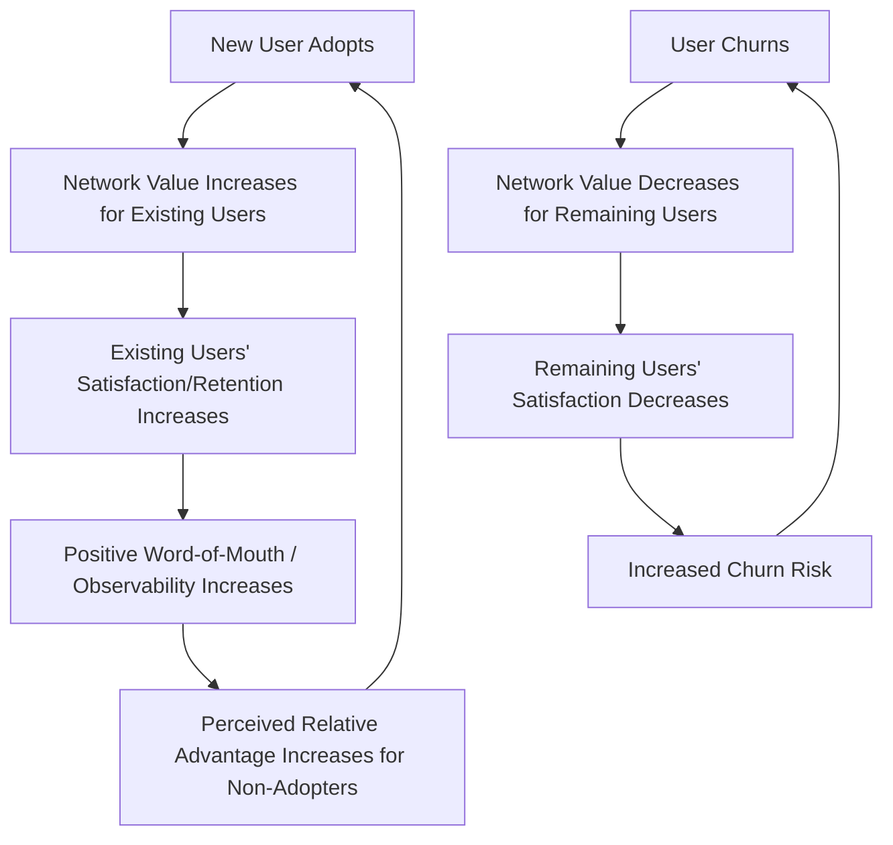

## Network Effects and Critical Mass

### Overview

Network effects (also called network externalities) occur when the value of a product or service to a given user increases as more users adopt it. Critical mass refers to the minimum threshold of adopters required for a network-effect-driven product to become self-sustaining, after which growth can become largely self-reinforcing rather than dependent on continued external marketing push. This dynamic significantly distorts the classical Rogers/Moore diffusion curve, since adoption utility itself is a function of prior adoption rather than fixed.

**Key Points**

- Network effects create a feedback loop absent from the standard diffusion model: adoption increases value, which increases adoption rate
- Critical mass represents a tipping point in an S-curve; below it, growth is fragile and reversible, above it, growth can become largely self-sustaining
- Not all innovations exhibit network effects — the concept applies specifically to products whose utility is inherently relational (communication tools, marketplaces, platforms, standards)

---

### Taxonomy of Network Effects

#### Direct (Same-Side) Network Effects

Value increases as more users of the *same type* join. Classic example: telephone networks — each additional subscriber increases the value of having a phone for every existing subscriber.

#### Indirect (Cross-Side) Network Effects

Value increases for one user group as a *different* user group grows, typical of two-sided or multi-sided platforms. Example: ride-hailing apps — more drivers increase value for riders (shorter wait times), and more riders increase value for drivers (more fare opportunities).

#### Data Network Effects

Value increases as more usage generates more data that improves the product itself (e.g., recommendation algorithms, fraud detection models improving with more transaction volume).

#### Physical/Local Network Effects

Value depends on the density of adopters within a specific geographic or social cluster rather than the total global user count (e.g., ride-sharing liquidity is city-specific, not globally aggregated).

**Example**

A B2B expense-management SaaS tool exhibits weak or no network effects (one company's use of the tool doesn't directly benefit another company's use of it), whereas a professional networking platform exhibits strong direct network effects (each new professional contact joining increases the platform's value to everyone already connected to them).

---

### Mathematical Framing

#### Metcalfe's Law (Direct Network Effects, Idealized)

$$V \propto n^2$$

where $V$ is the total network value and $n$ is the number of connected nodes/users, based on the number of possible pairwise connections, $\binom{n}{2} = \frac{n(n-1)}{2}$.

[Inference] Metcalfe's Law is a widely cited heuristic rather than an empirically validated universal law; critics (e.g., Briscoe, Odlyzko, and Tilly, 2006) argue actual network value scales closer to $n \log n$ because not all connections carry equal or even positive marginal value, and attention/relationship-maintenance costs impose diminishing returns.

#### Critical Mass Threshold Model

A simplified adoption model incorporating network effects can be expressed as a modified logistic/Bass-style diffusion equation where the effective adoption rate depends on current penetration:

$$\frac{dN(t)}{dt} = \left(p + q\cdot\frac{N(t)}{M}\right)\left(M - N(t)\right)$$

where:

- $N(t)$ = cumulative adopters at time $t$
- $M$ = total addressable market size
- $p$ = coefficient of innovation (external influence, e.g., advertising)
- $q$ = coefficient of imitation (internal/network influence — peer effects)

This is the **Bass Diffusion Model** (Bass, 1969), and the network-effect-heavy case corresponds to a high $q$ relative to $p$: growth is driven primarily by existing-adopter influence on new adopters rather than external marketing.

**Critical mass**, in this framing, corresponds informally to the inflection point of $N(t)$ — the point at which $\frac{d^2N}{dt^2}$ transitions from positive to negative deceleration but where organic imitation-driven growth ($q$ term) has become the dominant driver of further adoption, such that continued growth requires less external marketing investment per new adopter than at earlier stages.

---

### Diagram: Network-Effect-Amplified Adoption Curve vs. Standard Diffusion

<svg xmlns="http://www.w3.org/2000/svg" viewBox="0 0 900 440" font-family="Helvetica, Arial, sans-serif">
<text x="450" y="30" text-anchor="middle" font-size="19" font-weight="bold" fill="#1a1a1a">Network Effects and the Critical Mass Threshold (svg_diagram)</text>
<line x1="80" y1="380" x2="850" y2="380" stroke="#333" stroke-width="2" />
<line x1="80" y1="380" x2="80" y2="60" stroke="#333" stroke-width="2" />
<text x="465" y="415" text-anchor="middle" font-size="13" fill="#333">Time →</text>
<text x="35" y="220" text-anchor="middle" font-size="13" fill="#333" transform="rotate(-90 35 220)">Cumulative Adoption</text>

<path d="M 80 375 C 250 370, 400 300, 500 200 C 600 130, 700 90, 830 75" fill="none" stroke="#888" stroke-width="2" stroke-dasharray="6,4" />

<text x="700" y="105" font-size="11" fill="#888">Standard diffusion (low q)</text>

<path d="M 80 378 C 200 376, 320 368, 380 340 C 420 310, 440 220, 470 150 C 500 100, 560 75, 650 68 C 730 63, 790 62, 830 62" fill="none" stroke="`#2E86AB`" stroke-width="3" />

<text x="600" y="55" font-size="12" fill="`#2E86AB`" font-weight="bold">Network-effect diffusion (high q)</text>

<line x1="420" y1="60" x2="420" y2="380" stroke="#D62828" stroke-width="2" stroke-dasharray="5,3" />
<text x="420" y="50" text-anchor="middle" font-size="12" font-weight="bold" fill="#D62828">Critical Mass</text>
<text x="420" y="395" text-anchor="middle" font-size="10" fill="#D62828">Tipping Point</text>

<rect x="80" y="60" width="340" height="320" fill="#F4A261" fill-opacity="0.12" />
<text x="250" y="120" text-anchor="middle" font-size="11" fill="#B5651D" font-weight="bold">Fragile Growth Zone</text>
<text x="250" y="135" text-anchor="middle" font-size="10" fill="#B5651D">(reversible, cold-start risk)</text>
<rect x="420" y="60" width="410" height="320" fill="#2A9D8F" fill-opacity="0.10" />
<text x="620" y="120" text-anchor="middle" font-size="11" fill="#1D7870" font-weight="bold">Self-Sustaining Growth Zone</text>
</svg>

---

### The Cold-Start Problem

Products with strong network effects (especially indirect/multi-sided) face a **cold-start problem**: the product has minimal value to the first users precisely because there are not yet enough other users to generate network value, creating a chicken-and-egg barrier to reaching critical mass.

**Common cold-start mitigation strategies:**

| Strategy | Mechanism | Example Pattern |
| --- | --- | --- |
| Single-player mode | Product delivers standalone value even with zero network | A note-taking app useful individually before any sharing/collaboration features matter |
| Subsidize one side | Absorb costs to seed one side of a two-sided market artificially | Ride-hailing platforms paying driver incentives before sufficient rider demand exists |
| Niche/geographic seeding | Achieve local critical mass in a narrow segment before broadening | Campus-restricted early social networks (e.g., early Facebook's university-by-university rollout) |
| Manufactured/simulated liquidity | Populate a marketplace with the platform's own supply/inventory initially | Early e-commerce marketplaces sometimes list first-party inventory to simulate seller density |
| Come-for-the-tool, stay-for-the-network | Attract users with a non-network utility, then progressively surface network features | Productivity tools that add collaboration/sharing features once individual usage habits form |

[Inference] These are widely referenced practitioner strategies drawn from platform-economics literature (e.g., Parker, Van Alstyne, and Choudary's *Platform Revolution*) rather than a single formally validated academic taxonomy.

---

### Interaction with Rogers's Diffusion Model

Network effects modify the classical adopter-category dynamics discussed under Adopter Categories and the Adoption Curve in specific ways:

- **Early Adopters carry disproportionate weight**: In network-effect products, an Early Adopter's decision to adopt directly increases the product's objective value for the next potential adopter (not merely its perceived credibility, as in Moore's chasm model) — this is a structural, not just psychological, amplification
- **Observability and Relative Advantage become endogenous**: Under the Perceived Attributes framework, Observability and Relative Advantage are normally treated as fixed product characteristics; in network-effect products, both actually *increase in objective magnitude* as adoption grows, rather than merely being perceived more favorably
- **Chasm risk is structurally different**: Failing to cross the chasm in a network-effect product can result in outright network collapse (existing users leaving because the network has become too thin to be useful) rather than simply stalled growth, since departing users reduce value for remaining users — a negative feedback loop mirroring the positive one

---

### Risks Beyond Critical Mass

Reaching critical mass does not eliminate network-effect risk entirely:

- **Multi-homing**: Users adopting multiple competing networks simultaneously (common in marketplaces without high switching costs) dilutes the exclusivity that would otherwise lock in network value to a single platform
- **Negative network effects at scale**: Some networks experience congestion, noise, or quality degradation past a certain size (e.g., content platforms suffering signal-to-noise decline as user base grows without proportional moderation/curation investment)
- **Niche fragmentation**: Large networks can fragment into value-diluted sub-communities that no longer benefit fully from the aggregate network size

[Speculation] The precise scale at which negative network effects begin to outweigh positive ones is highly product- and category-specific and is not resolved by a general formula in the literature; this is typically assessed empirically per product rather than predicted a priori.

---

**Related Topics**

- Adopter categories and the adoption curve
- Bass Diffusion Model in depth (parameter estimation for $p$ and $q$)
- Platform business model design and multi-sided market strategy
- Metcalfe's Law critiques and alternative network value models
- Cold-start strategy design for two-sided marketplaces
- Switching costs and multi-homing behavior in platform competition
- Crossing the chasm and early-majority resistance