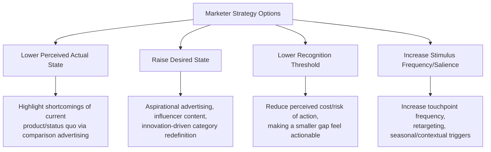

## Problem and Need Recognition

### Overview

Problem/need recognition is the initial stage of the classical consumer decision-making journey model (Engel-Kollat-Blackwell, 1968; later refined by Kotler and others), occurring when a consumer perceives a discrepancy between their **actual state** (current situation) and their **desired state** (an aspirational or required condition). This perceived gap generates the motivational drive that initiates the entire subsequent decision process — information search, evaluation, purchase, and post-purchase behavior.

**Key Points**

- Recognition is a perceptual and motivational event, not merely an objective condition — two consumers in identical objective circumstances may differ in whether they recognize a "problem" at all
- The gap must exceed a minimum threshold of magnitude before it translates into actionable motivation (see threshold discussion below)
- Marketers can influence both sides of the actual-state/desired-state gap, not merely respond to a naturally occurring one

---

### The Actual-State vs. Desired-State Model

$$\text{Recognition Trigger} = f(S_d - S_a)$$

where $S_d$ is the desired state and $S_a$ is the actual state, and recognition occurs when this function exceeds an individual's perception threshold. Two structurally distinct pathways lead to this gap:

#### 1. Need-Down Recognition (State-Change in Actual State)

The desired state remains stable, but the actual state deteriorates or is disrupted, opening the gap from below.

- **Example triggers**: A product runs out (running out of laundry detergent), a product fails (a laptop stops working), a life-stage change occurs (moving to a new city removes access to a previously habitual service)

#### 2. Need-Up Recognition (State-Change in Desired State)

The actual state remains stable, but the desired state rises, opening the gap from above — often driven by external influence rather than an internal deficiency.

- **Example triggers**: Exposure to marketing communication that raises aspiration ("you deserve better"), social comparison (a peer acquires a new product, raising the individual's reference point), exposure to a new innovation that redefines what "acceptable" performance looks like

[Inference] This bidirectional framing (need-down vs. need-up) is a standard pedagogical decomposition used across consumer behavior textbooks to operationalize the Engel-Kollat-Blackwell gap construct; it is a widely taught heuristic rather than a distinction the original EKB authors formally labeled with these exact terms.

---

### Diagram: The Actual-Desired State Gap

<svg xmlns="http://www.w3.org/2000/svg" viewBox="0 0 900 420" font-family="Helvetica, Arial, sans-serif">
<text x="450" y="30" text-anchor="middle" font-size="19" font-weight="bold" fill="#1a1a1a">Actual State vs. Desired State Gap (svg_diagram)</text>
<line x1="100" y1="360" x2="800" y2="360" stroke="#333" stroke-width="2" />
<text x="450" y="390" text-anchor="middle" font-size="13" fill="#333">Time →</text>

<line x1="150" y1="150" x2="450" y2="150" stroke="#2A9D8F" stroke-width="3" />
<text x="150" y="135" font-size="12" fill="#2A9D8F" font-weight="bold">Desired State (stable)</text>

<line x1="150" y1="200" x2="300" y2="200" stroke="#457B9D" stroke-width="3" />
<path d="M 300 200 L 340 280" stroke="#457B9D" stroke-width="3" />
<line x1="340" y1="280" x2="450" y2="280" stroke="#457B9D" stroke-width="3" />
<text x="150" y="215" font-size="12" fill="#457B9D" font-weight="bold">Actual State (need-down trigger)</text>

<line x1="400" y1="150" x2="400" y2="280" stroke="#D62828" stroke-width="2" marker-end="url(#arr1)" marker-start="url(#arr1)" />
<text x="415" y="220" font-size="12" fill="#D62828" font-weight="bold">GAP →</text>
<text x="415" y="236" font-size="12" fill="#D62828" font-weight="bold">Recognition</text>

<line x1="500" y1="280" x2="650" y2="280" stroke="#457B9D" stroke-width="3" />
<text x="500" y="295" font-size="12" fill="#457B9D" font-weight="bold">Actual State (stable)</text>
<line x1="500" y1="230" x2="600" y2="230" stroke="#2A9D8F" stroke-width="3" />
<path d="M 600 230 L 640 150" stroke="#2A9D8F" stroke-width="3" />
<line x1="640" y1="150" x2="800" y2="150" stroke="#2A9D8F" stroke-width="3" />
<text x="660" y="140" font-size="12" fill="#2A9D8F" font-weight="bold">Desired State (need-up, marketing-driven)</text>
<line x1="700" y1="150" x2="700" y2="280" stroke="#D62828" stroke-width="2" marker-end="url(#arr1)" marker-start="url(#arr1)" />
<text x="710" y="220" font-size="12" fill="#D62828" font-weight="bold">GAP →</text>
</svg>

---

### Types of Needs Triggering Recognition

| Need Type | Description | Example |
| --- | --- | --- |
| Functional | Practical performance requirement unmet | A phone battery no longer holds sufficient charge |
| Experiential/Hedonic | Desire for sensory pleasure, novelty, or variety | Boredom with current routine driving desire for a new restaurant experience |
| Social/Symbolic | Need to signal identity, status, or group belonging | Desire for a product associated with a reference group's status markers |
| Situational | Triggered by a specific, often transient, circumstance | Needing formal attire for an unexpected event invitation |

---

### Sources of Recognition Stimuli

Recognition triggers originate from both internal and external sources:

#### Internal Stimuli

Physiological or psychological states arising from within the individual absent external prompting — hunger, discomfort, fatigue, boredom, or the depletion of an owned product through normal use.

#### External Stimuli

Environmental or social sources that surface or manufacture a gap:

- **Marketing communications**: Advertising explicitly designed to activate need-up recognition by raising the desired-state reference point
- **Social influence**: Observing peers, reference groups, or aspirational figures using a product, triggering social comparison
- **Situational/environmental cues**: Retail environment exposure (in-store browsing surfacing a previously unrecognized need), seasonal/contextual triggers (weather change prompting recognition of a wardrobe gap)
- **Word-of-mouth**: Direct recommendation or complaint from a trusted source altering the perceived desired state

**Example**

A consumer with a functioning but several-generations-old smartphone may experience no internal recognition trigger (the device still performs its core function adequately), but exposure to a product launch event or a peer's new device can generate an external need-up trigger by resetting the consumer's desired-state reference point for "acceptable" phone performance.

---

### The Recognition Threshold Concept

Not every actual-desired state discrepancy results in recognized need or subsequent action. A **threshold** must be crossed:

$$\text{Recognition occurs if } (S_d - S_a) > T$$

where $T$ represents an individual- and category-specific perception/action threshold, influenced by:

- **Importance of the need category** to the individual's self-concept or daily functioning
- **Perceived cost of inaction** relative to the discomfort of the gap
- **Financial and situational constraints** that may suppress recognition even when the gap is objectively present (a consumer may suppress awareness of a need they cannot currently afford to address — a phenomenon sometimes termed motivated inattention)
- **Habituation**: Chronic, slowly-building gaps (e.g., gradual product degradation) can escape recognition longer than acute, sudden gaps of equivalent final magnitude, because the incremental change at each point in time falls below the noticeable-difference threshold (a dynamic paralleling the Weber-Fechner law of psychophysics)

[Inference] The application of Weber-Fechner-style just-noticeable-difference reasoning to consumer need recognition is a theoretical extension commonly discussed in pricing/value-perception literature; its direct empirical validation specifically within the need-recognition stage (as opposed to price-change perception, where it is well-documented) is less extensively studied.

---

### Marketing Strategy Implications

Because problem/need recognition is the entry point to the entire decision journey, marketers have direct strategic leverage at this stage through several distinct mechanisms:

**Example**

Oral care marketing frequently operationalizes need-up recognition by introducing new evaluative criteria (e.g., "whitening," "enamel repair," "sensitivity protection") beyond the previously sufficient baseline of "cavity prevention," effectively raising the desired-state bar and generating a recognized gap in consumers who were previously satisfied with their existing product.

---

### Distinguishing Recognized Need from Manufactured Need (Ethical Consideration)

A recurring critique in consumer behavior and marketing ethics literature distinguishes between:

- **Facilitated recognition**: Surfacing or clarifying a genuine, pre-existing gap the consumer had not yet consciously identified
- **Manufactured/induced need**: Artificially inflating the desired state through comparison, scarcity framing, or social-status anxiety without a corresponding genuine functional or experiential benefit

[Speculation] The line between these two categories is frequently contested in both academic and regulatory contexts (e.g., debates around planned obsolescence marketing or beauty-standard-based advertising), and no single objective test cleanly separates legitimate need-surfacing from need-manufacturing; this remains a normative rather than purely empirical distinction.

---

**Related Topics**

- Information search behavior (internal vs. external search)
- Evaluation of alternatives and consideration set formation
- Weber-Fechner law and just-noticeable-difference in marketing perception
- Maslow's hierarchy of needs applied to consumer motivation
- Reference group influence and social comparison theory
- Ethics of need creation in advertising
- Post-purchase dissonance and the decision journey feedback loop