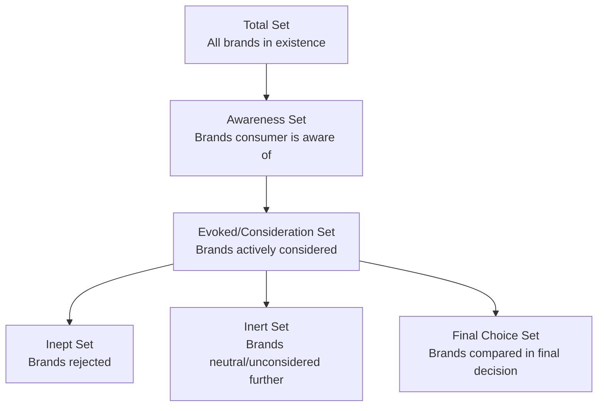

## Internal and External Information Search

### Overview

Information search is the second stage of the consumer decision-making journey, occurring once problem/need recognition has established sufficient motivational gap to prompt action. Consumers resolve this gap by gathering information through two distinct but interacting search modes: **internal search** (retrieval from existing memory) and **external search** (acquisition of new information from outside sources). The relative reliance on each mode, and the total amount of search undertaken, varies systematically with consumer, product, and situational characteristics.

**Key Points**

- Internal search is typically attempted first, functioning as a low-cost default before any external search is initiated
- External search occurs only when internal search yields insufficient information to make a confident decision
- The extent of search (internal and external combined) is governed by a cost-benefit tradeoff, not an assumption of exhaustive information gathering

---

### Internal Search

Internal search refers to the retrieval of relevant, previously stored information from long-term memory — prior product experience, previously acquired brand knowledge, and stored evaluative judgments.

#### Determinants of Internal Search Sufficiency

- **Prior purchase/usage experience**: Direct experiential memory is generally the most trusted and heavily weighted information source
- **Level of product involvement and category expertise**: Higher-expertise consumers possess richer, better-organized memory structures (schemas) enabling more effective internal retrieval
- **Recency and frequency of prior exposure**: More recently and more frequently encoded information is more retrievable (consistent with general memory-decay and interference principles)
- **Brand familiarity**: Established brand associations (attitudes, prior satisfaction) can substitute for detailed attribute-level search entirely in low-involvement, habitual repurchase contexts

**Example**

A consumer repurchasing a familiar grocery staple typically relies almost entirely on internal search (habitual brand loyalty, prior satisfaction memory), engaging in little to no external search — this pattern is characteristic of Extended vs. Limited Problem Solving distinctions in consumer behavior theory, where routine/habitual purchases fall at the low-search end of the spectrum.

---

### External Search

External search refers to the deliberate acquisition of information from sources outside the consumer's existing memory, undertaken when internal search is judged insufficient.

#### Categories of External Search Sources

| Source Type | Examples | Characteristics |
| --- | --- | --- |
| Personal/Interpersonal | Friends, family, colleagues, word-of-mouth | High perceived trust; low control by marketers; strong influence weight |
| Commercial/Marketer-Controlled | Advertising, brand websites, salespeople, product packaging | High marketer control; lower baseline trust; high availability/volume |
| Public/Independent | Consumer Reports-style reviews, government/regulatory sources, journalistic coverage | Perceived as more objective; moderate availability |
| Experiential | Product trials, samples, test drives, showroom demonstrations | High diagnostic value; typically occurs later in search process |
| User-Generated/Digital | Online reviews, ratings aggregators, social media, influencer content, forums | Rapidly growing in relative influence; blends personal and public source characteristics |

[Inference] The relative weighting of digital/user-generated sources versus traditional commercial sources has shifted substantially since the original EKB and Howard-Sheth models were formulated (pre-internet); most contemporary consumer behavior literature treats online reviews and social proof as now occupying a dominant position in external search for many product categories, though the precise magnitude of this shift varies by category, demographic, and is subject to ongoing measurement.

---

### Diagram: The Internal-External Search Decision Flow

<svg xmlns="http://www.w3.org/2000/svg" viewBox="0 0 900 480" font-family="Helvetica, Arial, sans-serif">
<text x="450" y="30" text-anchor="middle" font-size="19" font-weight="bold" fill="#1a1a1a">Internal vs. External Search Flow (svg_diagram)</text>
<rect x="350" y="55" width="200" height="55" rx="8" fill="#2A9D8F" fill-opacity="0.25" stroke="#2A9D8F" stroke-width="1.5" />
<text x="450" y="88" text-anchor="middle" font-size="13" font-weight="bold" fill="#1a1a1a">Need Recognized</text>
<line x1="450" y1="110" x2="450" y2="145" stroke="#333" stroke-width="2" marker-end="url(#a1)" />
<rect x="330" y="145" width="240" height="60" rx="8" fill="#457B9D" fill-opacity="0.25" stroke="#457B9D" stroke-width="1.5" />
<text x="450" y="170" text-anchor="middle" font-size="13" font-weight="bold" fill="#1a1a1a">Internal Search</text>
<text x="450" y="188" text-anchor="middle" font-size="10" fill="#333">Retrieve from memory</text>
<line x1="450" y1="205" x2="450" y2="240" stroke="#333" stroke-width="2" marker-end="url(#a1)" />
<polygon points="450,240 560,285 450,330 340,285" fill="#F4A261" fill-opacity="0.3" stroke="#F4A261" stroke-width="1.5" />
<text x="450" y="280" text-anchor="middle" font-size="12" font-weight="bold" fill="#1a1a1a">Sufficient?</text>
<text x="450" y="296" text-anchor="middle" font-size="10" fill="#333">Confidence adequate?</text>
<line x1="560" y1="285" x2="680" y2="285" stroke="#2A9D8F" stroke-width="2" marker-end="url(#a1)" />
<text x="600" y="275" font-size="11" fill="#2A9D8F" font-weight="bold">Yes</text>
<rect x="680" y="255" width="180" height="60" rx="8" fill="#2A9D8F" fill-opacity="0.25" stroke="#2A9D8F" stroke-width="1.5" />
<text x="770" y="280" text-anchor="middle" font-size="13" font-weight="bold" fill="#1a1a1a">Proceed to</text>
<text x="770" y="298" text-anchor="middle" font-size="13" font-weight="bold" fill="#1a1a1a">Evaluation</text>
<line x1="450" y1="330" x2="450" y2="365" stroke="#D62828" stroke-width="2" marker-end="url(#a1)" />
<text x="465" y="352" font-size="11" fill="#D62828" font-weight="bold">No</text>
<rect x="330" y="365" width="240" height="60" rx="8" fill="#D62828" fill-opacity="0.2" stroke="#D62828" stroke-width="1.5" />
<text x="450" y="390" text-anchor="middle" font-size="13" font-weight="bold" fill="#1a1a1a">External Search</text>
<text x="450" y="408" text-anchor="middle" font-size="10" fill="#333">Personal, commercial, public, digital sources</text>
<line x1="570" y1="395" x2="680" y2="330" stroke="#333" stroke-width="2" marker-end="url(#a1)" />
<text x="620" y="360" font-size="10" fill="#333">Feeds into</text>
</svg>

---

### Determinants of Extent of External Search

The amount of external search a consumer undertakes is governed by a cost-benefit calculus rather than a fixed procedural step, formalized in economic search theory as:

$$\text{Search continues while } MB(s) > MC(s)$$

where $MB(s)$ is the marginal benefit of an additional unit of search (reduced uncertainty, improved expected outcome quality) and $MC(s)$ is the marginal cost (time, cognitive effort, monetary cost, opportunity cost, psychological discomfort of prolonged deliberation).

#### Factors Increasing Search Extent

- **High perceived risk**: Financial, performance, social, or psychological risk associated with the purchase
- **High product involvement**: Personal relevance, self-concept linkage, or category interest
- **Low prior knowledge/experience**: Novice consumers must compensate for absent internal search capacity with more extensive external search — though at very low expertise levels, search efficiency can be impaired (novices may not know what to search for or how to interpret results, sometimes producing an inverted-U relationship between expertise and search extent)
- **Greater number of alternatives/complexity**: More differentiated markets increase the perceived value of comparison
- **Low time pressure**: Availability of time lowers the marginal cost of search
- **Higher price/consequence magnitude**: Larger financial commitments justify proportionally more search investment

#### Factors Decreasing Search Extent

- **Strong brand loyalty**: Functions as an internal-search substitute that pre-empts the need for further external search
- **High time pressure or situational urgency**: Raises the marginal cost of continued search
- **Search fatigue / choice overload**: Beyond a certain point, additional options or information sources can decrease decision confidence and search motivation rather than increase it (associated with Iyengar & Lepper's choice-overload research and related decision-fatigue literature)
- **High confidence from internal search alone**: Particularly in habitual, low-involvement repurchase contexts

[Inference] The inverted-U relationship between expertise and external search volume is a documented pattern in some consumer behavior studies (novices under-search due to not knowing what to look for, experts under-search due to sufficient internal search capacity, with moderate-expertise consumers searching most extensively), though the specific shape and magnitude of this relationship varies across product categories and is not a universally fixed function.

---

### The Evoked Set and Search Output

External (and internal) search activity narrows the full universe of theoretically available options down into progressively smaller decision-relevant sets:

The **evoked set** (sometimes called the consideration set) represents the practical output of the search stage — a manageable subset (commonly cited as averaging 3–5 brands across many product categories, though this varies substantially by category) that proceeds into the Evaluation of Alternatives stage.

[Unverified] The commonly cited "3–5 brands" evoked-set-size figure appears frequently across marketing textbooks and secondary sources but traces to varied original studies across different product categories and eras; treat it as an illustrative order-of-magnitude norm rather than a precise, universally applicable statistic.

---

### Marketing Implications by Search Stage

| Search Behavior | Marketing Lever |
| --- | --- |
| High reliance on internal search (loyal/habitual buyers) | Reinforce existing brand memory structures (consistent branding, loyalty programs); defend against competitor-triggered external search via retention marketing |
| High external search likely (high-involvement/high-risk category) | Ensure strong presence across personal (referral programs), commercial (SEO/SEM, content marketing), public (PR, third-party review management), and digital (review platform optimization) source categories simultaneously |
| Search-fatigue-prone segments | Simplify comparison (clear differentiation, decision-support tools, curated "best for X" framing) to reduce marginal search cost and prevent decision deferral |
| Low awareness-set inclusion | Invest in top-of-funnel awareness marketing before optimizing consideration-stage content, since a brand outside the awareness set cannot enter external search regardless of search extent |

---

**Related Topics**

- Problem and need recognition
- Evaluation of alternatives and consideration set formation
- Choice overload and decision fatigue (Iyengar & Lepper)
- Online review platforms and digital word-of-mouth influence
- High-involvement vs. low-involvement purchase decision models
- Brand awareness funnel and top-of-funnel marketing strategy
- Search cost economics (Stigler's economics of information)