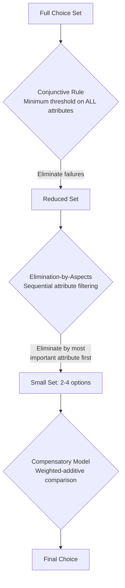

## Evaluation of Alternatives and Choice Sets

### Overview

Evaluation of alternatives is the third stage of the consumer decision-making journey, occurring after information search has produced a workable evoked set of options. At this stage, the consumer applies evaluative criteria and a decision strategy (choice heuristic) to compare the options within their consideration set and narrow toward a final purchase decision. This stage is where formal decision theory, multi-attribute utility modeling, and choice-heuristic research intersect most directly with consumer behavior.

**Key Points**

- Evaluation requires two inputs established in prior stages: a defined choice set (from search) and a set of evaluative criteria (attributes the consumer considers relevant)
- Consumers rarely use pure compensatory (weighted-additive) evaluation in practice — heuristic shortcuts (decision rules) are the norm, especially under time or cognitive constraints
- The composition of the choice set itself (not just individual product attributes) can systematically bias evaluation outcomes through context effects

---

### Choice Set Structure

Building on the search-stage funnel (Total Set → Awareness Set → Evoked Set), the evaluation stage operates specifically on the **evoked/consideration set** and produces further refined subsets:

| Set | Definition |
| --- | --- |
| Evoked/Consideration Set | Brands actively considered following search |
| Inept Set | Brands evaluated and rejected as unacceptable |
| Inert Set | Brands the consumer is aware of but has no strong opinion on, effectively deprioritized |
| Choice/Final Set | The small number of top options subjected to final direct comparison, typically 2–4 |

---

### Evaluative Criteria

Evaluative criteria are the specific attributes or dimensions consumers use to compare alternatives. Criteria selection and weighting vary by individual, category, and situational context.

#### Criteria Categories

- **Objective/Functional criteria**: Measurable performance attributes (price, specifications, durability, speed)
- **Subjective/Experiential criteria**: Sensory or hedonic attributes (taste, aesthetic appeal, perceived enjoyment)
- **Social/Symbolic criteria**: Status signaling, identity congruence, brand image alignment
- **Risk-related criteria**: Perceived reliability, warranty coverage, brand trust/reputation

#### Determining Criteria Importance

Not all criteria carry equal weight. Importance weighting is typically modeled multiplicatively in compensatory models (see below) and is influenced by:

- Product category norms (certain attributes are category-defining — e.g., battery life for wearables)
- Individual values and self-concept relevance
- Situational context (e.g., gift-giving contexts elevate symbolic criteria relative to personal-use contexts)

---

### Compensatory Decision Models

Compensatory models assume a strength on one attribute can offset (compensate for) a weakness on another, producing a single overall utility score per alternative.

#### The Multi-Attribute Attitude Model (Fishbein Model)

$$A_b = \sum_{i=1}^{n} w_i \cdot b_i$$

where:

- $A_b$ = overall attitude/utility score toward brand $b$
- $w_i$ = importance weight assigned to attribute $i$
- $b_i$ = belief/perceived performance rating of brand $b$ on attribute $i$
- $n$ = number of evaluative criteria considered

**Example**

A consumer evaluating laptops might weight battery life ($w_1 = 0.4$), price ($w_2 = 0.35$), and weight ($w_3 = 0.25$). A laptop scoring lower on price but substantially higher on battery life can still achieve the highest overall $A_b$ score if the weighted battery-life gain exceeds the weighted price penalty — this compensatory tradeoff is the defining feature distinguishing this model from non-compensatory heuristics below.

[Inference] The Fishbein multi-attribute model is a well-established, extensively documented framework in attitude and consumer research; its predictive accuracy in real-world purchase behavior (as opposed to stated attitude) has been debated in the literature, particularly regarding the attitude-behavior gap, and should not be assumed to translate directly and reliably into actual purchase prediction in all contexts.

---

### Non-Compensatory Decision Heuristics

Non-compensatory models do not allow a strength on one attribute to offset a weakness on another; a poor score on a critical attribute can eliminate an alternative regardless of its performance elsewhere. These heuristics are more commonly observed in real consumer behavior, particularly under time pressure, low involvement, or large choice sets.

#### Lexicographic Rule

Alternatives are compared attribute-by-attribute in order of importance; the alternative winning on the single most important attribute is chosen, with lower-ranked attributes used only as tie-breakers.

#### Elimination-by-Aspects (Tversky, 1972)

The consumer selects the most important attribute first and eliminates any alternative failing to meet a minimum threshold on that attribute, then repeats with the next most important attribute among survivors, until one alternative remains.

#### Conjunctive Rule

The consumer sets a minimum acceptable threshold for *every* attribute simultaneously; any alternative failing to meet the minimum on *any* attribute is eliminated. Often used as a first-pass filter to reduce a large choice set before applying a more detailed compensatory or lexicographic evaluation to survivors.

#### Disjunctive Rule

The consumer sets a minimum acceptable threshold for *each* attribute, and an alternative is retained if it exceeds the threshold on *at least one* attribute (a much less restrictive filter than the conjunctive rule, typically producing a larger surviving set).

**Example**

A conjunctive rule is commonly implemented directly in e-commerce filter interfaces (e.g., "minimum 4-star rating," "under $500," "free shipping") — each filter represents a minimum threshold criterion, and the retained result set represents the conjunctive survivors, often subsequently sorted or evaluated further via a compensatory or lexicographic secondary pass.

[Inference] This sequential conjunctive-then-lexicographic-then-compensatory pipeline is a commonly described practitioner model of real-world multi-stage decision processes (a "two-stage" or "phased" decision strategy), reflecting how consumers manage cognitive load by using cheap non-compensatory filters to shrink large sets before applying more effortful compensatory evaluation to a small survivor set — it is a descriptive synthesis rather a single formally unified academic model.

---

### Context Effects on Choice Set Evaluation

The composition of the choice set itself can systematically bias which alternative is selected, independent of the intrinsic merits of any single option — a well-documented departure from the rational, context-independent evaluation assumed by pure compensatory models.

#### Compromise Effect

When a third, more extreme option is added to a two-option set, the previously extreme option (now the "middle" option) gains disproportionate preference share, since middle options are perceived as safer, balanced compromises.

#### Attraction (Decoy) Effect

Adding a third option that is clearly inferior to one existing option on all attributes (an "asymmetrically dominated" decoy) increases the preference share of the option it is dominated by/similar to, even though the decoy itself is never chosen.

#### Similarity Effect

Adding an option similar to an existing strong alternative can split preference share between the two similar options, disproportionately benefiting a dissimilar third alternative (related to the substitution/cannibalization pattern predicted by the Independence of Irrelevant Alternatives violation in choice modeling).

<svg xmlns="http://www.w3.org/2000/svg" viewBox="0 0 900 380" font-family="Helvetica, Arial, sans-serif">
<text x="450" y="30" text-anchor="middle" font-size="18" font-weight="bold" fill="#1a1a1a">The Decoy/Attraction Effect (svg_diagram)</text>
<line x1="120" y1="320" x2="750" y2="320" stroke="#333" stroke-width="2" />
<line x1="120" y1="320" x2="120" y2="70" stroke="#333" stroke-width="2" />
<text x="435" y="355" text-anchor="middle" font-size="12" fill="#333">Attribute 1 (e.g., Price, lower = better) →</text>
<text x="45" y="195" text-anchor="middle" font-size="12" fill="#333" transform="rotate(-90 45 195)">Attribute 2 (e.g., Quality) →</text>
<circle cx="250" cy="180" r="12" fill="#2E86AB" />
<text x="250" y="160" text-anchor="middle" font-size="12" font-weight="bold" fill="#2E86AB">Option A</text>
<text x="250" y="205" text-anchor="middle" font-size="10" fill="#333">Lower price, lower quality</text>
<circle cx="550" cy="130" r="12" fill="#E63946" />
<text x="550" y="110" text-anchor="middle" font-size="12" font-weight="bold" fill="#E63946">Option B</text>
<text x="550" y="155" text-anchor="middle" font-size="10" fill="#333">Higher price, higher quality</text>
<circle cx="620" cy="200" r="10" fill="#999" />
<text x="640" y="200" font-size="12" font-weight="bold" fill="#999">Decoy D</text>
<text x="700" y="220" font-size="10" fill="#999">(dominated by B</text>
<text x="700" y="234" font-size="10" fill="#999">on both attributes)</text>
<line x1="550" y1="130" x2="620" y2="200" stroke="#999" stroke-width="1.5" stroke-dasharray="4,3" />
<text x="595" y="270" font-size="11" fill="#D62828" font-weight="bold">Decoy D pulls preference</text>
<text x="595" y="285" font-size="11" fill="#D62828" font-weight="bold">share toward Option B</text>
</svg>

**Example**

The classic *Economist* magazine subscription study (Ariely, *Predictably Irrational*, 2008) demonstrated the decoy effect empirically: adding a "print-only" option priced identically to a "print + web" option (making print-only strictly dominated) shifted a substantial share of subscribers from a cheaper "web-only" option toward the "print + web" option, despite the decoy itself being selected by almost no one.

[Inference] This specific study is widely cited as an illustrative demonstration of the attraction/decoy effect in applied marketing contexts; as with any single empirical study, its precise effect size should be treated as illustrative of the phenomenon rather than a universally reproducible magnitude across all product categories and pricing structures.

---

### Marketing Applications of Evaluation-Stage Theory

| Technique | Mechanism | Underlying Model |
| --- | --- | --- |
| Comparison charts / "vs." landing pages | Structures evaluative criteria explicitly to favor the marketer's brand on high-weight attributes | Compensatory (Fishbein) model manipulation |
| Tiered pricing (Good/Better/Best) | Middle tier framed as the "safe compromise" | Compromise effect |
| Strategic decoy SKUs | Underperforming SKU introduced to boost a target SKU's relative appeal | Attraction/decoy effect |
| Filter-driven e-commerce UX | Enables consumers to conjunctively eliminate unsuitable options before comparing survivors | Conjunctive rule + compensatory hybrid |
| Highlighting a single "hero" attribute | Leverages lexicographic or elimination-by-aspects heuristics by making one attribute maximally salient | Lexicographic / elimination-by-aspects |
| Bundling to obscure weak individual attributes | Reduces the salience of a single weak attribute by embedding it within an aggregate value proposition | Compensatory model reframing |

---

**Related Topics**

- Internal and external information search
- Purchase decision and point-of-sale influences
- The compromise effect and decoy/attraction effect in pricing strategy
- Multi-attribute utility theory and conjoint analysis
- Heuristics and biases in judgment under uncertainty (Tversky & Kahneman)
- Choice overload and decision fatigue
- Post-purchase dissonance and cognitive dissonance theory