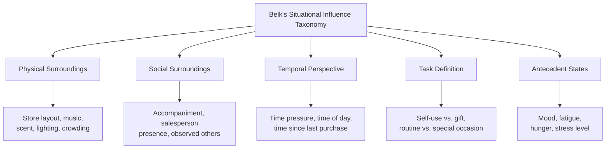

## Purchase Decision and Situational Influences

### Overview

The purchase decision stage is where the consumer converts an evaluated preference (typically the top-ranked alternative from the evaluation-of-alternatives stage) into an actual transaction. Critically, this stage is not a mechanical execution of a prior intention — a substantial body of research demonstrates that purchase intention and actual purchase behavior frequently diverge due to intervening situational factors that arise between evaluation and the point of purchase.

**Key Points**

- Purchase intention is a probabilistic predictor of purchase behavior, not a deterministic one — the intention-behavior gap is well documented in consumer research
- Two categories of factors can intervene between intention formation and purchase execution: the attitudes of others, and unanticipated situational factors
- Point-of-purchase (POP) environment and situational context can override or substantially modify an already-formed preference

---

### The Engel-Kollat-Blackwell Purchase Intervention Model

Building on the classical EKB framework, the transition from purchase intention to actual purchase is modeled as subject to two intervening variable categories:

#### 1. Attitudes of Others

The intensity of another person's negative attitude toward the intended purchase, combined with the consumer's motivation to comply with that person's wishes, can alter the final decision even after a favorable evaluation has been reached.

$$\text{Intention shift} = f(\text{intensity of other's negative attitude}, \text{motivation to comply})$$

**Example**

A consumer who has evaluated and selected a specific vehicle model may reverse the decision if a spouse expresses strong disapproval, particularly in joint-purchase household contexts where compliance motivation is high due to relationship and financial interdependence.

#### 2. Unanticipated Situational Factors

Circumstances arising between intention formation and the purchase moment that were not incorporated into the original evaluation — a sudden change in financial circumstances, a stockout of the preferred option, a competitor's last-minute promotion, or a shift in urgency/priority.

---

### Diagram: Intention-to-Purchase Intervention Model

<svg xmlns="http://www.w3.org/2000/svg" viewBox="0 0 900 400" font-family="Helvetica, Arial, sans-serif">
<text x="450" y="30" text-anchor="middle" font-size="19" font-weight="bold" fill="#1a1a1a">Purchase Intention to Behavior Gap (svg_diagram)</text>
<rect x="60" y="70" width="180" height="60" rx="8" fill="#2A9D8F" fill-opacity="0.25" stroke="#2A9D8F" stroke-width="1.5" />
<text x="150" y="105" text-anchor="middle" font-size="13" font-weight="bold" fill="#1a1a1a">Purchase Intention</text>
<line x1="240" y1="100" x2="330" y2="100" stroke="#333" stroke-width="2" marker-end="url(#m1)" />
<rect x="330" y="55" width="220" height="70" rx="8" fill="#E76F51" fill-opacity="0.2" stroke="#E76F51" stroke-width="1.5" />
<text x="440" y="80" text-anchor="middle" font-size="12" font-weight="bold" fill="#1a1a1a">Attitudes of Others</text>
<text x="440" y="98" text-anchor="middle" font-size="10" fill="#333">Intensity × Motivation to comply</text>
<text x="440" y="114" text-anchor="middle" font-size="10" fill="#333">e.g., spouse, family, peer disapproval</text>
<line x1="440" y1="125" x2="440" y2="160" stroke="#333" stroke-width="2" marker-end="url(#m1)" />
<rect x="330" y="160" width="220" height="70" rx="8" fill="#F4A261" fill-opacity="0.2" stroke="#F4A261" stroke-width="1.5" />
<text x="440" y="185" text-anchor="middle" font-size="12" font-weight="bold" fill="#1a1a1a">Unanticipated Situational Factors</text>
<text x="440" y="203" text-anchor="middle" font-size="10" fill="#333">Stockouts, financial change,</text>
<text x="440" y="217" text-anchor="middle" font-size="10" fill="#333">competitor promotion, urgency shift</text>
<line x1="440" y1="230" x2="440" y2="265" stroke="#333" stroke-width="2" marker-end="url(#m1)" />
<rect x="330" y="265" width="220" height="60" rx="8" fill="#457B9D" fill-opacity="0.25" stroke="#457B9D" stroke-width="1.5" />
<text x="440" y="300" text-anchor="middle" font-size="13" font-weight="bold" fill="#1a1a1a">Point-of-Purchase Moment</text>
<line x1="550" y1="295" x2="640" y2="230" stroke="#333" stroke-width="2" marker-end="url(#m1)" />
<rect x="640" y="70" width="180" height="60" rx="8" fill="#2A9D8F" fill-opacity="0.25" stroke="#2A9D8F" stroke-width="1.5" />
<text x="730" y="95" text-anchor="middle" font-size="13" font-weight="bold" fill="#1a1a1a">Actual Purchase</text>
<text x="730" y="112" text-anchor="middle" font-size="10" fill="#333">(same brand as intended)</text>
<rect x="640" y="265" width="180" height="60" rx="8" fill="#D62828" fill-opacity="0.2" stroke="#D62828" stroke-width="1.5" />
<text x="730" y="290" text-anchor="middle" font-size="13" font-weight="bold" fill="#1a1a1a">Modified Purchase</text>
<text x="730" y="307" text-anchor="middle" font-size="10" fill="#333">(brand switch, delay, or non-purchase)</text>
<line x1="550" y1="295" x2="640" y2="295" stroke="#333" stroke-width="2" marker-end="url(#m1)" />
</svg>

---

### Belk's Taxonomy of Situational Influence

Russell Belk's (1975) framework identifies five categories of situational characteristics that operate specifically at or near the point of purchase, independent of enduring individual or product characteristics.

#### 1. Physical Surroundings

Tangible environmental features of the purchase location: store layout, lighting, music, scent, temperature, crowding, and merchandise display/placement.

#### 2. Social Surroundings

The presence, absence, or characteristics of other people during the purchase occasion — being accompanied by a friend, family member, or salesperson, or observing other shoppers, all of which can trigger social-proof or self-presentation effects distinct from the evaluated product attributes.

#### 3. Temporal Perspective

Time-related factors including time of day, season, time pressure/urgency, time since last purchase, and time available for the purchase decision itself.

#### 4. Task Definition

The purpose or role the consumer occupies during the purchase (buying for oneself vs. buying as a gift; routine restocking vs. a special occasion), which can substantially shift evaluative criteria weighting relative to the original evaluation-stage assessment.

#### 5. Antecedent States

Momentary physiological or mood states preceding the purchase occasion — hunger, fatigue, stress, positive or negative mood — which are transient and distinct from the consumer's enduring personality or attitudes.

**Example**

A consumer who evaluated and mentally committed to a moderately priced wine bottle for personal consumption (Task Definition: routine) may substitute a higher-priced bottle when the same purchase occasion becomes a gift for a dinner host (Task Definition: gift-giving), even though no new product information or evaluation criteria were introduced — the situational task redefinition alone shifted the outcome.

---

### Point-of-Purchase (POP) Marketing Mechanisms

Retail and marketing practice has developed specific tactics that operationalize Belk's situational categories to influence the final purchase decision after evaluation has already occurred.

| Situational Category | POP Marketing Tactic | Underlying Mechanism |
| --- | --- | --- |
| Physical Surroundings | End-cap displays, checkout-lane placement, ambient scent marketing | Increased salience/availability heuristic; impulse-triggering exposure |
| Social Surroundings | Salesperson-assisted upselling, visible "bestseller" social proof labels | Social proof, compliance/persuasion dynamics |
| Temporal Perspective | Limited-time offers, countdown timers, flash sales | Scarcity heuristic, urgency-driven reduction of deliberation time |
| Task Definition | Gift-wrapping services, "gift guide" curated sections | Reframing evaluative criteria toward symbolic/social attributes |
| Antecedent States | Comfort-food placement near high-traffic/high-stress store zones (e.g., checkout candy) | Exploiting reduced self-regulation under negative/depleted affective states |

[Speculation] The ethical acceptability of deliberately exploiting Antecedent States (e.g., targeting consumers in depleted self-control states) is a contested area in marketing ethics literature; this framework describes the mechanism without endorsing its application in any specific context.

---

### Impulse Purchasing as a Situational Extreme

Impulse purchasing represents the extreme end of situational-influence dominance over planned evaluation — a purchase made with minimal or no prior deliberation, driven almost entirely by point-of-purchase stimuli rather than a pre-formed evaluated intention.

#### Stern's (1962) Impulse Buying Typology

- **Pure impulse**: A novelty- or escape-purchase that breaks a normal buying pattern entirely
- **Reminder impulse**: Seeing an item triggers memory of a need or a prior positive experience with the product (a hybrid of internal search reactivation and situational triggering)
- **Suggestion impulse**: A consumer sees a product for the first time and perceives a need for it, without prior evaluative criteria — the product itself supplies the criteria at the point of contact
- **Planned impulse**: The consumer enters the purchase environment with a general intention (e.g., "I'll buy something if there's a good deal"), and the specific selection is made opportunistically based on in-store conditions

[Inference] Stern's typology remains a foundational and widely cited reference framework in impulse-buying literature, though it predates digital/e-commerce retail environments; its direct applicability to online "impulse" mechanics (e.g., one-click purchasing, algorithmically triggered suggestions) is generally treated as an extension of the original framework rather than something the original typology was designed to address.

---

### Managerial and Marketing Strategy Implications

**Next Steps**

1. Recognize that measured purchase intention (e.g., via surveys) systematically overstates actual conversion — build in an expected intention-behavior gap when forecasting demand from stated-preference data
2. For high-compliance-motivation purchase contexts (joint household decisions, gift purchases), ensure marketing materials and in-store messaging address secondary decision-influencers, not only the primary evaluator
3. Audit point-of-purchase environments against Belk's five situational categories systematically, since favorable evaluation-stage positioning can be undone entirely by unfavorable situational execution at the point of sale
4. Design urgency and scarcity mechanisms carefully — while effective at closing the intention-behavior gap, overuse can erode long-term brand trust if perceived as manipulative or artificially scarce
5. Differentiate marketing messaging by task definition context (self-use vs. gift, routine vs. occasion) even for an identical product, since evaluative criteria weighting shifts materially by task frame

---

**Related Topics**

- Evaluation of alternatives and choice sets
- Post-purchase dissonance and cognitive dissonance theory
- Scarcity and urgency heuristics in persuasion
- Impulse buying and low-self-control purchase triggers
- Retail atmospherics and sensory marketing
- Compliance and social influence (Cialdini's principles of persuasion)
- Household and joint decision-making dynamics in consumer behavior