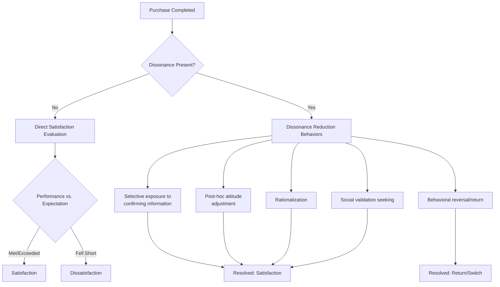

## Post-Purchase Evaluation and Dissonance

### Overview

Post-purchase evaluation is the final stage of the consumer decision-making journey, occurring after the transaction has been completed. During this stage, consumers assess whether the purchase met, exceeded, or fell short of their expectations, producing outcomes ranging from satisfaction to dissatisfaction, and frequently involving a specific psychological phenomenon known as **post-purchase (cognitive) dissonance** — discomfort arising from doubt about a decision already made. This stage generates the feedback loop that informs future problem/need recognition and internal-search memory for subsequent purchase cycles.

**Key Points**

- Post-purchase evaluation is governed primarily by the discrepancy between pre-purchase expectations and perceived actual performance, not by absolute product performance alone
- Cognitive dissonance following purchase is a distinct phenomenon from dissatisfaction — it can occur even when the product performs adequately, driven by awareness of foregone alternatives
- This stage directly determines repurchase intention, word-of-mouth behavior, and complaint/loyalty outcomes, making it a critical (and frequently under-invested) point of marketing leverage

---

### The Expectancy-Disconfirmation Model

The dominant theoretical framework for post-purchase satisfaction, developed by Oliver (1980), models satisfaction as a function of the gap between pre-purchase expectations and post-purchase perceived performance.

$$\text{Satisfaction} = f(P - E)$$

where $P$ is perceived performance and $E$ is pre-purchase expectation, producing three possible disconfirmation outcomes:

| Outcome | Condition | Result |
| --- | --- | --- |
| Positive Disconfirmation | $P > E$ | Performance exceeds expectations → satisfaction, often amplified beyond a simple linear function |
| Simple/Zero Confirmation | $P = E$ | Performance matches expectations → mild/neutral satisfaction, expectations validated |
| Negative Disconfirmation | $P < E$ | Performance falls short of expectations → dissatisfaction |

[Inference] The expectancy-disconfirmation model is one of the most extensively validated frameworks in consumer satisfaction research; however, the precise functional form of $f(P-E)$ (linear vs. asymmetric, where negative disconfirmation may weigh more heavily than positive disconfirmation of equal magnitude, consistent with general loss-aversion patterns) varies across studies and product categories rather than following a single universally agreed-upon equation.

---

### Diagram: The Expectancy-Disconfirmation Process

<svg xmlns="http://www.w3.org/2000/svg" viewBox="0 0 900 420" font-family="Helvetica, Arial, sans-serif">
<text x="450" y="30" text-anchor="middle" font-size="18" font-weight="bold" fill="#1a1a1a">Expectancy-Disconfirmation Model (svg_diagram)</text>
<rect x="60" y="70" width="200" height="60" rx="8" fill="#457B9D" fill-opacity="0.25" stroke="#457B9D" stroke-width="1.5" />
<text x="160" y="105" text-anchor="middle" font-size="13" font-weight="bold" fill="#1a1a1a">Pre-Purchase Expectation (E)</text>
<rect x="640" y="70" width="200" height="60" rx="8" fill="#2A9D8F" fill-opacity="0.25" stroke="#2A9D8F" stroke-width="1.5" />
<text x="740" y="105" text-anchor="middle" font-size="13" font-weight="bold" fill="#1a1a1a">Perceived Performance (P)</text>
<line x1="260" y1="100" x2="640" y2="100" stroke="#333" stroke-width="1" stroke-dasharray="4,3" />
<text x="450" y="90" text-anchor="middle" font-size="11" fill="#333">compared against</text>
<polygon points="450,150 570,210 450,270 330,210" fill="#F4A261" fill-opacity="0.3" stroke="#F4A261" stroke-width="1.5" />
<text x="450" y="205" text-anchor="middle" font-size="12" font-weight="bold" fill="#1a1a1a">Disconfirmation</text>
<text x="450" y="221" text-anchor="middle" font-size="10" fill="#333">Gap: P − E</text>
<line x1="160" y1="130" x2="380" y2="180" stroke="#333" stroke-width="1.5" marker-end="url(#pm)" />
<line x1="740" y1="130" x2="520" y2="180" stroke="#333" stroke-width="1.5" marker-end="url(#pm)" />
<rect x="60" y="300" width="180" height="55" rx="8" fill="#2A9D8F" fill-opacity="0.3" stroke="#2A9D8F" stroke-width="1.5" />
<text x="150" y="332" text-anchor="middle" font-size="12" font-weight="bold" fill="#1a1a1a">Positive Disconfirmation</text>
<rect x="360" y="300" width="180" height="55" rx="8" fill="#999" fill-opacity="0.25" stroke="#999" stroke-width="1.5" />
<text x="450" y="332" text-anchor="middle" font-size="12" font-weight="bold" fill="#1a1a1a">Zero Confirmation</text>
<rect x="660" y="300" width="180" height="55" rx="8" fill="#D62828" fill-opacity="0.2" stroke="#D62828" stroke-width="1.5" />
<text x="750" y="332" text-anchor="middle" font-size="12" font-weight="bold" fill="#1a1a1a">Negative Disconfirmation</text>
<line x1="380" y1="260" x2="200" y2="300" stroke="#333" stroke-width="1.5" marker-end="url(#pm)" />
<line x1="450" y1="270" x2="450" y2="300" stroke="#333" stroke-width="1.5" marker-end="url(#pm)" />
<line x1="520" y1="260" x2="720" y2="300" stroke="#333" stroke-width="1.5" marker-end="url(#pm)" />
</svg>

---

### Post-Purchase Cognitive Dissonance (Buyer's Remorse)

Rooted in Festinger's (1957) Cognitive Dissonance Theory, post-purchase dissonance refers to psychological discomfort arising when a consumer holds simultaneously inconsistent cognitions after a purchase — most commonly, awareness of the attractive features of *rejected* alternatives alongside commitment to the *chosen* option.

#### Conditions That Increase Dissonance Likelihood

- **High irreversibility/commitment**: Difficult-to-return or non-refundable purchases increase dissonance intensity, since the psychological "exit" that would resolve the inconsistency is unavailable
- **High financial or psychological stakes**: Larger purchase magnitude increases the cost of having chosen incorrectly
- **Similarity of rejected alternatives**: When rejected options were nearly as attractive as the chosen option, the consumer's cognition retains stronger "what if" tension (directly connects to the closeness of the final comparison at the Evaluation of Alternatives stage)
- **Presence of unique or otherwise-attractive features in rejected alternatives**: Even a single compelling missed feature can seed dissonance independent of overall utility comparison
- **Public commitment**: Purchases made or disclosed publicly increase social-consistency pressure, complicating dissonance resolution via simple reversal

$$\text{Dissonance Magnitude} \propto \frac{\text{Importance of decision} \times \text{Attractiveness of rejected alternatives}}{\text{Perceived reversibility of decision}}$$

[Inference] This proportionality relationship is a conceptual synthesis consistent with Festinger's original dissonance-magnitude principles (importance and number/attractiveness of dissonant cognitions increase dissonance, while dissonance-reduction routes decrease it) rather than a formally specified quantitative equation from the original theory, which was not originally expressed in this mathematical form.

---

### Dissonance Reduction Strategies (Consumer-Side)

Consumers are motivated to reduce dissonance once it arises, typically through one or more of the following cognitive strategies:

1. **Selective attention/exposure**: Actively seeking confirming information (positive reviews, advertisements) about the chosen product while avoiding disconfirming information about it or confirming information about rejected alternatives
2. **Attitude adjustment**: Upgrading perceived attractiveness of the chosen option post-hoc, and/or downgrading perceived attractiveness of rejected alternatives, to reduce inconsistency
3. **Rationalization/reinterpretation**: Reframing negative aspects of the purchase as less important than initially weighted, or reframing the decision context (e.g., "I needed it anyway")
4. **Social validation-seeking**: Discussing the purchase positively with others to elicit reinforcing feedback
5. **Behavioral reversal**: Returning the product or switching to an alternative — the most direct dissonance-resolution route, but also the most costly for the consumer and the marketer

---

### Behavioral Outcomes of Post-Purchase Evaluation

| Outcome | Consumer Response | Business Impact |
| --- | --- | --- |
| High Satisfaction | Repurchase intention, positive word-of-mouth, brand loyalty formation | Increased customer lifetime value (CLV), reduced acquisition cost via referral |
| Mild Satisfaction/Confirmation | Habitual repurchase without strong advocacy | Retention without amplification |
| Dissatisfaction (voice response) | Direct complaint to company, seeking resolution/refund | Opportunity for service recovery; well-handled complaints can produce the "service recovery paradox" (higher post-recovery satisfaction than if no failure had occurred) |
| Dissatisfaction (private response) | Negative word-of-mouth without direct company contact | Reputational damage without an opportunity for the company to intervene or recover |
| Dissatisfaction (third-party response) | Public reviews, regulatory complaints, social media posts | Broad reputational exposure; increasingly dominant channel in digital contexts |
| Unresolved Dissonance | Continued psychological discomfort, potential switching on next purchase cycle | Erosion of repeat-purchase probability despite adequate product performance |

[Inference] The "service recovery paradox" (post-recovery satisfaction exceeding pre-failure-baseline satisfaction) is a documented phenomenon in service marketing literature, but subsequent research has found it does not replicate universally across all failure types and severities — severe or repeated failures typically do not produce this paradox regardless of recovery quality, so it should be treated as a conditional effect rather than a general rule marketers can rely on for any service failure.

---

### Marketing Interventions to Manage Post-Purchase Stage

**Next Steps**

1. **Expectation calibration during pre-purchase marketing**: Avoid overpromising in advertising and sales messaging, since inflated pre-purchase expectations directly increase negative-disconfirmation risk regardless of actual product quality
2. **Post-purchase reinforcement communication**: Follow-up emails, onboarding content, and usage tips that reinforce the wisdom of the purchase decision directly address dissonance-reduction needs (supplying the consumer with confirming information rather than requiring them to seek it independently)
3. **Robust return/refund policies**: Counterintuitively, generous return policies can *reduce* dissonance-driven anxiety pre-purchase (by lowering perceived irreversibility) while simultaneously providing an accessible resolution path post-purchase if dissatisfaction occurs
4. **Active complaint-channel design**: Making it easy for dissatisfied customers to voice complaints directly to the company (rather than only to third parties or privately) preserves the opportunity for service recovery before reputational damage compounds
5. **Loyalty and community program design**: Structured post-purchase engagement (loyalty points, user communities, content around the product category) sustains positive reinforcement well beyond the immediate transaction window, feeding directly into the next decision cycle's internal-search stage

---

**Related Topics**

- Purchase decision and situational influences
- Cognitive Dissonance Theory (Festinger, 1957)
- Customer satisfaction measurement and Net Promoter Score (NPS) methodology
- Service recovery paradox and complaint-handling strategy
- Customer lifetime value (CLV) and retention marketing
- Word-of-mouth and online review generation strategy
- Internal and external information search (feedback loop into future cycles)