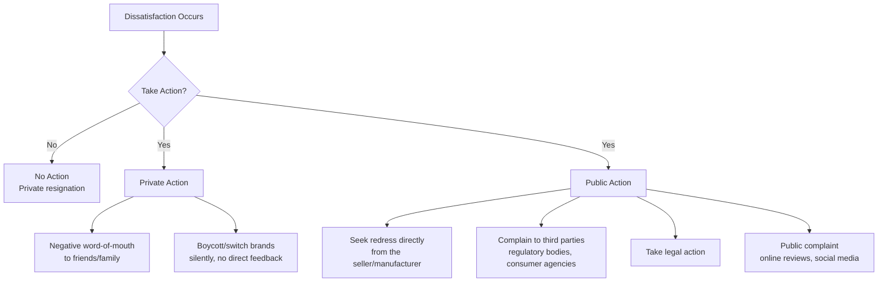

## Complaint Behavior and Service Recovery

### Overview

Complaint behavior refers to the range of consumer responses following a dissatisfying purchase or service experience, and service recovery refers to the organizational processes designed to address those responses and restore satisfaction. This stage extends directly from post-purchase dissatisfaction, but merits separate treatment because the vast majority of dissatisfied consumers do not complain directly to the company — a phenomenon with substantial implications for how businesses must actively surface, rather than passively await, dissatisfaction signals.

**Key Points**

- The large majority of dissatisfied consumers respond through private or third-party channels rather than voicing complaints directly to the firm, meaning silence should never be interpreted as satisfaction
- Complaint response is best modeled as a categorical choice among distinct behavioral paths, not a single "complain or don't complain" binary
- Well-executed service recovery can, under specific conditions, produce satisfaction levels matching or exceeding a failure-free experience, though this effect is conditional rather than universal

---

### Day and Landon's Taxonomy of Complaint Responses

The foundational framework (Day & Landon, 1977) categorizes consumer responses to dissatisfaction along two primary branches: **no action** versus **action taken**, with action further subdivided by target.

#### No Action (Private Resignation)

The consumer experiences dissatisfaction but takes no further behavioral step — no complaint, no word-of-mouth, no switching. This response is frequently underestimated in magnitude and represents a category businesses have essentially no visibility into without proactive measurement (e.g., satisfaction surveys).

#### Private Action

Responses that do not involve the offending company or any external authority:

- **Negative word-of-mouth**: Sharing the dissatisfying experience with personal network contacts
- **Silent brand switching**: Discontinuing patronage without informing the company of the reason

#### Public Action

Responses that involve external parties, including the company itself:

- **Direct redress-seeking**: Contacting the company for a refund, replacement, or apology
- **Third-party complaint**: Escalating to consumer protection agencies, industry regulators, or ombudsman services
- **Legal action**: Pursuing formal legal remedy, typically reserved for high-stakes or safety-related failures
- **Public/social complaint**: Posting reviews, social media complaints, or public forum posts — a channel that has grown substantially in relative prominence with the rise of digital platforms

[Inference] The Day and Landon taxonomy remains a standard foundational reference in complaint-behavior literature; the specific channel of public/social digital complaint (reviews, social media) has grown substantially in relative importance since the original 1977 framework predates widespread internet and social media use, and is typically treated in contemporary literature as an expansion of the "public action" branch rather than a wholly separate category.

---

### Determinants of Complaint Likelihood

Whether a dissatisfied consumer complains at all — and through which channel — depends on several interacting factors:

| Factor | Effect on Complaint Likelihood |
| --- | --- |
| Severity of dissatisfaction | Higher severity increases likelihood of any action, and increases likelihood of escalation to public/third-party channels |
| Perceived likelihood of successful resolution | Consumers who believe complaining will be effective are more likely to pursue direct redress; low perceived efficacy shifts behavior toward private action or exit |
| Cost of complaining (time, effort, friction) | High-friction complaint processes suppress direct-redress complaints, pushing dissatisfaction into private or public-digital channels instead |
| Attribution of blame | Complaints are more likely when the consumer attributes the failure to the company (controllable, internal cause) rather than to external/uncontrollable circumstances |
| Product/service importance and cost | Higher-stakes purchases increase complaint likelihood across all channels |
| Consumer complaint proneness (individual trait) | Some consumers exhibit a stable disposition toward complaining across situations, largely independent of the specific failure severity |
| Availability of accessible complaint channels | Easily accessible, low-friction channels (chat support, simple return processes) increase direct-to-company complaint rates relative to private/public alternatives |

[Inference] Attribution theory's application to complaint behavior (blame attribution driving complaint likelihood and channel choice) is well-established in services marketing literature; the magnitude of each individual factor's effect varies considerably by product category, cultural context, and is not reducible to a single universal weighting across all studies.

---

### The Service Recovery Paradox

The service recovery paradox describes a documented (but conditional) phenomenon in which a customer who experiences a service failure followed by an effective recovery can report *higher* satisfaction than a customer who experienced no failure at all.

#### Conditions Under Which the Paradox Is More Likely to Hold

- **First-time failure**: The paradox is more reliably observed for isolated incidents rather than repeated failures from the same provider
- **High-quality, prompt recovery**: Recovery must be perceived as fair, timely, and proportionate to the failure
- **Moderate failure severity**: Very severe failures (e.g., safety issues, significant financial harm) are less likely to produce the paradox regardless of recovery quality
- **Attribution to controllable, addressed causes**: Recovery is more effective when the consumer perceives the company took clear ownership and corrective action

[Inference] The service recovery paradox is a genuinely documented effect in the services marketing literature (associated substantially with research by McCollough, Bitner, and others), but subsequent research has consistently found it does not replicate universally — several studies find no paradox or even a persistent satisfaction deficit following severe or repeated failures. Practitioners should treat it as a conditional, failure-severity-dependent phenomenon rather than a general justification for tolerating service failures.

---

### The Justice Theory Framework for Service Recovery

Service recovery effectiveness is commonly analyzed through three dimensions of perceived organizational justice (drawing on Organizational Justice Theory applied to service failure contexts):

#### 1. Distributive Justice

Perceived fairness of the tangible outcome of the recovery — the refund amount, replacement value, or compensation relative to the loss experienced.

#### 2. Procedural Justice

Perceived fairness of the *process* used to reach the recovery outcome — policies, response speed, and the flexibility/appropriateness of the complaint-handling procedure.

#### 3. Interactional Justice

Perceived fairness of the interpersonal treatment received during the recovery process — politeness, empathy, honesty, and effort demonstrated by staff, independent of the outcome or process itself.

<svg xmlns="http://www.w3.org/2000/svg" viewBox="0 0 900 380" font-family="Helvetica, Arial, sans-serif">
<text x="450" y="30" text-anchor="middle" font-size="18" font-weight="bold" fill="#1a1a1a">Three-Dimensional Justice Model of Service Recovery (svg_diagram)</text>
<circle cx="300" cy="200" r="110" fill="#457B9D" fill-opacity="0.2" stroke="#457B9D" stroke-width="2" />
<circle cx="600" cy="200" r="110" fill="#2A9D8F" fill-opacity="0.2" stroke="#2A9D8F" stroke-width="2" />
<circle cx="450" cy="330" r="110" fill="#E76F51" fill-opacity="0.2" stroke="#E76F51" stroke-width="2" />

<text x="260" y="170" text-anchor="middle" font-size="13" font-weight="bold" fill="`#1a1a1a`">Distributive</text>

<text x="260" y="188" text-anchor="middle" font-size="13" font-weight="bold" fill="`#1a1a1a`">Justice</text>

<text x="260" y="206" text-anchor="middle" font-size="10" fill="#333">Outcome fairness</text>

<text x="260" y="220" text-anchor="middle" font-size="10" fill="#333">(refund, replacement)</text>

<text x="640" y="170" text-anchor="middle" font-size="13" font-weight="bold" fill="`#1a1a1a`">Procedural</text>

<text x="640" y="188" text-anchor="middle" font-size="13" font-weight="bold" fill="`#1a1a1a`">Justice</text>

<text x="640" y="206" text-anchor="middle" font-size="10" fill="#333">Process fairness</text>

<text x="640" y="220" text-anchor="middle" font-size="10" fill="#333">(speed, policy flexibility)</text>

<text x="450" y="345" text-anchor="middle" font-size="13" font-weight="bold" fill="`#1a1a1a`">Interactional</text>

<text x="450" y="363" text-anchor="middle" font-size="10" fill="#333">Interpersonal treatment</text>

<text x="450" y="377" text-anchor="middle" font-size="10" fill="#333">(empathy, respect, effort)</text>

<text x="450" y="240" text-anchor="middle" font-size="12" font-weight="bold" fill="`#1a1a1a`">Perceived Recovery Fairness</text>

<text x="450" y="256" text-anchor="middle" font-size="12" font-weight="bold" fill="`#1a1a1a`">→ Post-Recovery Satisfaction</text>

</svg>

**Example**

An airline handling a significant flight delay demonstrates all three justice dimensions when it provides adequate compensation matched to the inconvenience (distributive), resolves rebooking quickly through an accessible and flexible process (procedural), and has staff communicate proactively and apologetically rather than defensively (interactional) — research on service recovery generally suggests interactional and procedural justice often carry particularly strong weight on overall recovery satisfaction, frequently comparable to or exceeding the pure monetary/outcome compensation itself.

[Inference] The relative weighting of the three justice dimensions varies across studies and industries; while multiple studies find interactional and procedural justice meaningfully influence recovery satisfaction independent of compensation amount, the specific finding that they "outweigh" distributive justice is not a universal, fixed result across all contexts and should be treated as a general directional pattern rather than a precise ranking.

---

### Organizational Service Recovery Strategy Framework

| Principle | Description |
| --- | --- |
| Speed of response | Faster acknowledgment and resolution reduces escalation to private/public negative channels and improves procedural justice perception |
| Empowerment of frontline staff | Staff authorized to resolve issues without excessive escalation reduces friction cost for the consumer and improves procedural and interactional justice |
| Proactive complaint solicitation | Actively inviting feedback (surveys, easy-access complaint channels) surfaces the large "no action" silent-dissatisfaction segment that would otherwise remain invisible |
| Fair, proportionate compensation | Compensation calibrated to the severity of the failure supports distributive justice without over- or under-correcting |
| Root-cause resolution, not just symptom treatment | Addressing the underlying cause of recurring failures prevents the repeated-failure condition under which the service recovery paradox reliably fails to hold |
| Transparent, empathetic communication | Directly addresses interactional justice; documented as a consistently high-leverage, relatively low-cost recovery lever |

---

**Related Topics**

- Post-purchase evaluation and dissonance
- Customer satisfaction measurement and Net Promoter Score (NPS)
- Organizational Justice Theory in services marketing
- Word-of-mouth and online review management
- Customer lifetime value and retention strategy
- Attribution theory in consumer blame and complaint behavior
- Loyalty program design and post-recovery relationship rebuilding