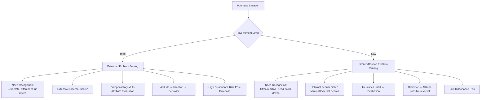

## Low- Versus High-Involvement Decision Paths

### Overview

Involvement refers to the perceived personal relevance of a purchase decision to the consumer, based on inherent needs, values, and interests (Zaichkowsky, 1985). The level of involvement fundamentally alters how a consumer moves through the decision journey — determining whether all five stages (need recognition, search, evaluation, purchase, post-purchase) are engaged deliberately and extensively, or whether the process collapses into an abbreviated, largely automatic sequence. This distinction is foundational to segmenting marketing strategy by decision-process type rather than solely by product category.

**Key Points**

- Involvement is a continuum, not a binary, though it is commonly operationalized as high/low for practical modeling purposes
- Involvement level determines which persuasion route is effective (central vs. peripheral, per the Elaboration Likelihood Model)
- The same product category can shift between high- and low-involvement processing depending on situational context, not only inherent product characteristics

---

### Determinants of Involvement Level

| Determinant Category | Description | Example |
| --- | --- | --- |
| Personal | Self-concept relevance, values, needs, prior interest | A car enthusiast experiences high involvement in any vehicle purchase, even routine ones |
| Product/Category | Price, complexity, perceived risk, symbolic value inherent to the category | Insurance and major appliances are typically high-involvement by category; chewing gum is typically low-involvement |
| Situational | Purpose of purchase, social visibility, time pressure, purchase occasion | A gift purchase can elevate involvement in an otherwise low-involvement category |

---

### The Extended Problem Solving (EPS) Path — High Involvement

High-involvement decisions engage all five stages of the decision journey extensively and deliberately, characteristic of infrequent, high-cost, high-risk, or highly self-relevant purchases.

#### Characteristics

- **Extensive external search**: Consumers actively seek multiple information sources across personal, commercial, and public channels
- **Compensatory, multi-attribute evaluation**: Detailed comparison across several evaluative criteria, often using formal or semi-formal weighting (see the Fishbein multi-attribute model)
- **High perceived risk**: Financial, performance, social, or psychological risk motivates thorough deliberation
- **Longer decision timeline**: Days, weeks, or months may elapse between need recognition and purchase
- **Attitude formation precedes behavior**: Consumers typically develop a considered attitude toward the product/brand before purchasing (attitude → intention → behavior sequence)
- **Significant post-purchase dissonance risk**: The stakes and irreversibility characteristic of high-involvement purchases increase the likelihood of post-purchase cognitive dissonance

**Example categories**: Homes, vehicles, higher education, major medical decisions, enterprise B2B software procurement, significant financial products (mortgages, retirement plans)

---

### The Limited/Routine Problem Solving (LPS/RPS) Path — Low Involvement

Low-involvement decisions abbreviate or skip stages of the decision journey, characteristic of frequent, low-cost, low-risk purchases with minimal personal relevance.

#### Characteristics

- **Minimal or no external search**: Internal search (habitual brand memory) is typically sufficient
- **Non-compensatory or heuristic-based evaluation**: Simple decision rules (habit, brand familiarity, price threshold) substitute for detailed multi-attribute comparison
- **Low perceived risk**: Low financial/performance consequences reduce the motivation for deliberation
- **Short decision timeline**: Often near-instantaneous, occurring at or very near the point of purchase
- **Behavior may precede attitude formation**: Consumers may purchase and use a product before forming a strong, considered attitude toward it (behavior → attitude sequence — a reversal of the high-involvement pattern), with attitude sometimes forming retroactively through post-purchase experience rather than driving the initial choice

**Example categories**: Household staples, inexpensive snack foods, routine grocery restocking, low-cost impulse items

---

### Diagram: The Involvement Continuum and Decision Process Compression

<svg xmlns="http://www.w3.org/2000/svg" viewBox="0 0 900 400" font-family="Helvetica, Arial, sans-serif">
<text x="450" y="30" text-anchor="middle" font-size="18" font-weight="bold" fill="#1a1a1a">Involvement Continuum and Process Compression (svg_diagram)</text>
<line x1="100" y1="360" x2="800" y2="360" stroke="#333" stroke-width="2" />
<text x="450" y="390" text-anchor="middle" font-size="13" fill="#333">Involvement Level →</text>
<text x="150" y="378" font-size="11" fill="#333">Low</text>
<text x="750" y="378" font-size="11" fill="#333">High</text>

<rect x="120" y="290" width="60" height="50" fill="#457B9D" fill-opacity="0.4" />
<text x="150" y="320" text-anchor="middle" font-size="9" fill="#1a1a1a">Need</text>
<rect x="185" y="290" width="30" height="50" fill="#457B9D" fill-opacity="0.25" />
<text x="200" y="320" text-anchor="middle" font-size="8" fill="#1a1a1a">Int.</text>
<rect x="220" y="290" width="40" height="50" fill="#457B9D" fill-opacity="0.3" />
<text x="240" y="320" text-anchor="middle" font-size="8" fill="#1a1a1a">Eval</text>
<rect x="265" y="290" width="50" height="50" fill="#457B9D" fill-opacity="0.4" />
<text x="290" y="320" text-anchor="middle" font-size="9" fill="#1a1a1a">Purchase</text>

<text x="220" y="270" text-anchor="middle" font-size="11" font-weight="bold" fill="`#457B9D`">Low Involvement: Compressed</text>

<rect x="500" y="150" width="60" height="190" fill="#2A9D8F" fill-opacity="0.4" />
<text x="530" y="250" text-anchor="middle" font-size="10" fill="#1a1a1a">Need</text>
<text x="530" y="264" text-anchor="middle" font-size="10" fill="#1a1a1a">Recognition</text>
<rect x="565" y="150" width="70" height="190" fill="#2A9D8F" fill-opacity="0.3" />
<text x="600" y="250" text-anchor="middle" font-size="10" fill="#1a1a1a">Extensive</text>
<text x="600" y="264" text-anchor="middle" font-size="10" fill="#1a1a1a">Search</text>
<rect x="640" y="150" width="70" height="190" fill="#2A9D8F" fill-opacity="0.35" />
<text x="675" y="250" text-anchor="middle" font-size="10" fill="#1a1a1a">Compensatory</text>
<text x="675" y="264" text-anchor="middle" font-size="10" fill="#1a1a1a">Evaluation</text>
<rect x="715" y="150" width="60" height="190" fill="#2A9D8F" fill-opacity="0.4" />
<text x="745" y="250" text-anchor="middle" font-size="10" fill="#1a1a1a">Purchase</text>

<text x="640" y="130" text-anchor="middle" font-size="11" font-weight="bold" fill="`#2A9D8F`">High Involvement: Extended</text>

</svg>

---

### Involvement and the Elaboration Likelihood Model (ELM)

Petty and Cacioppo's ELM (1986) provides the persuasion-theory complement to the involvement framework, specifying which persuasion route is effective under each involvement condition.

#### Central Route (High Involvement)

Persuasion occurs through careful, effortful evaluation of message content — argument quality, evidence strength, and logical coherence drive attitude change. Attitudes formed via the central route tend to be more durable, more predictive of behavior, and more resistant to counter-persuasion.

#### Peripheral Route (Low Involvement)

Persuasion occurs through heuristic cues unrelated to argument substance — source attractiveness/credibility, emotional appeal, repetition, endorsements, or simple positive associations. Attitudes formed via the peripheral route tend to be less durable and more susceptible to subsequent counter-persuasion.

**Example**

A B2B enterprise software vendor targeting high-involvement procurement decisions should prioritize detailed technical whitepapers, ROI case studies, and live product demonstrations (central-route content) over brand-mood advertising, whereas a snack food brand competing in a low-involvement category benefits more from repetitive, emotionally resonant, high-frequency brand advertising (peripheral-route content) than from detailed nutritional argumentation, which most consumers in this category are not motivated to process centrally.

---

### The FCB Grid: Integrating Involvement with Think/Feel Orientation

The Foote, Cone & Belding (FCB) Grid extends the involvement dichotomy into a two-dimensional model by crossing involvement level (high/low) with cognitive orientation (think/rational vs. feel/emotional), producing four distinct strategic quadrants.

|  | Think (Rational) | Feel (Emotional) |
| --- | --- | --- |
| **High Involvement** | Informative strategy — detailed, fact-based, extensive copy (e.g., insurance, major appliances) | Affective strategy — emotionally impactful, image-driven, large-format (e.g., jewelry, fashion) |
| **Low Involvement** | Habit-formation strategy — small-space reminder ads, in-store trial, repetitive exposure (e.g., household staples) | Self-satisfaction strategy — lifestyle/sensory association, billboard/outdoor formats (e.g., snacks, beverages) |

[Inference] The FCB Grid is a well-established practitioner framework originating from advertising agency planning practice; like many applied advertising-planning models, it is more widely used as a strategic heuristic in industry practice than as an empirically exhaustively validated academic theory, and its quadrant boundaries should be treated as directional strategic guidance rather than precise, universally measured category placements.

---

### Marketing Strategy Implications by Involvement Level

**Next Steps**

1. **Diagnose involvement level per situation, not per category alone** — the same product can shift involvement level based on situational task definition (e.g., a routine low-involvement purchase becomes high-involvement when purchased as a significant gift)
2. **For high-involvement categories**: invest in detailed, substantive content (comparison guides, technical specifications, case studies, demos) that supports central-route processing and compensatory evaluation
3. **For low-involvement categories**: prioritize repetition, availability/distribution, packaging distinctiveness, and peripheral cues (endorsements, emotional association, simple brand recognition) over detailed argumentation, since consumers are unlikely to engage in effortful central processing regardless of content quality
4. **Recognize the attitude-behavior sequence difference**: in low-involvement contexts, trial-generation tactics (sampling, low-cost trial offers) can be more effective than persuasion-first tactics, since attitude may form only after behavioral trial rather than before it
5. **Monitor for involvement-shifting triggers** (situational elevation of an otherwise low-involvement category) as an opportunity to deploy high-involvement-style marketing tactics selectively and temporarily

---

**Related Topics**

- Evaluation of alternatives and choice sets
- Elaboration Likelihood Model (Petty & Cacioppo) in depth
- FCB Grid and advertising strategy planning
- Attitude-behavior consistency theory
- Habitual/routine repurchase and brand loyalty formation
- Situational influences on purchase behavior
- Post-purchase evaluation and dissonance