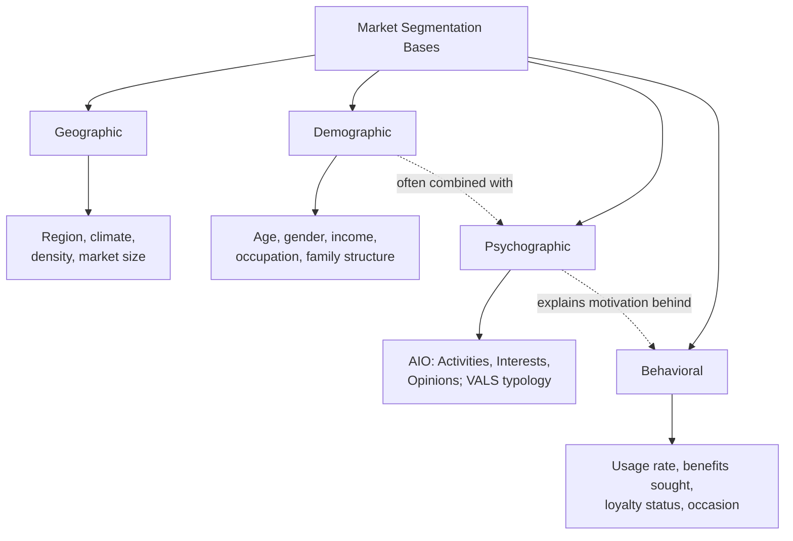

## Segmentation Bases and Variables

### Overview

Market segmentation is the process of dividing a heterogeneous market into distinct subgroups (segments) of consumers who share similar characteristics, needs, or behaviors, such that each segment can be addressed with a differentiated marketing strategy. The choice of **segmentation base** — the variable or variable set used to partition the market — is the foundational methodological decision underlying the entire segmentation-targeting-positioning (STP) process, since it determines both the homogeneity of resulting segments and their practical addressability by marketing action.

**Key Points**

- Segmentation bases are commonly grouped into four major categories: geographic, demographic, psychographic, and behavioral
- No single base is universally superior — base selection should be driven by the specific marketing decision the segmentation is intended to inform
- Effective segments must satisfy several criteria beyond mere internal homogeneity (see Criteria for Effective Segmentation below), most notably measurability, accessibility, and actionability

---

### Geographic Segmentation

Divides the market according to physical or administrative location.

| Variable | Examples |
| --- | --- |
| Region | Country, state/province, continent |
| Population density | Urban, suburban, rural |
| Climate | Tropical, temperate, arctic |
| City/market size | Population thresholds (e.g., major metro vs. small town) |

**Example**

A beverage company may formulate distinct product lines for hot-climate markets (emphasizing hydration/refreshment) versus cold-climate markets (emphasizing warmth-associated seasonal flavors), using climate as the primary geographic segmentation variable.

---

### Demographic Segmentation

Divides the market according to measurable, objective population characteristics. Demographic segmentation is the most widely used base in practice due to its ease of measurement and strong correlation with purchase behavior across many categories.

| Variable | Examples |
| --- | --- |
| Age | Generational cohorts, life-stage age bands |
| Gender | Male, female, non-binary segmentation where relevant to the category |
| Income | Income brackets, often combined with occupation for socioeconomic status (SES) proxies |
| Occupation | Blue-collar, white-collar, professional/managerial classifications |
| Education | Educational attainment level |
| Family/household structure | Family size, marital status, presence/age of children (often formalized via the Family Life Cycle model) |
| Religion, ethnicity, nationality | Used cautiously and contextually, often in combination with cultural/psychographic variables |

[Inference] Demographic variables (particularly age, income, and family structure) are extensively documented as correlating with purchase behavior across a wide range of categories in marketing research; however, demographic correlation with purchase behavior varies substantially by category, and demographic segmentation alone is frequently critiqued in contemporary marketing literature as insufficient without complementary psychographic or behavioral variables, since two demographically identical consumers can exhibit substantially different purchase motivations.

---

### Psychographic Segmentation

Divides the market according to psychological and lifestyle characteristics — values, attitudes, interests, opinions, and personality traits.

#### AIO Framework (Activities, Interests, Opinions)

The foundational psychographic measurement approach (Wells & Tigert, 1971), operationalizing lifestyle through survey batteries measuring:

- **Activities**: How consumers spend time (hobbies, social behavior, work, vacations)
- **Interests**: What consumers prioritize or find personally significant (family, community, recreation)
- **Opinions**: Consumer views on social, political, economic, and personal issues

#### VALS Framework (Values, Attitudes, and Lifestyles)

A widely used commercial psychographic segmentation system classifying consumers along two dimensions: **primary motivation** (ideals, achievement, or self-expression) and **resources** (ranging from minimal to abundant, encompassing income, education, energy, and self-confidence), producing distinct consumer types (e.g., Innovators, Thinkers, Achievers, Experiencers, Believers, Strivers, Makers, Survivors in the commonly cited US VALS framework).

**Example**

Two consumers with identical demographic profiles (same age, income, and occupation) may be segmented into entirely different psychographic groups if one prioritizes self-expression and novelty-seeking (aligning with an "Experiencer" VALS-type profile) while the other prioritizes stability and tradition (aligning with a "Believer" VALS-type profile), leading to substantially different product and messaging fit despite demographic similarity.

[Unverified] VALS is a proprietary commercial framework (developed by SRI International, now maintained by Strategic Business Insights); while widely referenced in marketing education and practice, the specific current typology labels and classification methodology are maintained and updated by the framework's commercial owner, so practitioners should consult the current official source rather than assuming a fixed, permanently stable set of type labels.

---

### Behavioral Segmentation

Divides the market according to consumers' actual behavior, knowledge, attitude toward, or usage of a product or category — often considered the most directly actionable base since it segments on observed rather than inferred characteristics.

| Variable | Examples |
| --- | --- |
| Occasion | Regular occasion vs. special occasion usage |
| Benefits sought | Segmenting by the specific benefit a consumer seeks from the category (see Benefit Segmentation below) |
| User status | Non-user, ex-user, potential user, first-time user, regular user |
| Usage rate | Light, medium, heavy user (often following a Pareto-style distribution, e.g., "heavy-half" analysis) |
| Loyalty status | None, moderate, strong, absolute brand loyalty |
| Buyer readiness stage | Unaware, aware, informed, interested, desirous, intending to buy |
| Attitude toward product | Enthusiastic, positive, indifferent, negative, hostile |

#### Benefit Segmentation (Haley, 1968)

A specific and influential behavioral approach segmenting the market according to the primary benefit sought from a product category, on the premise that the benefits consumers seek are the fundamental reason distinct segments exist, more so than any demographic or psychographic descriptor.

**Example**

Toothpaste markets have historically been segmented via benefit segmentation into groups seeking primarily decay prevention, whitening, flavor/sensory experience, or price-value — with demographic and psychographic profiles then used as secondary descriptors of who falls into each benefit-seeking group, rather than as the primary segmentation variable itself.

#### Usage-Rate Segmentation and the Pareto Principle

Many categories exhibit a heavily skewed usage distribution wherein a minority of "heavy users" account for a disproportionate share of total category volume or revenue — commonly referenced (though not universally precise) as an 80/20-style pattern.

[Inference] The specific "80/20" ratio is a commonly cited heuristic approximation across many product categories; actual heavy-user revenue concentration varies by category and dataset, and the ratio should be treated as illustrative of a general skew pattern rather than a precise universal constant applicable to every market.

---

### Diagram: The Four Major Segmentation Base Categories

---

### B2B-Specific Segmentation Bases

Business-to-business markets require additional or adapted bases beyond the consumer-oriented four categories above (Bonoma & Shapiro's nested B2B segmentation model is a commonly referenced framework):

| Category | Variables |
| --- | --- |
| Demographic (firmographic) | Industry (SIC/NAICS code), company size, location |
| Operating variables | Technology used, user/non-user status, customer capabilities |
| Purchasing approach | Purchasing function organization, power structure, purchasing policies, existing relationships |
| Situational factors | Urgency, specific application, order size |
| Personal characteristics | Buyer-seller similarity, attitudes toward risk, loyalty of individual decision-makers |

---

### Criteria for Effective Segmentation (The "5 Criteria")

A segmentation base or resulting segment set is only strategically useful if it satisfies several practical criteria, commonly summarized as:

1. **Measurable**: The size, purchasing power, and characteristics of the segment can be reasonably estimated
2. **Substantial**: The segment is large and profitable enough to be worth targeting with a differentiated strategy
3. **Accessible**: The segment can be effectively reached and served through distribution and communication channels
4. **Differentiable**: The segment is conceptually distinguishable and responds differently to different marketing mix elements
5. **Actionable**: The organization has the resources and capability to design and implement effective programs for the segment

**Example**

A psychographic segment defined by a highly specific, niche personality trait combination might be conceptually interesting and internally homogeneous but fail the "Accessible" and "Actionable" criteria if no media channel or targeting mechanism exists to reach that exact combination cost-effectively — illustrating why segmentation base selection must be evaluated against downstream marketing feasibility, not only statistical/conceptual coherence.

---

### Single-Base vs. Multi-Base (Hybrid) Segmentation

In practice, most contemporary segmentation approaches combine multiple bases rather than relying on a single variable category, since each base category addresses a different strategic question:

- **Geographic/Demographic**: Answer "who and where" — largely descriptive and highly measurable/accessible
- **Psychographic**: Answers "why" — explains underlying motivation but is harder to measure and target directly through most media channels
- **Behavioral**: Answers "what they do" — most directly actionable but does not always explain the underlying cause

A common hybrid approach uses behavioral or psychographic variables to identify the strategically meaningful segment structure, then profiles those segments using demographic and geographic variables to make them addressable through conventional targeting and media-buying infrastructure.

---

**Related Topics**

- Benefit segmentation and needs-based market research methodology
- VALS and other commercial psychographic typologies
- Targeting strategies: undifferentiated, differentiated, concentrated, and micromarketing
- Positioning strategy and perceptual mapping
- B2B (firmographic) segmentation and the Bonoma-Shapiro nested model
- Pareto analysis and heavy-user marketing strategy
- Family Life Cycle model and demographic life-stage marketing