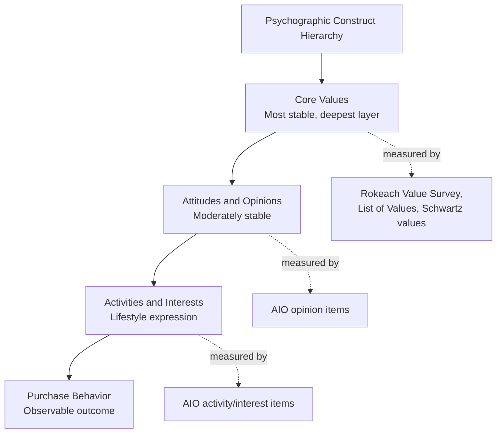

## Psychographic and Values-Based Segmentation

### Overview

Psychographic segmentation divides a market according to psychological attributes — personality, values, attitudes, interests, and lifestyle — rather than observable demographic or behavioral characteristics. Its core premise is that two consumers who are demographically identical can differ substantially in what they want from a category, and that these differences are driven by internal psychological orientation rather than external, easily measured traits. Values-based segmentation is a specific and increasingly prominent subtype that segments according to consumers' core, relatively stable personal and social values rather than the broader and more situational lifestyle constructs captured by general psychographics.

**Key Points**

- Psychographics answers the "why" behind purchase behavior in a way demographic and geographic bases cannot
- Psychographic variables are harder to measure directly than demographics, typically requiring purpose-built survey instruments (AIO batteries, personality scales, values inventories)
- Values-based segmentation specifically targets the most stable, deeply held layer of psychographic constructs, making resulting segments more temporally durable but often more abstract and harder to operationalize into targeting criteria

---

### The AIO Framework (Activities, Interests, Opinions)

Developed by Wells and Tigert (1971), AIO remains the foundational methodological approach to measuring psychographic/lifestyle variables through structured survey batteries.

| Dimension | Measured Via | Example Items |
| --- | --- | --- |
| Activities | How consumers spend time and resources | Work, hobbies, social events, vacation, entertainment, club membership |
| Interests | What consumers find personally important or engaging | Family, home, job, community, recreation, fashion, food, media |
| Opinions | Consumer views on self and the world | Views on themselves, social issues, politics, business, economics, culture, products |

AIO items are typically administered as large batteries of Likert-scale statements, then reduced via factor analysis or cluster analysis into a smaller number of interpretable lifestyle segments.

---

### VALS Framework (Values, Attitudes, and Lifestyles)

VALS, developed by SRI International (now maintained commercially by Strategic Business Insights), is among the most widely referenced commercial psychographic segmentation systems, classifying US consumers along two structural dimensions.

#### Dimension 1: Primary Motivation

- **Ideals**: Motivated by knowledge and principles
- **Achievement**: Motivated by demonstrating success to peers
- **Self-Expression**: Motivated by social or physical activity, variety, and risk

#### Dimension 2: Resources

A composite of psychological and material capacity — including income, education, self-confidence, health, energy level, and eagerness to buy — ranging from minimal to abundant.

<svg xmlns="http://www.w3.org/2000/svg" viewBox="0 0 900 460" font-family="Helvetica, Arial, sans-serif">
<text x="450" y="30" text-anchor="middle" font-size="18" font-weight="bold" fill="#1a1a1a">VALS Framework Structure (svg_diagram)</text>

<text x="450" y="55" text-anchor="middle" font-size="12" fill="#333">Primary Motivation →</text>

<text x="35" y="240" text-anchor="middle" font-size="12" fill="#333" transform="rotate(-90 35 240)">Resources: Minimal → Abundant</text>

<rect x="100" y="80" width="650" height="40" fill="#457B9D" fill-opacity="0.15" />
<text x="425" y="105" text-anchor="middle" font-size="11" font-weight="bold" fill="#1a1a1a">High Resources: Innovators (span all three motivations)</text>
<rect x="100" y="130" width="215" height="80" fill="#2E86AB" fill-opacity="0.2" />
<text x="207" y="160" text-anchor="middle" font-size="12" font-weight="bold" fill="#1a1a1a">Ideals</text>
<text x="207" y="180" text-anchor="middle" font-size="10" fill="#333">Thinkers</text>
<rect x="320" y="130" width="215" height="80" fill="#2A9D8F" fill-opacity="0.2" />
<text x="427" y="160" text-anchor="middle" font-size="12" font-weight="bold" fill="#1a1a1a">Achievement</text>
<text x="427" y="180" text-anchor="middle" font-size="10" fill="#333">Achievers</text>
<rect x="540" y="130" width="210" height="80" fill="#E76F51" fill-opacity="0.2" />
<text x="645" y="160" text-anchor="middle" font-size="12" font-weight="bold" fill="#1a1a1a">Self-Expression</text>
<text x="645" y="180" text-anchor="middle" font-size="10" fill="#333">Experiencers</text>
<rect x="100" y="215" width="215" height="80" fill="#2E86AB" fill-opacity="0.35" />
<text x="207" y="260" text-anchor="middle" font-size="10" fill="#333">Believers</text>
<rect x="320" y="215" width="215" height="80" fill="#2A9D8F" fill-opacity="0.35" />
<text x="427" y="260" text-anchor="middle" font-size="10" fill="#333">Strivers</text>
<rect x="540" y="215" width="210" height="80" fill="#E76F51" fill-opacity="0.35" />
<text x="645" y="260" text-anchor="middle" font-size="10" fill="#333">Makers</text>
<rect x="100" y="300" width="650" height="40" fill="#999" fill-opacity="0.2" />
<text x="425" y="325" text-anchor="middle" font-size="11" font-weight="bold" fill="#1a1a1a">Low Resources: Survivors (span all three motivations)</text>
</svg>

**Example**

A high-resource, achievement-motivated "Achiever" segment and a high-resource, self-expression-motivated "Experiencer" segment might purchase the same product category (e.g., automobiles) at similar price points, but the Achiever is more responsive to messaging emphasizing status, career success, and reliability, while the Experiencer is more responsive to messaging emphasizing performance, novelty, and self-expression.

[Unverified] VALS is a proprietary commercial framework; the specific type labels, classification algorithm, and questionnaire instrument are maintained and periodically updated by its commercial owner. Practitioners implementing VALS-based segmentation should consult the current official source rather than relying on a fixed historical description, as details can be revised over time.

---

### Values-Based Segmentation

Values-based segmentation specifically isolates the deepest, most stable layer of the psychographic construct hierarchy: core personal and social values, as distinct from the more surface-level and situationally variable activities, interests, and opinions captured by general AIO/lifestyle measures.

#### Rokeach Value Survey (Rokeach, 1973)

A foundational academic values-measurement instrument distinguishing:

- **Terminal values**: Desired end-states of existence (e.g., a sense of accomplishment, family security, inner harmony, social recognition)
- **Instrumental values**: Preferred modes of conduct or behavior used to achieve terminal values (e.g., honesty, ambition, independence, self-control)

#### List of Values (LOV) (Kahle, 1983)

A marketing-research-oriented simplification of Rokeach's approach, using a shorter set of values more directly tied to consumption-relevant self-concept (e.g., self-respect, security, warm relationships with others, sense of belonging, self-fulfillment, being well-respected, sense of accomplishment, fun and enjoyment, excitement).

#### Schwartz Theory of Basic Human Values

A cross-culturally validated model organizing values into a circular structure of ten broad motivational types (e.g., self-direction, stimulation, hedonism, achievement, power, security, conformity, tradition, benevolence, universalism), with adjacent values in the circle being psychologically compatible and opposite values representing motivational tension.

[Inference] The layered hierarchy depicted above (values as the most stable layer underlying more surface-level attitudes and lifestyle expressions) is a widely used conceptual model in consumer values research connecting Rokeach-style values theory to marketing psychographics; it represents a synthesized theoretical structure rather than a single empirically fixed causal chain validated identically across all studies.

---

### Values-Based Segmentation in Contemporary Marketing Practice

Values-based segmentation has grown in prominence alongside increased consumer interest in brand ethics, sustainability, and social positioning — segmenting markets according to values such as:

- **Environmental/sustainability orientation**: Willingness to pay premiums for environmentally responsible products, sensitivity to sustainability messaging
- **Social/ethical consumption values**: Preference for brands aligned with fair labor practices, social justice positioning, or community-oriented business models
- **Traditional vs. progressive value orientation**: Preference for brands emphasizing heritage, family, and continuity versus brands emphasizing innovation, disruption, and progressive social positioning
- **Individualist vs. collectivist orientation**: Preference for messaging emphasizing personal achievement/autonomy versus group belonging/community

**Example**

Two apparel brands may target demographically similar consumers with dramatically different value propositions — one emphasizing durability, heritage craftsmanship, and multi-generational brand tradition (appealing to a tradition/security value orientation), the other emphasizing constant novelty, trend-responsiveness, and individual self-expression (appealing to a stimulation/self-direction value orientation) — with values-based segmentation providing the conceptual basis for this divergent positioning even among otherwise similar target demographics.

[Speculation] The specific magnitude of "values-driven" purchasing behavior (i.e., how much actual purchase behavior shifts based on stated value alignment, as opposed to stated survey preference alone) is a genuinely contested empirical question in marketing research, sometimes referred to as the "values-action gap" — stated values-based preferences do not always translate proportionally into actual purchase premiums or brand-switching behavior, and this gap size varies substantially by category, demographic, and measurement methodology.

---

### Methodological Considerations and Limitations

| Limitation | Description |
| --- | --- |
| Measurement complexity | Requires custom survey instruments and statistical clustering (factor/cluster analysis), unlike readily available demographic data |
| Lower accessibility | Psychographic/values segments are harder to target directly through conventional media buying compared to demographic segments, often requiring secondary demographic/behavioral profiling of the psychographic clusters to make them addressable |
| Temporal instability of surface constructs | Activities, interests, and opinions (as opposed to core values) can shift more readily with life stage, trends, or situational context, requiring periodic re-measurement |
| Values-action gap | Stated value orientation does not always predict actual purchase behavior with the reliability marketers might assume, requiring triangulation with behavioral segmentation data |
| Proprietary framework dependency | Widely used commercial systems (VALS and similar) require licensing and periodic methodology updates from their commercial maintainers |

---

### Integration with Other Segmentation Bases

Values-based and general psychographic segments are most operationally useful when combined with demographic and behavioral profiling — psychographics identify *why* a segment exists and *what* motivates it, while demographic and behavioral overlays make the resulting segment addressable through conventional targeting infrastructure (media buying, retail distribution, direct marketing channels).

---

**Related Topics**

- Segmentation bases and variables
- Rokeach Value Survey and List of Values (LOV) methodology
- Schwartz Theory of Basic Human Values
- VALS framework and commercial psychographic typologies
- Values-action gap in ethical and sustainable consumption
- Targeting strategy selection (differentiated, concentrated, micromarketing)
- Brand positioning and values-driven brand strategy