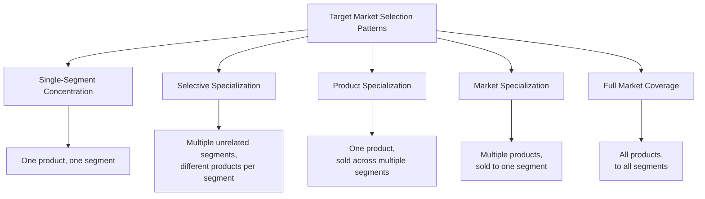

## Segment Evaluation and Targeting Strategies

### Overview

Once a market has been divided into segments using one or more segmentation bases, the firm must evaluate the relative attractiveness of each resulting segment and select which to pursue — the second stage of the Segmentation-Targeting-Positioning (STP) process. This stage translates a descriptive segmentation scheme into an actionable resource-allocation decision: which segments to serve, how many to serve simultaneously, and what breadth of marketing-mix customization to apply to each.

**Key Points**

- Segment evaluation requires weighing segment attractiveness (size, growth, profitability, competitive intensity) against the firm's own objectives and resources/capabilities
- Targeting strategy selection determines the breadth and depth of marketing-mix customization applied across the market
- The optimal targeting strategy is not fixed — it shifts across the product life cycle, competitive landscape, and firm resource base

---

### Criteria for Evaluating Segment Attractiveness

Before selecting a targeting strategy, each candidate segment is assessed against several evaluative dimensions, commonly synthesized from segment-attractiveness frameworks (e.g., extensions of Porter's Five Forces applied at the segment level):

| Criterion | Key Questions |
| --- | --- |
| Segment size and growth | Is the segment large enough to be profitable now, and is it growing or declining? |
| Structural attractiveness | What is the intensity of existing competition, threat of new entrants, and bargaining power of buyers/suppliers within this segment? |
| Company objectives and resources | Does pursuing this segment align with the firm's long-term strategic objectives, and does the firm possess the resources/capabilities to serve it competitively? |
| Segment profitability | What is the expected margin structure, accounting for segment-specific costs (customization, service, acquisition costs)? |
| Compatibility with existing operations | Does serving this segment create synergies with, or conflicts against, the firm's existing product lines and brand positioning? |

[Inference] This synthesis of segment-attractiveness criteria draws on widely taught strategic marketing frameworks (commonly associated with Kotler's marketing management texts and Porter's competitive strategy framework applied at the segment level); it represents a standard pedagogical integration rather than a single originally unified model from one source.

---

### The Five Patterns of Target Market Selection

Building on segment evaluation, Abell's (1980) framework identifies five structural patterns by which a firm can select which segment(s) to serve, based on combinations of markets and products.

- **Single-Segment Concentration**: Focus entirely on one segment with one tailored offering — maximizes understanding of that segment's needs but carries concentration risk
- **Selective Specialization**: Serve several distinct segments with different products for each, diversifying risk without requiring synergy between segments
- **Product Specialization**: Offer one product/product line sold across multiple, distinct segments — builds strong product/category reputation but carries risk if the product category itself is disrupted
- **Market Specialization**: Serve a single segment comprehensively with a range of different products — builds strong reputation and relationships within that segment but carries risk if the segment's needs shift or contract
- **Full Market Coverage**: Attempt to serve all segments with all relevant products — typically only viable for firms with dominant scale and resources

---

### Targeting Strategy Types

Distinct from the market-selection patterns above (which describe *which* segments to serve), targeting strategy describes the *breadth of marketing-mix customization* applied.

#### 1. Undifferentiated (Mass) Marketing

The firm ignores segment differences and pursues the whole market with a single offer and marketing mix, on the premise that shared needs across the market outweigh differences.

- **Advantages**: Lowest cost due to economies of scale in production, distribution, and advertising; simplicity of execution
- **Disadvantages**: Vulnerable to competitors offering more tailored solutions to underserved sub-groups; increasingly rare as a viable strategy in most contemporary, fragmented markets

#### 2. Differentiated (Segmented) Marketing

The firm targets several distinct segments, designing a separate offer and/or marketing mix for each.

- **Advantages**: Higher total sales and stronger position within each segment relative to undifferentiated marketing
- **Disadvantages**: Higher costs across product development, manufacturing, inventory, marketing, and management complexity

#### 3. Concentrated (Niche) Marketing

The firm pursues a large share of one or a few smaller segments/niches rather than a small share of a large market.

- **Advantages**: Strong knowledge and specialization within the niche; often achievable with limited resources, making it attractive for smaller firms or new entrants
- **Disadvantages**: Higher risk from concentration — vulnerable to shifts in that segment's demand, competitive entry, or structural decline

#### 4. Micromarketing

The most granular targeting strategy, tailoring products and marketing programs to the needs of specific individuals or local groups, further divided into:

- **Local marketing**: Tailoring to specific cities, neighborhoods, or store-level needs
- **Individual marketing (one-to-one marketing)**: Tailoring to the needs and preferences of individual consumers, increasingly enabled by digital data and mass-customization technology

<svg xmlns="http://www.w3.org/2000/svg" viewBox="0 0 900 400" font-family="Helvetica, Arial, sans-serif">
<text x="450" y="30" text-anchor="middle" font-size="18" font-weight="bold" fill="#1a1a1a">Targeting Strategy Spectrum (svg_diagram)</text>
<line x1="80" y1="200" x2="820" y2="200" stroke="#333" stroke-width="2" marker-end="url(#ar)" />
<text x="450" y="230" text-anchor="middle" font-size="12" fill="#333">Increasing Customization / Decreasing Scale Economy →</text>
<rect x="100" y="120" width="150" height="70" rx="8" fill="#457B9D" fill-opacity="0.25" stroke="#457B9D" stroke-width="1.5" />
<text x="175" y="150" text-anchor="middle" font-size="12" font-weight="bold" fill="#1a1a1a">Undifferentiated</text>
<text x="175" y="168" text-anchor="middle" font-size="10" fill="#333">Whole market, one mix</text>
<rect x="290" y="120" width="150" height="70" rx="8" fill="#2A9D8F" fill-opacity="0.25" stroke="#2A9D8F" stroke-width="1.5" />
<text x="365" y="150" text-anchor="middle" font-size="12" font-weight="bold" fill="#1a1a1a">Differentiated</text>
<text x="365" y="168" text-anchor="middle" font-size="10" fill="#333">Several segments, tailored mixes</text>
<rect x="480" y="120" width="150" height="70" rx="8" fill="#F4A261" fill-opacity="0.3" stroke="#F4A261" stroke-width="1.5" />
<text x="555" y="150" text-anchor="middle" font-size="12" font-weight="bold" fill="#1a1a1a">Concentrated</text>
<text x="555" y="168" text-anchor="middle" font-size="10" fill="#333">One/few niches, deep focus</text>
<rect x="670" y="120" width="150" height="70" rx="8" fill="#E76F51" fill-opacity="0.3" stroke="#E76F51" stroke-width="1.5" />
<text x="745" y="150" text-anchor="middle" font-size="12" font-weight="bold" fill="#1a1a1a">Micromarketing</text>
<text x="745" y="168" text-anchor="middle" font-size="10" fill="#333">Local / individual level</text>
</svg>

**Example**

A national fast-casual restaurant chain typically operates a differentiated targeting strategy at the national brand level (distinct campaigns for health-conscious, convenience-seeking, and value-seeking segments), while simultaneously applying local micromarketing at the individual store level (menu localization for regional taste preferences, geo-targeted promotions).

---

### Factors Influencing Targeting Strategy Choice

| Factor | Influence on Strategy Choice |
| --- | --- |
| Company resources | Limited resources favor concentrated marketing; abundant resources enable differentiated or full-coverage strategies |
| Product variability | Uniform products (e.g., commodities) favor undifferentiated marketing; highly variable products favor differentiated or concentrated approaches |
| Product life-cycle stage | Introduction/growth stages often favor undifferentiated or concentrated approaches to establish initial demand; maturity stages often favor differentiated approaches as the market naturally fragments and competitors multiply |
| Market variability | Homogeneous markets (buyers with similar tastes/quantities purchased) favor undifferentiated marketing; heterogeneous markets favor differentiated or concentrated approaches |
| Competitors' targeting strategies | Undifferentiated marketing is generally unwise in a market where competitors are actively pursuing differentiated or concentrated strategies, since the firm would face segment-specific competitors with a generic offer |

[Inference] This set of contingency factors (resources, product variability, life-cycle stage, market variability, competitive strategy) is a standard synthesis found across mainstream strategic marketing texts; while broadly consistent across sources, the precise relative weighting of each factor in any specific market situation requires case-specific managerial judgment rather than a fixed formula.

---

### Ethical Considerations in Targeting

Target market selection carries ethical responsibilities distinct from pure commercial attractiveness evaluation, particularly when:

- Targeting vulnerable populations (children, individuals in financial distress, populations with lower health literacy) with products carrying potential for harm
- Segmenting in ways that could facilitate discriminatory pricing or access, particularly where segmentation variables correlate with protected characteristics
- Exploiting psychographic or behavioral vulnerabilities (e.g., targeting consumers during states of reduced self-regulation) identified through granular data-driven segmentation

[Speculation] The boundary between legitimate, efficiency-enhancing targeting and ethically problematic exploitation of vulnerability is a genuinely contested area across marketing ethics, regulatory policy, and public discourse, varying by jurisdiction, product category, and evolving societal norms; this is a normative rather than a purely technical marketing question.

---

### Targeting Strategy and the Product Life Cycle

**Next Steps**

1. **Introduction stage**: Concentrated or undifferentiated targeting is often most resource-efficient, focused on establishing initial category awareness and early-adopter traction (connecting directly to Adopter Categories and the Adoption Curve)
2. **Growth stage**: As the market expands and competitors enter, shifting toward differentiated targeting allows the firm to defend share against segment-specific competitive entrants
3. **Maturity stage**: Markets typically fragment further at maturity; differentiated or micromarketing approaches become more necessary to sustain growth as easy undifferentiated gains are exhausted
4. **Decline stage**: Firms often retreat toward concentrated targeting of the most loyal or profitable remaining segments as overall market resources are harvested rather than expanded
5. Reassess segment evaluation criteria periodically rather than treating targeting strategy as a fixed, one-time decision, since segment attractiveness and competitive intensity shift over the life cycle

---

**Related Topics**

- Segmentation bases and variables
- Psychographic and values-based segmentation
- Positioning strategy and perceptual mapping
- Product life cycle strategy
- Porter's Five Forces applied to segment-level competitive analysis
- Niche marketing and concentrated strategy for resource-constrained firms
- Marketing ethics in data-driven and vulnerability-based targeting