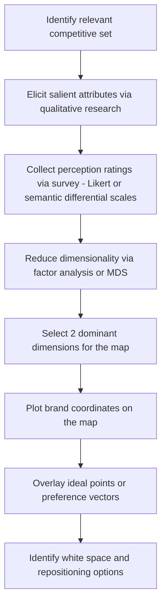

## Positioning Strategy and Perceptual Mapping

### Overview

Positioning is the deliberate design of a brand's identity and offering so that it occupies a distinct, valued place in the target customer's mind relative to competing alternatives. The concept was formalized by Al Ries and Jack Trout in *Positioning: The Battle for Your Mind* (1981), building on the premise that positioning is not something done *to* the product, but something done *in the mind of the prospect* — the product, price, and promotion are merely inputs to that mental construct.

Perceptual mapping is the analytical technique used to visualize and diagnose positioning: it plots brands (and sometimes ideal points representing consumer preferences) on a small number of dimensions that matter most to buyers, revealing gaps, clusters, and competitive proximity.

### Core Positioning Concepts

**Key Points**

- Positioning targets the mind of the prospect, not the physical product — two functionally identical products can occupy entirely different positions if perception differs
- A position is defined *relatively*, always in reference to competitors, not in isolation
- Overcommunication in a crowded market makes simplicity essential — Ries & Trout argue the mind protects itself against information overload by accepting only what matches or extends prior knowledge
- Repositioning an entrenched competitor (attacking their position directly) is generally harder than finding an unoccupied position

### The Positioning Statement Framework

A standard positioning statement template used across marketing practice:

> For [target customer] who [statement of need/opportunity], [brand name] is a [product category] that [statement of key benefit/reason to believe]. Unlike [primary competitive alternative], [brand name] [statement of primary differentiation].

**Example**

For time-pressed home cooks who want restaurant-quality meals without grocery planning, FreshBox is a meal-kit delivery service that provides pre-portioned ingredients and chef-designed recipes deliverable in 30 minutes or less. Unlike traditional grocery shopping, FreshBox eliminates food waste and decision fatigue while guaranteeing meal variety every week.

### Positioning Strategy Types

| Strategy | Basis | Example Pattern |
| --- | --- | --- |
| Attribute/Benefit positioning | A specific product feature or benefit | "Longest battery life," "Whitest whites" |
| Price/Quality positioning | Value-for-money or premium/luxury tier | Discount retailers vs. luxury goods |
| Use/Application positioning | Association with a specific use occasion | Gatorade as an athletic-performance drink |
| User positioning | Association with a user category or lifestyle | Harley-Davidson and rebellious/freedom identity |
| Competitor positioning | Explicit or implicit reference to a rival | "The un-cola" (7-Up vs. cola category) |
| Product category positioning | Positioning against or within a category | Red Bull creating the "energy drink" category |
| Cultural symbol positioning | Association with iconic imagery/symbolism | Marlboro Man and rugged individualism |

### Perceptual Mapping Methodology

A perceptual map is typically a two-dimensional (occasionally three-dimensional) spatial representation where axes represent attributes salient to purchase decisions, and brands are plotted as points based on aggregated consumer perception data.

**Construction Process**

**Statistical Techniques**

1. **Multidimensional Scaling (MDS)** — takes similarity/dissimilarity judgments between brand pairs (e.g., "how similar are Brand A and Brand B?") and derives spatial coordinates that best preserve the rank order of those distances. Does not require pre-specified attributes; dimensions are interpreted post-hoc.
2. **Factor Analysis** — starts from attribute ratings across many variables and reduces them to a smaller set of underlying latent factors (dimensions), which become the map's axes.
3. **Discriminant Analysis** — used when the goal is to find dimensions that best *discriminate* between predefined brand groups rather than purely minimize distance distortion.

[Inference] In practice, factor analysis is more common in applied marketing research than pure MDS, because it produces attribute loadings that are directly actionable for messaging, whereas MDS dimensions often require subjective post-hoc labeling.

### Perceptual Map Example (svg_diagram)

<svg xmlns="http://www.w3.org/2000/svg" viewBox="0 0 700 560">
<text x="350" y="26" text-anchor="middle" font-size="16" font-weight="bold" fill="#1a1a1a">Perceptual Map: Coffee Shop Category (svg_diagram)</text>

<line x1="60" y1="300" x2="640" y2="300" stroke="#333" stroke-width="1.5" />
<line x1="350" y1="60" x2="350" y2="520" stroke="#333" stroke-width="1.5" />

<text x="640" y="295" text-anchor="end" font-size="12" fill="`#1a1a1a`">High Price →</text>

<text x="65" y="295" text-anchor="start" font-size="12" fill="`#1a1a1a`">← Low Price</text>

<text x="350" y="52" text-anchor="middle" font-size="12" fill="`#1a1a1a`">↑ Premium/Artisanal Experience</text>

<text x="350" y="535" text-anchor="middle" font-size="12" fill="`#1a1a1a`">↓ Fast/Convenient</text>

<text x="480" y="120" font-size="10" fill="#888" font-style="italic">Premium + Expensive</text>

<text x="120" y="120" font-size="10" fill="#888" font-style="italic">Premium + Affordable</text>

<text x="480" y="470" font-size="10" fill="#888" font-style="italic">Fast + Expensive</text>

<text x="120" y="470" font-size="10" fill="#888" font-style="italic">Fast + Affordable</text>

<circle cx="500" cy="130" r="7" fill="#7c3aed" />
<text x="510" y="128" font-size="12" fill="#1a1a1a">Artisan Roaster Co.</text>
<circle cx="480" cy="200" r="7" fill="#2563eb" />
<text x="490" y="200" font-size="12" fill="#1a1a1a">Premium Chain A</text>
<circle cx="450" cy="420" r="7" fill="#dc2626" />
<text x="460" y="420" font-size="12" fill="#1a1a1a">Drive-Thru Express</text>
<circle cx="180" cy="440" r="7" fill="#16a34a" />
<text x="190" y="440" font-size="12" fill="#1a1a1a">Budget Gas-Station Brew</text>
<circle cx="230" cy="150" r="7" fill="#ea580c" stroke="#000" stroke-width="1.5" stroke-dasharray="3,2" />
<text x="240" y="148" font-size="12" fill="#1a1a1a" font-weight="bold">White Space (Opportunity)</text>

<circle cx="250" cy="180" r="3" fill="#999" />
<circle cx="270" cy="160" r="3" fill="#999" />
<circle cx="240" cy="200" r="3" fill="#999" />
<text x="255" y="230" font-size="10" fill="#666" font-style="italic">Cluster: consumer ideal points</text>
</svg>

### Interpreting the Map

- **Clustering**: brands positioned close together are perceived as close substitutes and compete most directly for the same customers
- **White space**: empty regions on the map, especially those overlapping with clusters of consumer *ideal points*, represent unmet positioning opportunities
- **Ideal point model**: represents a hypothetical "perfect" combination of attributes for a given consumer segment; distance from a brand to an ideal point is inversely related to preference for that brand (assuming a vector or ideal-point preference model rather than a purely ordinal one)
- **Direction/vector interpretation**: in vector-based perceptual maps, an arrow shows the direction of increasing preference for an attribute; a brand's projection onto that vector indicates relative standing

### Repositioning Strategies

When a map reveals an unfavorable or crowded position, four canonical response strategies emerge (per Trout & Ries and subsequent positioning literature):

1. **Strengthen current position** — reinforce existing perceptual advantage through consistent messaging
2. **Reposition the brand** — shift perception to occupy a new, less contested space (higher risk, requires sustained investment; consumer perception changes slowly)
3. **Reposition the competitor** — comparative advertising or messaging that shifts how the competitor is perceived, indirectly improving relative position
4. **Alter the perceptual dimensions considered relevant** — introduce a new attribute into buyer decision-making that favors the brand (e.g., a category creating a "moisturizing" dimension in soap when competitors compete purely on "cleaning")

**Output**

A completed positioning deliverable should include: (1) a positioning statement using the template above, (2) a perceptual map with 2 validated dimensions and the full competitive set plotted, (3) an identified white-space opportunity or defensible cluster, and (4) a chosen repositioning strategy with supporting rationale.

### Common Pitfalls

- **Overpositioning**: too narrow a position causes buyers to miss the full range of a brand's offerings
- **Underpositioning**: vague or generic positioning fails to give buyers any real reason to choose the brand
- **Confused positioning**: frequent claim changes or inconsistent messaging erode a clear mental slot
- **Doubtful positioning**: claims are perceived as implausible given price, brand history, or product features
- **Dimension selection bias**: choosing axes the brand happens to score well on, rather than axes that are empirically salient to the target segment's purchase decision, produces a map that flatters the brand but misrepresents the market

**Related Topics**

- STP Framework (Segmentation, Targeting, Positioning) as the parent process
- Brand Equity Models (Aaker's Brand Equity, Keller's CBBE Pyramid)
- Multidimensional Scaling (MDS) statistical methodology in depth
- Blue Ocean Strategy and value innovation as a repositioning-adjacent framework
- Category Creation and the "purple cow" differentiation concept
- Conjoint Analysis for attribute-level preference measurement
- Brand Personality Framework (Aaker's Five Dimensions)