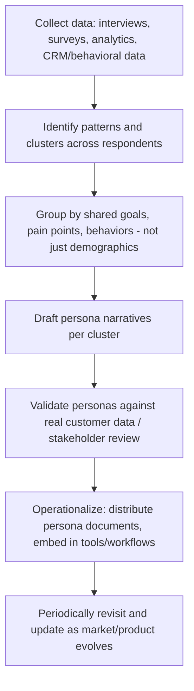

## Persona Development and Jobs-to-be-Done

### Overview

Persona development and Jobs-to-be-Done (JTBD) are two complementary but methodologically distinct approaches to understanding customers beyond raw demographic segmentation. Personas are archetypal representations of user/customer types, built from qualitative and quantitative research, used to align teams around a concrete mental model of "who" the customer is. JTBD, formalized primarily by Clayton Christensen (building on work by Tony Ulwick and others), reframes the analytical unit away from the customer entirely and onto the **job** — the underlying progress a customer is trying to make in a given circumstance — arguing that customers "hire" products to do this job.

These two frameworks are often used together: JTBD identifies the functional, social, and emotional job driving purchase, while personas give that job a face, context, and narrative that is easier for cross-functional teams (design, sales, product) to internalize and apply.

### Persona Development

#### Definition and Purpose

A persona is a fictional, generalized representation of a segment of real users, synthesized from research data rather than invented from assumption. Personas serve to:

- Translate abstract segmentation data into a memorable, discussable character
- Align cross-functional teams (marketing, product, sales, support) around a shared customer understanding
- Guide decisions on messaging, feature prioritization, and channel selection
- Reduce the risk of designing for an internal "elastic user" that conveniently matches whatever a stakeholder wants to build

#### Construction Methodology

**Key Points**

- Personas built purely from demographic or firmographic data (age, income, job title) without behavioral or attitudinal grounding are a common and well-documented failure mode — they produce plausible-sounding but non-predictive archetypes
- Rigorous persona development typically draws on qualitative interviews (10–30+ depending on market complexity) supplemented by quantitative validation (surveys, usage data clustering)
- The number of personas should be limited to what an organization can realistically act on — most practitioners recommend 3–5 primary personas per product line, since higher counts dilute focus [Unverified — no universal threshold; varies by product complexity and market breadth]

#### Standard Persona Template Components

| Component | Description |
| --- | --- |
| Name and photo/illustration | Humanizing identifier, memorable shorthand for the team |
| Demographic/firmographic snapshot | Age, role, company size, industry (context, not the core driver) |
| Goals | What the persona is trying to achieve, ideally tied to the underlying job |
| Frustrations/pain points | Current obstacles preventing goal achievement |
| Behaviors | How the persona currently solves the problem, tools used, channels frequented |
| Quote | A representative verbatim or synthesized statement capturing their mindset |
| Objections | Reasons this persona might not adopt/buy |
| Influence map | Who this persona listens to, defers to, or is influenced by in the decision |

**Example**

*Persona: "Operations Owner Olivia"* — Mid-market logistics operations manager, 8–15 years experience, manages a team of 5–10 dispatchers. Goal: reduce late-delivery penalties without adding headcount. Frustration: current TMS software requires manual cross-referencing across three systems. Behavior: checks dashboards first thing each morning, relies heavily on a senior dispatcher's judgment for exceptions. Quote: "I don't need more data, I need to know which three shipments will blow up today."

### Jobs-to-be-Done (JTBD)

#### Core Premise

JTBD theory holds that customers do not buy products — they "hire" them to make progress in a specific circumstance. The now-canonical framing from Christensen's research: people don't want a quarter-inch drill, they want a quarter-inch hole (originally attributed to Theodore Levitt, popularized within JTBD via Christensen). The famous applied case study is the McDonald's milkshake research, where morning commuters were found to be "hiring" milkshakes for a job unrelated to dessert — a long-lasting, one-handed, boredom-relieving companion for a dull commute — a job that competed against bananas and bagels, not other milkshake brands.

#### The Job Statement

A JTBD job statement is typically structured as:

> When [situation/circumstance], I want to [motivation/action], so I can [expected outcome].

This format deliberately excludes any product or brand reference — it describes the customer's struggle independent of any particular solution.

**Example**

*When I'm commuting to work with one free hand, I want something filling and not messy, so I can stay occupied and arrive at work satisfied rather than hungry.*

#### Three Dimensions of a Job

| Dimension | Description |
| --- | --- |
| Functional job | The practical task or problem to be solved |
| Emotional job | How the customer wants to feel (or avoid feeling) while getting the job done |
| Social job | How the customer wants to be perceived by others as a result |

[Inference] Most JTBD practitioners argue that functional jobs alone rarely explain purchase behavior fully — emotional and social dimensions frequently determine brand choice among functionally similar options, though the relative weighting varies substantially by category (e.g., social job weight is typically higher for visible/status goods than for utility purchases).

#### JTBD Research Method: The Switch Interview

JTBD research commonly uses a structured retrospective interview (the "Switch Interview" or "Timeline Interview," developed by Bob Moesta and colleagues) tracing the customer's journey from the first inkling of dissatisfaction with their prior solution to the moment of purchase:

**Key Points**

- The interview surfaces "forces" acting on the decision: push (dissatisfaction with the status quo), pull (attraction to the new solution), anxiety (fear about the new solution), and habit/inertia (comfort with the current approach)
- JTBD framing treats indirect competitors seriously — a company selling meal-kits competes with the "job" of feeding oneself, which is also contested by restaurants, frozen food, and simply skipping the meal, not merely other meal-kit brands

### Reconciling Personas and JTBD

| Dimension | Personas | Jobs-to-be-Done |
| --- | --- | --- |
| Unit of analysis | The customer (who) | The job/circumstance (what/why) |
| Stability over time | Can shift as demographics/attitudes evolve | Jobs tend to be highly stable even as solutions change |
| Primary use case | Team alignment, empathy-building, messaging tone | Product strategy, identifying true competitive set, innovation opportunity sizing |
| Common critique | Risk of stereotyping or being demographic-only | Risk of being too abstract for creative/marketing execution |

[Inference] A common integrated practice is to define jobs first (since they are more stable and strategically foundational), then layer personas on top to make the job actionable for teams that need a concrete character to design and write copy for — though organizations vary in which framework they treat as primary.

### Common Pitfalls

- **Persona theater**: producing polished persona documents that are never actually referenced in day-to-day decisions
- **Assumption-based personas**: skipping primary research and building personas from internal stakeholder opinion alone
- **Job statement conflation with product features**: writing job statements that secretly describe the existing product's functionality rather than the underlying customer struggle
- **Ignoring the switch/inertia forces**: focusing JTBD research only on why customers chose you, while ignoring the anxiety and habit forces that cause otherwise-interested customers to not switch at all

**Next Steps**

- Conduct 10–15 switch interviews for the primary product line to draft initial job statements
- Cluster interview findings into candidate persona archetypes and validate against CRM/usage data
- Cross-reference each persona against its underlying job statement to ensure internal consistency
- Pilot persona-driven messaging in a single channel (e.g., paid social ad variants) to test differentiated response by segment

**Related Topics**

- STP Framework (Segmentation, Targeting, Positioning)
- Positioning Strategy and Perceptual Mapping
- Customer Journey Mapping
- Outcome-Driven Innovation (Tony Ulwick's ODI methodology)
- Empathy Mapping in UX research
- Behavioral Segmentation vs. Demographic Segmentation
- The Mom Test (customer interview technique for avoiding biased feedback)