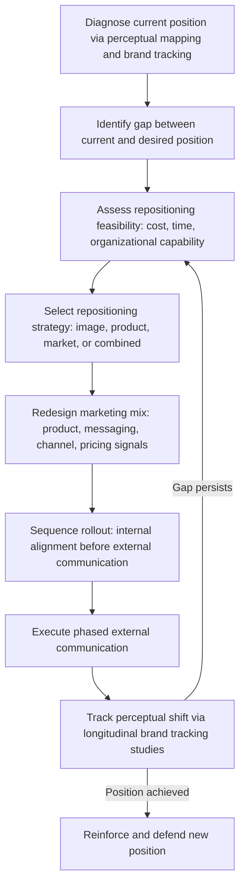

## Repositioning and Competitive Positioning

### Overview

Repositioning is the deliberate act of changing how a brand or product is perceived relative to competitors in the target customer's mind, undertaken when the current position has become weak, crowded, outdated, or misaligned with market evolution. Competitive positioning, more broadly, is the ongoing discipline of defining and defending a brand's relative standing against named or category-level rivals. Where initial positioning (covered separately) establishes a mental slot from a blank or lightly contested state, repositioning operates against inertia — existing brand associations, prior customer experience, and competitor entrenchment all resist change, making repositioning generally slower, costlier, and higher-risk than original positioning.

### Why Repositioning Becomes Necessary

**Key Points**

- **Market evolution**: customer needs, technology, or category definitions shift, leaving the original position irrelevant (e.g., a "film camera" positioning becoming obsolete)
- **Competitive encroachment**: a rival directly attacks or dilutes the brand's original position, or a new entrant redefines category expectations
- **Negative associations**: scandal, quality failures, or shifting cultural attitudes toward the original position (e.g., health trends undermining a "indulgent" positioning)
- **Growth ceiling**: the original position, while successful, caps addressable market size or price realization, prompting a move upmarket, downmarket, or into adjacent categories
- **Positioning drift**: incremental, unmanaged messaging changes over years leave the brand with a diffuse, inconsistent position that requires active correction rather than reinforcement

### Repositioning Strategy Types

Building on the Ries & Trout framework, four canonical repositioning approaches:

| Strategy | Mechanism | Risk Profile |
| --- | --- | --- |
| Image repositioning | Change perception without altering the product or target market | Lower cost, but limited if the underlying gap is real rather than perceptual |
| Product repositioning | Modify the actual product/features to better match desired new position | Higher cost, more credible, slower to execute |
| Market repositioning | Same product, new target segment | Requires new channel/messaging investment; risk of alienating original segment |
| Product-and-market repositioning | Simultaneous change of both offering and target audience | Highest risk and cost, but sometimes necessary for category-level disruption |

**Example**

Old Spice's early-2010s repositioning is a widely cited image + market repositioning case: without materially changing the core product, the brand shifted target audience emphasis from older male users to a younger, partner/spouse-influenced purchase audience via the "The Man Your Man Could Smell Like" campaign, repositioning the brand from "your grandfather's aftershave" to a culturally relevant, self-aware, humor-forward brand. [Unverified — specific attributed sales lift figures vary by source and are commonly cited but not independently re-verified here.]

### Repositioning Process

**Key Points**

- Internal alignment (sales, customer service, product teams) must precede external repositioning messaging — a repositioned brand promise unsupported by internal operations produces a credibility gap
- Repositioning is measured longitudinally; a single post-campaign survey cannot distinguish genuine perceptual shift from short-term awareness lift
- [Inference] Repositioning campaigns generally require sustained investment over multiple quarters to years to shift entrenched perception, since prior brand schema in long-term memory do not update on a single exposure

### Competitive Positioning Frameworks

#### Competitive Positioning Map

An extension of the standard perceptual map focused specifically on head-to-head competitive analysis, typically constructed using two dimensions most decision-relevant to the category (commonly price/quality, but category-specific dimensions like "innovation vs. reliability" are also used).

#### Porter's Generic Competitive Strategies

Michael Porter's framework, frequently taught alongside competitive positioning, identifies three broad postures a firm can occupy relative to the industry:

1. **Cost Leadership** — competing on being the lowest-cost producer/provider in the category
2. **Differentiation** — competing on a unique, valued attribute broad enough to command a premium
3. **Focus (Cost or Differentiation)** — narrowing to a specific segment and pursuing either cost or differentiation advantage within that niche

**Key Points**

- Porter's "stuck in the middle" caution: firms that fail to commit clearly to one generic strategy typically underperform firms with a clear strategic choice [Inference — later strategy scholars have contested the universality of this claim, noting some firms successfully blend cost and differentiation via operational innovation]

#### Competitive Response Patterns

When a competitor repositions or a new entrant disrupts category positioning, incumbents typically select from:

| Response | Description |
| --- | --- |
| Ignore | Appropriate when the threat is assessed as low-relevance to the core customer base |
| Direct confrontation | Match or exceed the challenger's claimed advantage directly |
| Flanking | Reposition to a different, less contested segment rather than engaging directly |
| Fortify | Reinforce the existing position's strength rather than reacting to the specific challenge |

### Risks and Common Pitfalls

- **Brand equity erosion**: repositioning too aggressively can strip away the very associations (however outdated) that provided residual value and customer loyalty
- **Message whiplash**: repositioning too frequently prevents any single position from accumulating enough consistent exposure to embed in memory
- **Internal-external misalignment**: launching new external positioning before internal capability (product, service delivery, staff training) can support the new promise
- **Cannibalization of existing base**: market repositioning toward a new segment risks alienating the original loyal customer base if executed without a bridging strategy
- **Confusing tactics with position**: a new ad campaign or slogan is not repositioning unless it is backed by a genuine, sustained shift in the underlying value proposition or perceptual dimension being contested

### Measuring Repositioning Success

Standard measurement approaches include:

- **Brand tracking studies** — longitudinal survey waves measuring awareness, perception attributes, and purchase consideration pre/post campaign
- **Perceptual map shift** — re-running the mapping methodology (MDS or factor analysis) at intervals to observe brand coordinate movement
- **Share of voice and share of search** — proxy indicators of relative market salience during the repositioning window
- **Price realization** — for upmarket repositioning specifically, the ability to sustain higher price points without volume collapse is a direct behavioral (not merely attitudinal) validation signal

**Next Steps**

- Run a baseline perceptual map and brand tracking wave before any repositioning initiative to establish a comparison point
- Stress-test the desired position against internal operational capability before external launch
- Sequence internal communication and training ahead of any customer-facing repositioning campaign
- Define explicit longitudinal KPIs (tracking wave cadence, perceptual map re-run schedule) at the start of the initiative, not after launch

**Related Topics**

- Positioning Strategy and Perceptual Mapping
- Porter's Five Forces and Generic Competitive Strategies
- Brand Equity Models (Aaker, Keller CBBE)
- Blue Ocean Strategy and Value Innovation
- Crossing the Chasm (Geoffrey Moore) and adoption-stage positioning shifts
- Brand Tracking and Longitudinal Market Research Design
- Category Design and Category Creation Strategy