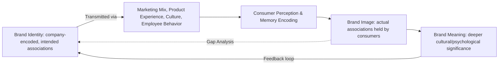

## Brand Identity, Image, and Meaning

### Overview

Brand identity, brand image, and brand meaning are three related but analytically distinct constructs in brand psychology, frequently conflated in casual usage but treated separately in academic and applied branding frameworks. **Brand identity** is what the organization projects — the intended, encoded set of associations a company builds and controls. **Brand image** is what actually lands — the perceptions, associations, and beliefs that exist in the consumer's mind, which may diverge significantly from intended identity. **Brand meaning** is the deeper, culturally and psychologically embedded significance a brand holds for consumers, often extending beyond functional attributes into identity, values, and social signaling.

The gap between identity (sent) and image (received) is a central diagnostic concern in brand management — a persistent, large gap indicates either poor execution, channel noise, or a fundamentally flawed identity strategy.

### Brand Identity

#### Definition and Frameworks

Brand identity is the aspirational, company-controlled set of associations the brand strategist wants to create and maintain. David Aaker's **Brand Identity System** (from *Building Strong Brands*, 1996) is the most widely taught structural framework, organizing identity into four perspectives:

| Perspective | Focus | Example Elements |
| --- | --- | --- |
| Brand as Product | Functional attributes and scope | Product scope, quality/value, uses, users, country of origin |
| Brand as Organization | Company-level associations | Organizational attributes (innovative, trustworthy), local vs. global |
| Brand as Person | Personality-based associations | Brand personality, brand-customer relationships |
| Brand as Symbol | Visual and metaphorical associations | Visual imagery/metaphors, brand heritage |

Aaker further distinguishes:

- **Core identity** — the timeless essence of the brand, expected to remain stable across markets and time
- **Extended identity** — supplementary elements providing texture and completeness, which can flex more by market/product line

#### Identity Components (Practical/Design Layer)

- **Verbal identity**: name, tagline, tone of voice, messaging pillars
- **Visual identity**: logo, color palette, typography, imagery style
- **Sensory identity**: sound marks, packaging tactility, scent (where applicable)
- **Behavioral identity**: how the brand acts — customer service style, corporate conduct, social responsibility posture

**Key Points**

- Identity is intentional and controllable by the organization, in contrast to image, which is emergent and only partially controllable
- A well-constructed identity system provides internal decision-making guardrails (e.g., "would this campaign fit Brand-as-Person?") beyond its external communication function

### Brand Image

#### Definition

Brand image is the set of perceptions about a brand as reflected by brand associations held in consumer memory (Keller, *Strategic Brand Management*). Unlike identity, image is not directly authored by the company — it is constructed by consumers based on all touchpoints: advertising, product experience, word of mouth, media coverage, and social context.

#### Keller's Brand Associations Structure

Kevin Lane Keller's framework decomposes brand image into associations varying along three dimensions:

1. **Strength** — how firmly an association is linked to the brand in memory, influenced by relevance and consistency of exposure
2. **Favorability** — whether consumers view the association positively, negatively, or neutrally relative to their needs
3. **Uniqueness** — whether the association is perceived as differentiating (a **point-of-difference**) or shared with competitors (a **point-of-parity**, necessary for category credibility but not for differentiation)

**Types of Brand Associations**

- **Attributes** — descriptive features of the product/service (product-related and non-product-related, e.g., price, user imagery, usage imagery)
- **Benefits** — the personal value consumers attach to attributes, further split into:
  - *Functional benefits* — intrinsic advantages of product performance
  - *Experiential benefits* — what it feels like to use the product
  - *Symbolic benefits* — extrinsic advantages related to social approval, self-expression, or status
- **Attitudes** — consumers' overall evaluations of the brand, often the summary construct driving choice

### Brand Meaning

#### Definition

Brand meaning refers to the deeper cultural, psychological, and symbolic significance a brand carries for consumers — extending beyond functional benefit into identity construction, tribal belonging, and narrative. This construct draws heavily from consumer culture theory (CCT) and cultural branding scholarship, most notably Douglas Holt's work (*How Brands Become Icons*, 2004).

#### Holt's Cultural Branding Theory

Holt argues that the most powerful brands ("icon brands") derive their value not from functional superiority but from performing **identity myths** — stories that resolve acute cultural tensions or anxieties of a historical moment. A brand becomes iconic when it consistently enacts a myth relevant to a specific population's anxieties (e.g., Marlboro enacting a myth of rugged, untamed masculinity during a period of increasing corporate/bureaucratic constraint on American men).

**Key Points**

- Cultural branding is distinguished from "mindshare" branding (the Aaker/Keller tradition) in that it treats brand value as arising from cultural performance and myth-making rather than from consistent attribute/benefit communication alone
- [Inference] The two traditions (mindshare branding and cultural branding) are not strictly incompatible — many practitioners treat cultural branding as an additional layer applicable primarily to category-leading or aspirational brands, while mindshare-style identity/image management remains the baseline discipline for most brands regardless of category position

#### Consumer Identity and Self-Brand Connection

Consumers use brands as tools for identity construction and signaling, drawing on:

- **Self-congruity theory** — consumers prefer brands whose perceived personality matches their actual or ideal self-concept
- **Extended self theory** (Belk, 1988) — possessions, including branded products, become incorporated into a consumer's sense of self
- **Brand communities** — consumers form social bonds and shared rituals around brands that carry strong tribal meaning (e.g., motorcycle, gaming, or outdoor-gear communities)

### Identity-Image-Meaning Relationship

**Key Points**

- The feedback loop matters: brand meaning generated by consumer culture (e.g., unofficial community use, subcultural adoption) can reshape how a company subsequently manages its own identity strategy
- Gap analysis between intended identity and measured image is a standard brand health diagnostic, typically conducted via brand tracking surveys and qualitative association elicitation (e.g., free association tasks, projective techniques)

### Measurement Approaches

| Method | What It Measures | Typical Technique |
| --- | --- | --- |
| Brand tracking studies | Awareness, association strength/favorability/uniqueness over time | Longitudinal survey waves |
| Free association / elicitation tasks | Top-of-mind associations, unaided | Open-ended "what comes to mind when you think of [Brand]?" |
| Projective techniques | Associations respondents may not consciously articulate | Brand personification, collage exercises, laddering interviews |
| Net Promoter Score / advocacy metrics | Overall favorability and willingness to recommend (proxy, not a direct image measure) | Single-item or short survey instrument |
| Semantic differential scales | Attribute-level perception on bipolar scales | e.g., "Traditional (1) — Modern (7)" |

**Example**

A laddering interview probing brand meaning for an outdoor apparel brand might proceed: *attribute* ("waterproof fabric") → *functional benefit* ("stays dry on long hikes") → *emotional benefit* ("feel confident regardless of weather") → *values/self-concept* ("I am someone who doesn't let conditions limit me"). This progression illustrates how a concrete product attribute connects upward into deeper personal meaning.

### Common Pitfalls

- **Identity-image gap neglect**: companies invest heavily in defining intended identity but rarely measure whether it has actually landed as image in the target market
- **Conflating brand awareness with brand meaning**: high recall does not imply the brand carries valued or differentiated meaning
- **Over-reliance on functional attributes**: in mature, commoditized categories, competing purely on functional points-of-parity fails to build durable meaning or loyalty
- **Ignoring negative or unintended associations**: image includes associations the company did not intend to create (e.g., associations formed by controversy, poor service incidents, or unintended audience adoption) — these must be actively monitored, not assumed absent

**Next Steps**

- Conduct a brand identity workshop using Aaker's four-perspective system to document intended associations explicitly
- Run an unaided free-association study with target consumers to capture actual brand image
- Compare identity and image outputs to quantify the gap and prioritize corrective actions
- For category-leading or aspirational brands, assess whether a cultural/myth-based positioning opportunity exists using Holt's framework as a diagnostic lens

**Related Topics**

- Aaker's Brand Equity Model and Keller's Customer-Based Brand Equity (CBBE) Pyramid
- Positioning Strategy and Perceptual Mapping
- Brand Personality Framework (Aaker's Five Dimensions)
- Consumer Culture Theory (CCT)
- Self-Congruity Theory and Extended Self
- Brand Communities and Tribal Marketing
- Semiotics in Branding and Visual Identity Design