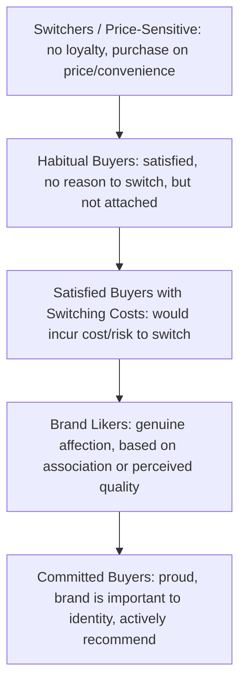
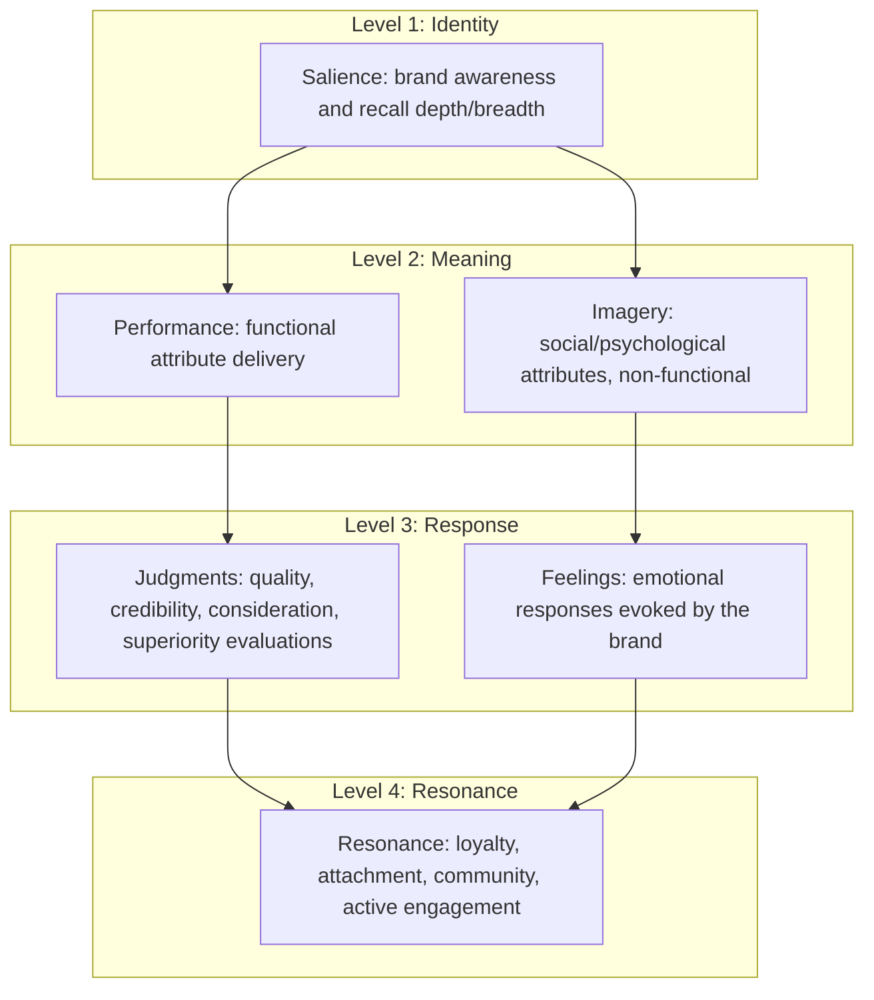

## Brand Equity Models

### Overview

Brand equity refers to the incremental value a brand name confers on a product or service beyond its purely functional attributes — the differential effect that brand knowledge has on consumer response to marketing of that brand (Keller's definition). Multiple influential models have been developed to structure, measure, and manage brand equity, each emphasizing different mechanisms: consumer psychology (Keller), financial/market-based value (Aaker's asset view, Interbrand), or behavioral/attitudinal loyalty dynamics. This entry covers the major models used across academic and applied marketing practice.

### Why Brand Equity Matters

**Key Points**

- Brand equity explains why consumers will pay a price premium, exhibit lower price sensitivity, and show greater purchase intent for a branded product versus an unbranded or generically-branded equivalent with identical functional attributes
- Brand equity operates as a balance-sheet-relevant intangible asset in financial contexts (e.g., M&A valuation, licensing negotiations) as well as a marketing-management construct
- Two broad equity approaches: **customer-based brand equity (CBBE)** (equity as it exists in the mind of the consumer) and **financial-based brand equity** (equity expressed as a monetary valuation, used in accounting and M&A contexts)

### Aaker's Brand Equity Model

David Aaker (*Managing Brand Equity*, 1991) defines brand equity as a set of assets and liabilities linked to a brand that add to or subtract from the value provided by a product/service. The model identifies five asset categories:

| Asset Category | Description |
| --- | --- |
| Brand Loyalty | The degree to which customers are attached to the brand, reducing vulnerability to competitive action and marketing costs of retention |
| Brand Awareness | The strength of a brand's presence in consumer memory (recognition and recall) |
| Perceived Quality | Consumer perception of overall quality/superiority relative to alternatives (distinct from objective/engineering quality) |
| Brand Associations | Anything mentally linked to the brand, providing differentiation, reasons-to-buy, and a platform for brand extensions |
| Other Proprietary Assets | Patents, trademarks, channel relationships that protect equity from competitive erosion |

**Key Points**

- Aaker's model is explicitly framed in asset/liability language, making it more directly applicable to financial and strategic brand-management contexts than purely psychological models
- Brand loyalty is treated as the central asset, since it directly reduces marketing cost (retention is cheaper than acquisition) and provides a defensive barrier against competitive attack

#### Aaker's Brand Loyalty Pyramid

A companion model within the same framework, describing loyalty as an escalating hierarchy:

### Keller's Customer-Based Brand Equity (CBBE) Pyramid

Kevin Lane Keller's model (*Strategic Brand Management*) defines brand equity as the differential effect of brand knowledge on consumer response, structured as a four-level, six-block pyramid building sequentially from the base:

**Key Points**

- Each level must be achieved in sequence — resonance (the pinnacle) cannot be built without first establishing salience, meaning, and favorable response; skipping levels produces fragile equity
- **Resonance** is decomposed into four sub-dimensions: behavioral loyalty (repeat purchase), attitudinal attachment (genuine liking/love), sense of community (identification with other brand users), and active engagement (willingness to invest time/energy beyond purchase, e.g., seeking brand content, joining brand events)
- Performance is further subdivided into five categories: primary characteristics/features, product reliability/durability/serviceability, service effectiveness/efficiency/empathy, style and design, and price
- Imagery associations can form directly from experience or indirectly through advertising, word-of-mouth, or other information sources, even absent direct product use

### Financial/Market-Based Brand Equity Models

#### Interbrand Methodology

Interbrand's annual "Best Global Brands" valuation combines three inputs:

1. **Financial performance** of the branded products/services (economic profit forecast)
2. **Role of brand** — the portion of purchase decision attributable to the brand itself versus other factors (assessed via analysis of demand drivers)
3. **Brand strength** — a competitive benchmarking score assessing the brand's ability to secure ongoing future demand (based on internal factors like clarity/commitment and external factors like authenticity/relevance)

[Unverified — exact current weighting formulas are proprietary and Interbrand has revised methodology across years; treat specific numeric weightings as illustrative rather than current authoritative figures.]

#### Brand Finance and Y&R BrandAsset Valuator (BAV)

- **Young & Rubicam's BrandAsset Valuator** measures brand equity across four pillars: *Differentiation* (distinctiveness), *Relevance* (appropriateness to customer needs), *Esteem* (regard/respect), and *Knowledge* (depth of understanding). Differentiation × Relevance is treated as **Brand Strength** (future-oriented, leading indicator); Esteem × Knowledge is treated as **Brand Stature** (current-state, lagging indicator of past performance)
- Brand Finance uses a royalty-relief methodology, estimating equity as the discounted value of hypothetical royalty payments a company would pay to license its own brand from a third party

### Comparing the Models

| Model | Primary Lens | Best Used For |
| --- | --- | --- |
| Aaker's Brand Equity Model | Assets/liabilities, strategic management | Brand portfolio strategy, extension decisions, competitive defense |
| Keller's CBBE Pyramid | Sequential consumer psychology | Diagnosing where equity-building is breaking down (awareness vs. loyalty gap) |
| Interbrand / Brand Finance | Financial valuation | M&A, licensing, balance-sheet/accounting contexts |
| Y&R BrandAsset Valuator | Leading vs. lagging indicator diagnostics | Predicting future brand trajectory (growth vs. decline risk) |

**Example**

A brand with high Esteem and Knowledge but declining Differentiation and Relevance (BAV framing) is a brand living off past reputation — a pattern often observed in legacy brands losing ground to newer entrants; the diagnostic value of BAV is precisely in catching this decline before it shows up in current sales, since stature (esteem/knowledge) lags while strength (differentiation/relevance) leads.

### Measuring Brand Equity in Practice

- **Brand tracking surveys** — measure awareness, association, and loyalty metrics longitudinally, typically mapped against Keller's pyramid levels
- **Price premium analysis** — conjoint analysis or market-mix modeling isolating the price premium attributable to brand alone, holding functional attributes constant
- **Brand extension research** — testing consumer acceptance of new products under the existing brand name as an indirect equity signal (strong equity supports successful extension into adjacent categories)
- **Financial valuation models** — royalty-relief, economic-use, or cost-based approaches used primarily for accounting/M&A purposes

### Common Pitfalls

- **Conflating awareness with equity**: high brand awareness alone does not indicate strong equity if associated judgments, feelings, or resonance are weak or absent
- **Treating equity as static**: brand equity requires continuous reinforcement; asset erosion occurs through underinvestment, negative publicity, or competitive share-of-voice loss even without an active reason
- **Over-reliance on financial valuation absent consumer diagnostics**: a high financial valuation can mask an underlying consumer-level fragility (e.g., strength built on category dominance rather than genuine differentiation) that CBBE-style models would surface
- **Ignoring negative brand equity**: liabilities (Aaker's framing) — poor reputation, negative associations, or perceived declining quality — actively subtract value and require distinct remediation strategies, not merely "more marketing"

**Next Steps**

- Select a primary equity model aligned to the immediate business question (Keller's CBBE for diagnostic marketing decisions; Aaker or financial models for portfolio/valuation decisions)
- Establish a longitudinal brand tracking program mapped to the chosen model's structure
- Benchmark equity metrics against category competitors, not solely against the brand's own historical trend
- Where resonance/loyalty (top of the CBBE pyramid) lags salience and meaning, prioritize community and engagement initiatives over further awareness spend

**Related Topics**

- Brand Identity, Image, and Meaning
- Positioning Strategy and Perceptual Mapping
- Brand Personality Framework (Aaker's Five Dimensions)
- Brand Loyalty Programs and Retention Psychology
- Conjoint Analysis for Price Premium Measurement
- Brand Extension and Brand Architecture Strategy
- Net Promoter Score and Customer Advocacy Metrics