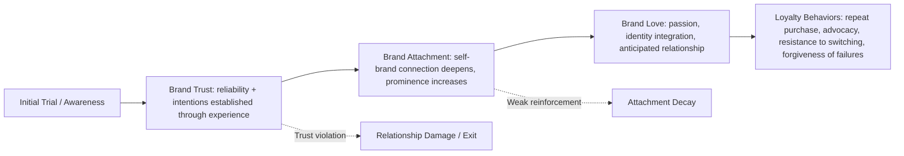

## Brand Attachment, Trust, and Love

### Overview

Brand attachment, brand trust, and brand love are three related but conceptually distinct constructs in consumer-brand relationship research, together forming the emotional and cognitive substrate underlying long-term brand loyalty. **Brand trust** is a cognitive, belief-based construct concerning confidence in the brand's reliability and integrity. **Brand attachment** is the strength of the psychological bond connecting the consumer's self-concept to the brand. **Brand love** is a more intense, affectively-loaded construct describing a passionate, emotionally rich relationship analogous to interpersonal romantic love. These constructs are typically modeled as sequential or mutually reinforcing, with trust often positioned as a foundational precursor to deeper attachment and love.

### Brand Trust

#### Definition and Dimensions

Brand trust is the consumer's willingness to rely on a brand to perform its stated function, rooted in expectations of reliability and intentions. Most academic models (e.g., Chaudhuri & Holbrook, 2001; Delgado-Ballester) decompose brand trust into two core dimensions:

| Dimension | Description |
| --- | --- |
| Brand Reliability | Confidence that the brand consistently delivers on its functional promises and meets expectations |
| Brand Intentions | Belief that the brand acts with the consumer's interests in mind, even in situations of unforeseen problems |

**Key Points**

- Trust is fundamentally a risk-reduction mechanism — consumers use brand trust as a heuristic to reduce perceived risk (functional, financial, social, psychological) associated with a purchase decision, particularly under conditions of imperfect information
- Trust is built cumulatively through consistent experience over time and is asymmetric in its dynamics: it accrues slowly through repeated confirming experiences but can be severely damaged by a single significant violation (e.g., product recall, data breach, publicized ethical failure)
- Trust operates at both a transactional level (confidence in this specific purchase) and a relational level (generalized confidence in the brand across future, unspecified interactions)

#### Antecedents of Brand Trust

- **Consistency of experience** across touchpoints and over time
- **Perceived competence** — the brand's demonstrated capability to deliver as promised
- **Transparency and communication** — particularly during service failures or product issues
- **Word of mouth and social proof** — trust signals transmitted through the consumer's social network
- **Corporate reputation and perceived ethicality** — increasingly salient in categories where consumers weigh corporate social responsibility

### Brand Attachment

#### Definition

Brand attachment is defined in consumer psychology (drawing on Bowlby's human attachment theory, adapted by Park, MacInnis, and colleagues) as the strength of the bond connecting the brand with the self, reflected in the richness and accessibility of brand-self connections in memory. Unlike attitude-based constructs (which capture valence — how favorably a brand is evaluated), attachment captures the *bond strength* independent of valence, though in practice the two are correlated.

#### The Attachment-Aversion Model

Park and MacInnis's framework distinguishes brand attachment from brand attitude strength along two axes, useful for identifying consumers who are highly attached despite mixed evaluations (e.g., attachment to a brand associated with nostalgia or identity despite awareness of its functional flaws), and conversely, consumers who rate a brand favorably without deep attachment (transactional satisfaction absent bond strength).

**Key Components of Attachment**

- **Self-brand connection** — the degree to which the brand has become incorporated into the consumer's self-concept and personal narrative
- **Brand prominence** — the accessibility and salience of brand-related thoughts and feelings in the consumer's mind
- **Separation distress** — a hallmark signature of genuine attachment (borrowed directly from human attachment theory): the degree of psychological discomfort anticipated or experienced if the brand became unavailable

**Key Points**

- Separation distress is considered a particularly diagnostic marker of true attachment versus mere preference — a consumer who would feel genuinely distressed if a brand were discontinued exhibits stronger attachment than one who would simply switch to a substitute without emotional cost
- Attachment has been empirically linked to increased willingness to pay a price premium, resistance to negative information about the brand, and stronger word-of-mouth advocacy, independent of general brand attitude favorability [Inference — effect sizes vary considerably by study design and product category; treat directional relationship as more robust than any specific magnitude]

### Brand Love

#### Definition

Brand love, formalized primarily through the work of Batra, Ahuvia, and Bagozzi (2012), extends interpersonal love theory (notably elements of Sternberg's Triangular Theory of Love) into the consumer-brand domain, describing an intense, passionate emotional attachment characterized by multiple converging components rather than a single affective state.

#### Components of Brand Love (Batra, Ahuvia & Bagozzi Model)

| Component | Description |
| --- | --- |
| Passion-driven behaviors | Desire to interact with, use, and be near the brand; behavioral manifestation of intensity |
| Self-brand integration | The brand becomes part of the consumer's actual or desired identity |
| Positive emotional connection | Warmth, affection, and positive emotion beyond mere satisfaction |
| Long-term relationship | Anticipation of, and commitment to, an ongoing relationship with the brand over time |
| Anticipated separation distress | Distress anticipated at the thought of brand loss (echoing the attachment construct) |
| Overall attitude valence and certainty | Strongly positive, confidently held attitude, resistant to counter-persuasion |
| Attitude toward the brand as unique/irreplaceable | Belief that no substitute could fully replace the brand |

**Key Points**

- Brand love is empirically distinct from brand satisfaction — satisfaction is a cognitive-evaluative judgment of performance against expectations, whereas love encompasses passion, identity integration, and anticipated relational continuity that satisfaction measures do not capture
- Brand love has been shown in multiple studies to be a stronger predictor of positive word-of-mouth, forgiveness of brand transgressions, and resistance to competitive offers than satisfaction alone [Inference — magnitude and consistency vary across category and study; the directional finding is broadly replicated but should not be treated as a fixed universal coefficient]

### Sequential Relationship Among the Three Constructs

**Key Points**

- Trust is generally treated as a necessary but not sufficient precursor — a consumer can trust a brand (reliable, well-intentioned) without ever forming deep attachment or love, particularly in low-involvement or purely functional categories
- Not all brand relationships progress to love; most transactional categories operate successfully on trust and satisfaction alone, and forcing love-based marketing strategies onto low-involvement categories is often strategically mismatched
- [Inference] The progression is best understood as a potential pathway rather than an inevitable sequence — attachment and love are more commonly observed in categories with high symbolic/identity relevance (fashion, technology, sports teams) than in commodity or purely utilitarian categories

### Measurement Approaches

| Construct | Common Measurement Method |
| --- | --- |
| Brand Trust | Chaudhuri & Holbrook (2001) or Delgado-Ballester validated survey scales measuring reliability and intentions items |
| Brand Attachment | Park et al. Attachment scale, often including direct separation-distress items ("I would feel upset if I could no longer use this brand") |
| Brand Love | Batra, Ahuvia & Bagozzi's multi-item scale covering the seven components listed above |
| Behavioral proxies (all three) | Repeat purchase rate, price premium tolerance, Net Promoter Score, brand community engagement, social media advocacy behavior |

### Managerial Implications

**Key Points**

- **Trust repair after failure**: because trust violations are asymmetric (harder to rebuild than to build), brand crisis response should prioritize transparency and demonstrated corrective action over reassurance messaging alone
- **Attachment-building investments**: brand community programs, personalization, and narrative-driven content that integrate the brand into the consumer's identity story are more effective attachment levers than promotional/price-based tactics, which tend to build transactional loyalty rather than emotional bonds
- **When love-based strategy is (and isn't) appropriate**: high-involvement, identity-relevant, or experientially rich categories are better candidates for brand love cultivation than low-involvement commodity categories, where over-investing in "love" messaging can appear inauthentic or mismatched to the category's actual role in the consumer's life

### Common Pitfalls

- **Treating loyalty (behavioral repeat purchase) as evidence of attachment or love**: repeat purchase can result from habit, switching costs, or lack of alternatives rather than genuine emotional bond — behavioral loyalty and attitudinal/emotional loyalty must be measured separately
- **Assuming satisfaction surveys capture brand love**: standard satisfaction/CSAT instruments do not capture passion, identity integration, or anticipated separation distress, and should not be used as a proxy for deeper relational constructs
- **Underestimating trust as a foundation**: pursuing attachment or love-based campaigns while unresolved reliability issues persist undermines the entire relationship-building effort, since trust functions as the necessary base layer
- **Overgeneralizing brand love findings across categories**: the strength and even relevance of brand love varies substantially by category involvement and symbolic content; applying love-based frameworks uniformly across a diverse brand portfolio can misallocate marketing investment

**Next Steps**

- Deploy validated trust, attachment, and love scales (Chaudhuri & Holbrook; Park et al.; Batra, Ahuvia & Bagozzi) as part of ongoing brand tracking rather than relying on satisfaction metrics alone
- Segment the customer base by relationship depth (trust-only vs. attached vs. brand-love) to calibrate differentiated retention and advocacy strategies
- Audit current marketing investment for category-appropriateness — confirm whether attachment/love-building tactics match the category's actual involvement and identity relevance
- Build a trust-repair protocol in advance of any crisis, given the asymmetric difficulty of rebuilding trust post-violation

**Related Topics**

- Brand Equity Models
- Brand Identity, Image, and Meaning
- Brand Personality and Archetypes
- Customer Loyalty Programs and Retention Psychology
- Net Promoter Score and Customer Advocacy Metrics
- Attachment Theory (Bowlby) in Consumer Behavior
- Brand Communities and Tribal Marketing