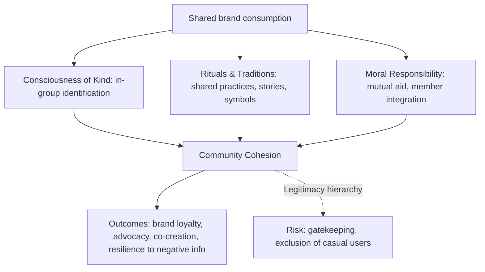

## Brand Communities and Tribal Branding

### Overview

Brand communities and tribal branding describe the social dimension of consumer-brand relationships — the phenomenon whereby consumers form bonds not only with a brand but with each other through shared identification with it. **Brand community** theory, formalized primarily by Muniz and O'Guinn (2001), treats these groups as genuine, if geographically dispersed, communities structured around a brand. **Tribal marketing**, drawn from consumer culture theory and most associated with Bernard Cova and colleagues, applies sociological concepts of "neo-tribes" (Michel Maffesoli) to consumption, arguing that consumers organize into fluid, emotionally-bonded tribes whose shared identity and rituals — not the brand itself — are often the primary object of consumer devotion, with the brand serving as a "linking value" that facilitates social bonding.

### Brand Communities: Muniz and O'Guinn's Framework

#### Definition

A brand community is a specialized, non-geographically bound community, based on a structured set of social relations among admirers of a brand. Crucially, the theory treats the brand community as a community in the full sociological sense — not merely a marketing segment or user group — possessing the same core markers sociologists use to identify traditional communities.

#### Three Markers of Community

| Marker | Description |
| --- | --- |
| Consciousness of kind | An intrinsic connection members feel toward one another and a collective sense of difference from non-members (users of competing or lesser brands) |
| Rituals and traditions | Shared practices, histories, and cultural rites that reproduce and transmit the community's meaning (e.g., shared vocabulary, origin myths, commemorative events) |
| Sense of moral responsibility | A felt duty to the community as a whole, manifesting as integrating and retaining members and assisting fellow members in the proper use of the brand |

**Key Points**

- "Consciousness of kind" often manifests as a hierarchy of legitimacy within the community (e.g., distinguishing "true" long-term brand users from newcomers or perceived inauthentic adopters), which can create both strong in-group bonding and gatekeeping tension
- Moral responsibility frequently shows up as peer-to-peer technical support, onboarding of new members, and collective defense of the brand against external criticism — functions that reduce the company's own customer-support and advocacy burden
- Brand communities can exist with or without company sponsorship; some of the most durable communities (e.g., certain motorcycle or vehicle enthusiast groups) originated organically and predate formal brand community marketing programs

#### Community Structure and Dynamics

### Tribal Branding: Cova's Framework

#### Theoretical Basis

Bernard Cova's tribal marketing theory extends Michel Maffesoli's sociological concept of "neo-tribes" — small, fluid, emotionally-bonded groups characteristic of postmodern social life — into consumption contexts. Where traditional marketing treats the brand as the central object of loyalty, tribal marketing argues that the **tribe's social bond** is often the true object of member attachment, with brand consumption serving as a shared ritual or "linking value" that enables the tribe to exist and recognize itself.

#### Linking Value vs. Use Value

| Concept | Description |
| --- | --- |
| Use value | The traditional functional/utilitarian value a product delivers to an individual consumer |
| Linking value | The social value a product creates by facilitating bonds and recognition among members of a tribe |

**Key Points**

- Under tribal marketing logic, a product's linking value can be a more powerful driver of consumption and loyalty than its use value, particularly in categories with strong subcultural or lifestyle dimensions (extreme sports gear, gaming, craft/hobbyist categories)
- Tribes are characterized by fluidity — membership is voluntary, non-exclusive, and identity-based rather than fixed by traditional demographic or geographic boundaries; an individual can belong to multiple, sometimes overlapping tribes simultaneously
- [Inference] Tribal marketing theory is generally viewed as more explicitly rooted in postmodern consumer culture theory than Muniz and O'Guinn's brand community model, which, while related, retains more traditional (Tönnies-derived) sociological community concepts; the two frameworks are frequently used together in practice despite differing theoretical lineages

#### Tribal Marketing Practice

Cova and colleagues outline practices for companies seeking to support (rather than command) a consumption tribe:

- **Facilitating gathering** — providing physical or digital spaces for tribe members to congregate (events, forums, dedicated apps)
- **Providing linking objects** — products or symbols (badges, apparel, shared aesthetic markers) that signal tribal membership to other members
- **Supporting tribal rituals** — sponsoring or amplifying practices the tribe already engages in, rather than inventing rituals top-down
- **Ceding narrative control** — allowing the tribe to shape shared meaning and stories around the brand rather than dictating messaging unilaterally

### Comparing Brand Community and Tribal Branding Perspectives

| Dimension | Brand Community (Muniz & O'Guinn) | Tribal Branding (Cova) |
| --- | --- | --- |
| Central object of attachment | The brand itself, mediated through community structures | The tribe/social bond; brand is a facilitating device |
| Theoretical lineage | Classical sociology of community (Tönnies-influenced) | Postmodern sociology, neo-tribalism (Maffesoli) |
| Company role | Can sponsor, but community can exist independently | Should facilitate/support, avoid over-controlling |
| Primary value driver | Consciousness of kind, ritual, shared identity around brand | Linking value between members; brand is secondary to social bond |

### Managing Brand Communities in Practice

**Key Points**

- **Company-sponsored vs. organic communities**: company-initiated communities (branded forums, ambassador programs, official fan clubs) offer more control but often exhibit lower perceived authenticity than organically-formed communities; many practitioners recommend supporting existing organic community activity rather than attempting to fully own or replace it
- **Digital platform role**: social media and dedicated apps have substantially lowered the barrier to community formation and maintenance, enabling brand communities to scale and sustain engagement without geographic proximity — a key enabler noted in the original Muniz and O'Guinn framework, which was itself partly motivated by observing early internet-based brand communities
- **Co-creation opportunities**: mature brand communities are frequently a source of product feedback, informal R&D (e.g., user-generated modifications, workaround solutions), and content generation, which some brands formalize into official co-creation programs

**Example**

A running shoe brand might support tribal dynamics by sponsoring local run clubs (facilitating gathering), offering members-only race-day gear (linking objects), and amplifying member-generated running-route content on official channels (supporting rituals) — rather than mandating official brand messaging as the primary content within those clubs (ceding narrative control).

### Measurement and Business Impact

| Metric | What It Captures |
| --- | --- |
| Community engagement rate | Active participation (posts, replies, event attendance) relative to total community size |
| Net Promoter Score within community members vs. non-members | Comparative advocacy differential attributable to community membership |
| User-generated content volume | Proxy for ritual/tradition activity and tribal linking value |
| Retention/churn differential | Behavioral loyalty comparison between community-engaged and non-engaged customers |
| Peer-to-peer support volume | Indicator of moral responsibility dynamics and reduced official support burden |

[Inference] Businesses with active, well-supported brand communities generally report higher retention and lower support costs among engaged community members compared to non-engaged customers, though the direction of causality (does community engagement cause loyalty, or does prior loyalty cause community engagement) is difficult to fully disentangle in observational brand community research.

### Common Pitfalls

- **Over-controlling organic communities**: heavy-handed corporate involvement in a previously organic community can be perceived as co-optation, damaging authenticity and triggering member backlash or exodus to unofficial alternative spaces
- **Treating community as a marketing channel only**: viewing the community purely as a distribution channel for promotional messaging, rather than genuinely supporting the social bonds and rituals members value, undermines the moral-responsibility and consciousness-of-kind dynamics that make the community valuable in the first place
- **Ignoring exclusionary dynamics**: strong consciousness-of-kind and legitimacy hierarchies can alienate potential new customers who perceive the community (and by extension the brand) as cliquish or gatekept
- **Assuming all categories support tribal dynamics**: low-involvement, purely functional categories rarely sustain genuine tribal or community formation; attempting to manufacture community around categories lacking sufficient identity or lifestyle relevance typically produces low-engagement, artificial-feeling programs

**Next Steps**

- Identify existing organic community or tribal activity around the brand (social media groups, forums, informal meetups) before designing any official program
- Map current community/tribal activity against the three community markers (consciousness of kind, rituals, moral responsibility) to identify gaps and opportunities for support
- Design facilitation-oriented initiatives (spaces, linking objects, ritual support) rather than top-down content mandates
- Establish community-specific engagement and retention metrics separate from general brand tracking to isolate community impact

**Related Topics**

- Brand Attachment, Trust, and Love
- Brand Identity, Image, and Meaning
- Brand Personality and Archetypes
- Consumer Culture Theory (CCT)
- Word-of-Mouth and Social Proof in Consumer Psychology
- User-Generated Content and Co-Creation Strategy
- Diffusion of Innovation and Opinion Leadership