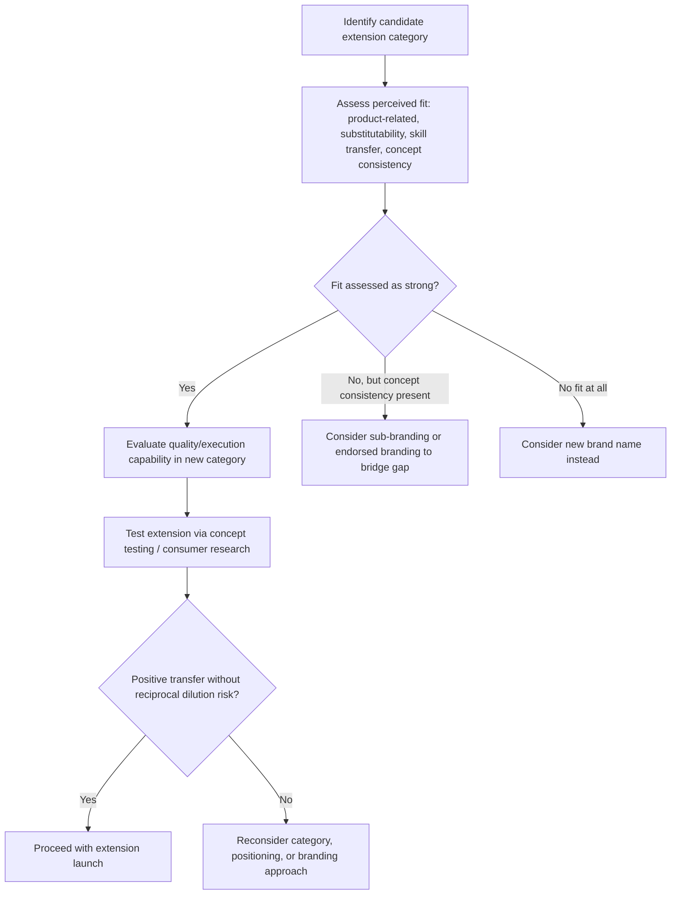

## Brand Extensions and Dilution Risk

### Overview

Brand extension is the strategic practice of leveraging an established brand name to enter a new product category, capitalizing on existing brand equity to reduce launch risk, awareness-building cost, and time-to-market compared to introducing an entirely new brand. Brand dilution risk is the countervailing concern: extensions that are poorly fitted, too numerous, or executed inconsistently can weaken the parent brand's associations, clarity, and perceived quality, degrading the very equity the extension sought to leverage. The strategic tension between extension opportunity and dilution risk is a central topic in brand architecture and brand equity management.

### Types of Brand Growth Strategies

Brand extension is one quadrant within a broader brand-growth matrix (commonly attributed to Keller and adapted across brand management literature), organized along two axes: existing vs. new product category, and existing vs. new brand name.

| Strategy | Product Category | Brand Name | Description |
| --- | --- | --- | --- |
| Line Extension | Existing | Existing | New variant within the same category (new flavor, size, formulation) |
| Brand Extension | New | Existing | Existing brand name applied to a new, different product category |
| Multi-brand | Existing | New | New brand name introduced within the same category the company already competes in |
| New Brand | New | New | Entirely new brand name for a new category, no connection to existing portfolio |

**Key Points**

- Line extensions carry substantially lower dilution risk than category-crossing brand extensions, since they operate within the category boundary where existing associations already apply
- The decision to pursue brand extension versus a new brand name is fundamentally a trade-off between speed/cost efficiency (extension) and protection of the parent brand's distinct equity (new brand)

### Rationale for Brand Extension

- **Leveraged awareness**: the new product benefits from existing brand recognition, reducing the marketing investment required to build awareness from zero
- **Transferred associations**: favorable quality, trust, or personality associations from the parent brand transfer to the extension, reducing perceived risk for the consumer trying the new category
- **Reduced distribution/retail friction**: retailers and channel partners are often more willing to stock an extension from an established brand than an unproven new entrant
- **Portfolio efficiency**: marketing, R&D, and operational synergies across a smaller number of managed brand names

### Extension Fit and Transfer of Associations

#### Types of Fit

Aaker and Keller's foundational extension research identifies multiple dimensions along which consumers assess "fit" between a parent brand and a proposed extension category, which determines whether positive associations transfer successfully:

| Fit Dimension | Description | Example |
| --- | --- | --- |
| Product-related fit (complementarity) | Products are used together or serve a related functional purpose | A pasta brand extending into pasta sauce |
| Substitutability | The extension could reasonably substitute for the parent category in use occasions | A soft drink brand extending into flavored sparkling water |
| Transfer of skills/manufacturing competence | The company's demonstrated expertise plausibly extends to the new category | A camera brand extending into optics/lenses |
| Brand concept consistency | The extension aligns with the abstract brand concept (e.g., luxury, ruggedness, innovation) even absent product-level similarity | A luxury fashion house extending into luxury hospitality |

**Key Points**

- Fit is a perceptual/psychological judgment made by consumers, not an objective, company-determined categorization — two extensions with similar "objective" category distance can be perceived very differently depending on how strongly the brand concept (rather than literal product similarity) bridges the categories
- **Prototypicality** of the parent brand's core category matters: extensions are more likely to succeed when the parent brand is not so strongly prototypical of its original category that consumers cannot conceive of it elsewhere (paradoxically, brands with slightly more abstract or benefit-based core positioning often extend more successfully than brands defined narrowly by a single concrete product)

#### Extension Evaluation Process

**Example**

A premium outdoor apparel brand extending into camping tents exhibits strong product-related fit and skill-transfer plausibility (outdoor gear expertise), while the same brand extending into breakfast cereal would rely almost entirely on abstract brand-concept consistency (if any at all — "outdoor adventure" concept applied to cereal is a considerable stretch), making the cereal extension far riskier and more dependent on creative bridging (e.g., positioning as "fuel for the trail") to establish any perceived fit.

### Reciprocal Effects: How Extensions Affect the Parent Brand

A critical and often underappreciated dimension of extension strategy is the **feedback effect** — how the extension, once launched, can alter consumer perception of the original parent brand, for better or worse.

| Effect | Mechanism |
| --- | --- |
| Positive reciprocal effect | A well-executed extension can reinforce or even enhance parent brand associations (e.g., reinforcing an innovation or quality association) |
| Negative reciprocal effect (dilution) | A poorly-fitted or poorly-executed extension can weaken, blur, or contradict core parent brand associations |
| Association dilution | Even a successful extension in a very different category can dilute a sharply-defined parent association by broadening what the brand "means," reducing distinctiveness |

**Key Points**

- Dilution can occur even without extension failure — a functionally successful extension into an incongruent category can still blur the parent brand's meaning simply by broadening the scope of what the brand represents, independent of the extension's own quality
- [Inference] The dilution literature generally distinguishes between two failure modes: **direct extension failure** (the new product itself performs poorly, damaging trust in the brand generally) and **concept dilution** (even a well-received extension erodes the sharpness/distinctiveness of the parent brand's core positioning by association-broadening) — the latter is more subtle and harder to detect via short-term sales metrics alone

### Managing Dilution Risk

#### Branding Architecture Strategies to Mitigate Risk

| Strategy | Description | Use Case |
| --- | --- | --- |
| Branded house | Single master brand across all extensions (e.g., using the same name/identity everywhere) | Strong fit, consistent brand concept across categories |
| Sub-branding | Parent brand name combined with a distinct sub-brand identifier | Moderate fit; provides some differentiation while retaining parent equity transfer |
| Endorsed branding | New brand name for the extension, with parent brand providing a visible "endorsement" or seal | Lower fit; limits dilution exposure while still borrowing some parent credibility |
| House of brands | Fully independent brand names with minimal/no visible parent connection | Poor fit or high risk category (e.g., reputational sensitivity); protects parent brand fully |

**Key Points**

- The choice of architecture is a direct dilution-risk management lever: as perceived fit decreases or category risk increases (e.g., health/safety-sensitive categories, or categories where quality failure would be highly visible), architecture should shift progressively from branded house toward house-of-brands to insulate the parent brand
- Sub-branding and endorsed branding are frequently used as intermediate options precisely because they permit some equity transfer while limiting downside blast radius if the extension underperforms

### Common Extension Failure Patterns

- **Vertical extension mismatch**: extending a brand associated with a specific quality/price tier into a substantially higher or lower tier (e.g., a budget brand attempting a premium extension, or vice versa) without sufficient bridging strategy, since price/quality tier associations are typically strongly encoded and resistant to reversal
- **Over-extension / brand stretching**: pursuing too many extensions across too many disparate categories, progressively diluting what the brand distinctly stands for until it has no clear, differentiated meaning left
- **Cannibalization without net growth**: extensions that primarily draw existing customers away from the parent product line rather than expanding the overall customer base or usage occasions
- **Category association contamination**: entering a category with negative cultural or reputational associations (e.g., certain regulatory-sensitive or controversy-prone categories) that reflect backward onto the parent brand regardless of extension execution quality

### Measurement and Risk Assessment

| Method | What It Assesses |
| --- | --- |
| Concept fit testing | Pre-launch consumer research measuring perceived fit and transfer plausibility |
| Parent brand association tracking (pre/post launch) | Longitudinal brand tracking isolating any shift in core parent brand associations following extension launch |
| Extension trial and repeat purchase | Direct behavioral validation of extension acceptance |
| Cannibalization analysis | Sales/share analysis distinguishing incremental extension revenue from parent-line displacement |

**Next Steps**

- Conduct formal fit assessment (product-related, substitutability, skill-transfer, concept-consistency) before committing to any category-crossing extension
- Select branding architecture (branded house through house-of-brands) calibrated to assessed fit and category risk, rather than defaulting to full parent-brand branding for convenience
- Establish parent-brand association tracking before extension launch to create a pre-launch baseline for detecting reciprocal dilution effects
- Set explicit portfolio-level extension limits or governance review to guard against uncontrolled brand stretching over time

**Related Topics**

- Brand Equity Models
- Brand Identity, Image, and Meaning
- Brand Architecture Strategy (Branded House vs. House of Brands)
- Positioning Strategy and Perceptual Mapping
- Brand Personality and Archetypes
- Category Creation and Category Design Strategy
- Cannibalization Analysis in Product Portfolio Management