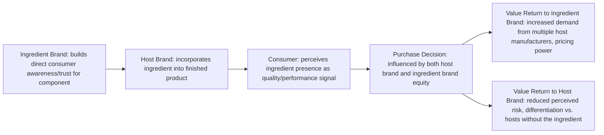

## Co-Branding and Ingredient Branding

### Overview

Co-branding is a strategic alliance in which two or more established brands are combined in a single product, service, or marketing offering, with the intent that consumers perceive value from the association of both brand names simultaneously. **Ingredient branding** is a specific subtype of co-branding in which a component or input brand (the "ingredient") is branded and promoted within a host product, most famously exemplified by "Intel Inside" — a case so influential it gave the broader concept its common name in industry usage. Both strategies rest on the transfer and combination of brand equity across partners, but carry distinct risk profiles and governance requirements compared to single-brand strategies or standard brand extension.

### Co-Branding: Definitions and Rationale

#### Core Rationale

- **Equity transfer and combination**: each partner brand lends its existing associations (quality, trust, prestige, innovation) to the joint offering, potentially creating a combined equity greater than either brand could generate alone
- **Access to new customer segments**: partnering brands can cross-pollinate each other's existing customer bases, providing efficient market access without the cost of independent customer acquisition
- **Risk and cost sharing**: product development, marketing, and R&D costs and risks are distributed across partners
- **Signal of confidence**: the willingness of an established brand to lend its name to a partnership can itself function as a credibility signal to consumers

#### Types of Co-Branding

| Type | Description | Example Pattern |
| --- | --- | --- |
| Same-company co-branding | Two brands owned by the same parent company are combined | A conglomerate combining two of its own brand names on one product |
| Joint venture co-branding | Two independently-owned companies form a partnership brand | Two companies co-developing and co-branding a new product line |
| Multiple-sponsor co-branding | Several independent brands combine on a single offering (e.g., co-branded credit cards involving a bank, a card network, and a retail/airline partner) | Airline + bank + card network co-branded credit card |
| Ingredient co-branding | A component/input brand is branded within a host product | Component brand featured prominently within a finished good |

**Key Points**

- Co-branding differs from simple brand extension in that it involves two (or more) genuinely independent brand equities being combined, rather than a single brand entering a new category alone
- Partner selection is the single most consequential decision in co-branding strategy — mismatched partner equity, incompatible target audiences, or incongruent brand personalities can produce negative equity transfer for one or both partners rather than the intended positive combination

### Ingredient Branding

#### Definition and Origin

Ingredient branding involves branding a raw material, component, or sub-system that is incorporated into a larger host product, then marketing that component brand directly to end consumers — even though the consumer's actual purchase decision is for the host product, not the component itself. The strategy requires convincing consumers that the presence of a specific branded ingredient meaningfully affects the quality or performance of the finished product.

#### The "Intel Inside" Case

Intel's "Intel Inside" campaign (launched 1991) is the canonical reference case for ingredient branding, built on a co-op marketing model in which computer manufacturers (the host brands) received advertising subsidies for featuring the Intel Inside logo in their own marketing and packaging. The campaign is widely credited with transforming a component that was previously invisible to end consumers (the processor) into a driver of purchase preference and a factor in perceived computer quality and reliability. [Unverified — specific market-share and financial figures attributed to the campaign vary by source; treat the campaign's qualitative significance as well-established but specific quantitative claims as requiring independent verification.]

#### Ingredient Branding Value Flow

**Key Points**

- Ingredient branding is strategically valuable for the ingredient supplier because it builds direct brand equity with the *end consumer*, rather than equity being confined to B2B relationships with host manufacturers alone — this reduces the ingredient supplier's dependence on any single host brand relationship and creates consumer-driven demand pull
- For the ingredient brand to succeed, the ingredient must be genuinely perceptible or believable as a meaningful quality/performance driver to the end consumer — ingredient branding attempts for components that are perceived as commoditized or interchangeable typically fail to generate consumer-level differentiation
- Common ingredient-branding categories include: computing components (processors, materials like Gore-Tex in apparel), food/beverage inputs (e.g., a specific sweetener or dairy source), and textile/material technologies

### Requirements for Successful Ingredient Branding

- **Perceptible quality differentiation**: the ingredient must plausibly and visibly affect the performance or experience of the host product from the end consumer's perspective
- **Sustained co-marketing investment**: ingredient brands typically must invest significantly in direct-to-consumer marketing (not just B2B trade marketing) to build the awareness and trust needed for the ingredient to function as a purchase driver
- **Host brand cooperation and consistency**: the ingredient brand's visibility and messaging depend on host brand cooperation (logo placement, co-op advertising participation), requiring sustained incentive alignment between ingredient supplier and multiple host manufacturers
- **Protection against commoditization**: as ingredient branding succeeds, competitors may attempt to imitate the marketing approach for functionally similar components, requiring the ingredient brand to maintain genuine performance/quality leadership, not just perception

### Risks in Co-Branding and Ingredient Branding

| Risk | Description |
| --- | --- |
| Negative equity transfer | If one partner brand experiences a quality failure, scandal, or reputational damage, the association can transfer negative associations to the partner brand as well |
| Brand personality/positioning mismatch | Partnering brands with incongruent personalities, price tiers, or target audiences can create consumer confusion or perceived inauthenticity |
| Loss of distinctiveness | Frequent or poorly-curated co-branding partnerships can dilute a brand's distinct identity, similar to the dilution risk in brand extension |
| Partner dependency | Ingredient brands in particular can become overly dependent on a small number of host manufacturers, creating channel-concentration risk |
| Termination/exit complexity | Unwinding a co-branded partnership (e.g., a bank losing an airline co-branded credit card contract) can be operationally and reputationally complex, particularly for offerings with embedded loyalty program value |

**Example**

A co-branded credit card partnership between an airline and a bank exemplifies both the upside and risk profile: the airline gains a revenue stream and loyalty-program engagement mechanism, and the bank gains access to a valuable, often higher-income customer segment with an existing affinity — but if the airline's service reputation deteriorates or the partnership contract ends, both partners face embedded risk (the bank's card product loses its core value proposition; the airline's loyalty program loses its primary earning mechanism), illustrating the interdependency inherent in co-branded structures.

### Governance and Partner Selection Framework

**Key Points**

- **Brand equity parity**: partnerships are generally more stable and mutually beneficial when partner brands have roughly comparable equity strength — a significant equity imbalance can result in the stronger brand absorbing risk disproportionately relative to benefit received
- **Audience and values congruence**: successful co-branding typically requires overlapping or complementary target audiences and compatible brand values/personality, evaluated using frameworks such as Aaker's brand personality dimensions or the Fit assessment used in brand extension analysis
- **Contractual clarity on quality control**: since each partner's brand reputation becomes partially dependent on the other's execution, contracts and operational agreements typically specify quality standards, approval rights over joint marketing material, and exit/termination provisions
- **Category and legal considerations**: certain categories (e.g., alcohol, gambling, or politically sensitive categories) carry elevated co-branding risk due to regulatory or reputational sensitivity, warranting additional due diligence beyond standard brand-fit analysis

### Common Pitfalls

- **Partner selection based on short-term opportunism**: choosing a co-branding partner primarily for a one-time marketing lift rather than genuine long-term brand and audience fit
- **Underinvesting in the ingredient brand's own consumer marketing**: treating ingredient branding as purely a B2B logo-licensing exercise without building the sustained end-consumer education needed for the ingredient to function as a genuine purchase driver
- **Ambiguous accountability for joint product quality**: failing to establish clear quality governance can leave both brands exposed to reputational damage from failures neither fully controls
- **Overextending the co-branding portfolio**: pursuing too many simultaneous co-branding partnerships can dilute the distinctiveness of each individual partnership and confuse the brand's overall positioning, echoing the over-extension risk seen in standard brand extension strategy

**Next Steps**

- Evaluate potential co-branding partners using both equity-parity and audience/personality congruence criteria before pursuing partnership discussions
- For ingredient branding strategies, assess whether the component is genuinely perceptible as a quality/performance driver to end consumers before committing to a consumer-facing branding campaign
- Establish joint quality governance and exit-provision agreements at the outset of any co-branding partnership, not after launch
- Build a partner-brand health tracking mechanism to monitor reputational or equity shifts in partner brands that could create reciprocal risk

**Related Topics**

- Brand Extensions and Dilution Risk
- Brand Equity Models
- Brand Architecture Strategy (Branded House vs. House of Brands)
- Brand Identity, Image, and Meaning
- Loyalty Program Design and Retention Psychology
- Strategic Alliance and Joint Venture Management
- Positioning Strategy and Perceptual Mapping