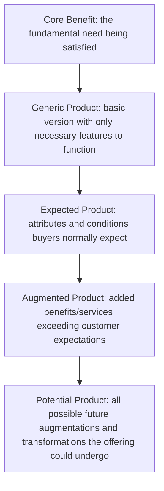

## Product Levels and the Augmented Product

### Overview

The Product Levels model, most widely attributed to Philip Kotler (building on earlier work by Theodore Levitt on the "augmented product" concept), decomposes any market offering into a series of conceptual layers, each adding value beyond pure physical function. The framework's central insight is that consumers do not purchase a product for its core function alone — they purchase a bundle of benefits spanning function, form, and meaning, and competitive differentiation increasingly occurs at the outer layers rather than the core once a category matures and core functional parity is achieved among competitors.

### The Five Product Levels

Kotler's model structures the offering into five concentric levels, moving from the most abstract customer need to the most tangible and elaborated market offering:

| Level | Definition | Example (Hotel Room) |
| --- | --- | --- |
| Core Benefit | The fundamental need or problem-solution the customer is actually buying | Rest and sleep |
| Generic Product | A basic version of the product containing only the attributes necessary for it to function | A room with a bed |
| Expected Product | The set of attributes and conditions buyers normally expect when purchasing this product | Clean sheets, a working bathroom, reasonable quiet |
| Augmented Product | Additional services, benefits, and attributes that exceed customer expectations and differentiate from competitors | Free high-speed WiFi, a personalized welcome, express checkout, loyalty program benefits |
| Potential Product | All potential augmentations and transformations the product might undergo in the future | Fully personalized in-room environment via smart-room technology, AI-driven concierge services |

**Key Points**

- The **core benefit** is the only level defined purely by the customer's underlying need, independent of any product category — Levitt's classic formulation ("people don't want a quarter-inch drill, they want a quarter-inch hole") operates precisely at this level, directly parallel to the Jobs-to-be-Done concept
- Movement from generic to expected to augmented reflects increasing category maturity and rising baseline customer expectations — features that were once augmentation-level differentiators (e.g., free WiFi in hotels) frequently migrate down into the expected-product level over time as the entire category adopts them, a process sometimes termed **expectation escalation** or **commoditization drift**
- The potential product level represents the field of future strategic possibility and R&D direction, distinct from current market execution — it is aspirational/strategic rather than a description of the current offering

### Levitt's Augmented Product Concept

Theodore Levitt's earlier and more specific "augmented product" framing (predating Kotler's full five-level elaboration) argued that competitive differentiation in mature markets occurs primarily at the augmented level, since core and generic-level parity becomes increasingly difficult to sustain as competitors converge on functional adequacy. Levitt's framing emphasized that the augmented product — encompassing installation, after-sales service, warranty, delivery, credit terms, and other surrounding services — is where genuine competitive advantage is built once the core product itself is commoditized.

**Key Points**

- Levitt's original insight remains foundational to service-differentiation strategy: in commoditized categories, the augmented layer (not the core product) is typically the primary battleground for competitive positioning and price premium justification
- [Inference] The distinction between Levitt's two-part framing (core/tangible vs. augmented) and Kotler's five-level elaboration is largely one of granularity — Kotler's generic and expected levels effectively subdivide what Levitt's earlier "tangible product" concept treated as a single layer; both frameworks agree on the augmented level's strategic centrality

### Why Layer Distinction Matters Strategically

- **Differentiation locus identification**: as categories mature, functional (generic/expected level) differentiation becomes harder to sustain, shifting competitive emphasis toward the augmented level (service, experience, ecosystem) and, at the frontier, toward potential-level innovation
- **Expectation management**: correctly identifying what customers currently place in the "expected" versus "augmented" bucket prevents both under-delivery (failing to meet expected-level baseline, causing dissatisfaction) and inefficient over-investment (marketing an expected-level feature as if it were a differentiator)
- **Pricing and value communication**: augmented-level benefits are often the primary justification for price premiums, since core/generic/expected levels are frequently matched across competitors at a given price tier
- **Innovation roadmap structuring**: the potential-product level provides a structured space for long-term innovation planning distinct from near-term competitive positioning at the augmented level

### Applying the Framework: Diagnostic Questions by Level

| Level | Diagnostic Question |
| --- | --- |
| Core Benefit | What fundamental need is the customer actually trying to satisfy? |
| Generic Product | What is the minimum viable version of this offering that functions at all? |
| Expected Product | What do customers in this category currently take for granted as baseline? |
| Augmented Product | What can we add that exceeds current category expectations and is difficult for competitors to replicate quickly? |
| Potential Product | What could this offering become given plausible future technology, customer behavior shifts, or business model innovation? |

**Example**

For a software-as-a-service (SaaS) analytics product: the core benefit is *understanding business performance*; the generic product is basic dashboards and reports; the expected product includes reliable uptime, standard export functionality, and role-based access control (now baseline expectations in the category); the augmented product might include AI-generated insights, dedicated customer success management, and proactive anomaly alerts; the potential product could involve predictive, autonomous decision-recommendation systems that act on the analytics without requiring human interpretation.

### Relationship to Adjacent Frameworks

| Framework | Relationship to Product Levels |
| --- | --- |
| Jobs-to-be-Done | The core benefit level maps directly onto the JTBD concept of the underlying "job" the customer is hiring the product to perform |
| Kano Model | Kano's Basic/Performance/Delight attribute categories closely parallel Expected/Expected(-performance)/Augmented levels respectively, providing a complementary quantitative method for classifying which features belong at which level |
| Total Product Concept (services marketing) | Similar layered logic applied specifically within services marketing, often incorporating service-specific dimensions like process and physical evidence |
| Positioning Strategy | Augmented-level attributes frequently become the specific points-of-difference used in positioning statements once generic/expected-level parity is assumed |

### Common Pitfalls

- **Marketing expected-level features as differentiators**: promoting baseline category expectations (e.g., "our software has a login page") as if they were meaningful competitive advantages, which fails to resonate and can signal a lack of genuine augmented-level innovation
- **Under-investing in the expected level while over-investing in augmentation**: pursuing flashy augmented-level features while failing to reliably deliver expected-level baseline performance produces dissatisfaction that augmentation cannot offset — expected-level failures are typically dissatisfiers regardless of how strong the augmented layer is (a dynamic also described in the Kano model as a "must-be" or "basic" attribute)
- **Confusing potential product with current offering**: presenting aspirational, not-yet-built potential-level capabilities as though they were part of the current augmented product, risking credibility and customer trust if the gap becomes apparent
- **Static application in a moving category**: failing to periodically reassess which features have migrated from augmented to expected as the category matures, resulting in stale differentiation claims

**Next Steps**

- Map the current product/service offering explicitly across all five levels to identify where actual differentiation is occurring versus where competitive parity has been assumed incorrectly
- Cross-reference the augmented-level map against category competitor offerings to confirm claimed differentiators are not already migrating toward the expected level
- Use the potential-product level as a structured input to long-term roadmap and R&D prioritization discussions, kept explicitly separate from near-term augmented-level marketing claims
- Pair this framework with Kano model analysis to quantitatively validate which specific attributes customers currently classify as basic, performance, or delight-level

**Related Topics**

- Jobs-to-be-Done Framework
- Kano Model of Customer Satisfaction
- Positioning Strategy and Perceptual Mapping
- New Product Development Process
- Diffusion of Innovation and Adoption Psychology
- Total Product Concept in Services Marketing
- Value Proposition Design