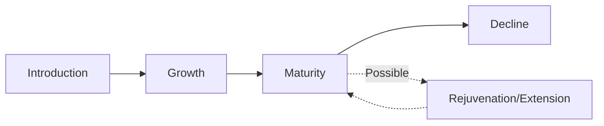

## Product Life Cycle and Psychological Adoption Stages

### Overview

The Product Life Cycle (PLC) model describes the typical trajectory of a product's sales and profit performance over time, from introduction through decline, and is one of the most widely taught frameworks in strategic marketing. This entry connects the standard PLC stages to the psychological adoption dynamics operating beneath them — principally Rogers' Diffusion of Innovation adopter categories — to explain *why* the sales curve takes its characteristic shape, rather than treating the PLC as a purely descriptive sales pattern.

### The Four (or Five) Stage PLC Model

| Stage | Sales Pattern | Profit Pattern | Competitive Intensity |
| --- | --- | --- | --- |
| Introduction | Slow, low sales volume | Typically negative or minimal (high launch costs) | Few or no direct competitors |
| Growth | Rapid sales acceleration | Rising, often peaking late in this stage | Increasing entrants attracted by demonstrated demand |
| Maturity | Sales plateau, peak volume | Stable but often declining (price competition) | Highest competitive intensity, market saturation |
| Decline | Sustained sales reduction | Falling further, may become negative | Weaker competitors exit; consolidation |

**Key Points**

- The PLC curve shape is not intrinsic to the product itself but emerges from the aggregation of individual adoption decisions occurring across the population over time — the curve is, in effect, the macro-level expression of the same underlying process Rogers' diffusion model describes at the individual level
- Not all products traverse a "normal" bell/S-shaped curve — fads exhibit rapid rise and rapid fall with no sustained maturity plateau, while some durable categories exhibit repeated "extension" cycles that reset or prolong the maturity stage rather than proceeding directly to decline

### Mapping PLC Stages to Diffusion Adopter Categories

The psychological substrate of the PLC becomes visible when overlaid against Rogers' adopter categories (Innovators, Early Adopters, Early Majority, Late Majority, Laggards):

| PLC Stage | Dominant Adopter Category Entering the Market | Psychological Driver |
| --- | --- | --- |
| Introduction | Innovators (approx. 2.5% of eventual adopters) | Venturesome risk tolerance, intrinsic interest in novelty, tolerance for imperfect early execution |
| Growth (early) | Early Adopters (approx. 13.5%) | Opinion leadership, social status from early recognition of value, moderate risk tolerance guided by observed innovator experience |
| Growth (late) / Maturity (early) | Early Majority (approx. 34%) | Deliberate, pragmatic; adopts once utility and reliability are well-established via peer validation |
| Maturity (late) | Late Majority (approx. 34%) | Skeptical; adopts due to economic necessity, social pressure, or the product becoming an unavoidable standard |
| Decline | Laggards (approx. 16%), if at all | Traditional orientation; adoption, if it occurs, is driven by necessity once alternatives become unavailable |

**Key Points**

- The inflection point between Introduction and Growth in the PLC curve corresponds psychologically to the transition from Innovators to Early Adopters — and in Geoffrey Moore's extension of diffusion theory, the more consequential and higher-risk transition is the one immediately following, from Early Adopters to Early Majority (the "chasm"), since these two groups have meaningfully different psychographic profiles (visionaries seeking transformation vs. pragmatists seeking proven, low-risk solutions)
- The Maturity plateau reflects market saturation in diffusion terms: once Early and Late Majority adoption is largely exhausted, remaining growth is constrained to population growth, replacement purchases, and the comparatively small and reluctant Laggard segment
- [Inference] Because Laggards are, by Rogers' definition, oriented toward tradition and resistant to change, many products never meaningfully penetrate this segment at all before being succeeded by a newer generation of the category — meaning the Decline stage of many PLCs is driven less by Laggard exhaustion and more by category-level substitution (a newer innovation beginning its own introduction stage)

### Psychological Mechanisms Operating Within Each Stage

#### Introduction Stage

- **Uncertainty and perceived risk** dominate consumer psychology; only consumers with high risk tolerance (Innovators) and low switching costs proceed to trial
- **Information asymmetry** is high — marketing communication in this stage is primarily *educational*, focused on awareness-knowledge (per Rogers' innovation-decision process) rather than persuasion or comparative differentiation, since no established category frame of reference yet exists in most consumers' minds

#### Growth Stage

- **Social proof accelerates adoption**: as Early Adopters (often opinion leaders) visibly use and endorse the product, the two-step flow of communication accelerates diffusion into the Early Majority
- **Bandwagon and herd effects** become increasingly influential as adoption becomes visible and socially normalized
- **Competitive entry intensifies**, shifting marketing communication from category education toward brand differentiation, since the category itself is now understood

#### Maturity Stage

- **Habituation and routinized purchase behavior** dominate — most remaining potential adopters have already made their initial decision, and marketing shifts toward retention, loyalty, and share-of-wallet competition rather than category education
- **Price sensitivity increases** as functional differentiation narrows and consumers perceive competing offerings as largely substitutable (points-of-parity dominate over points-of-difference)
- **Repositioning and product modification pressure emerges**, since organic category growth has largely stalled

#### Decline Stage

- **Psychological disengagement**: consumer attention and cultural relevance shift toward newer, substitute innovations, reducing salience even among previously loyal segments
- **Residual loyalist behavior**: a shrinking base of habitual or identity-attached users (often the most attached remaining segment, per brand attachment theory) may sustain a long "tail" of demand well past the category's peak relevance

### Marketing Mix Implications by Stage

| Stage | Product Focus | Pricing | Promotion | Distribution |
| --- | --- | --- | --- | --- |
| Introduction | Basic/core functionality, may still have quality issues | Often skimming (high) or penetration (low), depending on strategy | Educational, awareness-building | Limited, selective |
| Growth | Product improvements, feature additions based on early feedback | Adjusted to reflect competitive entry | Persuasion-focused, differentiation messaging | Expanding distribution intensity |
| Maturity | Differentiation via augmented-product features (see Product Levels framework) | Increasingly competitive/promotional pricing | Reminder and loyalty-reinforcement messaging | Maximum distribution intensity, intense channel competition |
| Decline | Rationalized product line, possible harvesting | Often reduced to clear inventory or sustain remaining demand | Minimal; targeted at residual loyal segment only | Selective withdrawal from weaker channels |

**Example**

A smartphone category illustrates the full cycle: introduction-stage devices attracted technology enthusiasts tolerant of limited app ecosystems and higher prices (Innovators); the growth stage saw early-adopter opinion leaders driving visible social adoption, followed by early-majority consumers once reliability and app availability were well-established; maturity is characterized by intense feature-parity competition and price segmentation across tiers; and decline dynamics for any specific model generation are typically driven less by exhausting laggard demand and more by manufacturers actively obsoleting older models in favor of newer generations beginning their own introduction stage.

### PLC Limitations and Critiques

**Key Points**

- **Not all products follow the idealized curve**: category-level PLC patterns can be highly variable — some products cycle through repeated rejuvenation (via repositioning, new use occasions, or line extensions) rather than proceeding linearly to decline, while others (fads) collapse rapidly without a stable maturity plateau
- **Difficulty identifying the current stage in real time**: PLC stage is more reliably identified retrospectively than prospectively, creating strategic risk if decisions (e.g., harvesting a "mature" product) are made based on a misdiagnosed stage
- **Category vs. brand vs. specific product confusion**: the PLC concept applies most cleanly at the category level (e.g., "smartphones" as a category); applying it naively to a specific brand's product line can obscure competitive share dynamics operating independently of overall category maturity
- **Self-fulfilling strategic risk**: treating a product as being in "decline" and reducing marketing investment accordingly can accelerate the very decline being diagnosed, independent of genuine underlying demand conditions

**Next Steps**

- Diagnose current PLC stage using multiple converging indicators (sales growth rate, competitive entry/exit patterns, adopter category composition of recent buyers) rather than sales trend alone
- Cross-reference the PLC stage diagnosis against Rogers' diffusion model to identify which adopter category the brand should be targeting with current messaging
- For products approaching or within maturity, evaluate rejuvenation/extension options (repositioning, line extension, new use-occasion messaging) before defaulting to harvest/decline strategies
- Align marketing mix decisions (pricing, promotion focus, distribution intensity) explicitly to the diagnosed stage rather than applying a uniform strategy across the product portfolio

**Related Topics**

- Rogers' Diffusion of Innovation Model
- Crossing the Chasm (Geoffrey Moore)
- Product Levels and the Augmented Product
- Positioning Strategy and Perceptual Mapping
- Bass Diffusion Model (mathematical formalization of adoption over time)
- Brand Attachment, Trust, and Love
- New Product Development Process