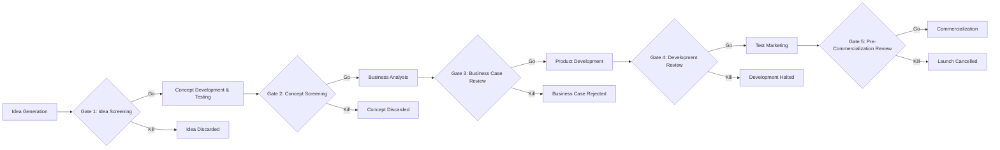

## New Product Development and Concept Testing

### Overview

New Product Development (NPD) is the structured organizational process of bringing new offerings to market, spanning idea generation through commercialization. Concept testing is a specific research methodology embedded within NPD, used to evaluate consumer response to a proposed product idea before committing significant resources to full development and launch. Together, they form the disciplined front end of product strategy, aimed at reducing the well-documented high failure rate of new products by systematically filtering, refining, and validating ideas against genuine customer demand before physical or financial commitment escalates.

### The NPD Process: Stage-Gate Framework

The most widely taught NPD structure is Robert Cooper's **Stage-Gate** model, which organizes development into discrete stages separated by evaluative "gates" — go/kill/hold decision points where management reviews progress before authorizing further investment.

**Key Points**

- The stage-gate structure is explicitly designed to reduce sunk-cost escalation — each gate forces an evaluative decision rather than allowing projects to continue by organizational default or momentum
- Later gates require progressively more rigorous evidence, since the cost of proceeding (and the cost of a wrong decision) increases substantially at each subsequent stage
- [Inference] In practice, many organizations run modified or compressed versions of the full Stage-Gate model, particularly in software/digital contexts where iterative and agile development methods blend stage-gate governance with continuous, incremental delivery rather than discrete sequential stages — the canonical five/six-stage model is best understood as a governance logic rather than a rigid universal procedure

### Idea Generation and Screening

#### Sources of New Product Ideas

- **Internal sources**: R&D, employee suggestion systems, sales force customer feedback
- **Customer sources**: direct customer research, complaint/support data, lead-user innovation (customers who face needs ahead of the broader market and often develop their own solutions)
- **Competitive sources**: competitive intelligence, reverse engineering, category benchmarking
- **Channel and supplier sources**: distributors and suppliers often observe unmet needs across many client relationships

#### Idea Screening Criteria

Idea screening typically evaluates concepts against criteria such as: strategic fit with company capabilities and brand, estimated market size and growth potential, competitive intensity, technical feasibility, and estimated cost-to-develop relative to expected return. A common failure mode at this stage is the **DROP-error** (rejecting an idea that would have succeeded) versus **GO-error** (advancing an idea that ultimately fails) trade-off — screening criteria calibration affects the relative likelihood of each error type, and organizations must consciously decide their risk tolerance rather than assuming screening rigor uniformly reduces both error types simultaneously.

### Concept Development and Concept Testing

#### From Idea to Concept

A **product idea** is a possible offering the company might bring to market; a **product concept** is a detailed, articulated version of the idea expressed in terms meaningful to consumers — typically including the target segment, the core benefit, and the basic form the offering will take. Concept testing requires this translation step, since raw ideas are generally too abstract for meaningful consumer evaluation.

#### Concept Testing Methodology

Concept testing presents consumers with a description (verbal, visual, or prototype-based) of the proposed product and measures response along several standard dimensions:

| Measurement Dimension | What It Assesses |
| --- | --- |
| Comprehension/clarity | Whether consumers understand what the product is and does |
| Believability | Whether consumers find the claimed benefits credible |
| Need/benefit level | Whether the concept addresses a need consumers actually have |
| Purchase intent | Stated likelihood of purchasing, typically on a 5-point scale ("definitely would buy" to "definitely would not buy") |
| Uniqueness/differentiation | Whether the concept is perceived as distinct from existing alternatives |
| Price-value perception | Whether the perceived value justifies the anticipated or stated price |

**Key Points**

- Purchase intent scales are subject to well-documented **overstatement bias**: stated purchase intent, particularly at the "top box" (definitely would buy) level, systematically overstates actual future purchase behavior, requiring calibration factors developed from historical concept-test-to-actual-sales validation within a given company or category [Inference — the direction of overstatement bias is well-established in market research practice; specific calibration ratios are company/category-specific and not universal constants]
- Concept tests are typically run as **monadic** (each respondent evaluates only one concept, avoiding direct comparison bias) or **comparative** (respondents evaluate multiple concepts against each other) designs, with monadic designs generally preferred when the goal is to estimate a concept's likely real-world reception in isolation, since real purchase decisions are rarely made via explicit side-by-side comparison of unlaunched concepts
- Concept statements should isolate the variable being tested — testing a concept with conflated benefit and price variations simultaneously makes it difficult to attribute consumer response to a specific concept element

#### Concept Testing Formats

- **Verbal/written concept statements**: low-cost, fast, but limited in conveying tactile, visual, or experiential aspects of the offering
- **Visual/storyboard concepts**: static images or renderings supplementing text description
- **Prototype-based testing**: functional or non-functional physical/digital prototypes allowing more realistic evaluation, at higher cost and later-stage applicability
- **Virtual/simulated shopping environments**: increasingly used to test concepts within a realistic purchase-decision context (e.g., simulated shelf sets, e-commerce mockups) rather than an isolated description

**Example**

A beverage company testing a new low-sugar sports drink might present a concept statement structured as: *For active adults concerned about sugar intake, [Brand] Lite is a sports hydration drink with 80% less sugar than traditional sports drinks, using natural sweeteners, so you can rehydrate effectively without the sugar crash.* Respondents would then rate purchase intent, believability of the "80% less sugar" claim, and perceived differentiation versus existing low-sugar alternatives already in market.

### Business Analysis

Following concept validation, business analysis translates consumer response data into financial projections: estimated sales volume (often derived from calibrated purchase-intent data combined with awareness and distribution assumptions), cost structure, projected profitability, and break-even analysis. This stage is the primary gate at which a concept with genuine consumer appeal may still be rejected on financial or strategic-fit grounds.

### Product Development and Test Marketing

#### Product Development

The concept is translated into an actual physical or functional product, iterated through internal testing (functional/safety validation) and consumer testing (usage testing, preference testing against prototypes or competitive benchmarks).

#### Test Marketing Approaches

| Approach | Description | Trade-off |
| --- | --- | --- |
| Standard test markets | Full launch in a limited number of representative geographic markets | Realistic data, but slow, expensive, and visible to competitors (risk of competitive response or copying before national launch) |
| Controlled test markets | Product placed in a panel of stores with controlled distribution/promotion, often supplemented by consumer panels | Faster and more controlled than standard test markets, less competitively visible |
| Simulated test markets | Consumers exposed to advertising/concepts in a controlled research setting, then given opportunity to "purchase" in a simulated or laboratory store environment | Fast, low-cost, low competitive visibility, but lower real-world validity than in-market approaches |

**Key Points**

- Test marketing decisions involve an explicit trade-off between predictive validity (how well results predict actual national launch performance) and competitive exposure risk (test markets can tip off competitors, enabling preemptive response or fast-follow copying before full launch)
- [Inference] The rise of digital/direct-to-consumer channels has expanded lower-risk test marketing options (e.g., limited digital ad campaigns measuring click-through and pre-order intent, crowdfunding campaigns as a live market validation mechanism) that were less available before e-commerce and social advertising platforms matured, though these approaches carry their own validity limitations relative to full-scale test markets

### Why New Products Fail: Common Root Causes

- **Insufficient market need validation**: proceeding past concept testing despite weak or ambiguous purchase-intent and need signals, often due to internal organizational momentum or sunk-cost pressure
- **Poor concept-to-product translation**: the final developed product fails to deliver on the specific benefit or differentiation that drove positive concept-test response
- **Inadequate market size estimation**: overestimating addressable market size due to overstated purchase intent data uncorrected by calibration factors
- **Competitive response underestimation**: failing to anticipate competitor fast-follow or preemptive response during the development/test-marketing window
- **Cross-functional misalignment**: disconnects between R&D, marketing, and sales assumptions about the target segment or core benefit, often traceable to weak or bypassed gate reviews earlier in the process

### Measurement Summary Across the NPD Funnel

| Stage | Primary Research Method | Key Metric |
| --- | --- | --- |
| Idea Screening | Internal scoring models, expert panels | Strategic fit and feasibility scores |
| Concept Testing | Monadic/comparative concept tests | Purchase intent, uniqueness, believability |
| Business Analysis | Financial modeling using calibrated concept-test data | Projected ROI, break-even volume |
| Product Development | Usage/preference testing, prototype validation | Product performance vs. specification and competitive benchmark |
| Test Marketing | Controlled or simulated test markets | Trial rate, repeat rate, market share projection |

**Next Steps**

- Establish or adopt a calibration factor for purchase-intent overstatement specific to the product category, using historical concept-test-to-actual-launch data if available
- Ensure concept statements isolate single variables (benefit, price, form) to enable clean diagnostic interpretation of test results
- Select a test marketing approach that balances predictive validity needs against competitive exposure risk given the category's competitive intensity
- Build explicit go/kill criteria for each Stage-Gate review before development begins, to reduce sunk-cost-driven advancement of weak concepts

**Related Topics**

- Product Levels and the Augmented Product
- Jobs-to-be-Done Framework
- Kano Model of Customer Satisfaction
- Product Life Cycle and Psychological Adoption Stages
- Rogers' Diffusion of Innovation Model
- Persona Development and Jobs-to-be-Done
- Conjoint Analysis for Feature and Price Preference Measurement