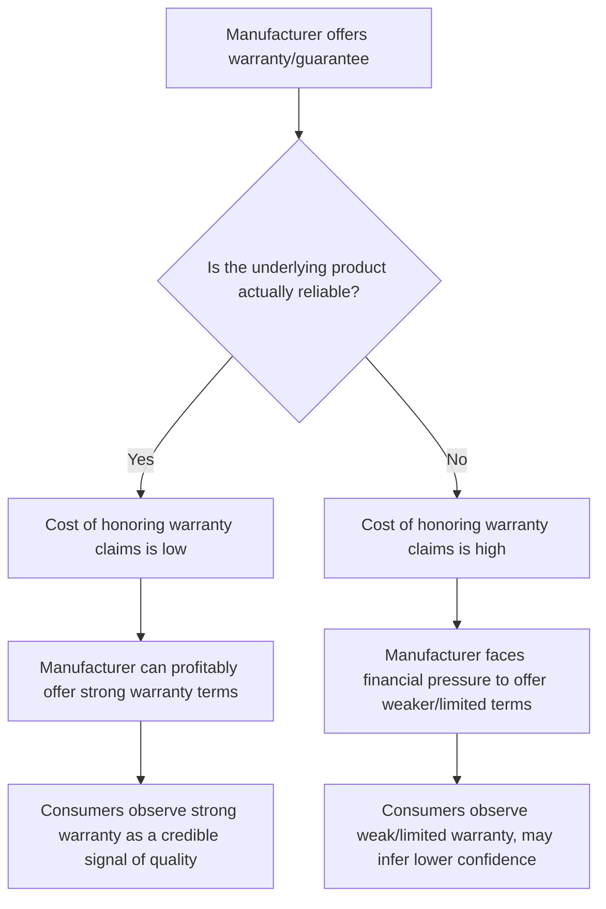

## Warranties, Guarantees, and Risk-Reduction Signals

### Overview

Warranties, guarantees, and related risk-reduction signals are marketing and contractual mechanisms designed to lower a consumer's perceived risk of purchase by shifting some or all of the financial, functional, or psychological consequences of product failure back onto the seller or manufacturer. Beyond their legal/contractual function, these mechanisms operate as **signaling devices** in consumer psychology — communicating manufacturer confidence, reducing perceived purchase risk, and, per signaling theory, functioning as credible information precisely because they are costly to offer on a genuinely unreliable product.

### Perceived Risk in Consumer Decision-Making

Warranties and guarantees address specific categories of perceived risk identified in classic consumer behavior research (Bauer, Jacoby & Kaplan):

| Risk Type | Description | Primary Risk-Reduction Mechanism |
| --- | --- | --- |
| Functional/Performance risk | Product may not perform as expected | Performance warranties, guarantees |
| Financial risk | Money paid may be lost if product fails or underperforms | Money-back guarantees, refund policies |
| Physical/Safety risk | Product may cause physical harm | Safety certifications, recall commitments |
| Social risk | Product choice may negatively affect how others perceive the buyer | Brand reputation, third-party endorsement (indirect) |
| Psychological risk | Purchase may conflict with self-concept or cause post-purchase regret | Satisfaction guarantees, generous return policies |
| Time/Convenience risk | Time invested in evaluating/using the product may be wasted if it fails | Trial periods, easy-replacement policies |

**Key Points**

- Warranties and guarantees primarily target functional, financial, and time risk directly; their effect on social and psychological risk is generally indirect, operating through the broader mechanism of increased purchase confidence rather than a direct risk-transfer mechanism
- The relative importance of each risk type varies by product category, price point, and purchase involvement — high-involvement or high-price purchases (major appliances, vehicles, electronics) typically weight financial and functional risk most heavily, while services and experience goods weight psychological and time risk more heavily

### Warranties: Types and Structure

#### Types of Warranties

| Type | Description |
| --- | --- |
| Express warranty | Explicitly stated promise (written or verbal) about product performance or condition |
| Implied warranty | Legally presumed baseline (e.g., merchantability, fitness for a particular purpose) not explicitly stated but existing by default under applicable consumer protection law |
| Full warranty | Covers repair or replacement without unreasonable cost or inconvenience to the consumer (terminology and legal thresholds vary by jurisdiction) |
| Limited warranty | Warranty with specific stated conditions, exclusions, or partial-cost obligations placed on the consumer |
| Extended warranty | Warranty coverage purchased separately, extending beyond the manufacturer's standard included coverage period |

**Key Points**

- Warranty terms (length, scope, conditions) function as a graduated signal — longer and less conditional warranties generally signal higher manufacturer confidence, following the same signaling-theory logic that underlies interpretation of any costly guarantee
- [Unverified — jurisdiction dependent] Specific legal definitions and minimum requirements for warranty categories (e.g., what legally qualifies as a "full" warranty) vary substantially by country and regulatory regime; general psychological signaling principles apply broadly, but specific compliance requirements should be verified against applicable local consumer protection law

#### Extended Warranties and the Profitability Paradox

Extended warranties (frequently sold at point of sale for consumer electronics, appliances, and vehicles) present a notable behavioral economics case: they are widely documented in retail industry practice as carrying high profit margins for retailers, in part because actual failure rates within the extended coverage period are often lower than consumers' risk perception would suggest. [Inference] This pattern is generally explained by a combination of consumer risk-aversion bias (overweighting low-probability negative outcomes, consistent with prospect theory) and the framing of extended warranty offers at the point of maximum post-purchase anxiety (immediately after committing to a significant purchase), rather than by extended warranties reflecting an actuarially fair assessment of failure risk.

### Guarantees: Types and Strategic Use

#### Money-Back and Satisfaction Guarantees

A **satisfaction guarantee** promises a refund, replacement, or other remedy if the consumer is not satisfied with the purchase, often without requiring a specific product defect (distinguishing it from a standard warranty, which typically requires demonstrable malfunction or defect).

**Key Points**

- Satisfaction guarantees target psychological and time/convenience risk more directly than standard warranties, since they eliminate the need for the consumer to prove fault or defect
- The strength of a guarantee — measured by conditions attached (time window, restocking fees, condition requirements) and ease of redemption — directly affects its credibility and risk-reduction power; heavily conditioned guarantees are perceived as, and often are, weaker signals despite nominally offering "a guarantee"

#### Unconditional vs. Conditional Guarantees

| Guarantee Type | Description | Signaling Strength |
| --- | --- | --- |
| Unconditional guarantee | No conditions beyond dissatisfaction itself (e.g., "100% money back, no questions asked") | Strongest signal; highest perceived manufacturer confidence |
| Conditional guarantee | Requires specific conditions (proof of defect, time-limited window, condition of returned item) | Moderate signal; more common due to lower cost/risk exposure to the seller |
| Implied/reputational guarantee | No formal guarantee stated, but strong brand reputation implicitly assures quality | Variable strength; entirely dependent on pre-existing brand equity rather than an explicit contractual mechanism |

**Example**

A subscription software company offering an unconditional 30-day money-back guarantee with no usage restrictions signals substantially higher confidence than a competitor offering a "satisfaction guarantee" that excludes accounts exceeding a certain usage threshold — even though both are technically "guarantees," the conditional structure of the second weakens its risk-reduction and signaling value.

### The Signaling Theory Mechanism

**Key Points**

- The core signaling-theory insight is that a strong warranty is a credible (not merely stated) signal precisely because it would be economically irrational for a manufacturer of an unreliable product to offer it — the cost asymmetry between reliable and unreliable manufacturers is what makes the signal informative rather than "cheap talk"
- This mechanism parallels the logic applied to ingredient branding and heavy advertising spend as quality signals: costly, hard-to-fake commitments are more informative to consumers than low-cost claims
- [Inference] The strength of this signaling effect depends on consumers actually perceiving the warranty as costly/credible rather than as a low-cost marketing add-on; in categories where extended warranties are widely understood to be high-margin add-ons rather than genuine risk assessments (see the extended warranty profitability paradox above), the signaling value of the warranty itself may be discounted by more sophisticated consumers

### Risk-Reduction Signals Beyond Formal Warranties

- **Free trials and sample periods**: directly addresses functional and financial risk by allowing evaluation before full commitment, closely related to the "trialability" attribute in Rogers' diffusion of innovation framework
- **Third-party certifications and endorsements**: transfers credibility from an independent, presumably unbiased source, particularly valuable for credence goods where intrinsic quality is difficult to verify even post-purchase
- **Money-back price-matching or lowest-price guarantees**: addresses financial risk specifically related to potential post-purchase regret over pricing rather than product performance
- **Transparent return/exchange policies**: even absent a formal "guarantee" framing, clearly stated and generous return policies function as an implicit risk-reduction signal
- **Social proof mechanisms** (reviews, testimonials, usage statistics): while not a formal guarantee, function as a risk-reduction signal by providing evidence of other consumers' successful experience, particularly influential for experience and credence goods

### Managerial Considerations

**Key Points**

- **Cost-benefit calibration**: warranty/guarantee generosity should be calibrated against actual product reliability data — offering guarantees disproportionate to genuine reliability creates financial exposure, while under-offering relative to genuine reliability forfeits available signaling value at low actual cost
- **Category norm benchmarking**: consumers evaluate warranty/guarantee terms relative to category norms, not in isolation — an objectively generous warranty may still be perceived as weak if competitors in the category offer stronger terms as standard
- **Redemption friction as a hidden weakening factor**: even nominally strong guarantees can be undermined in practice (and in longer-term brand trust) if the actual redemption process is burdensome, since consumers' post-experience assessment of guarantee credibility depends on realized ease of use, not just stated terms
- **Interaction with perceived quality cues**: warranties function as one extrinsic quality cue among several (alongside price, brand, packaging) and should be evaluated for consistency with the broader extrinsic cue strategy rather than in isolation

### Common Pitfalls

- **Overpromising relative to actual reliability**: issuing warranty/guarantee terms that exceed what actual product reliability can financially support, creating unsustainable cost exposure or forcing later contraction of terms (itself a negative trust signal)
- **High-friction redemption processes**: designing guarantee terms that are nominally generous but practically difficult to redeem, which damages trust more severely than offering a more modest but genuinely easy-to-use guarantee
- **Treating warranty length as the only lever**: focusing exclusively on warranty duration while neglecting scope, conditions, and redemption ease, all of which jointly determine actual signaling strength and consumer-perceived value
- **Ignoring category benchmarking**: setting warranty/guarantee terms based on internal cost considerations alone without assessing competitive category norms, risking terms that are perceived as weak regardless of their objective generosity

**Next Steps**

- Benchmark current warranty/guarantee terms against category competitors to assess relative (not just absolute) signaling strength
- Audit the actual redemption process for friction points that could undermine the credibility of stated guarantee terms
- Calibrate guarantee generosity against actual product reliability/failure-rate data to ensure sustainable cost exposure
- Evaluate warranty/guarantee strategy as part of the broader extrinsic quality cue system (price, packaging, brand) rather than as an isolated policy decision

**Related Topics**

- Perceived Quality and Extrinsic Quality Cues
- Signaling Theory in Marketing and Economics
- Rogers' Diffusion of Innovation Model (Trialability attribute)
- Brand Attachment, Trust, and Love
- Prospect Theory and Risk Perception in Consumer Decision-Making
- Search, Experience, and Credence Goods Classification
- New Product Development and Concept Testing