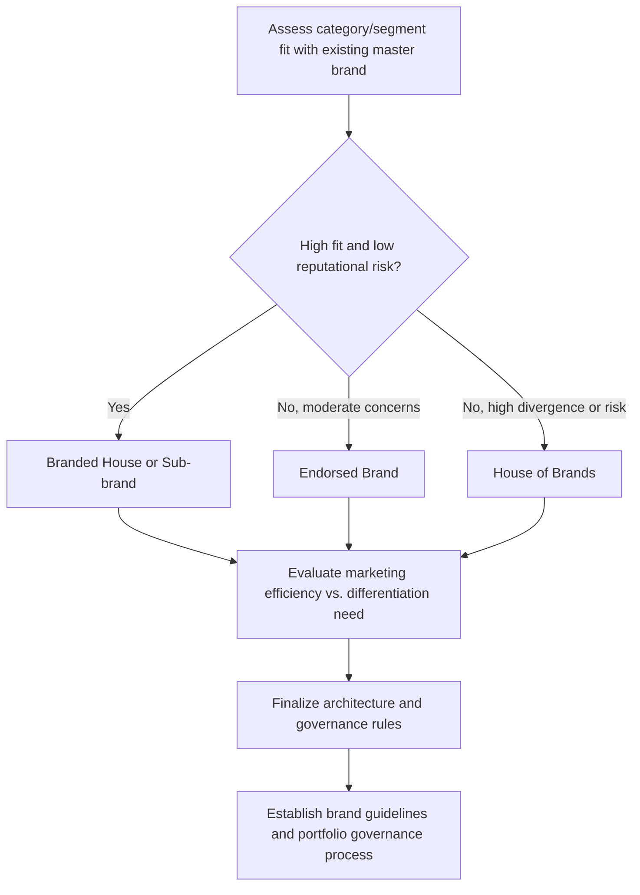

## Product Line and Brand Architecture Decisions

### Overview

Product line strategy and brand architecture together define how a company organizes its portfolio of offerings and the brand names attached to them. **Product line strategy** concerns decisions about the breadth, depth, and consistency of related products a company offers within a category. **Brand architecture** concerns the higher-level structural decision of how brand names relate to one another across the portfolio — whether products share a single master brand, operate under distinct independent names, or some hybrid structure. These decisions jointly determine how efficiently a company can grow its offering set while managing brand equity, consumer clarity, and internal complexity.

### Product Line Strategy

#### Product Mix Dimensions

A company's full product offering (the **product mix** or product portfolio) can be described along four dimensions, foundational to product line planning (Kotler):

| Dimension | Definition |
| --- | --- |
| Width | Number of distinct product lines the company carries |
| Length | Total number of items across all product lines |
| Depth | Number of variants offered within a given product line (sizes, flavors, models) |
| Consistency | Degree to which lines are related in end use, production requirements, distribution channels, or other ways |

**Key Points**

- These four dimensions provide the basic vocabulary for describing and comparing product portfolio strategies, and each dimension carries distinct strategic trade-offs — width increases market coverage but raises coordination complexity; depth increases market coverage within a category but raises cannibalization and inventory-management risk

#### Line Stretching and Line Filling

- **Line stretching** — extending a product line beyond its current range, either *downward* (adding lower-priced/lower-tier items, risking dilution of the line's established quality positioning), *upward* (adding higher-priced/premium items, risking credibility challenges if the brand lacks prestige association), or *two-way* (stretching in both directions simultaneously from an established mid-market position)
- **Line filling** — adding additional items within the current range of the line (rather than extending beyond it), typically to fill a gap that leaves room for competitor entry, utilize excess production capacity, or capture incremental demand from underserved sub-segments

**Key Points**

- Downward line stretching carries a well-documented risk: the lower-priced/lower-quality addition can damage perceived quality of the entire line if consumers cannot clearly distinguish the new lower-tier item from the established higher-tier offering — a dynamic closely related to the dilution risk discussed in brand extension strategy
- Upward line stretching faces a credibility challenge in the opposite direction: established mass-market or budget associations can undermine consumer acceptance of a premium addition, since accumulated brand associations resist rapid repositioning
- Line filling carries **cannibalization risk** — a new item within the existing range may substitute for sales of an existing item rather than generating incremental demand, requiring careful assessment of whether the gap being filled represents genuine unmet demand or simply fragments existing demand across more SKUs

#### Line Pruning

Periodic **line pruning** — discontinuing underperforming items — is necessary to manage production/inventory complexity and marketing resource allocation, typically guided by sales volume, profitability, and strategic role assessment (some low-volume items may be retained deliberately for their role in completing the perceived range or serving a loyal niche segment, rather than judged on volume/profitability alone).

### Brand Architecture: Core Structural Models

Brand architecture exists on a spectrum, most commonly represented by two poles with hybrid structures in between, a framework closely associated with Aaker and Joachimsthaler's work on brand relationship spectrums:

| Architecture Type | Structure | Degree of Master Brand Visibility |
| --- | --- | --- |
| Branded House | Single master brand applied consistently across the entire portfolio | Maximum — master brand is dominant and consistent everywhere |
| Sub-branding | Master brand combined with a distinct sub-brand name/identity for a specific line or product | High — master brand remains prominent, sub-brand adds differentiation |
| Endorsed Branding | Distinct product/business brand with the master brand playing a visible but secondary "endorser" role | Moderate — master brand is present but subordinate to the product-level brand |
| House of Brands | Fully independent brand names across the portfolio, with minimal or no visible connection to a parent company | Minimal to none — parent company relationship is typically not consumer-facing |

**Key Points**

- The choice along this spectrum is fundamentally a trade-off between **equity leverage efficiency** (branded house maximizes reuse of a single brand's accumulated equity, awareness, and marketing efficiency) and **risk isolation / positioning flexibility** (house of brands isolates each brand's risk and allows precise, unconstrained positioning for each individual offering, since no shared brand identity constrains messaging or quality perception across lines)
- This spectrum directly parallels the brand extension dilution-risk mitigation strategies covered separately — brand architecture is, in effect, the portfolio-wide, standing version of the same case-by-case decision made for individual extensions

### Factors Driving Brand Architecture Choice

| Factor | Implication for Architecture Choice |
| --- | --- |
| Cross-category fit/coherence | High fit across the portfolio favors branded house; low fit across disparate categories favors house of brands |
| Target segment overlap or divergence | Overlapping segments favor a shared master brand; sharply divergent segments (e.g., luxury vs. budget tiers) favor separation to avoid cross-contamination of positioning |
| Risk tolerance for reputational contagion | Low risk tolerance (e.g., categories with elevated safety, regulatory, or reputational sensitivity) favors house of brands or endorsed branding to contain potential damage |
| Marketing resource efficiency goals | Resource-constrained organizations favor branded house/sub-branding to maximize reuse of marketing investment and awareness |
| M&A and acquisition history | Acquired brands with strong existing equity are frequently retained as house-of-brands entries rather than being absorbed into the acquirer's master brand, to preserve acquired equity value |
| Price/quality tier separation needs | Companies operating across sharply different price/quality tiers frequently use house of brands or endorsed branding to prevent tier associations from bleeding across the portfolio |

**Example**

A company operating both a premium, design-forward furniture line and a budget flat-pack furniture line would typically favor a house-of-brands or at minimum a strongly differentiated sub-branding approach, since sharing a single master brand risks the budget line's price/quality associations bleeding backward onto the premium line's positioning (and vice versa, with the premium line's higher price potentially deterring budget-segment consumers who assume the whole company operates at that price tier).

### Hybrid and Endorsed Structures in Practice

- **Endorsed branding** is frequently used as a middle-ground solution when a company wants a new or acquired brand to benefit from some parent credibility transfer while retaining distinct positioning flexibility and limiting full reputational entanglement — the parent's endorsement role can range from prominent (e.g., "by [Parent Company]" featured clearly) to subtle (small logo placement)
- **Sub-branding** is common when a company wants to signal a genuinely differentiated line (different quality tier, target segment, or use case) while still fully leveraging master-brand awareness and trust — the sub-brand name typically functions as a *modifier* rather than a fully independent identity
- [Inference] Many large consumer goods and technology companies operate a genuinely hybrid portfolio — some product lines under a branded-house structure, others under sub-branding, and select acquired or strategically distinct lines under a house-of-brands structure simultaneously — meaning brand architecture is frequently decided at the individual line/business-unit level within a single company rather than as one uniform company-wide policy

### Brand Architecture Decision Process

### Governance and Ongoing Management

**Key Points**

- Brand architecture is not a one-time decision — portfolios evolve through new product launches, acquisitions, and category expansion, requiring periodic architecture review to ensure the structure still matches current fit, risk, and efficiency considerations
- Clear governance (brand guidelines specifying which new products/lines default to which architecture position, and under what conditions exceptions are considered) prevents ad hoc, inconsistent architecture decisions that can gradually erode overall portfolio clarity
- Architecture decisions have direct implications for organizational structure as well — house-of-brands portfolios often correspond to more autonomous business-unit management structures, while branded-house portfolios typically require more centralized brand governance to maintain consistency

### Common Pitfalls

- **Defaulting to branded house for efficiency without assessing fit**: applying the master brand to a poorly-fitting new category purely to save marketing cost, risking the same dilution dynamics documented in brand extension strategy
- **Under-leveraging equity via unnecessary house-of-brands fragmentation**: creating entirely new brand names for closely related, well-fitting extensions when a sub-brand or branded-house approach would have captured meaningful equity-transfer efficiency at lower cost
- **Inconsistent architecture application across the portfolio without clear governance rationale**: ad hoc architecture decisions made line-by-line without documented criteria produce a confusing, difficult-to-manage portfolio structure over time
- **Neglecting periodic architecture review**: treating brand architecture as permanently fixed despite portfolio evolution through acquisition, category expansion, or shifting competitive dynamics that may warrant restructuring

**Next Steps**

- Map the current product portfolio against the width/length/depth/consistency framework to identify structural gaps or overextension
- Assess each product line's category fit, target segment overlap, and reputational risk profile to determine appropriate positioning along the brand architecture spectrum
- Establish documented brand architecture governance criteria to guide future launch and acquisition integration decisions
- Schedule periodic (e.g., annual or post-acquisition) brand architecture reviews to ensure the structure remains aligned with portfolio evolution

**Related Topics**

- Brand Extensions and Dilution Risk
- Co-Branding and Ingredient Branding
- Brand Equity Models
- Positioning Strategy and Perceptual Mapping
- Product Levels and the Augmented Product
- Mergers, Acquisitions, and Brand Integration Strategy
- Cannibalization Analysis in Product Portfolio Management