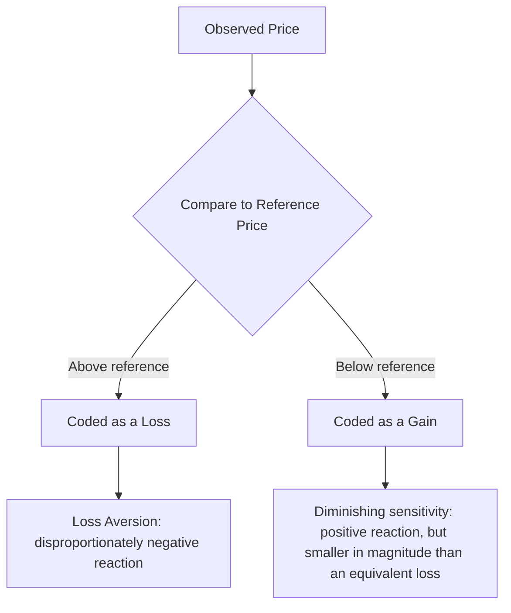

## Reference Prices and Price Perception

### Overview

Reference price theory addresses a foundational insight in behavioral pricing: consumers rarely evaluate a price in absolute isolation. Instead, they judge an observed price against an internally or externally held **reference price** — a comparison standard that determines whether the price is perceived as a good deal, fair, or excessive. This reframes pricing strategy from a purely economic exercise (what price maximizes revenue given a demand curve) into a psychological one (what price, relative to the consumer's reference point, produces a favorable value judgment). The theory draws heavily on adaptation-level theory and, subsequently, prospect theory (Kahneman & Tversky) to explain why identical absolute prices can produce very different consumer responses depending on context.

### Internal vs. External Reference Prices

| Type | Definition | Source |
| --- | --- | --- |
| Internal reference price | A price standard stored in the consumer's memory, formed through past purchase experience, general price knowledge, or expectations | Prior purchases, general category price familiarity, "fair price" beliefs |
| External reference price | A price standard provided directly within the purchase environment at the point of decision | Manufacturer's suggested retail price (MSRP), "was/now" pricing, comparative shelf pricing, competitor price display |

**Key Points**

- Internal reference prices are not static, precisely-remembered figures — consumers typically hold an imprecise range or "latitude of acceptance" around a central tendency rather than a single exact recalled price, meaning small deviations from the internal reference often go unnoticed while larger ones trigger evaluation
- External reference prices are frequently used deliberately by retailers/marketers (e.g., displaying a crossed-out "regular price" beside a "sale price") precisely because they can shift or anchor the consumer's evaluative standard within the purchase environment itself, independent of what internal reference the consumer may have otherwise held
- [Inference] When both an internal reference price and a strongly presented external reference price are available, research generally suggests the external reference price can meaningfully influence the evaluation, though the internal reference is not simply overridden — the two interact, with the relative influence depending on the strength/confidence of the consumer's internal reference and the credibility of the external cue

### Assimilation-Contrast and Adaptation-Level Theory

Reference price theory is grounded in **adaptation-level theory**, which holds that consumers judge new stimuli (including prices) relative to an adapted standard formed by prior exposure, rather than in absolute terms. This produces two related effects:

- **Assimilation effect**: prices reasonably close to the reference price tend to be perceived as similar to (assimilated toward) the reference point, reducing the perceived magnitude of small deviations
- **Contrast effect**: prices far outside the latitude of acceptance around the reference price are perceived as more extreme than their absolute numerical distance alone would suggest, amplifying perceived deviation

**Key Points**

- These effects explain why moderate price increases are often absorbed with limited consumer reaction (assimilated toward the existing reference), while price changes exceeding a certain threshold trigger disproportionately negative reactions (contrast) — pricing strategy that accounts for these thresholds can sequence price changes more gradually to remain within the assimilation range

### Prospect Theory and the Gain-Loss Asymmetry in Pricing

Building on Kahneman and Tversky's prospect theory, reference price research applies the concept of **loss aversion** directly to price perception: a price above the reference point is coded psychologically as a *loss* relative to the reference, while a price below the reference point is coded as a *gain*. Because losses are weighted more heavily than equivalent-sized gains (a core prospect theory finding), consumers react more strongly and negatively to price increases than they react positively to equivalent price decreases.

**Key Points**

- This gain-loss asymmetry explains well-documented pricing phenomena: consumer backlash to price increases tends to be more severe and more durable than the goodwill generated by equivalent price decreases, creating asymmetric risk in pricing strategy
- The **value function** underlying prospect theory is concave for gains and convex for losses, and steeper for losses than gains — meaning the psychological impact of a price change diminishes at the margin (a $10 increase from a $10 reference feels larger than a further $10 increase from a $100 reference) but losses retain their steeper negative weighting throughout

### Fairness Perception and Reference Prices

Reference prices are closely tied to consumer judgments of **price fairness**, most influentially studied via Kahneman, Knetsch, and Thaler's "fairness as a constraint on profit-seeking" research. Their findings indicate that price increases are judged as more acceptable when justified by a corresponding cost increase to the seller (e.g., raw material cost increases passed through) than when perceived as pure profit-driven exploitation of a shift in demand or bargaining position (e.g., raising prices during a shortage-driven demand spike absent any cost justification).

**Key Points**

- Fairness perception operates as a reference-price-adjacent but conceptually distinct construct: a price can be perceived as unfair even when it does not exceed a strict numerical reference point, if the *justification* for the price is perceived as illegitimate
- This has direct implications for price-increase communication strategy — increases framed around transparent, verifiable cost drivers face substantially less fairness backlash than unexplained increases, even when the numerical magnitude is identical

### Price Presentation Tactics Leveraging Reference Price Effects

| Tactic | Mechanism |
| --- | --- |
| "Was/Now" pricing | Explicitly presents a higher external reference price alongside the actual selling price, framing the current price as a gain relative to that reference |
| Manufacturer's Suggested Retail Price (MSRP) display | Establishes an external reference price ceiling against which the actual retail price appears favorable |
| Price bundling | Obscures individual component reference prices by presenting a single bundled price, reducing the consumer's ability to apply prior per-item reference prices |
| Decoy pricing (asymmetric dominance) | Introduces a strategically inferior third option to shift the perceived reference point and make a target option appear more favorable by comparison |
| Price tiering / good-better-best structures | Uses adjacent tier prices as mutual reference points, often making a "better" middle tier appear as the reasonable, moderate choice relative to both extremes |

**Example**

A retailer presenting a product at $79 with a crossed-out "$120" reference price is deliberately establishing an external reference point substantially above the actual selling price, coding the $79 purchase as a psychological gain (per prospect theory) even if $79 is close to or above the consumer's own internal reference price for the category, provided the external cue is perceived as credible.

### Reference Price Erosion and Sale Price Dependency

**Key Points**

- Frequent or aggressive promotional pricing can gradually shift a consumer's internal reference price downward toward the promotional price rather than the regular price, a well-documented risk in categories with high promotional frequency — over time, the "regular" price becomes perceived as the loss-coded anchor and the "sale" price becomes the new internal reference, undermining full-price sales
- [Inference] This dynamic creates a structural pricing trap in categories that rely heavily on promotional cadence: once a substantial portion of the customer base has internalized the promotional price as their reference, returning to consistent full pricing produces a disproportionately negative (loss-coded) reaction even if the "full" price was the originally intended standard price all along

### Managerial Implications

- **Sequencing price changes**: gradual, incremental price adjustments that remain within the consumer's latitude of acceptance around the existing reference price are more likely to be assimilated with limited backlash than large, abrupt increases that trigger contrast effects
- **Justification framing for increases**: communicating price increases with transparent, verifiable cost-driver explanations reduces fairness-based backlash relative to unexplained increases, independent of the numerical magnitude involved
- **Promotional cadence discipline**: managing the frequency and depth of promotional pricing deliberately, to avoid training the customer base's internal reference price downward and eroding full-price realization over time
- **External reference price credibility management**: "was/now" and MSRP-based external reference tactics carry regulatory and reputational risk if the reference price is not genuine or was never a real prevailing price — several jurisdictions have specific consumer protection regulations governing the legitimacy of reference price claims in advertising [Unverified — regulatory specifics vary substantially by jurisdiction; verify against applicable local advertising and consumer protection law before relying on external reference price tactics]

### Common Pitfalls

- **Ignoring the gain-loss asymmetry when planning price changes**: assuming a price increase and an equivalent price decrease will produce symmetric consumer reactions, when loss aversion predicts and empirical research confirms a stronger negative reaction to increases than the positive reaction to equivalent decreases
- **Overusing promotional pricing without accounting for reference price erosion**: pursuing short-term promotional lift without considering the longer-term effect on the customer base's internalized reference price and resulting full-price sales resistance
- **Using non-credible external reference prices**: presenting inflated or rarely-charged "regular" prices as an external reference point risks both regulatory exposure and consumer skepticism if the reference is perceived (or proven) to be artificial
- **Treating fairness perception as identical to reference price comparison**: assuming a price increase will be accepted purely because it remains within a numerical latitude of acceptance, while neglecting the separate and significant role of perceived justification/legitimacy in fairness judgments

**Next Steps**

- Assess the current promotional cadence and depth for signs of internal reference price erosion (e.g., declining full-price conversion rates, increased price-sensitivity at regular pricing)
- Develop transparent cost-driver communication templates for anticipated price increases to mitigate fairness-based backlash
- Audit any external reference price claims ("was/now," MSRP displays) for regulatory compliance and factual accuracy in the relevant jurisdiction
- Sequence planned price increases incrementally where feasible, informed by category-specific latitude-of-acceptance research

**Related Topics**

- Prospect Theory and Loss Aversion in Consumer Decision-Making
- Price Bundling and Decoy Pricing Strategies
- Perceived Quality and Extrinsic Quality Cues
- Psychological Pricing (Charm Pricing, Price Endings)
- Price Fairness and Ethical Pricing Perception
- Anchoring and Adjustment Heuristic
- Dynamic and Surge Pricing Psychology