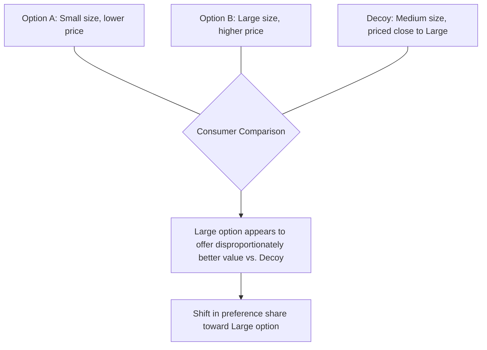

## Psychological Pricing Tactics

### Overview

Psychological pricing tactics are specific price-presentation techniques designed to influence consumer perception of value, fairness, and magnitude independent of the underlying economic price itself. Where reference price theory explains the broader cognitive mechanism of price comparison, psychological pricing tactics are the concrete, tactical applications marketers use to shape how a given price is encoded and evaluated at the moment of decision. These tactics operate primarily through numerical cognition effects, attention allocation, and heuristic processing rather than through deliberate cost-benefit calculation.

### Charm Pricing and Left-Digit Bias

#### Definition and Mechanism

**Charm pricing** refers to setting prices just below a round number (e.g., $9.99 instead of $10.00). The dominant explanation for its effectiveness is the **left-digit bias**: consumers process multi-digit numbers non-holistically, anchoring disproportionately on the leftmost digit rather than performing full, precise numerical comparison. Under this account, $9.99 is encoded as closer to "$9" than to "$10," producing a perceived price gap larger than the actual one-cent difference.

**Key Points**

- Left-digit bias is distinct from a simple rounding-down heuristic — it specifically predicts that the effect is strongest at digit-boundary crossings (e.g., $9.99 vs. $10.00, a leftmost-digit change from 9 to 10) and comparatively weaker for equivalent absolute-cent reductions that do not cross a leftmost-digit boundary (e.g., $9.99 vs. $9.98)
- [Inference] While charm pricing effects are well-replicated in retail and behavioral pricing research, the magnitude of the effect varies by category, price level, and consumer numeracy/attentiveness, and should not be treated as a fixed universal percentage lift; category-specific testing is generally recommended before broad application
- Charm pricing also carries secondary signaling connotations: 9-ending prices are strongly associated in consumer perception with discount/value positioning, while round-number prices (e.g., $10.00, $50.00) are more commonly associated with premium or prestige positioning — meaning charm pricing selection has positioning implications beyond the numerical perception effect alone

#### Round Number Pricing as a Prestige Signal

Conversely, **round-number pricing** (whole-dollar or otherwise "clean" prices) is frequently used deliberately in premium and luxury contexts, where the absence of a charm-pricing ending signals confidence, simplicity, and non-discount positioning. This reflects a broader principle: psychological pricing tactics are not universally "more effective" in a single direction — the appropriate tactic depends on the desired positioning signal, not solely on maximizing perceived discount magnitude.

### Price Ending Effects Beyond the 9

| Price Ending | Common Association | Typical Use Case |
| --- | --- | --- |
| .99 / .95 | Value, discount, bargain | Mass-market retail, promotional pricing |
| .00 (round number) | Premium, confidence, simplicity | Luxury goods, prestige positioning |
| .49 / .89 (non-9, non-round) | Moderate, less strongly coded than .99 | Mid-tier positioning avoiding strong discount or premium signaling |

**Key Points**

- The specific digit chosen for a non-round price ending carries its own accumulated cultural association within a market, meaning price-ending selection should be informed by category norms rather than treated as an arbitrary implementation detail

### Price Framing and Partitioning

#### Price Partitioning

**Price partitioning** involves separating a total price into a base price plus one or more surcharges (shipping, taxes, service fees, resort fees) rather than presenting a single all-inclusive figure. Research on partitioned pricing generally finds that consumers tend to underweight the surcharge component relative to the base price when evaluating overall cost, particularly when the surcharge is presented later in the purchase process or in smaller/less prominent typography.

**Key Points**

- The effectiveness of price partitioning is contingent on when and how transparently the surcharge is disclosed — surcharges revealed only at a late stage of the purchase process (sometimes termed "drip pricing") can generate stronger short-term conversion at the base-price stage but carry elevated risk of consumer frustration, cart abandonment at the final stage, and regulatory scrutiny in several jurisdictions
- [Unverified — regulatory specifics vary by jurisdiction] A number of consumer protection regimes have introduced or strengthened "all-in" or "drip pricing" disclosure requirements in recent years; applicability and specific requirements should be verified against current local regulation before designing a partitioned pricing strategy

#### Temporal Reframing

**Temporal reframing** presents a price in smaller, more frequent units (e.g., "$2 a day" rather than "$730 a year") to reduce the perceived magnitude of the total cost, leveraging the same non-holistic numerical processing tendencies underlying left-digit bias, applied to time-unit framing rather than digit position.

**Example**

A subscription service pricing itself at "less than a cup of coffee per day" reframes an annual cost (which might appear substantial as a single lump sum) into a smaller, more easily-dismissed daily increment, reducing perceived cost salience without altering the actual total price paid.

### Price Bundling

**Price bundling** combines multiple products or services into a single package price, typically priced below the sum of the components' individual prices.

| Bundling Type | Description |
| --- | --- |
| Pure bundling | Products are only available as a bundle, not sold individually |
| Mixed bundling | Products are available both as a bundle and individually, with the bundle offering a price advantage |
| Price bundling (single price) | A single combined price is presented for multiple items, obscuring individual component prices |

**Key Points**

- Bundling reduces the consumer's ability to apply individual internal reference prices to each component, since the components are evaluated as a single aggregate value proposition rather than being compared item-by-item against category norms
- Mixed bundling generally provides more effective price discrimination than pure bundling, since it retains an option for consumers who value only a subset of the bundled components, while still capturing bundle-seeking consumers at the bundle price point
- [Inference] Bundling is generally more effective for products with negatively correlated individual valuations across the consumer base (i.e., different consumers value different components most highly), since this allows the bundle to capture aggregate willingness-to-pay more efficiently across a heterogeneous customer base than uniform individual pricing could

### Decoy Pricing and Asymmetric Dominance

The **decoy effect** (attraction effect) introduces a deliberately inferior third pricing option specifically to make one of the original two options appear more attractive by comparison, without that inferior option being intended to actually sell in meaningful volume.

**Key Points**

- The decoy must be **asymmetrically dominated** — inferior to the target option on all relevant dimensions (e.g., smaller and similarly priced) but only partially comparable to the non-target option, so its introduction shifts the choice share specifically toward the intended target rather than uniformly across all options
- This tactic is closely related to but distinct from good-better-best tiering (below) — a decoy is specifically engineered to be an unattractive standalone choice, whereas good-better-best tiers are each intended to be independently viable options for different segments

### Good-Better-Best Tiering

Presenting three (or more) price/feature tiers leverages the tendency for consumers to avoid extreme options (**extremeness aversion** / compromise effect) and gravitate toward a perceived moderate middle option, particularly under conditions of uncertainty about which tier best fits their needs.

**Key Points**

- The middle tier in a three-tier structure often benefits from a **compromise effect** — appearing as the "reasonable" choice precisely because it avoids the perceived risk of either the cheapest (possibly inadequate) or most expensive (possibly excessive) options
- Strategic tier design frequently involves deliberately pricing or featuring the top tier partly to make the middle tier appear more reasonable by comparison, a related but distinct mechanism from the decoy effect, since all tiers here are typically intended to generate genuine sales rather than being pure decoys

### Odd-Even Pricing and Precision Cues

**Precise, non-round prices** (e.g., $47.63 rather than $50) can signal calculated, cost-based, "fair" pricing in certain contexts (surge/dynamic pricing, algorithmically-determined prices), leveraging a **precision heuristic**: consumers may infer that a highly precise number reflects careful calculation rather than an arbitrary or opportunistically rounded figure. [Inference] This effect is more established in negotiation and real-estate pricing research than in general retail psychological pricing literature, and its applicability to broader consumer retail contexts should be treated as a plausible but less extensively validated extension of the underlying precision-heuristic finding.

### Summary Table of Tactics and Mechanisms

| Tactic | Underlying Psychological Mechanism |
| --- | --- |
| Charm pricing (.99 endings) | Left-digit bias, non-holistic number processing |
| Round-number pricing | Prestige signaling, absence of discount association |
| Price partitioning | Underweighting of secondary/surcharge components |
| Temporal reframing | Reduced magnitude salience via smaller time-unit framing |
| Price bundling | Reduced applicability of item-level reference prices |
| Decoy pricing | Asymmetric dominance shifting comparative attractiveness |
| Good-better-best tiering | Extremeness aversion / compromise effect |
| Precision pricing | Precision heuristic signaling calculated, justified pricing |

### Managerial and Ethical Considerations

**Key Points**

- **Regulatory exposure**: several psychological pricing tactics, particularly drip pricing/partitioning and reference price claims, intersect with consumer protection regulation in many jurisdictions; tactics should be reviewed against current local law rather than assumed universally permissible
- **Trust erosion risk**: tactics perceived by consumers as manipulative once recognized (e.g., late-disclosed surcharges, decoys perceived as obvious) can generate disproportionate trust and brand-attachment damage relative to their short-term conversion benefit, echoing the fairness-perception dynamics discussed in reference price theory
- **Category and positioning fit**: tactic selection should align with intended brand positioning (charm pricing generally undermines premium positioning; round pricing generally undermines discount positioning), not be applied uniformly across a portfolio without regard to positioning consistency

### Common Pitfalls

- **Applying charm pricing indiscriminately across a premium-positioned portfolio**: undermining prestige positioning by introducing discount-associated price endings inconsistent with the brand's broader identity
- **Over-partitioning to the point of perceived deception**: excessive or late-disclosed surcharges that generate cart abandonment or regulatory complaint risk outweighing the short-term base-price conversion benefit
- **Using decoys that are too obviously non-viable**: an implausible or clearly non-competitive decoy can trigger consumer skepticism about the pricing structure's legitimacy, undermining rather than reinforcing the intended comparative effect
- **Assuming universal effect magnitudes**: treating psychological pricing effects (left-digit bias, decoy effects, bundling lift) as fixed, universally-sized effects rather than validating magnitude within the specific category and customer base through testing

**Next Steps**

- A/B test charm vs. round-number pricing within the specific category and price tier before broad rollout, given category-dependent effect-size variation
- Audit current pricing disclosure practices (partitioning, surcharges) against applicable consumer protection regulation in relevant markets
- Evaluate current tiering structure for compromise-effect design opportunities, ensuring the middle tier is positioned to capture the extremeness-averse segment
- Assess overall psychological pricing tactic selection for consistency with the brand's broader positioning strategy (premium vs. value)

**Related Topics**

- Reference Prices and Price Perception
- Prospect Theory and Loss Aversion in Consumer Decision-Making
- Price Fairness and Ethical Pricing Perception
- Anchoring and Adjustment Heuristic
- Choice Architecture and Nudge Theory
- Dynamic and Surge Pricing Psychology
- Perceived Quality and Extrinsic Quality Cues