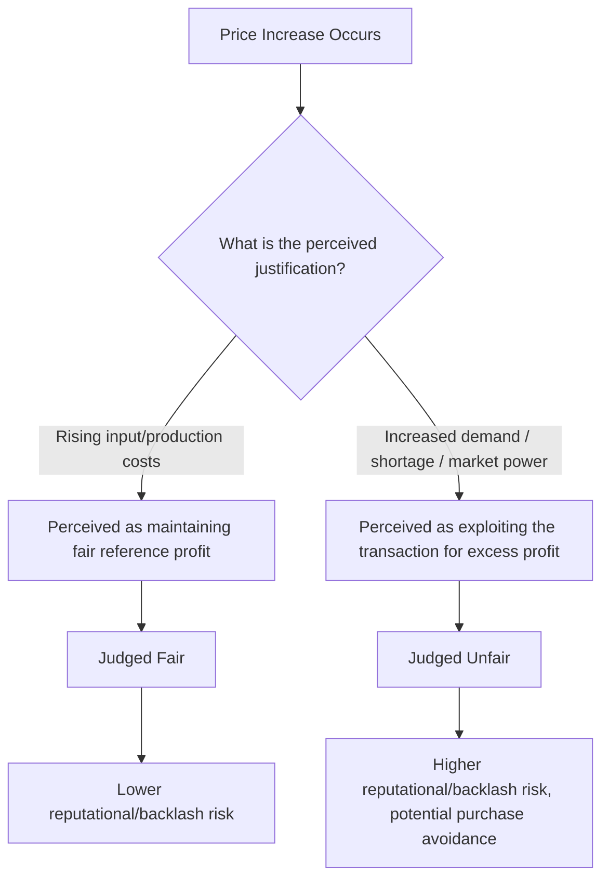
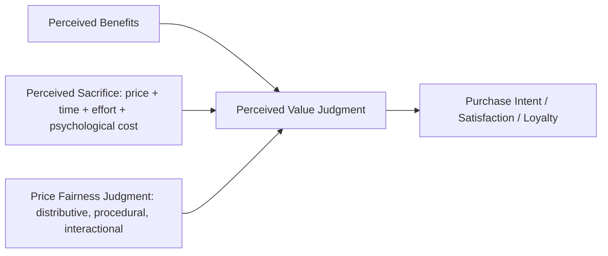

## Price Fairness and Perceived Value

### Overview

Price fairness and perceived value are closely related but conceptually distinct constructs governing how consumers evaluate whether a given price is acceptable. **Price fairness** concerns judgments about whether the *process* and *outcome* of price-setting are legitimate, reasonable, and non-exploitative — a comparative, often moralized evaluation. **Perceived value** is the broader trade-off judgment between what the consumer receives (benefits) and what they must give up (price and other costs) — a construct that fairness perception feeds into but does not fully determine. This entry builds directly on reference price theory and psychological pricing tactics, focusing specifically on the equity/legitimacy dimension of price judgment and its downstream effect on overall value perception.

### The Dual Entitlement Principle

The foundational framework in price fairness research comes from Kahneman, Knetsch, and Thaler's dual entitlement principle (1986), which holds that both buyers and sellers are seen as entitled to a reasonable outcome, and that price changes are judged fair or unfair based on whether they preserve or violate this dual entitlement — not based on the resulting absolute price level alone.

**Key Points**

- A firm is generally judged entitled to maintain its **reference profit** (the profit level associated with a prior reference transaction), and price increases that merely preserve this reference profit in the face of rising costs are typically judged as fair
- A firm is generally judged as acting unfairly when it raises prices to increase profit beyond the reference level, particularly when the justification is an increase in market power or demand (e.g., a shortage) rather than an increase in the firm's own costs
- This produces the well-documented empirical finding that cost-justified price increases are perceived as substantially fairer than identical-magnitude, demand-driven price increases, even when the final price paid by the consumer is numerically identical in both cases

### Cost-Based vs. Demand-Based Price Increase Perception

**Example**

A hardware store raising the price of snow shovels immediately following a snowstorm (a demand-driven justification) is a canonical example used in the original Kahneman, Knetsch, and Thaler research to illustrate strong unfairness perception, even though the same numerical price increase framed as a response to a documented rise in the store's own wholesale shovel costs would typically be judged considerably more acceptable.

### Distributive, Procedural, and Interactional Fairness

Broader organizational justice theory, applied to pricing contexts, identifies three fairness dimensions relevant to consumer price judgments:

| Fairness Dimension | Description in Pricing Context |
| --- | --- |
| Distributive fairness | Whether the price itself, as an outcome, is perceived as reasonable relative to value received and to what others pay |
| Procedural fairness | Whether the process used to set or communicate the price is perceived as transparent, consistent, and non-arbitrary |
| Interactional fairness | Whether the manner in which the price/price change is communicated to the consumer is respectful, honest, and adequately explained |

**Key Points**

- Personalized or dynamic pricing (different consumers paying different prices for functionally identical offerings) raises distinct procedural fairness concerns, since consumers who become aware that others paid less for the same product/service — absent an understood and accepted justification (e.g., loyalty program tier, advance-purchase discount) — often perceive the practice as a violation of procedural fairness independent of whether the price they personally paid was itself objectively reasonable
- Interactional fairness explains why the *manner* of price-increase communication (advance notice, clear explanation, respectful tone) meaningfully affects consumer reaction even when the substantive fairness of the price itself (distributive/procedural) is held constant

### Perceived Value: The Benefit-Cost Trade-off

Perceived value is most commonly modeled in marketing research (e.g., Zeithaml's foundational value framework) as a ratio or trade-off between perceived benefits received and perceived sacrifices made, where "sacrifice" encompasses more than the monetary price alone.

#### Components of Perceived Sacrifice

| Sacrifice Type | Description |
| --- | --- |
| Monetary price | The direct financial cost of the transaction |
| Time cost | Time invested in searching, purchasing, or learning to use the product |
| Effort/cognitive cost | Mental effort required to evaluate options or use the product |
| Psychological cost | Anxiety, risk, or post-purchase regret potential associated with the purchase |

**Key Points**

- Perceived value is not simply "quality minus price" — it is a broader trade-off incorporating all forms of sacrifice, meaning value can be improved either by increasing perceived benefit or by reducing any category of sacrifice (including non-monetary ones), a distinction with direct implications for value-improvement strategy beyond pure price reduction
- Zeithaml's research identifies multiple consumer conceptualizations of "value," ranging from a narrow "value is low price" view to a broader "value is what I get for what I give" trade-off view, with the broader trade-off conceptualization generally treated as the more complete and widely applicable model in subsequent marketing research

### Fairness as an Input to Perceived Value

Fairness perception functions as a distinct input layer feeding into the overall value judgment, separate from the raw benefit-cost calculation:

**Key Points**

- A price can be numerically favorable relative to benefits received (high raw value by a simple benefit/cost calculation) yet still be judged unfavorably overall if the price-setting process is perceived as unfair — fairness perception can suppress or amplify the effect of an otherwise favorable value calculation
- Conversely, a price that is objectively less favorable on a pure benefit-cost basis can be more readily accepted if the associated fairness judgment is strongly positive (e.g., a well-justified, transparently communicated premium price)

### Contexts With Elevated Fairness Sensitivity

- **Dynamic and surge pricing**: real-time demand-based price fluctuation (ride-sharing, event ticketing, airline pricing) is a frequent trigger for fairness scrutiny, particularly when price increases coincide with visible external hardship or emergency conditions
- **Personalized/algorithmic pricing**: pricing that varies by individual consumer characteristics (browsing history, device type, geographic location, inferred willingness-to-pay) raises heightened procedural fairness concerns once consumers become aware of price variation among otherwise similar buyers
- **Post-crisis or shortage pricing**: price increases during emergencies, natural disasters, or supply shortages are subject to both strong consumer fairness scrutiny and, in a number of jurisdictions, specific "price gouging" regulation [Unverified — price gouging regulation varies substantially by jurisdiction and by declared emergency status; verify applicable local law before setting pricing policy during shortage or emergency conditions]
- **Subscription and contract renewal pricing**: price increases applied to existing subscribers, particularly without clear justification or advance notice, are a frequently cited driver of subscription churn and public fairness criticism

### Managerial Strategies for Managing Fairness Perception

**Key Points**

- **Cost-driver transparency**: communicating price increases with specific, verifiable references to underlying cost changes (materials, logistics, labor) rather than vague or unexplained increases substantially improves fairness perception, consistent with the dual entitlement framework
- **Advance notice and communication tone**: providing adequate advance notice of price changes and communicating with a respectful, explanatory tone addresses the interactional fairness dimension independent of the substantive price change itself
- **Consistency and non-arbitrariness**: applying pricing policies consistently across similar customer segments and transaction contexts supports procedural fairness; inconsistent or seemingly arbitrary price variation (absent a clearly understood and accepted rationale) undermines it
- **Value-sacrifice trade-off management**: when raising monetary price is fairness-risky (e.g., during a demand spike), firms may instead manage the broader value equation by adjusting non-monetary elements (e.g., service level, bundled inclusions) rather than the price itself, avoiding the specific fairness backlash associated with direct demand-driven price increases

### Common Pitfalls

- **Justifying price increases with demand rather than cost rationale**: framing or allowing price increases to be perceived as opportunistic responses to increased demand or reduced competition, rather than cost-based necessity, even when the actual underlying driver may be mixed
- **Opaque personalized/dynamic pricing without consumer-facing rationale**: implementing algorithmic or personalized pricing without any consumer-facing explanation of the basis for price variation, increasing the risk of procedural fairness backlash if variation becomes visible
- **Treating perceived value as synonymous with low price**: focusing exclusively on price reduction as the value-improvement lever while neglecting non-monetary sacrifice reduction (time, effort, psychological risk) or benefit enhancement opportunities
- **Underestimating interactional fairness**: assuming that a substantively fair and well-justified price change will be well-received regardless of communication manner, when abrupt, unexplained, or poorly-timed communication can independently damage fairness perception even for objectively reasonable price changes

**Next Steps**

- Develop a standard cost-driver communication protocol for any planned price increase, ensuring the increase can be credibly linked to verifiable cost changes where applicable
- Audit current dynamic or personalized pricing practices for procedural fairness risk, particularly consumer-facing transparency about the basis for price variation
- Map the full perceived-sacrifice profile (monetary, time, effort, psychological) for the core offering to identify non-price value-improvement opportunities
- Review advance-notice and communication practices for planned price changes against interactional fairness best practices (adequate notice period, respectful and explanatory tone)

**Related Topics**

- Reference Prices and Price Perception
- Psychological Pricing Tactics
- Prospect Theory and Loss Aversion in Consumer Decision-Making
- Dynamic and Surge Pricing Psychology
- Zeithaml's Perceived Value Framework
- Brand Attachment, Trust, and Love
- Customer Loyalty Programs and Retention Psychology