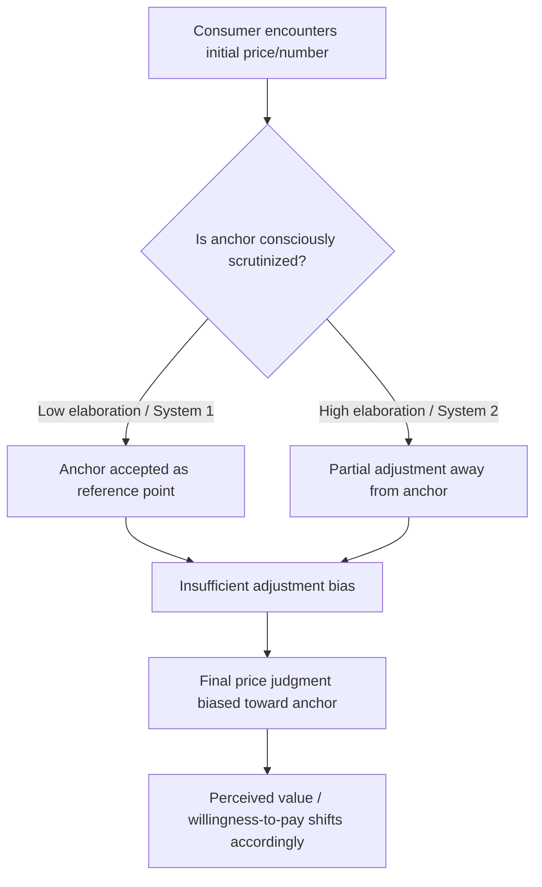

## Anchoring Effects in Price Presentation

### Definition and Theoretical Foundation

Anchoring is a cognitive bias in which an initial piece of numerical information (the "anchor") disproportionately influences subsequent judgments, even when the anchor is arbitrary, irrelevant, or explicitly disclosed as non-diagnostic. In pricing contexts, the first price a consumer encounters — a suggested retail price, a competitor's price, a "was" price, or even an unrelated number — establishes a reference point against which all later prices are evaluated.

The effect was first documented by Amos Tversky and Daniel Kahneman in their 1974 work on judgment heuristics, where subjects asked to estimate quantities (e.g., the percentage of African countries in the UN) were influenced by a randomly spun wheel number shown immediately beforehand. The estimates clustered near the arbitrary anchor, demonstrating that anchoring operates even absent any logical connection between the anchor and the target judgment.

Anchoring is formally situated within **Prospect Theory** (Kahneman & Tversky, 1979), which models decisions as evaluated relative to a reference point rather than in absolute terms. A price is not judged as "high" or "low" in isolation — it is judged as a gain or loss relative to the anchor.

### Psychological Mechanisms

**Key Points**

- **Insufficient adjustment**: Once an anchor is set, people adjust away from it but typically stop too early, leaving the final judgment biased toward the anchor (Tversky & Kahneman's "anchoring-and-adjustment" heuristic).
- **Selective accessibility**: Considering the anchor activates anchor-consistent information in memory, making it easier to retrieve reasons the true value is close to the anchor (Strack & Mussweiler, 1997).
- **Numeric priming**: Even semantically unrelated numbers can anchor judgments, indicating a partly perceptual/associative rather than purely deliberative process.
- **Confirmatory hypothesis testing**: Consumers test "is the price close to the anchor?" rather than "what is the price actually worth?" — a biased search strategy that reinforces the anchor's influence.

[Inference] The relative contribution of insufficient adjustment versus selective accessibility likely varies by consumer expertise and cognitive load, though isolating each mechanism in field pricing settings (as opposed to controlled lab tasks) is difficult.

### Types of Anchors in Price Presentation

#### 1. Manufacturer's Suggested Retail Price (MSRP) / "Was" Price

Displaying a crossed-out higher original price next to a discounted price ($199 ~~$299~~) anchors perceived value at the higher figure, making the sale price seem like a larger gain.

#### 2. Product Line Ordering (Decoy/Extremeness Aversion)

Presenting a premium-tier option first (e.g., a $1,200 "Pro" tier before a $400 "Standard" tier) anchors the price scale high, making mid-tier options appear more reasonable by comparison. This interacts with the **compromise effect**, where consumers gravitate toward a middle option flanked by a more expensive and less expensive alternative.

#### 3. Arbitrary/Incidental Anchors

Research (Ariely, Loewenstein & Prelec's "coherent arbitrariness" studies, 2003) shows that even asking consumers to write down the last two digits of their social security number before bidding on products shifts their subsequent willingness-to-pay in the direction of that number — despite the number being entirely unrelated to the product's value.

#### 4. Self-Generated Anchors

Asking "Would you pay more or less than $50 for this?" before eliciting a specific price estimate anchors the response near $50, a technique used deliberately in contingent valuation and door-in-the-face sales tactics.

#### 5. Digit-Based Anchoring

Prices with more digits (e.g., $1,000 vs. $1,000.00) or expressed precisely (e.g., $9,997 vs. $10,000) can shift perceived precision and anchor value differently — precise numbers are often perceived as more credible/lower than round numbers of similar magnitude (Thomas, Simon & Kadiyali, 2010, on precision effects).

### Anchoring in Multi-Item and Bundle Pricing

**Key Points**

- **Bundle anchor transfer**: When a bundle price is shown alongside individual component prices, the sum of components acts as an anchor, making the bundle discount appear larger.
- **Quantity anchors**: Signage such as "Limit 12 per customer" has been shown (Wansink, Kent & Hoch, 1998) to anchor purchase quantity upward, even though the limit is not a price manipulation per se — it demonstrates the same reference-point mechanism applied to quantity rather than price.
- **Tiered subscription anchoring**: SaaS pricing pages commonly place a high-priced "Enterprise" tier at the rightmost or top position to anchor the perceived value of "Pro" and "Basic" tiers below it.

### Anchoring and the Left-Digit Effect

Closely related to anchoring is the **left-digit effect**, where consumers encode prices predominantly by their leftmost digit(s), treating $3.99 as categorically closer to $3 than to $4, despite the actual numerical distance being negligible (Thomas & Morwitz, 2005). This produces charm pricing effects (e.g., "99-ending" prices) that function as a micro-scale anchoring phenomenon: the leftmost digit anchors magnitude perception, and the trailing digits receive disproportionately less weight.

### Boundary Conditions and Moderators

**Key Points**

- **Anchor plausibility**: Extremely implausible anchors (e.g., a $50,000 "reference price" for a $20 item) can trigger reactance and skepticism, weakening or reversing the effect (Biswas & Burton, 1993).
- **Consumer expertise**: Domain experts show reduced anchoring susceptibility for judgments within their expertise (Wright & Anderson, 1989), though expertise does not eliminate the effect entirely.
- **Processing motivation**: Higher involvement and cognitive elaboration can attenuate anchoring, consistent with dual-process accounts (System 1 heuristic reliance vs. System 2 deliberate correction).
- **Anchor disclosure**: Explicitly telling consumers an anchor is random or irrelevant reduces but does not eliminate the bias — a robustness finding replicated across many anchoring studies.
- **Regulatory exposure**: Reference-price advertising (crossed-out "was" prices) is subject to regulation in several jurisdictions (e.g., FTC guidance in the U.S., and stricter former-price rules in the EU under the Omnibus Directive) requiring the reference price to reflect a genuine prior selling price. [Unverified] Specific enforcement thresholds and lookback periods vary by jurisdiction and change over time; verify current local regulations before implementation.

### Practical Application Framework

#### Example: Anchoring in a SaaS Pricing Page

A three-tier structure ordered Enterprise ($499/mo) → Team ($199/mo) → Starter ($49/mo), read left to right, anchors the visual and cognitive starting point at the highest price. Consumers scanning right encounter each subsequent price as a "discount" relative to the first number seen, increasing the relative attractiveness of the Team tier — often the tier the seller most wants to sell (the classic "decoy/anchor" tier design).

#### Example: Retail Markdown Presentation

Original signage: "$85." Promotional signage: "$85 ~~$120~~ — Save $35 (29%)." The $120 anchor recalibrates the reference point, so $85 is evaluated as a gain of $35 rather than judged against the product's independent market value.

### Process Flow of Anchor-Driven Price Judgment

### Measurement and Experimental Paradigms

**Key Points**

- **Between-subjects anchor manipulation**: Different consumer groups shown different anchors, comparing resulting willingness-to-pay (WTP) or perceived fairness ratings.
- **Becker-DeGroot-Marschak (BDM) mechanism**: An incentive-compatible auction procedure used in academic pricing research to elicit true WTP while testing for anchoring contamination.
- **Field A/B testing**: E-commerce anchor testing (e.g., varying whether a "was" price is shown) measured via conversion rate, average order value, and perceived-discount surveys. [Inference] Field effect sizes for anchoring manipulations are typically smaller and more variable than lab effect sizes, likely due to real-world price familiarity and competitive price-checking behavior that labs do not replicate.

### Ethical and Regulatory Considerations

**Key Points**

- Fabricated or inflated reference prices ("fake original prices") that were never genuinely offered constitute deceptive pricing under most consumer protection frameworks.
- Disclosure requirements increasingly mandate that "was" prices reflect a genuine, sustained prior price (not a price held for only a token period before a "discount").
- Ethical anchoring practice generally distinguishes between: (a) legitimate reference points (genuine previous prices, verifiable competitor prices) and (b) manufactured anchors designed solely to distort the reference point without factual basis.

### Related Topics

- Charm pricing and the left-digit effect
- Decoy effect and the compromise effect in choice architecture
- Reference price theory and adaptation-level theory
- Loss aversion and framing in price communication
- Drip pricing and partitioned pricing
- Price bundling and mixed bundling strategies
- Contingent valuation and willingness-to-pay elicitation methods
- Regulatory frameworks for reference-price advertising (FTC, EU Omnibus Directive)