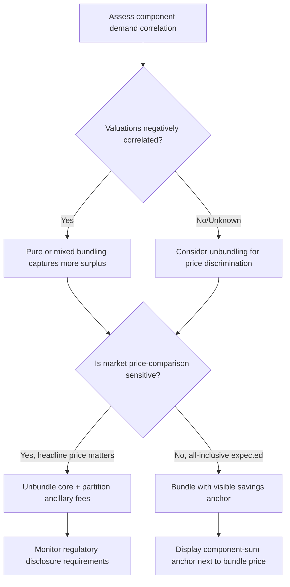

## Bundling, Unbundling, and Price Partitioning

### Definitions

**Bundling** is the practice of selling two or more distinct products or services together as a single package, typically at a combined price lower than the sum of individual prices. **Unbundling** is the reverse — decomposing a previously combined offering into separately priced components. **Price partitioning** (also called partitioned pricing) is the practice of dividing a total price into a base price plus one or more mandatory surcharges (shipping, handling, taxes, fees) that are disclosed separately rather than folded into a single all-inclusive figure.

All three are pricing architecture decisions governed by how consumers mentally represent, add, and evaluate multiple price components — a domain rooted in **mental accounting** theory (Thaler, 1985, 1999).

### Theoretical Foundation: Mental Accounting

Richard Thaler's mental accounting framework proposes that consumers do not evaluate transactions in strictly rational, additive terms. Instead, they code gains and losses into separate "mental accounts" and apply prospect theory's value function — which is concave for gains, convex for losses, and steeper for losses than gains (loss aversion) — to each account.

This produces four canonical hedonic framing predictions for combining/segregating outcomes:

**Key Points**

- **Segregate multiple gains**: Two separate small gains produce more pleasure than one combined gain of equal total value (concavity of the gain function means the sum of two smaller evaluations exceeds one large evaluation).
- **Integrate multiple losses**: Two separate losses are more painful than one combined loss of equal total value — so sellers should bundle costs together (this is the theoretical basis for price partitioning being effective: presenting a small "loss" of a base price plus a small "loss" of a fee is often processed as if some of the fee loss is dampened relative to being combined, though the empirical picture on this specific prediction is mixed — see Boundary Conditions below).
- **Integrate a smaller loss with a larger gain**: Cancel a loss against a larger gain (the "silver lining" principle) — used to justify why a rebate or discount should be presented as reducing a large purchase price rather than as a standalone gain.
- **Segregate a small gain from a larger loss**: A small gain should be presented separately from a large loss (the "silver lining" applied in reverse) — the basis for showing a small bonus/freebie as a distinct highlighted item rather than folding it into the main price reduction.

### Bundling Mechanisms

#### 1. Pure Bundling

Products are available only as a bundle; individual components cannot be purchased separately (e.g., a cable TV package with no à la carte channels).

#### 2. Mixed Bundling

Products are available both as a bundle and individually, with the bundle priced at a discount relative to the sum of standalone prices (e.g., a "value meal" alongside standalone menu items).

#### 3. Mixed-Leader / Mixed-Joint Bundling

A variant where one item is prominently priced as a loss leader within the bundle to anchor perceived bundle value.

**Key Points on Why Bundling Works**

- **Reduces the number of "pain of paying" events**: Prelec & Loewenstein's (1998) "double entry mental accounting" model shows that paying once for a bundle decouples the pain of payment from the pleasure of each individual consumption occasion, versus paying separately for each item.
- **Value uncertainty reduction**: Bundling low-demand-variance items with high-demand-variance items (Stigler, 1963; Adams & Yellen, 1976) allows a seller to extract more aggregate surplus when consumer valuations for individual components are heterogeneous but negatively correlated.
- **Perceived savings via anchor transfer**: Displaying the sum of component prices next to the bundle price creates a reference-price anchor (see Anchoring Effects), amplifying the perceived discount.

### Unbundling Mechanisms

#atched Unbundling is typically deployed for the inverse strategic goals:

**Key Points**

- **Price discrimination granularity**: Selling components separately allows a firm to capture consumer surplus from buyers who want only a subset of features (e.g., airline "basic economy" fares that unbundle checked bags, seat selection, and priority boarding).
- **Perceived base-price competitiveness**: An unbundled "starting price" appears lower in comparison-shopping contexts (search engines, price aggregators) even though the fully-configured price may be equal to or higher than a competitor's all-inclusive price. This is a direct application of price partitioning strategy.
- **Ancillary revenue capture**: Low-margin core products (e.g., budget airline seats) are supplemented by high-margin unbundled add-ons (baggage, seat selection, food) that were previously bundled into the ticket price.

### Price Partitioning

Partitioned pricing separates a total price into a **base price** and one or more **surcharges** disclosed at a later point in the purchase funnel (e.g., shown only at checkout).

#### Empirical Effects

- Morwitz, Greenleaf & Johnson (1998) demonstrated that partitioning a price into a base price plus a separately stated surcharge (e.g., shipping and handling) tends to lower consumers' estimates of the total price and increase purchase likelihood, because consumers under-integrate the surcharge into their total price judgment — a form of the anchoring/insufficient-adjustment mechanism applied to price components rather than a single number.
- This effect is attenuated when consumers are experienced with the product category (they know to expect and mentally budget for the surcharge) or when the surcharge is unusually large relative to the base price, which can trigger perceived unfairness and reactance ("drip pricing" backlash).

#### Drip Pricing

"Drip pricing" refers to a specific, often regulated form of partitioned pricing where mandatory fees are revealed incrementally through a multi-step checkout flow rather than disclosed upfront. Regulatory bodies (e.g., the FTC's 2024 "Junk Fees Rule" efforts in the U.S., and equivalent EU/UK consumer protection rules) increasingly require all mandatory fees to be disclosed in the initially advertised price. [Unverified] The specific legal status and enforcement scope of such rules vary by jurisdiction and are subject to ongoing litigation and regulatory change; verify current requirements before implementation.

### Comparative Decision Framework

| Strategy | Primary Goal | Consumer-Facing Effect | Typical Use Case |
| --- | --- | --- | --- |
| Pure bundling | Maximize aggregate surplus extraction from heterogeneous valuations | Single price, no component visibility | Cable/software suites, subscription tiers |
| Mixed bundling | Segment price-sensitive vs. convenience-seeking buyers | Bundle discount visible next to component sum | Fast food combos, software suites with à la carte options |
| Unbundling | Enable price discrimination and low headline price | Lower "starting from" price, add-ons revealed later | Budget airlines, SaaS feature add-ons |
| Price partitioning | Lower perceived total price via under-integration | Base price + separately stated surcharge | Shipping/handling fees, resort fees, service charges |
| Drip pricing | Same as partitioning, with delayed disclosure | Fees revealed progressively through funnel | Ticketing platforms, hotel booking sites (subject to increasing regulation) |

### Decision Flow for Choosing a Bundling Strategy

### Example: SaaS Bundle vs. Unbundled Pricing

A project-management SaaS product offers:

- **Bundled tier**: "All-in-One Plan — $79/mo" (includes task management, time tracking, reporting, and integrations)
- **Unbundled equivalent**: Task management $29/mo + Time tracking $25/mo + Reporting $35/mo + Integrations $15/mo = $104/mo

Presenting the bundle at $79 alongside the $104 component sum creates a $25 (24%) anchored discount, while simultaneously allowing the firm to unbundle for customers who only want one module — a mixed bundling structure capturing both segments.

### Boundary Conditions and Moderators

**Key Points**

- **Transparency backlash**: Excessive or opaque partitioning (many small fees) can trigger perceived unfairness judgments (Xia, Monroe & Cox, 2004, on price fairness perceptions), potentially offsetting the under-integration benefit.
- **Product category norms**: In categories where all-inclusive pricing is the norm (e.g., fine dining), partitioning can appear more manipulative than in categories where itemization is expected (e.g., contractor invoices).
- **Bundle composition asymmetry**: Bundling a strongly desired item with a weakly desired item can produce a "spillover" negative effect where the weak item drags down evaluation of the whole bundle (Yadav, 1994) — the framing benefit of bundling is not unconditional.
- [Inference] The magnitude of partitioning effects on purchase conversion likely differs meaningfully between low-involvement, low-price transactions (where consumers do less deliberate price summation) and high-involvement, high-price transactions (where more careful total-cost evaluation is expected), though direct meta-analytic effect-size comparisons across involvement levels are limited.

### Related Topics

- Anchoring effects in price presentation
- Mental accounting and the pain of paying
- Drip pricing regulation and disclosure law
- Price fairness perception and reactance
- Loss aversion and framing effects in pricing
- Freemium and tiered subscription design
- Add-on pricing and ancillary revenue strategy in travel/hospitality
- Decoy effect and product-line pricing architecture