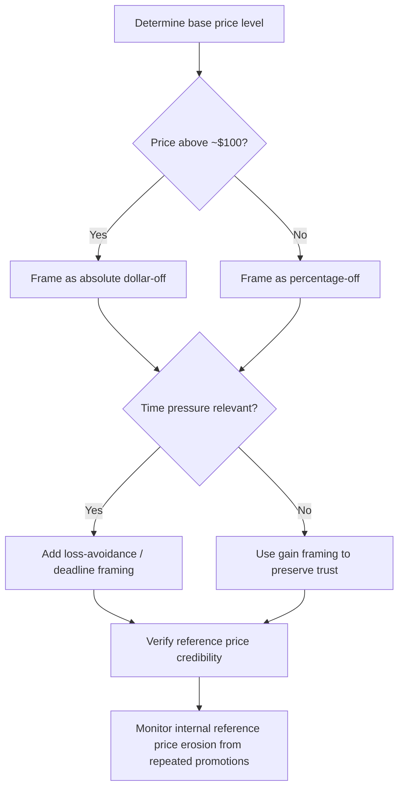

## Promotions, Discounts, and Their Framing

### Definition and Scope

Promotional pricing encompasses temporary price reductions and value-adding offers designed to stimulate short-term demand, accelerate purchase timing, or shift brand/quantity choice. **Framing** refers to how the same objective discount is presented — as a percentage vs. absolute amount, as a gain vs. avoided loss, as a bonus quantity vs. a price cut — with framing choices producing measurably different consumer responses even when the underlying economic value is held constant.

### Theoretical Foundation

Discount framing effects rest on three interlocking theories:

**Key Points**

- **Prospect Theory value function** (Kahneman & Tversky, 1979): Because the value function is concave for gains and the marginal psychological impact of a gain diminishes as its size increases, framing choices that maximize perceived gain magnitude (rather than absolute dollar value) tend to increase perceived attractiveness.
- **Reference price theory**: Consumers compare a promoted price against an internal reference price (an expectation formed from past prices, competitor prices, or "was" pricing) rather than evaluating the price in isolation.
- **Transaction utility** (Thaler, 1985): Total perceived value = **acquisition utility** (value of the good relative to its price) + **transaction utility** (perceived quality of the "deal" relative to the reference price) — a discount can increase purchase likelihood purely through transaction utility even when acquisition utility is unchanged.

### The Percentage vs. Absolute Framing Effect

A well-documented finding (often traced to a foundational demonstration in behavioral pricing literature, sometimes called the "$100 rule" or "rule of 100"): for prices below $100, a percentage discount frame produces a larger perceived discount than an equivalent absolute-dollar frame; for prices above $100, the reverse holds.

**Example**

- A $50 item discounted by $10: "20% off" is perceived as more attractive than "$10 off" (20 > 10 numerically, even though both represent the same value).
- A $1,000 item discounted by $100: "$100 off" is perceived as more attractive than "10% off" (100 > 10 numerically).

This is a direct application of the numerical magnitude/anchoring heuristic — consumers respond to the size of the number displayed, not solely to a fully computed dollar value, particularly under low-elaboration processing conditions.

### Gain-Framing vs. Loss-Framing of Promotions

**Key Points**

- **Gain frame**: "Save $20" or "Get 20% off" emphasizes a positive outcome obtained.
- **Loss-avoidance frame**: "Don't miss out on $20 in savings" or "Offer ends — you'll pay $20 more after Friday" emphasizes a loss avoided, leveraging loss aversion (losses loom larger than equivalent gains, roughly 2:1 to 2.5:1 in classic estimates from Kahneman & Tversky's original work, though the ratio varies substantially by context and elicitation method).
- Loss-avoidance framing is generally more effective at accelerating urgency and reducing procrastination (relevant to scarcity/deadline promotions) but can be perceived as more manipulative or pressure-oriented if overused, with potential brand-trust costs. [Inference] The brand-trust cost of loss-framed urgency messaging likely scales with frequency of exposure and category trust norms, though this trade-off is difficult to quantify precisely outside a specific brand's testing data.

### Discount Format Taxonomy

#### 1. Percentage-Off

"25% off" — most common, scales proportionally, but perceived magnitude depends on price level (see Rule of 100 above).

#### 2. Absolute Dollar-Off

"$25 off" — more concrete and easier to mentally compute exact savings; more effective at higher price points.

#### 3. Bonus Quantity ("Get More" Framing)

"Buy 2, Get 1 Free" reframes a 33% price reduction as a quantity bonus. Research (e.g., Hardesty & Bearden, 2003) shows bonus-pack framing is often perceived as offering higher value than an equivalent percentage discount, because consumers tend to under-compute the implied percentage discount of a "free" bonus item and instead anchor on the salient word "free."

#### 4. "Free" Framing

The word "free" produces a disproportionate behavioral response relative to its actual monetary value — a phenomenon termed the **"zero price effect"** (Shampanier, Mazar & Ariely, 2007), where demand for a free item exceeds what a rational cost-benefit calculation would predict, because "free" eliminates any perceived downside risk (there is no possible loss from a free transaction) rather than simply lowering cost.

#### 5. Multi-Unit/Tiered Pricing

"Buy 1 for $10, or 3 for $25" anchors a per-unit reference price and can shift purchase quantity upward, though this can also depress perceived per-unit value if consumers do not need the full tier.

#### 6. Threshold/Conditional Discounts

"Spend $75, get $15 off" sets a spending target that can increase average order value as consumers "round up" to reach the discount threshold — a documented basket-inflation effect in retail promotion design.

#### 7. Cashback and Rebates

Delayed-redemption discounts (mail-in rebates, cashback apps) exploit the fact that the purchase-time pain of paying is decoupled from the eventual reward, and redemption rates are often well below 100%, meaning the effective discount cost to the seller is lower than the advertised discount value. [Unverified] Specific redemption rate statistics vary substantially by rebate mechanism, product category, and time period; cite current data if precise figures are needed for a specific application.

### Reference Price Effects on Discount Perception

**Key Points**

- **External reference price**: A stated "regular price" or competitor price shown alongside the promotional price (see Anchoring Effects in Price Presentation).
- **Internal reference price**: A consumer's own expectation, shaped by purchase history and category familiarity — repeated deep discounting can permanently lower a consumer's internal reference price, making future non-discounted prices seem unfairly high (a documented risk of frequent promotional cadence in retail, sometimes called "reference price erosion" or training consumers to "wait for the sale").
- **Perceived believability**: Discounts framed against implausibly high reference prices trigger skepticism and can reduce, rather than increase, purchase intent (Compeau & Grewal, 1998, on comparative price advertising credibility).

### Promotion Framing Decision Table

| Price Level | Recommended Frame | Rationale |
| --- | --- | --- |
| Low price (< $100) | Percentage-off | Larger numeral perceived, exploits magnitude heuristic |
| High price (> $100) | Absolute dollar-off | Larger numeral perceived at this price range |
| Urgency/deadline-driven | Loss-avoidance framing | Leverages loss aversion to accelerate decision timing |
| Everyday/brand-trust priority | Gain framing | Reduces perceived manipulation, supports long-term trust |
| Volume-driving goal | Bonus quantity ("free" unit) | Zero-price effect and under-computed discount magnitude |
| Basket-size goal | Threshold discount | Encourages spending up to a target to unlock reward |

### Promotion Framing Decision Flow

### Example: Framing the Same Discount Four Ways

A $40 product discounted to $32 (a $8 / 20% reduction) can be framed as:

1. "20% off" (percentage frame)
2. "Save $8" (absolute frame)
3. "Buy 4, get 1 free equivalent value" (bonus-pack reframe, if sold in multi-packs)
4. "Price goes back up to $40 Friday — save $8 now" (loss-avoidance + deadline frame)

Each communicates identical economic value but is expected to produce different conversion and urgency outcomes depending on price level, purchase context, and consumer involvement — effects that behavioral pricing testing (A/B testing across frames) is the standard method to quantify for a specific product and audience.

### Boundary Conditions and Moderators

**Key Points**

- **Discount magnitude ceiling effects**: Beyond a certain discount depth, further increases in percentage-off produce diminishing marginal increases in purchase intent, and very deep discounts (e.g., 70%+) can trigger quality-inference concerns ("why is this so cheap?").
- **Promotional frequency**: High-frequency discounting trains consumers to delay purchases in anticipation of the next sale, a well-documented risk in categories like apparel retail and consumer electronics.
- **Regulatory constraints**: As with anchoring-based reference pricing, discount framing claims (e.g., "was/now" pricing, "compare at" pricing) are subject to consumer protection regulation requiring the reference price to be genuine and not fabricated for the appearance of a discount.
- **Cultural and category norms**: Sensitivity to specific framing techniques (e.g., loss-avoidance urgency messaging) varies across cultural contexts and product categories; direct generalization across all markets is not warranted. [Inference] This cross-cultural variation is plausible given known differences in uncertainty avoidance and risk perception across cultures, but category- and market-specific testing is the appropriate way to confirm effect direction and size in a given context.

### Related Topics

- Anchoring effects in price presentation
- Bundling, unbundling, and price partitioning
- Loss aversion and prospect theory in consumer decision-making
- Scarcity and urgency cues in promotional messaging
- Reference price theory and price fairness perception
- Charm pricing and the left-digit effect
- Behavioral pricing A/B testing methodology
- Regulatory frameworks for comparative and reference-price advertising