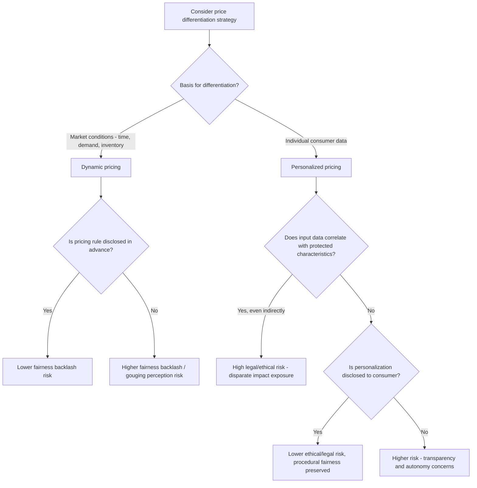

## Dynamic and Personalized Pricing Ethics

### Definitions and Distinctions

**Dynamic pricing** is the practice of adjusting prices in response to aggregate market conditions — demand fluctuations, inventory levels, time, competitor prices, or supply constraints — applied uniformly to all consumers viewing the offer at a given moment (e.g., airline seat pricing, ride-share surge pricing). **Personalized pricing** (also called first-degree or individualized price discrimination) adjusts prices based on characteristics of the specific individual consumer — browsing history, device type, location, purchase history, or inferred willingness-to-pay — such that two consumers viewing the same product at the same moment may see different prices.

The ethical issues raised by each differ meaningfully: dynamic pricing is generally accepted as a legitimate market-clearing mechanism, while personalized pricing raises distinct concerns about fairness, discrimination, and transparency because it treats otherwise-identical transactions differently based on inferred attributes of the buyer rather than market conditions.

### Economic Foundation: Price Discrimination Theory

Classical microeconomics classifies price discrimination into three degrees (Pigou, 1920):

**Key Points**

- **First-degree (personalized)**: Each consumer is charged their maximum willingness-to-pay, theoretically maximizing seller surplus extraction and eliminating consumer surplus entirely in the extreme case.
- **Second-degree (menu-based)**: Consumers self-select into different price/quantity bundles (e.g., tiered subscriptions, bulk discounts) — welfare-neutral to positive since it is opt-in.
- **Third-degree (segment-based)**: Different prices charged to different observable groups (e.g., student discounts, regional pricing) based on group-level demand elasticity differences.

Dynamic pricing is typically a form of intertemporal or demand-responsive third-degree discrimination (segmenting by time/market conditions rather than individual identity); algorithmically personalized pricing pushes toward first-degree discrimination, which is the form generating the most acute ethical scrutiny because it targets the individual rather than an observable group.

### Consumer Psychology of Perceived Price Fairness

**Key Points**

- **Dual entitlement principle** (Kahneman, Knetsch & Thaler, 1986): Consumers judge a price increase as fair if it is passed through from a genuine cost increase to the seller, but as unfair (price gouging) if the seller merely captures increased demand at no increased cost — a distinction highly relevant to surge/dynamic pricing backlash.
- **Distributive vs. procedural fairness**: Consumers evaluate not only the outcome (the price they receive) but the process by which it was determined; opaque algorithmic personalization violates procedural fairness expectations even when the resulting price is objectively reasonable.
- **Discovered discrimination reactance**: Empirical studies (e.g., Turow et al., 2005 on U.S. consumer attitudes toward tracking-based pricing) consistently find that consumers react negatively upon learning that prices are personalized, often perceiving it as more objectionable than an equivalent uniform price increase, because it implies the seller has identified and exploited a means/willingness-to-pay signal specific to them.

### Sources of Data Used in Personalized Pricing

#### 1. Behavioral Signals

Browsing history, cart abandonment patterns, search frequency, and time-on-page can serve as proxies for urgency or price sensitivity.

#### 2. Device and Technical Signals

Device type (historically, some retailers were found to charge Mac users differently from PC users, based on inferred income correlation), browser, and connection speed.

#### 3. Geographic Signals

IP-based location can be used to adjust prices to local market conditions (a legitimate use overlapping with currency/cost-of-living adjustment) or, more controversially, to exploit region-specific willingness-to-pay differences unrelated to cost.

#### 4. Loyalty and Purchase History

Ironically, some algorithmic systems have been found to charge existing/loyal customers more than new customers (since loyal customers demonstrate lower price sensitivity by not switching), a pattern that runs counter to conventional loyalty-reward intuitions and has drawn particular criticism.

#### 5. Demographic Inference

Inferred age, income bracket, or other demographic proxies derived from third-party data brokers or account information.

### Ethical Frameworks Applied to Pricing Personalization

**Key Points**

- **Consequentialist framing**: Evaluates personalized pricing by aggregate welfare outcomes — proponents argue it can increase total transactions (some consumers who would not buy at a uniform price gain access at a lower personalized price), while critics note it primarily redistributes surplus from consumer to seller.
- **Deontological/rights-based framing**: Focuses on whether personalized pricing violates a duty of equal treatment or transparency, independent of aggregate welfare outcomes.
- **Fairness-as-non-discrimination**: When personalization correlates with protected characteristics (race, gender, disability, national origin) — even indirectly through proxy variables — it raises legal and ethical concerns distinct from ordinary price discrimination, potentially constituting disparate-impact discrimination even without explicit intent.
- **Transparency/autonomy framing**: Consumers' ability to make informed decisions is undermined if they cannot know they are seeing a personalized price or cannot access the "standard" price for comparison.

### Regulatory Landscape

**Key Points**

- Several jurisdictions have introduced or proposed disclosure requirements specifically for personalized/algorithmic pricing (e.g., EU consumer protection amendments under the Omnibus Directive require disclosure when a price has been personalized based on automated decision-making).
- U.S. regulatory attention (FTC inquiries into surveillance pricing, various state-level legislative proposals) has increased scrutiny of personalized pricing practices, particularly where they rely on non-public behavioral or location data.
- Anti-discrimination law (e.g., disparate impact doctrine) can apply where personalized pricing algorithms produce systematically different outcomes correlated with protected classes, even absent explicit use of those classes as inputs.
- [Unverified] The specific legal status, disclosure thresholds, and enforcement posture of personalized-pricing regulation are evolving rapidly across jurisdictions; verify current requirements in the relevant jurisdiction before implementation, as this area is subject to frequent regulatory and litigation developments.

### Dynamic Pricing: Distinct Ethical Considerations

Even though dynamic pricing (uniform across consumers at a point in time) is generally viewed more favorably than personalization, it raises its own concerns:

**Key Points**

- **Surge/gouging perception**: Demand-responsive pricing during emergencies or shortages (e.g., ride-share surge pricing during a crisis) frequently triggers strong fairness backlash even when the underlying supply-demand rationale is economically coherent, per the dual entitlement principle above.
- **Transparency of the mechanism**: Consumers generally respond less negatively to dynamic pricing when the *rule* is disclosed in advance (e.g., "prices are higher during peak hours") rather than encountered as an unexplained price at checkout.
- **Algorithmic collusion risk**: When multiple sellers in a market use similar dynamic pricing algorithms (sometimes from the same third-party vendor), there is a documented antitrust concern that algorithmic pricing can produce tacit collusion-like outcomes without explicit coordination — an active area of competition law scrutiny. [Unverified] The legal treatment of algorithmic pricing coordination is an evolving and jurisdiction-specific area; specific case outcomes should be verified against current legal sources.

### Decision Framework for Ethical Pricing Personalization

### Example: Comparing Two Pricing Scenarios

**Scenario A (Dynamic, disclosed)**: A ride-share app displays "Prices are 1.8x normal due to high demand in your area right now" before booking. All users see the same multiplier at that moment. This is dynamic pricing with mechanism transparency — generally lower ethical risk despite potential fairness backlash during extreme events.

**Scenario B (Personalized, undisclosed)**: An e-commerce site silently charges a returning customer a higher price than a new visitor for the identical product, based on the returning customer's purchase history indicating low price sensitivity, with no disclosure that prices vary by user. This is undisclosed first-degree personalization — high ethical and increasingly high regulatory risk.

### Boundary Conditions and Practical Guidance

**Key Points**

- **Legitimate cost-based differentiation** (currency conversion, region-specific shipping/tax costs, local market competition) is generally viewed as ethically distinct from willingness-to-pay-based personalization, even though both result in different prices for different consumers.
- **Opt-in personalization** (e.g., loyalty programs where consumers knowingly trade data for discounts) is generally viewed as more ethically defensible than covert personalization, since it preserves consumer autonomy and consent.
- **Symmetric disclosure** — allowing consumers to see that a price is personalized and access an alternative standard price — substantially mitigates the procedural fairness and autonomy concerns discussed above, though it does not resolve underlying discrimination law questions if the personalization correlates with protected characteristics.
- [Inference] Firms are likely to face increasing pressure toward disclosure-based compliance approaches (rather than abandoning personalization entirely) given current regulatory trajectories, though the specific compliance mechanisms required will likely continue to vary by jurisdiction and are not yet fully settled.

### Related Topics

- Price discrimination theory (first-, second-, and third-degree)
- Anchoring effects in price presentation
- Price fairness perception and the dual entitlement principle
- Algorithmic pricing and antitrust/collusion concerns
- Data privacy regulation and consumer profiling (GDPR, CCPA)
- Loyalty program design and its behavioral trade-offs
- Surge pricing and consumer backlash management
- Disparate impact doctrine in algorithmic decision-making