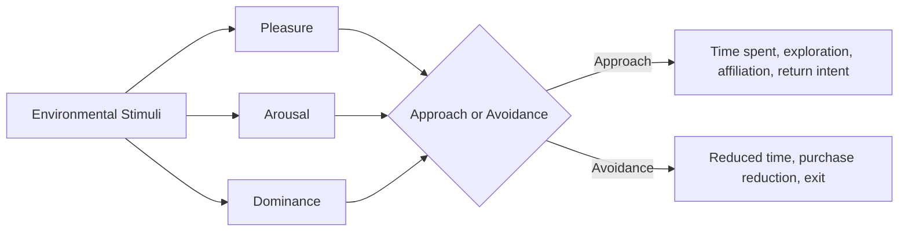
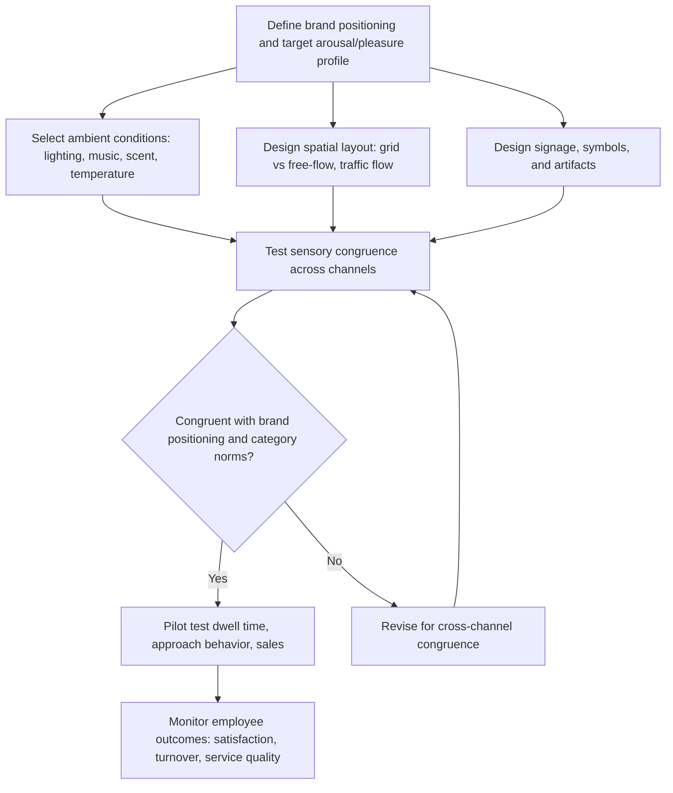

## Store Atmospherics and Servicescapes

### Definitions and Foundational Framework

**Atmospherics** refers to the deliberate design of a retail environment's sensory qualities — visual, auditory, olfactory, tactile, and thermal elements — to influence consumer perception, emotion, and behavior. The term was coined by Philip Kotler (1973), who argued that the "atmosphere" of a place could be a more decisive purchase influence than the product itself in certain categories.

**Servicescape** is a broader theoretical construct introduced by Mary Jo Bitner (1992), extending atmospherics theory to encompass the entire physical environment in which a service is delivered and consumed, explicitly modeling its effects on both customers *and* employees, and on the social interactions between them.

### The Servicescape Model (Bitner, 1992)

Bitner's model organizes environmental dimensions into three categories, which jointly produce internal responses (cognitive, emotional, physiological) that drive approach-avoidance behavior:

**Key Points**

- **Ambient conditions**: Temperature, lighting, noise, music, scent, and air quality — background conditions perceived diffusely rather than consciously attended to unless extreme.
- **Space/function**: Layout, equipment, and furnishings that facilitate or hinder the accomplishment of customer and employee goals (e.g., aisle width, checkout flow, seating arrangement).
- **Signs, symbols, and artifacts**: Explicit signage plus implicit cues (décor style, material quality, staff uniforms) that communicate brand meaning and behavioral expectations (e.g., implicit norms about dress code or price tier).

These dimensions produce responses along three channels, consistent with the Mehrabian-Russell (1974) environmental psychology framework that underlies most atmospherics research:

**Key Points**

- **Cognitive response**: Beliefs about the store (e.g., perceived quality, price tier) formed from environmental cues.
- **Emotional response**: Measured along the **Pleasure-Arousal-Dominance (PAD)** dimensions — the core Mehrabian-Russell model — where pleasure and arousal are the primary drivers of approach/avoidance behavior.
- **Physiological response**: Direct bodily reactions (comfort, fatigue, sensory overload) that can independently drive avoidance regardless of cognitive or emotional evaluation.

### The Mehrabian-Russell Stimulus-Organism-Response (S-O-R) Model

This is the dominant theoretical scaffolding for atmospherics research: environmental **S**timuli → internal **O**rganismic states (pleasure, arousal, dominance) → behavioral **R**esponse (approach or avoidance).

**Key Points**

- **Approach behaviors**: Desire to stay, explore, affiliate with others in the space, and return — associated with higher sales and satisfaction.
- **Avoidance behaviors**: Desire to leave, ignore, or avoid interaction — associated with reduced dwell time and purchase.
- **Arousal's moderating role**: The relationship between arousal and pleasure is critical — high arousal *amplifies* whatever pleasure valence is already present (a highly arousing pleasant environment is very approach-inducing; a highly arousing unpleasant environment strongly triggers avoidance). This is a key nuance often missed in simplified atmospherics guidance: arousal alone (e.g., from loud music) is not universally positive or negative.

### Sensory Channels in Detail

#### 1. Lighting

Bright lighting generally increases arousal and can increase examination/handling of merchandise (Areni & Kim, 1994, in a wine store context found brighter lighting increased product examination, though not necessarily direct sales). Warm, dim lighting is more commonly used in upscale/relaxation-oriented contexts (fine dining, spas) to lower arousal and support a leisurely pace.

#### 2. Music

**Key Points**

- **Tempo effects**: Slow-tempo background music has been shown to increase in-store dwell time and, in supermarket settings, increase sales (Milliman, 1982, is a foundational study), while fast-tempo music can increase walking pace and reduce dwell time — useful in high-throughput contexts (e.g., quick-service restaurants aiming to increase table turnover).
- **Genre-congruence effects**: Music genre can activate category-consistent associations — a classic finding (North, Hargreaves & McKendrick, 1997) showed French accordion music increased French wine sales relative to German music increasing German wine sales, demonstrating that music can prime specific product associations, not just general mood.
- **Volume and complexity**: Loud or complex music increases arousal and can reduce processing capacity for other tasks (e.g., careful price comparison), which has been exploited deliberately in some high-volume retail contexts.

#### 3. Scent

Ambient scent (diffused throughout a space, not attached to a specific product) has been shown to improve store evaluation, mood, and approach behavior when the scent is congruent with the retail category and not perceived as overwhelming (Spangenberg, Crowley & Henderson, 1996). Scent-arousal congruence with music has also been found to interact — congruent scent and music arousal levels produce more positive evaluations than mismatched combinations (Mattila & Wirtz, 2001).

#### 4. Temperature and Air Quality

Largely operates as a threshold/dissatisfier variable in Herzbergian terms — comfortable temperature is rarely consciously noticed or credited, but uncomfortable temperature reliably produces avoidance and complaint behavior.

#### 5. Tactile and Textural Cues

Material quality of surfaces, product packaging, and fixtures signals perceived brand quality and price tier; touch-friendly merchandising ("touch this" signage, open displays) has been shown to increase impulse purchase likelihood by increasing psychological ownership (Peck & Shu, 2009, on the endowment effect from mere touch).

### Spatial Layout and Wayfinding

**Key Points**

- **The "decompression zone"** (a term from retail design practice, associated with Paco Underhill's research): The first several feet of a store entrance are typically underutilized by shoppers who are still transitioning from the external environment and adjusting pace — merchandising in this zone often underperforms.
- **The "invariant right" / "boomerang" pattern**: In many Western retail contexts, shoppers entering a store tend to turn right and move counterclockwise, a pattern retailers use to inform placement of high-margin or high-priority merchandise along the natural traffic flow.
- **Grid vs. free-flow layout**: Grid layouts (parallel aisles, common in grocery/pharmacy) maximize product exposure and shelf efficiency; free-flow layouts (irregular fixture placement, common in fashion/boutique retail) encourage browsing and exploration at the cost of navigational efficiency — a direct trade-off between the "space/function" dimension's efficiency goal and the emotional/exploratory goal of atmospherics.
- **Decision-point signage**: Placement of navigational and promotional signage at natural pause points (aisle ends, intersections) aligns with where shoppers are already making micro-decisions about direction and attention.

### Servicescape Effects on Employees

A distinguishing feature of Bitner's model (versus earlier atmospherics research focused solely on customers) is its explicit treatment of employee outcomes:

**Key Points**

- **Employee approach-avoidance**: The same environmental dimensions that drive customer behavior also affect employee affiliation, satisfaction, productivity, and turnover intention — a poorly designed servicescape can degrade service quality indirectly by degrading employee experience.
- **Social interaction moderation**: The servicescape shapes the nature and quality of customer-employee and customer-customer interactions (e.g., open layouts with clear sightlines facilitate service interactions; cramped or maze-like layouts can increase interpersonal friction).

### Store Atmospherics Design Process

### Example: Atmospherics Contrast Across Retail Positioning

A discount grocery chain typically uses bright, high-arousal lighting, minimal ambient music, dense grid layout, and utilitarian signage — consistent with a low-price, high-efficiency positioning where extended dwell time and exploratory browsing are not the goal. A luxury boutique typically uses dim, warm lighting, slow-tempo curated music, open free-flow layout with generous spacing, and high-quality tactile materials — consistent with a positioning that benefits from lower arousal, longer dwell time, and exploratory browsing, since the transaction value per visit is high and time pressure is not desired.

### Boundary Conditions and Moderators

**Key Points**

- **Individual differences**: Consumers vary in their trait-level preference for environmental stimulation (some research references a "screener" vs. "non-screener" distinction — individuals who filter out excess stimulation vs. those more sensitive to it), meaning the same atmosphere can produce different arousal responses across shoppers.
- **Shopping goal moderation**: Task-oriented shoppers (e.g., a quick grocery run) may respond negatively to atmospheric elements that slow them down (leisurely music, complex layout), while recreational shoppers respond positively to the same elements — atmospherics effectiveness is contingent on the dominant shopping motivation in a given context.
- **Cultural variation**: Preferences for ambient density, personal space, and appropriate arousal levels vary across cultural contexts; atmospherics research findings from one cultural/retail context should not be assumed to generalize without local validation. [Inference] This is a reasonable extension of known cross-cultural differences in proxemics and sensory preference research, though direct cross-cultural replications of specific atmospherics findings (e.g., the music-tempo dwell-time effect) are not uniformly available across all retail contexts.
- **Sensory overload risk**: Excessive stimulation across multiple channels simultaneously (loud music + strong scent + bright lighting + visual clutter) can push arousal into an aversive rather than exciting range, producing avoidance rather than approach — congruence and moderation across channels matters more than maximizing any single channel.

### Related Topics

- Mehrabian-Russell Stimulus-Organism-Response (S-O-R) model
- Sensory marketing and cross-modal correspondence
- Store layout design and shopper wayfinding
- Impulse purchase behavior and in-store triggers
- Psychological ownership and the endowment effect in merchandising
- Employee experience and internal marketing in service environments
- Queue design and perceived wait time psychology
- Visual merchandising and planogram design