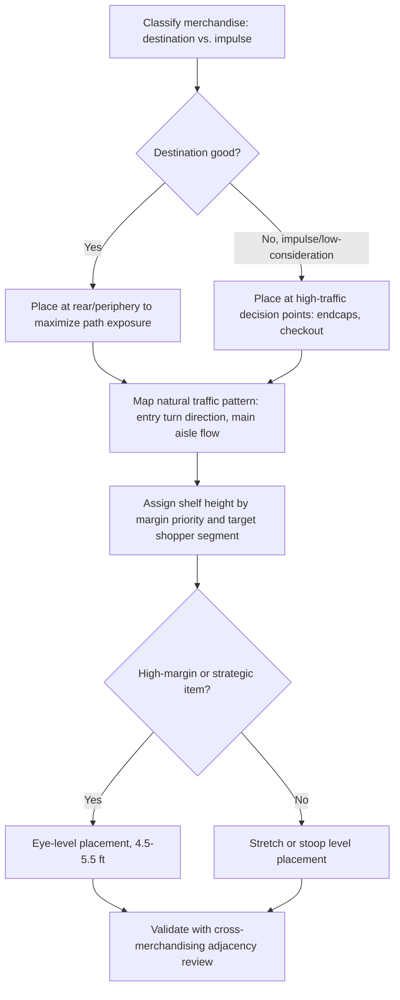

## Layout, Traffic Flow, and Product Placement

### Definition and Scope

Store layout, traffic flow, and product placement together constitute the **spatial choice architecture** of a retail environment — the deliberate arrangement of fixtures, aisles, and merchandise to guide shopper movement, control exposure to products, and shape purchase decisions. Where atmospherics (see prior topic) governs sensory experience, this domain governs the structural and geometric design of the shopping path itself, drawing on retail geography, environmental psychology, and behavioral economics of in-store decision-making.

### Layout Typologies

#### 1. Grid Layout

Parallel aisles at consistent intervals, most common in grocery, pharmacy, and hardware retail.

**Key Points**

- Maximizes shelf-linear footage and product exposure per square foot.
- Highly efficient for goal-directed, repeat-purchase shopping.
- Predictable navigation supports fast task completion but limits exploratory browsing and can reduce unplanned purchase exposure outside the direct path.

#### 2. Free-Flow (Free-Form) Layout

Irregular, asymmetric fixture placement without a fixed grid, common in fashion, boutique, and specialty retail.

**Key Points**

- Encourages slower pace, exploration, and browsing behavior consistent with a recreational shopping motivation.
- Lower space efficiency (more circulation space, fewer linear feet of shelving) is traded for a more immersive, exploratory experience.
- Supports the free-flow layout's compatibility with lower-arousal, higher-dwell-time atmospherics strategies (see Store Atmospherics and Servicescapes).

#### 3. Loop / Racetrack Layout

A single dominant circulation path (often loop-shaped) that guides shoppers past the majority of the store's merchandise before reaching checkout, common in IKEA-style big-box and warehouse retail.

**Key Points**

- Maximizes forced exposure to merchandise by design, since deviation from the loop requires deliberate effort.
- Can produce shopper fatigue or frustration if perceived as overly long or inflexible, particularly for shoppers with a specific, narrow purchase goal.

#### 4. Spine Layout

A single main aisle ("spine") running through the store with secondary departments branching off it, common in department stores.

**Key Points**

- Balances navigational clarity (a single primary path) with departmental browsing flexibility (branching secondary paths).

### Traffic Flow Patterns

**Key Points**

- **The "invariant right" pattern**: In right-side-driving cultures, a substantial majority of shoppers turn right upon entry and move counterclockwise through a store — a widely cited pattern in retail design practice (associated with Paco Underhill's *Why We Buy* research), used to inform placement of high-priority or high-margin categories along the natural early path.
- **The decompression zone**: The first several feet inside an entrance are a transitional zone in which shoppers are still adjusting pace and attention from the external environment; merchandising and signage in this zone are typically underprocessed and underperform expectations.
- **The power wall / power aisle**: The prominent display area encountered immediately upon entry (after the decompression zone), used for high-margin, seasonal, or promotional merchandise given its high-attention position.
- **Endcap effects**: Displays at the end of aisles receive disproportionately high visibility because they are visible from the main traffic artery independent of whether a shopper enters that specific aisle — endcaps are among the most heavily used and effective locations for promotional and impulse merchandise.
- **Checkout lane merchandising**: The queue area is a high-dwell, low-cognitive-load zone (shoppers are typically finished with their primary task and waiting) — a well-established location for low-consideration, low-price impulse items (candy, magazines, small accessories).

### Product Placement Principles

#### 1. Category Placement Strategy: Destination vs. Impulse Goods

**Key Points**

- **Destination categories** (staples a shopper specifically visits the store for, e.g., milk, bread) are often placed at the rear or periphery of a grocery store, deliberately maximizing the traffic path length and exposure to intermediate categories before reaching the destination item.
- **Impulse categories** (low-consideration, high-margin items) are placed along high-traffic paths and at decision points (aisle ends, checkout) to maximize incidental exposure rather than relying on destination-seeking behavior.

#### 2. Vertical Placement (Shelf Height) — "Eye Level is Buy Level"

**Key Points**

- Products at eye level (roughly 4.5–5.5 feet from the floor for adult shoppers) receive the highest visual attention and sales lift; this position is typically the most competitively sought-after and often commands slotting fee premiums from manufacturers.
- Products at "stretch level" (top shelf) or "stoop level" (bottom shelf) receive systematically lower attention; bottom-shelf placement is frequently used for bulk/value private-label items where price-sensitive shoppers are motivated to search regardless of placement friction.
- Children's products are often placed at child eye-level (lower shelves) to leverage pester-power dynamics in family shopping trips — a well-documented category-specific placement strategy.

#### 3. Horizontal Placement and Cross-Merchandising

**Key Points**

- **Category adjacency**: Placing complementary products near each other (e.g., chips near dips, pasta near sauce) increases basket-building through reminder and convenience effects.
- **Left-to-right scanning bias**: Some research on shelf scanning suggests a left-to-right visual scanning tendency in left-to-right reading cultures, informing placement of premium or promoted items at the natural start of a shopper's visual scan path, though the magnitude and consistency of this effect across categories is less robustly established than eye-level effects. [Unverified] The strength of directional scanning bias as an independent driver of purchase (versus eye level and brand familiarity) is not as consistently replicated across studies as the eye-level effect; treat with more caution when making specific placement recommendations.

#### 4. Facing and Shelf Share

**Key Points**

- The number of adjacent product facings (identical units displayed side by side) has been shown to correlate with perceived popularity and can independently increase sales beyond simple visibility, a phenomenon linked to social proof heuristics — more facings can imply "other people buy this."
- Manufacturers negotiate for facing count and shelf position via trade/slotting arrangements, making this an area where retail buyer-supplier negotiation directly intersects with consumer psychology.

### Traffic Flow and Placement Decision Process

### Example: Grocery Store Layout Logic

A typical large-format grocery store places fresh produce near the entrance (leveraging the decompression zone's transition into a "freshness" impression that primes perceived quality for the rest of the store), positions dairy and bread — high-frequency staples — at the rear-most points of the store, and routes the main aisle path such that reaching these staples requires passing through center-store aisles containing higher-margin packaged goods. Endcaps throughout this path rotate promotional and seasonal merchandise, and the checkout queue is merchandised with low-price, low-consideration impulse items (gum, magazines, single-serve snacks).

### Digital and Omnichannel Extensions

**Key Points**

- **Website/app "shelf" analogues**: E-commerce category page ordering, "above the fold" placement, and search result ranking function analogously to physical eye-level and traffic-flow effects — position in a digital list independently affects click-through and purchase likelihood, a well-established finding in digital choice architecture research.
- **Heat-mapping and traffic analytics**: Physical retailers increasingly use in-store sensors, Wi-Fi triangulation, and computer vision to empirically map actual traffic flow and dwell time, replacing purely heuristic layout assumptions with measured data — a methodological evolution from the largely observational tradition (e.g., Underhill's shopper-tracking methodology) toward instrumented, quantitative retail analytics. [Inference] Adoption of such instrumented approaches likely varies substantially by retailer scale and category, given the capital and privacy-compliance investment required, though systematic industry-wide adoption figures are not something this reference can state with confidence.

### Boundary Conditions and Moderators

**Key Points**

- **Shopping mission moderation**: A shopper on a fast, targeted trip (e.g., picking up a single item) is less susceptible to path-length manipulation and impulse placement than a shopper on a leisurely, exploratory trip — layout strategy effectiveness is contingent on the mix of shopping missions a given store or time-of-day attracts.
- **Familiarity effects**: Repeat shoppers develop cognitive maps of store layout and increasingly route around intended manipulation (e.g., experienced shoppers may deliberately avoid center-store aisles), meaning layout-driven exposure effects can diminish with shopper tenure at a given store.
- **Store format constraints**: Small-format and convenience retail cannot fully implement loop/racetrack strategies due to physical footprint limits, requiring different placement priorities (e.g., near-checkout impulse merchandising becomes proportionally more important when a long traffic-generating path is not feasible).
- **Ethical and regulatory boundaries**: Placement of age-restricted or health-sensitive products (alcohol, tobacco, candy at child eye-level near checkout) is subject to increasing regulatory attention in some jurisdictions, particularly regarding proximity to schools, checkout impulse zones, or child sightlines. [Unverified] Specific regulatory restrictions vary significantly by jurisdiction and product category; verify current local requirements before implementation.

### Related Topics

- Store atmospherics and servicescapes
- Endcap and point-of-purchase display effectiveness
- Shelf space allocation and category management
- Digital choice architecture and e-commerce placement effects
- Impulse purchase behavior and decision-point psychology
- Slotting fees and retailer-manufacturer negotiation
- Queue psychology and checkout experience design
- Eye-tracking and shopper analytics methodology