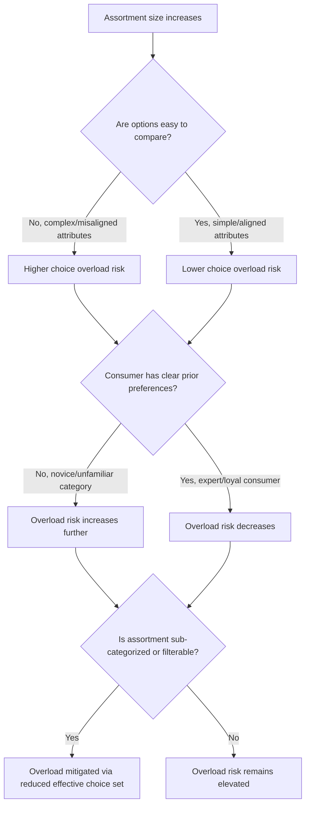

## Shelf Position and Choice Overload

### Definitions and Scope

**Shelf position** refers to the vertical and horizontal placement of a product within a retail display and its measurable effect on visibility, attention capture, and purchase likelihood. **Choice overload** (also termed the "choice overload effect" or "overchoice") refers to the phenomenon in which an increase in the number of available options — beyond some point — reduces rather than increases consumer satisfaction, purchase likelihood, and decision confidence, contrary to the classical economic assumption that more options are always welfare-improving.

These two topics intersect directly in retail category management: shelf position determines which of many available options receive attention, and assortment size (the total number of SKUs presented) determines whether the choice environment itself becomes a source of cognitive burden that shelf position and category structure must help mitigate.

### Shelf Position Effects

#### Vertical Position: "Eye Level is Buy Level"

**Key Points**

- Products positioned at eye level (approximately 4.5–5.5 feet from floor for adult shoppers) receive the highest fixation frequency and duration in eye-tracking studies and correspondingly the highest sales lift relative to identical products moved to other shelf heights.
- "Stretch level" (top shelf, requiring upward reach/gaze) and "stoop level" (bottom shelf, requiring downward gaze/bending) both show measurably reduced attention capture, with stoop level typically showing the largest attention decrement of the three positions.
- Retailers and manufacturers both treat eye-level placement as a scarce, negotiated resource — manufacturer slotting fees are frequently tied specifically to shelf height tier, reflecting the well-established commercial value of this position.

#### Horizontal Position

**Key Points**

- Position relative to natural traffic flow and aisle entry point affects initial attention capture (see Layout, Traffic Flow, and Product Placement), with items nearer the aisle entrance or a natural pause point receiving more attention than items requiring sustained deep-aisle browsing.
- **Facing count (shelf share)**: The number of adjacent identical-product facings has an attention and sales effect independent of position — wider facing blocks are more visually salient and can signal popularity via a social-proof-adjacent mechanism ("many facings suggests many buyers").

#### Position Relative to Category Anchors

**Key Points**

- Placement adjacent to a well-known "anchor" brand within a category can produce comparison-based attention spillover, though this can cut either direction — proximity to a strong incumbent can either lend credibility by association or invite unfavorable direct comparison, depending on relative price and quality positioning.

### Choice Overload: Theoretical Foundation

The foundational empirical demonstration is Iyengar and Lepper's 2000 "jam study," in which a tasting booth offering 24 jam varieties attracted more browsing interest than a 6-variety booth, but the 6-variety booth produced a substantially higher purchase conversion rate among those who stopped — a dissociation between *attraction* (larger assortments draw more initial interest) and *conversion* (smaller assortments convert a higher share of that interest into actual purchase).

**Key Points**

- **Cognitive load mechanism**: Evaluating more options requires more comparative cognitive effort; beyond a threshold, the marginal cost of comparison begins to outweigh the marginal benefit of finding a marginally better option.
- **Decision regret and post-choice satisfaction**: Larger assortments have been associated with lower post-choice satisfaction and higher anticipated regret (Schwartz's "Paradox of Choice" framework, 2004), partly because a larger option set makes the counterfactual "what I gave up" more salient.
- **Preference uncertainty amplification**: When consumers do not have well-formed, stable preferences for a category (common for unfamiliar or infrequently purchased categories), a larger assortment increases the difficulty of preference construction rather than simply enabling better-matched selection.

### Boundary Conditions: When Choice Overload Does and Does Not Occur

The choice overload effect is not universal, and subsequent meta-analytic work (notably Scheibehenne, Greifeneder & Todd, 2010, a meta-analysis of choice overload studies) found the average effect size across studies to be close to zero, with substantial heterogeneity — meaning choice overload is a **moderated** effect that occurs reliably only under specific conditions rather than a general law of assortment size.

**Key Points**

- **Complexity of comparison**: Choice overload is more likely when options are difficult to compare (many attributes, non-aligned attribute sets across options) than when options are easily comparable on a small number of clear dimensions.
- **Preexisting preference clarity**: Consumers with clear, well-formed preferences (domain experts, or categories with strong prior brand loyalty) are less susceptible to overload than novices facing an unfamiliar category.
- **Time pressure and decision goals**: Choice overload is more pronounced when the decision goal is to select a single "best" option (maximizing) rather than to find a merely "good enough" option (satisficing) — a link to Barry Schwartz's maximizer/satisficer distinction in individual decision-making style.
- **Categorization and menu structuring**: Presenting a large assortment with clear sub-categorization (reducing the *effective* choice set size actively considered at each decision step) can mitigate overload even when the total assortment size remains large — this is a primary practical mitigation strategy in category management and digital interface design (e.g., faceted filtering in e-commerce).
- **Justifiability of the decision**: When consumers need to justify a choice (to themselves or others), a larger assortment can increase confidence that "the best option was considered," partially offsetting overload in some contexts — an example of the effect's context-dependence rather than a fixed direction.

### Choice Overload Occurrence Framework

### Practical Mitigation and Category Management Strategies

**Key Points**

- **Assortment curation**: Deliberately limiting SKU count within a category to a range that balances perceived variety against comparison burden — a central task of category management, informed by both overload research and pure sales-per-SKU productivity analysis.
- **Hierarchical categorization**: Structuring a large assortment into nested categories/subcategories (e.g., "shampoo" → "for dry hair" → specific brands) so that a shopper only compares a small effective set at each decision step, consistent with the categorization-based mitigation described above.
- **Default and recommended options**: Presenting a "recommended" or "best-seller" flag on a subset of options reduces the need for exhaustive comparison, functioning as an implicit reduction of the effective choice set even when the full assortment remains visible.
- **Comparison tools**: Digital retail environments can offer explicit side-by-side comparison tools, directly addressing the complexity-of-comparison moderator by structuring the comparison task rather than leaving shoppers to self-organize it.
- **Sequential/filtered presentation**: Progressive disclosure (showing a smaller initial set with an option to "see more") allows shoppers to self-select into the increased comparison burden only when their preference clarity or motivation supports it.

### Example: Category Management Application

A retailer stocking 40 SKUs of pasta sauce might restructure the shelf into clearly labeled sub-groups (e.g., "Marinara," "Alfredo," "Arrabbiata," "Organic/Premium") with 8-10 SKUs visible per sub-group at eye level, rather than presenting all 40 as an undifferentiated block. This preserves total assortment breadth (addressing variety-seeking and market coverage goals) while reducing the effective comparison set encountered at any single decision point — directly applying the categorization mitigation strategy to a physical shelf context.

### Example: Digital Choice Architecture Parallel

An e-commerce category page with 200 results uses faceted filters (price range, brand, rating, size) and a default "Best Match" or "Most Popular" sort order. This mirrors physical shelf sub-categorization: the total catalog remains large, but the shopper's *effective* consideration set at any given moment is filtered down, directly applying choice-overload mitigation principles to a digital shelf equivalent of vertical/horizontal position.

### Boundary Conditions and Moderators (Combined)

**Key Points**

- **Individual differences in maximizing tendency**: Consumers scoring higher on trait maximizing behavior (per Schwartz et al.'s Maximization Scale) are more susceptible to both choice overload and negative effects of shelf-position-driven exposure limitations, since they are motivated to seek an optimal rather than satisfactory choice regardless of assortment size.
- **Category involvement**: High-involvement categories (e.g., a mattress purchase) may tolerate or even benefit from larger assortments with strong information support, while low-involvement categories (e.g., a candy bar) are more susceptible to choice overload effects at much smaller assortment sizes, since the cognitive investment consumers are willing to make is proportionally smaller.
- [Inference] Given the near-zero average meta-analytic effect size but wide study-level heterogeneity, generalized claims that "fewer options always sell better" are not well-supported as a blanket rule; the moderators above (comparability, preference clarity, categorization) are more diagnostic than assortment size alone for predicting whether overload will occur in a specific retail context.

### Related Topics

- Layout, traffic flow, and product placement
- Category management and assortment planning
- The paradox of choice and maximizer/satisficer decision styles
- Digital choice architecture and faceted search design
- Default effects and choice architecture nudges
- Social proof and popularity signaling in merchandising
- Decision fatigue and cognitive load in consumer choice
- Shelf space allocation and slotting fee negotiation