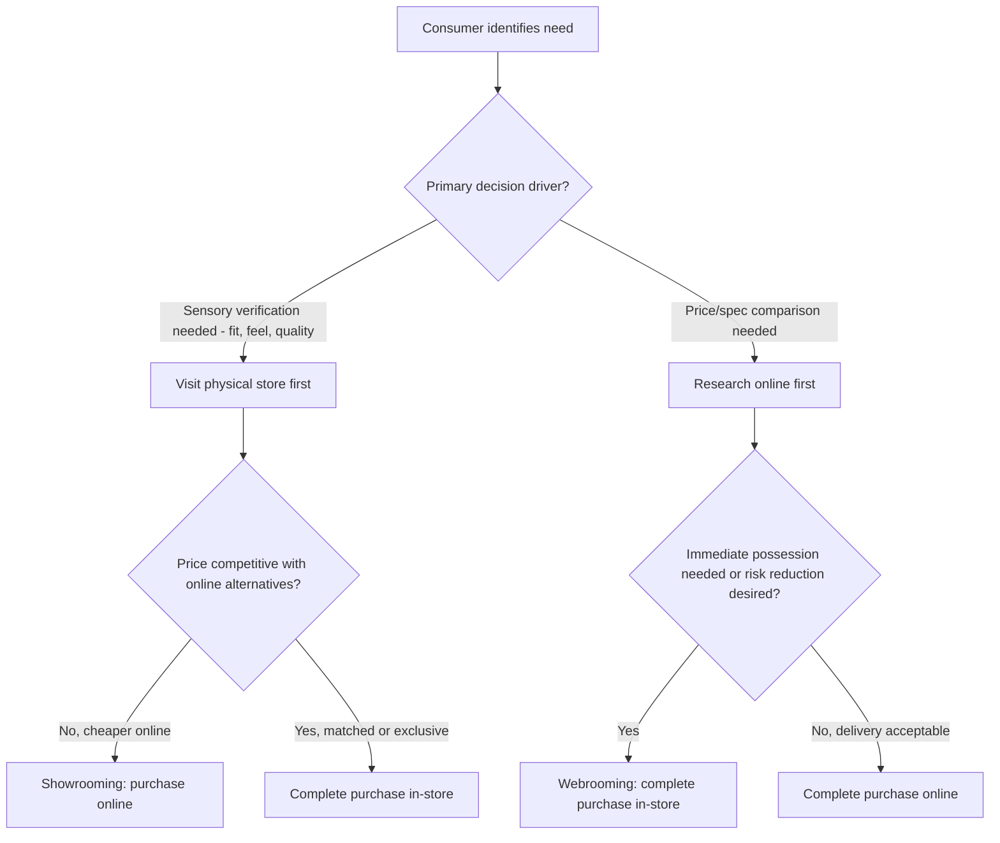

## Showrooming, Webrooming, and Channel-Switching Behavior

### Definitions

**Showrooming** is the consumer behavior of examining a product in a physical retail store — assessing fit, quality, or function through direct sensory inspection — and then purchasing that product through a different (typically online) channel, often at a lower price. **Webrooming** (also called "reverse showrooming" or ROBO — Research Online, Buy Offline) is the inverse: researching a product online (reviews, specifications, price comparisons) and then completing the purchase in a physical store. **Channel-switching behavior** is the broader umbrella construct describing any movement of a single purchase journey across multiple retail channels (physical store, brand website, third-party marketplace, mobile app, social commerce) between the research and transaction stages.

### Theoretical Foundation

These behaviors are best understood through the lens of **multichannel/omnichannel consumer decision journey theory**, which decomposes a purchase into discrete stages — need recognition, information search, evaluation of alternatives, purchase, post-purchase — and recognizes that consumers are no longer constrained to complete all stages within a single channel.

**Key Points**

- **Channel-specific comparative advantage**: Each channel offers a distinct bundle of benefits — physical stores offer sensory verification (touch, try-on, immediate possession), online channels offer price transparency, broader assortment, and reduced search costs — and consumers rationally allocate different decision-journey stages to whichever channel offers the strongest advantage for that specific stage.
- **Search cost asymmetry**: Showrooming is enabled by the sharp reduction in price-search costs from mobile price-comparison apps and barcode/image scanning, which effectively imports online price transparency into the physical store environment in real time.
- **Risk reduction motivation**: Webrooming is driven substantially by risk reduction — online research (reviews, specifications) reduces functional/performance risk, while completing the purchase in-store reduces risk related to shipping, fit uncertainty, or immediate need, and can provide immediate gratification (avoiding delivery wait time).

### Showrooming: Mechanisms and Retailer Response

**Key Points**

- **Price transparency exposure**: In-store showrooming is most prevalent in categories with standardized, easily comparable products (consumer electronics, books, established branded goods) where the in-store and online versions are verifiably identical, minimizing perceived risk in switching channels.
- **Sales-associate interaction risk**: Showrooming behavior can create tension in the service encounter, as a customer may consume in-store service resources (associate time, product demonstration) without contributing to that store's revenue — a documented concern in physical retail employee experience research.

#### Retailer Countermeasures to Showrooming

- **Price matching guarantees**: Committing to match a verified lower online price removes the price-search incentive to switch channels, converting showrooming into a webrooming-adjacent single-channel completion.
- **Exclusive or private-label assortment**: Carrying SKUs not available from competing online retailers eliminates direct price comparison, since the exact product cannot be "showroomed" against an identical listing elsewhere.
- **In-store-exclusive value-adds**: Bundling immediate services (setup, fitting, installation, warranty registration) with in-store purchase that are not available or are more costly through online channels, shifting the comparison from pure price to total value.
- **Enhanced experiential differentiation**: Leaning into services that cannot be replicated online (expert consultation, hands-on trial, social/community experience) to justify the in-store premium via added utility rather than price competition alone.

### Webrooming: Mechanisms and Retailer Response

**Key Points**

- **Reviews and social proof consumption**: Online research heavily leverages user-generated reviews and ratings as a risk-reduction mechanism prior to an in-store visit, meaning a brand's online review ecosystem substantially influences store-level conversion even when the transaction itself never touches the online channel.
- **Immediate possession motivation**: A substantial driver of webrooming over pure online purchase is avoidance of shipping wait time — relevant for categories with urgency (a specific event, a broken appliance needing immediate replacement) or categories where anticipated shipping/return friction is high (large or heavy items).
- **In-store price/availability verification**: Consumers increasingly check online stock and pricing before traveling to a store specifically to avoid a wasted trip — a behavior directly enabled by real-time inventory visibility APIs that many omnichannel retailers now expose.

#### Retailer Enablement of Webrooming

- **"Buy Online, Pick Up In Store" (BOPIS)**: A hybrid fulfillment model directly serving webrooming-adjacent behavior by letting a consumer complete the transaction online but take possession immediately in-store, capturing both online conversion tracking and in-store foot traffic (which frequently produces incremental in-store add-on purchases during pickup).
- **Real-time inventory visibility**: Publishing accurate store-level stock data online reduces the risk of a wasted webrooming trip, directly supporting conversion at the final in-store stage of the journey.
- **Store locator and reservation tools**: "Reserve online, try in store" functionality explicitly formalizes the webrooming journey as a supported, first-class path rather than an unmanaged behavior.

### Channel-Switching Decision Framework

### Measurement and Analytics Approaches

**Key Points**

- **Cross-device and cross-session attribution**: Because channel-switching journeys span multiple touchpoints (mobile research, desktop comparison, in-store visit), accurate measurement requires identity resolution across devices and channels — a persistent methodological challenge given privacy regulation constraints on cross-device tracking (see Dynamic and Personalized Pricing Ethics for related data-use considerations).
- **BOPIS/reserve-and-collect conversion tracking**: Provides one of the cleanest measurable proxies for webrooming behavior, since the online-to-offline handoff is explicitly instrumented by the retailer's own systems.
- **In-store mobile behavior tracking**: Some retailers use in-store Wi-Fi analytics or app-based geofencing to detect price-comparison app usage as a showrooming proxy, though this raises the same privacy and disclosure considerations relevant to personalized pricing and tracking-based marketing generally.
- [Unverified] Publicly available statistics on the relative prevalence of showrooming vs. webrooming vary considerably across studies, survey methodologies, time periods, and categories; category- and market-specific primary research is recommended over reliance on a single cited prevalence figure, as these behaviors have also evolved substantially with the growth of BOPIS and same-day delivery infrastructure since early 2010s-era showrooming research.

### Example: Consumer Electronics Category

A consumer visits a big-box electronics retailer to physically compare two television models side by side (assessing picture quality, physical presence, and size feel — a showrooming-enabling scenario since specs alone under-communicate sensory quality). Standing in the aisle, they use a price-comparison app and find an identical model $150 cheaper on a competing retailer's app, then complete the purchase online while still in the store. In response, the physical retailer's price-match guarantee — if activated at the point of sale — could have converted this into a completed in-store transaction instead, directly illustrating the countermeasure mechanism described above.

### Example: Furniture Category (Webrooming-Dominant)

A consumer researches sofa dimensions, material options, and customer reviews extensively online, narrowing the choice to two models. Because upholstered furniture carries meaningful fit/comfort/texture risk that cannot be resolved remotely, and because return shipping for large furniture is costly and inconvenient, the consumer visits a physical showroom specifically to sit on and inspect the two finalist models before completing the purchase in-store — a canonical webrooming journey driven by category-specific risk reduction needs.

### Boundary Conditions and Moderators

**Key Points**

- **Category risk profile**: Categories with high sensory/fit uncertainty (furniture, apparel, mattresses) skew toward webrooming; categories with low sensory uncertainty and high price standardization (electronics, media, commodity branded goods) skew toward showrooming.
- **Urgency and time sensitivity**: Time-sensitive needs favor whichever channel offers faster fulfillment — often in-store completion regardless of where research occurred, since immediate possession dominates marginal price savings under urgency.
- **Trust in online reviews and specifications**: As consumer trust in online information sources (reviews, video demonstrations, augmented reality try-on tools) increases for a given category, showrooming's sensory-verification advantage diminishes, potentially shifting behavior toward pure online completion without any physical store visit at all — a boundary case beyond channel-switching into single-channel online journeys.
- [Inference] The continued growth of AR/VR try-on and high-fidelity video content likely reduces the sensory-verification advantage that historically anchored webrooming in categories like apparel and furniture, though the pace and category-specificity of this shift is not something that can be stated with precision without current market data specific to the category and time period in question.

### Related Topics

- Omnichannel retail strategy and BOPIS fulfillment design
- Dynamic and personalized pricing ethics
- Online review systems and social proof in purchase decisions
- Cross-device attribution and identity resolution in marketing analytics
- Store atmospherics and servicescapes
- Price matching guarantees and competitive pricing strategy
- Mobile commerce and in-store technology adoption
- Consumer decision journey mapping