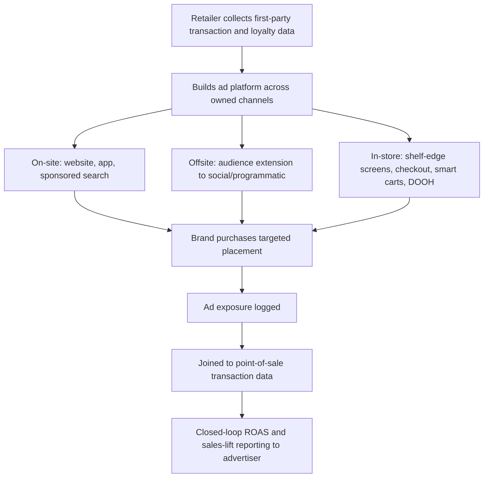

## Retail Media Networks and In-Store Advertising

### Definition

A **retail media network (RMN)** is an advertising platform operated by a retailer that sells ad placements across the retailer's owned and operated media channels — website, mobile app, in-store digital screens, email, and offsite audience extensions — using the retailer's first-party shopper and transaction data for targeting and measurement. The targeting is powered by the retailer's own transaction data — what people actually buy, how often, at what price, and through which channel. In effect, an RMN is the retailer operating as a media company alongside its core merchandising business, monetizing traffic and data assets it already owns rather than relying solely on product margin. [adquick](https://adquick.com/guides/what-is-a-retail-media-network)

**In-store advertising** within an RMN context refers specifically to the physical-store subset of this inventory: digital signage, kiosks, and smart displays that connect brands with consumers in real time, influencing purchase decisions at the shelf. [quad](https://www.quad.com/faq-items/what-are-in-store-retail-media-networks)

### Why Retail Media Exists: The Three-Sided Value Proposition

Retail media networks solve three problems simultaneously: for advertisers, RMNs offer deterministic targeting based on real purchase behavior; for retailers, RMNs create a high-margin revenue stream from existing traffic and data assets; and for shoppers, retail media surfaces relevant products and offers in context, reducing friction in the purchase journey. [adquick](https://adquick.com/guides/what-is-a-retail-media-network)

**Key Points**

- **Deterministic vs. probabilistic targeting**: Unlike traditional digital advertising, which increasingly relies on probabilistic or modeled audience inference (especially post third-party-cookie deprecation), RMN targeting is grounded in verified transaction records — a structural advantage in ad-tech's broader shift toward first-party data.
- **Closed-loop measurement**: Because the retailer controls both the ad exposure and the point of sale, RMNs can report sales attribution within a single owned system, avoiding the cross-platform attribution gaps common in open-web advertising.
- **High-margin revenue diversification**: Ad revenue carries substantially higher margins than retail merchandise margins, making RMNs an increasingly significant profit contributor for large retailers independent of core retail sales performance.

### Market Structure and Scale

Global retail media advertising spend was expected to reach $196.7 billion in 2026, representing roughly 16% of all ad spend worldwide, reflecting the sector's shift from a niche channel to a mainstream advertising category. Retail media networks may be owned by digital-first operations, marketplaces, mass merchandisers, grocers, department stores, category specialists, or delivery services that support retailers, indicating the model has generalized well beyond its original e-commerce-marketplace origins into virtually every retail vertical. [amazon](https://advertising.amazon.com/blog/retail-media-networks)[emarketer](https://emarketer.com/insights/definition-retail-media-networks)

**Key Points**

- The center of gravity in retail media remains concentrated with Amazon and Walmart, with the primary growth edges emerging in in-store, connected TV, and broader commerce media — meaning in-store advertising specifically is characterized as an expansion frontier rather than the current core of the category. [everything-pr](https://everything-pr.com/retail-media-networks-how-advertising-built-on-purchase-data-took-over-digital)
- Industry commentary frames 2026 as a breakout year specifically for in-store digital retail media, suggesting this sub-channel has historically lagged on-site (web/app) retail media in adoption and sophistication. [Unverified] The specific pace and magnitude of this in-store growth trajectory should be verified against current primary market data given how rapidly this space is characterized as evolving. [stratacache](https://stratacache.com/en/?p=520)
- [Inference] The maturity gap between on-site and in-store retail media likely stems from the greater technical and capital complexity of instrumenting physical store measurement (screens, sensors, attribution) compared to the natively-trackable digital environment of a website or app, though this reference cannot state the precise magnitude of that gap with confidence.

### How a Retail Media Network Operates

**Key Points**

- **Platform layer**: A retailer with significant first-party data and traffic builds or licenses an ad-serving platform capable of managing inventory, targeting, and reporting across its owned channels. [adquick](https://adquick.com/guides/what-is-a-retail-media-network)
- **Inventory layer**: Ad placements are defined across on-site (sponsored product listings, display banners), offsite (audience extension onto third-party publishers and social platforms using the retailer's audience segments), and in-store (digital shelf-edge screens, endcap displays, checkout-lane screens, smart carts) surfaces.
- **Data layer**: Loyalty program and transaction data underpin audience segmentation — for example, Kroger's 84.51° retail media unit draws on data from over 60 million loyalty households to build purchase-based targeting segments. [adquick](https://adquick.com/guides/what-is-a-retail-media-network)
- **Measurement layer**: Sales lift and return-on-ad-spend (ROAS) are calculated by joining ad exposure logs to actual point-of-sale transaction data within the retailer's own systems — the "closed loop" that differentiates RMN measurement from open-web attribution modeling.

### In-Store Advertising: Formats and Mechanisms

**Key Points**

- **Digital shelf-edge and endcap screens**: Digital displays integrated into or adjacent to shelving, replacing or supplementing static point-of-purchase signage, capable of dynamic/rotating creative and, in more advanced deployments, contextual triggering (e.g., displaying an ad only when a specific product category is in view or inventory conditions warrant a promotion).
- **Checkout-lane and self-checkout screens**: Leverages the same high-dwell, low-cognitive-load queue position long used for physical impulse merchandising (see Layout, Traffic Flow, and Product Placement), now digitized for dynamic, targetable creative.
- **Smart carts and handheld devices**: Cart-mounted screens or store-provided handheld scanners that can display targeted offers as a shopper moves through the store, combining physical traffic-flow position with digital targeting capability.
- **In-store audio and overhead messaging**: Digitized and increasingly programmatic versions of traditional in-store PA/audio advertising, sold as inventory within the broader RMN rather than negotiated as standalone sponsorships.
- **Programmatic digital-out-of-home (DOOH) convergence**: In-store screens are increasingly bought and sold through the same programmatic infrastructure used for outdoor and out-of-home advertising, rather than through bespoke, manually negotiated retailer contracts — a structural convergence trend reshaping how in-store inventory is transacted. Programmatic DOOH platforms now provide access to over 1 million screens, indicating this convergence is operating at meaningful scale. [adquick](https://adquick.com/guides/what-is-a-retail-media-network)

### Psychological Rationale for In-Store Placement Specifically

In-store advertising inherits and extends the choice-architecture logic of physical merchandising (see Store Atmospherics and Servicescapes; Layout, Traffic Flow, and Product Placement), but adds targetability:

**Key Points**

- **Proximity to point of sale**: Retail media networks bring advertisers closer to the point of sale, meaning ads may be more likely to convert than advertising encountered earlier in the decision journey — in-store advertising represents the closest possible proximity, occurring at or immediately before the moment of purchase decision. [emarketer](https://emarketer.com/insights/definition-retail-media-networks)
- **Low-elaboration decision context**: Consistent with dual-process decision theory (see Anchoring Effects; Promotions, Discounts, and Their Framing), in-store advertising reaches shoppers in a relatively low-elaboration, System-1-dominant state, making salience, simplicity, and immediate relevance more impactful than detailed argumentation.
- **Sponsored product parity with organic merchandising**: In-store digital sponsored placements function analogously to eye-level shelf position (see Shelf Position and Choice Overload) — both are forms of purchased or negotiated visual prominence, but the digital format allows dynamic reallocation of that prominence across advertisers rather than fixed physical placement.

### Retail Media Network Value Flow

### Example: In-Store Retail Media Campaign

A CPG snack brand purchases targeted placement on shelf-edge digital screens within a grocery RMN's snack aisle, timed to display only during peak evening shopping hours (a contextual/dayparting targeting parameter) and limited to stores where the brand's competitor is the current category leader (a first-party-sales-data-informed targeting parameter). Ad exposure is logged by the in-store screen network and subsequently matched against loyalty-card-linked point-of-sale data to calculate incremental sales lift attributable specifically to the campaign — the closed-loop measurement structure distinguishing RMN reporting from traditional in-store signage, which historically could not be tied to individual-transaction-level attribution.

### Boundary Conditions, Risks, and Open Challenges

**Key Points**

- **Measurement standardization**: Industry commentary identifies common pitfalls undermining in-store retail media effectiveness, and the sector generally lacks the cross-retailer measurement standardization that has matured in on-site digital advertising, making cross-network campaign comparison difficult for advertisers operating across multiple retailers. [stratacache](https://stratacache.com/en/?p=520)
- **Consumer experience risk**: Increasing ad density within the physical shopping environment risks the same sensory-overload and reactance dynamics documented in atmospherics research (see Store Atmospherics and Servicescapes) — excessive or poorly targeted in-store advertising can degrade rather than enhance the shopping experience, working against the "reduced friction" value proposition RMNs claim to offer shoppers.
- **Data privacy and disclosure**: In-store targeting that draws on loyalty and transaction history raises the same personalization-transparency considerations discussed under Dynamic and Personalized Pricing Ethics — shoppers are generally less aware that in-store screens may be personalized or targeted compared to their awareness of online ad targeting, which has more established public discourse and disclosure norms.
- **Fragmentation across retailers**: Brands face the operational challenge of operating across a fragmented retail media landscape without overpaying the dominant networks or spreading investment too thin across smaller, less proven networks, a portfolio-allocation problem distinct from the effectiveness of any single network's in-store offering. [everything-pr](https://everything-pr.com/retail-media-networks-how-advertising-built-on-purchase-data-took-over-digital)
- [Inference] As in-store retail media scales, convergence toward standardized measurement currencies (similar to how digital advertising standardized around metrics like viewability and click-through rate) is a plausible trajectory, but the specific standards or governing bodies likely to emerge cannot be confidently predicted from currently available information.

### Related Topics

- Store atmospherics and servicescapes
- Layout, traffic flow, and product placement
- Shelf position and choice overload
- Showrooming, webrooming, and channel-switching behavior
- Dynamic and personalized pricing ethics
- First-party data strategy and post-cookie targeting
- Programmatic advertising and digital-out-of-home (DOOH) infrastructure
- Marketing attribution and closed-loop measurement methodology