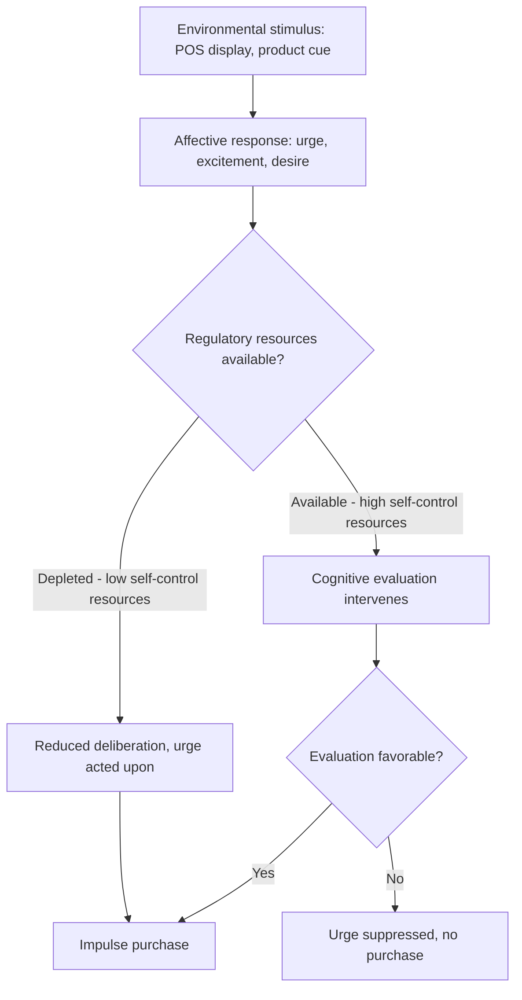

## Point-of-Sale Displays and Impulse-Purchase Triggers

### Definitions

**Point-of-sale (POS) displays** are merchandising fixtures positioned at or near the transaction point of a store — most commonly the checkout lane, but also including free-standing displays, dump bins, and counter units positioned near cash registers or self-checkout stations — designed to capture attention and prompt purchase decisions in the final moments before a shopper completes their transaction. **Impulse-purchase triggers** are the broader set of environmental, product, and psychological cues that prompt an unplanned purchase decision, of which POS displays are one of the most concentrated and well-studied applications.

### Theoretical Foundation: The Impulse Buying Construct

**Key Points**

- **Definitional core**: Impulse buying is characterized in the consumer behavior literature (foundational work by Rook, 1987) as a sudden, often powerful urge to buy immediately, typically accompanied by a hedonic, emotionally-charged quality and reduced deliberation relative to planned purchases.
- **Distinction from unplanned purchase**: Not all unplanned purchases are impulsive in the psychological sense — a purchase can be unplanned but still involve moderate deliberation (e.g., "reminder" buying triggered by seeing a needed item). True impulse buying is characterized by the urge preceding and often overriding deliberation, rather than deliberation simply occurring in-store rather than pre-trip.
- **Rook's dimensions of the impulse buying experience**: Spontaneity, power/compulsion/intensity of urge, excitement/stimulation, and disregard for consequences — a multidimensional construct rather than a single behavioral trigger-response mechanism.

### The Cognitive-Affective Model of Impulse Buying

Impulse buying is generally modeled as resulting from an interaction between environmental stimuli, an individual's affective/emotional state, and situational and individual moderators that determine whether an impulse urge translates into actual purchase behavior.

**Key Points**

- **Self-regulation depletion**: Consumers who have already exercised self-control earlier in a shopping trip (resisting other temptations, making many prior decisions) show reduced capacity to resist subsequent impulse cues — a direct application of ego-depletion / limited-resource models of self-control to the retail checkout context, where POS displays are strategically positioned as the *last* opportunity in the trip, after self-regulatory resources have already been taxed by earlier decisions.
- **Affect-as-information**: Positive mood states (often induced by store atmospherics — see Store Atmospherics and Servicescapes) have been shown to increase impulse buying susceptibility, consistent with a broader finding that positive affect increases risk tolerance and reduces systematic deliberation.

### Why Checkout Position Is Structurally Optimal for Impulse Triggers

**Key Points**

- **Captive attention with low competing task demand**: The queue is one of the few points in a shopping trip where the primary task (product selection) is complete and cognitive resources are otherwise idle, making the environment unusually receptive to low-effort, low-consideration purchase prompts.
- **Forced dwell time**: Unlike aisle browsing (which a shopper controls and can accelerate through), queue time is often externally imposed by store throughput, guaranteeing a minimum exposure duration to checkout-adjacent merchandising regardless of shopper intent.
- **Low price-point, low-risk framing**: Checkout impulse items are near-universally low-priced relative to the primary basket, minimizing the perceived financial risk and decision effort required to add the item — consistent with impulse buying research showing susceptibility is inversely related to perceived purchase risk and commitment.
- **Terminal position in the decision journey**: Because checkout is the final decision point, any resistance built up earlier in the trip (having successfully avoided other temptations) does not protect against checkout-stage prompts — the position exploits the fact that self-control is a depletable, not renewable-within-trip, resource.

### Categories of POS/Impulse Merchandise

**Key Points**

- **Low-consideration consumables**: Candy, gum, single-serve snacks — categories requiring essentially no comparison shopping or deliberation, ideal for the low-cognitive-resource checkout context.
- **Seasonal and topical items**: Holiday-specific or trending items placed at checkout to capture attention through novelty/timeliness rather than habitual repurchase.
- **Small-format accessories and add-ons**: Batteries, phone chargers, travel-size personal care items — often functioning as "reminder" purchases (the display cues awareness of a genuine but forgotten need) rather than pure hedonic impulse, illustrating that POS displays serve both impulse and reminder-purchase functions simultaneously.
- **Price-point-bracketed impulse items**: Retailers frequently curate checkout assortments within a narrow, low price band (e.g., all items under a specific threshold) to minimize the cognitive "is this worth it" evaluation, keeping the purchase decision close to automatic.

### Design Principles for POS Display Effectiveness

**Key Points**

- **Visual salience and contrast**: POS displays typically use higher color saturation, contrast, and packaging distinctiveness than shelf-based merchandising, since they must capture attention within a brief, low-motivation glance rather than relying on deliberate search.
- **Quantity and facing density**: Dense, abundant-looking displays (dump bins, multi-facing counter displays) can leverage the same social-proof-adjacent "popularity" signal documented in shelf-facing research (see Shelf Position and Choice Overload) — abundance can imply desirability.
- **Proximity to register/payment point**: Placement is optimized to be within easy reach without requiring the shopper to leave the queue line, minimizing the physical effort barrier to adding an item.
- **Limited assortment depth**: Unlike category aisles, POS displays intentionally offer very narrow assortment (few SKUs, sometimes single-SKU dump bins) — consistent with choice-overload mitigation principles (see Shelf Position and Choice Overload), since a checkout-stage shopper has minimal motivation to compare multiple options and a large assortment would undermine rather than support quick impulse conversion.
- **Self-checkout and digital adaptation**: The rise of self-checkout kiosks has required redesigning POS impulse strategy, since self-checkout stations often have less physical display space than staffed lanes; retailers increasingly compensate with digital screen prompts at self-checkout terminals (see Retail Media Networks and In-Store Advertising) offering targeted add-on suggestions in place of physical dump bins.

### Digital and E-Commerce Analogues to POS Impulse Triggers

**Key Points**

- **Cart-page and checkout-page upsells**: "Frequently bought together," "add this for $X more," and similar checkout-page prompts in e-commerce function as the direct digital analogue of physical POS displays — same terminal-position logic, same low-price-point framing, same narrow assortment principle.
- **One-click and saved-payment friction reduction**: Reduced purchase-completion friction (stored payment details, one-click reorder) increases the behavioral proximity between impulse and action in digital contexts, analogous to how physical proximity to the register reduces effort barriers in-store.
- **Countdown and limited-quantity cues at digital checkout**: Digital equivalents of urgency-based impulse triggers (e.g., "only 2 left," countdown timers) combine impulse-purchase mechanisms with scarcity psychology, layering an additional urgency trigger onto the terminal-position advantage.

### Boundary Conditions and Moderators

**Key Points**

- **Individual trait differences**: Consumers vary in trait impulsiveness (a stable individual-difference construct measurable via established impulsiveness scales), and high-trait-impulsive individuals show systematically greater susceptibility to POS triggers than low-trait-impulsive individuals, independent of any specific display design.
- **Mood and stress state**: Negative affect and stress have shown mixed effects in the impulse-buying literature — some research links negative mood to increased impulse buying as a mood-repair mechanism ("retail therapy"), while other findings suggest stress can reduce impulse buying via increased cognitive narrowing on the primary task; the direction is likely moderated by the specific emotion and coping style involved rather than following a single consistent pattern. [Inference] This mixed pattern in the literature suggests context-specific testing is more reliable than a general assumption about mood-state effects on impulse susceptibility in a given retail setting.
- **Shopping companion presence**: Shopping with children has long been associated with increased impulse purchase incidence (pester-power dynamics), while shopping with a spending-conscious companion can suppress impulse behavior through social accountability — companion presence is a well-established situational moderator.
- **Cultural and regulatory considerations**: Placement of certain impulse categories (candy, sugary snacks) at checkout has drawn regulatory and public-health attention in some jurisdictions given concerns about pediatric exposure and dietary impact, particularly regarding child-eye-level placement near checkout. [Unverified] Specific regulatory restrictions on checkout merchandising vary by jurisdiction and are subject to change; verify current local requirements before implementation.
- **Post-purchase regret**: Impulse purchases are associated with higher rates of post-purchase regret than planned purchases in some studies, an outcome relevant to long-term brand and retailer trust considerations even where the immediate transaction is completed successfully.

### Example: Checkout Lane Curation Logic

A supermarket checkout lane is stocked with single-serve candy (under $2), a narrow selection of 6–8 SKUs, arranged in dense multi-facing blocks, positioned within arm's reach of the queue line, with brighter packaging than the equivalent multi-packs sold in the confectionery aisle. This reflects the combined application of low price-point framing, narrow assortment (choice-overload mitigation), visual salience design, and terminal-position self-regulation-depletion logic described above — each principle reinforcing the others rather than operating independently.

### Related Topics

- Store atmospherics and servicescapes
- Layout, traffic flow, and product placement
- Shelf position and choice overload
- Retail media networks and in-store advertising
- Self-control depletion and consumer decision-making
- Scarcity and urgency cues in promotional messaging
- E-commerce cart and checkout-page design
- Post-purchase regret and consumer satisfaction