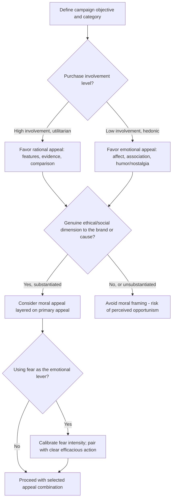

## Advertising Appeals: Rational, Emotional, Moral

### Definition and Classification Origin

An **advertising appeal** is the central persuasive strategy or psychological angle an advertisement uses to motivate the target audience toward a desired attitude or behavior. The tripartite classification into rational, emotional, and moral appeals traces conceptually to Aristotle's classical rhetorical framework of **logos** (rational/logical appeal), **pathos** (emotional appeal), and **ethos**, with moral appeals in the marketing context most closely mapped to a combination of ethos (credibility/character) and a values-based extension of pathos oriented toward the audience's sense of right and wrong rather than personal feeling alone.

### Rational Appeals (Logos-Based)

**Definition**: Rational appeals persuade by presenting factual information, functional benefits, logical arguments, and evidence-based claims about a product's attributes, performance, or value proposition, engaging the audience's deliberative, System-2-type cognitive processing.

**Key Points**

- **Feature-benefit structure**: Rational appeals typically follow a feature → benefit → proof structure (e.g., "contains X ingredient" → "which does Y for you" → "as demonstrated by Z evidence/testing").
- **Comparative appeals**: A specific rational appeal subtype that explicitly contrasts the advertised product against a competitor or category norm on measurable attributes (price, performance, durability).
- **Testimonial and demonstration appeals**: Using expert endorsement, third-party certification, or direct product demonstration to substantiate rational claims — these blend rational content with a credibility (ethos) component.
- **Best-suited contexts**: Rational appeals are generally more effective for high-involvement, utilitarian purchase categories where the audience is motivated and able to process detailed information (per the Elaboration Likelihood Model's central-route processing conditions — see Related Topics), such as financial services, technology, insurance, and B2B purchasing.

### Emotional Appeals (Pathos-Based)

**Definition**: Emotional appeals persuade by evoking a specific affective state — happiness, fear, nostalgia, humor, sadness, love, pride, or excitement — and associating that affective state with the brand or product, engaging more automatic, System-1-type affective processing rather than deliberative evaluation.

**Key Points**

- **Discrete emotion targeting**: Effective emotional advertising research (building on discrete emotion theory rather than treating "emotion" as a single undifferentiated construct) shows that different specific emotions produce different behavioral and attitudinal effects — humor tends to increase attention and likability but not necessarily persuasion strength on its own; fear appeals can increase message engagement but only within a specific intensity range (see Fear Appeals below); nostalgia has been shown to increase brand attachment and willingness to pay a premium by linking the brand to positive self-relevant memories.
- **Affect transfer mechanism**: The theoretical basis for emotional appeal effectiveness is affect transfer/classical conditioning — repeated pairing of a brand with a positive affective stimulus can create an associative link such that the brand itself begins to elicit the associated emotion, independent of any factual claim about the product.
- **Emotional appeals and low-involvement categories**: Emotional appeals are particularly prevalent and effective in low-involvement, hedonic, or parity-product categories (soft drinks, snacks, fragrance, apparel) where functional differentiation between competing brands is minimal and the primary differentiator available to marketers is brand meaning and feeling rather than objective attribute superiority.
- **Fear appeals — a special case**: Fear-based appeals (common in public health, insurance, and safety-related advertising) follow a documented **curvilinear (inverted-U) relationship** with persuasion, formalized in Protection Motivation Theory (Rogers, 1975) — appeals with too little fear fail to motivate attention or action, while appeals with excessive fear can trigger defensive avoidance or message rejection (the audience copes with the fear by dismissing the message rather than changing behavior) rather than the intended behavior change. Effective fear appeals must be paired with a clear, credible, and efficacious recommended action (high "response efficacy" and "self-efficacy" in Protection Motivation Theory terms), or the fear response is more likely to produce avoidance than compliance.

### Moral Appeals (Values-Based)

**Definition**: Moral appeals persuade by invoking the audience's sense of ethical obligation, social responsibility, fairness, or shared values, positioning the advertised behavior (purchase, donation, brand switch) as an expression of the audience's moral identity rather than a purely self-interested rational or emotional choice.

**Key Points**

- **Cause-related and social-responsibility appeals**: Advertising that links a purchase to a charitable outcome, environmental benefit, or social cause (e.g., "a portion of proceeds supports X") frames consumption as a moral act, leveraging consumers' desire for **moral self-licensing** or **warm-glow giving** (the psychological reward derived from an altruistic act, independent of the act's actual impact).
- **Identity-congruence mechanism**: Moral appeals are most effective when the advocated behavior is framed as congruent with an identity the audience already values (e.g., "as someone who cares about X, you would choose Y") — a mechanism distinct from pure emotional appeal because it operates through self-concept maintenance rather than affective state induction alone.
- **Risk of perceived moral opportunism ("woke-washing" / "greenwashing")**: Moral appeals carry a documented reputational risk when audiences perceive the moral claim as inauthentic or purely instrumental (a marketing tactic rather than a genuine organizational value) — perceived moral opportunism has been shown to produce backlash effects more severe than simply omitting a moral claim altogether, since it introduces a credibility violation on top of the underlying product evaluation.
- **Fairness and justice framing**: A specific moral appeal subtype invokes fairness norms directly (e.g., pricing framed as "fair" relative to a reference point — see Promotions, Discounts, and Their Framing and its discussion of the dual entitlement principle), positioning the brand as an ethical market actor rather than simply a value-maximizing one.

### Comparative Framework

| Appeal Type | Primary Processing Mode | Core Mechanism | Best-Fit Contexts | Key Risk |
| --- | --- | --- | --- | --- |
| Rational | Deliberative (System 2) | Feature-benefit-proof logic | High-involvement, utilitarian, technical categories | Perceived as dry/uncompelling if overused in low-involvement categories |
| Emotional | Affective/automatic (System 1) | Affect transfer, associative conditioning | Low-involvement, hedonic, parity-product categories | Fear appeals backfiring via defensive avoidance if miscalibrated |
| Moral | Identity/values-based | Self-concept congruence, warm-glow | Cause-driven brands, categories with genuine social/environmental stakes | Backlash from perceived opportunism ("greenwashing") |

### Appeal Selection Decision Process

### Combined and Hybrid Appeals

**Key Points**

- Real advertising campaigns frequently combine appeal types rather than using a single pure form — a rational core claim (functional superiority) delivered through an emotionally engaging narrative, or a moral appeal reinforced by rational proof points (e.g., a sustainability claim substantiated with specific verified metrics), is common practice rather than an exception.
- The **Elaboration Likelihood Model** (Petty & Cacioppo, 1986) provides a theoretical bridge explaining why hybrid appeals often outperform pure forms: strong rational arguments matter most when audience motivation and ability to process (elaborate) is high, while peripheral cues (emotional tone, source attractiveness, moral framing) matter most when motivation or ability is low — a well-designed campaign can be layered to succeed across varying audience elaboration conditions simultaneously.

### Example: Same Product, Three Appeal Executions

A reusable water bottle brand could be advertised three ways: **Rational** — "Keeps drinks cold for 24 hours, tested against leading competitors, made from double-wall vacuum-insulated stainless steel" (feature-benefit-proof structure). **Emotional** — a wordless narrative ad showing a person's outdoor adventures across seasons, associating the product with feelings of freedom and vitality rather than stating any functional claim. **Moral** — "Every bottle sold removes one pound of ocean plastic, verified by our third-party environmental partner," framing the purchase as a moral act contingent on credible substantiation to avoid greenwashing backlash.

### Boundary Conditions and Moderators

**Key Points**

- **Cultural variation in appeal effectiveness**: Cross-cultural advertising research has found systematic differences in appeal preference and effectiveness across individualist vs. collectivist cultural contexts (e.g., appeals emphasizing individual benefit vs. in-group/family benefit), meaning appeal strategy generalization across markets without localization carries meaningful risk. [Inference] This is a well-supported general pattern in cross-cultural advertising research, though the specific magnitude of the effect for any given appeal and market pairing would need market-specific testing rather than a universal assumption.
- **Regulatory constraints on moral and fear appeals**: Advertising standards bodies in various jurisdictions impose substantiation requirements on environmental and social claims (moral appeals) and restrict manipulative fear-based advertising in sensitive categories (health, financial services, advertising to children). [Unverified] Specific regulatory thresholds and enforcement practices vary by jurisdiction and are subject to change; verify current requirements before implementation.
- **Audience skepticism and advertising literacy**: Increasing consumer awareness of persuasion tactics (persuasion knowledge, per Friestad & Wright's Persuasion Knowledge Model, 1994) can reduce the effectiveness of appeals perceived as manipulative or overly transparent in their persuasive intent, a consideration relevant across all three appeal types but particularly acute for moral appeals given the added credibility-violation risk described above.

### Related Topics

- Elaboration Likelihood Model and dual-process persuasion theory
- Fear appeals and Protection Motivation Theory
- Persuasion Knowledge Model and consumer skepticism
- Cause-related marketing and greenwashing risk
- Source credibility and endorser effects in advertising
- Nostalgia marketing and brand attachment
- Cross-cultural advertising strategy
- Promotions, discounts, and their framing