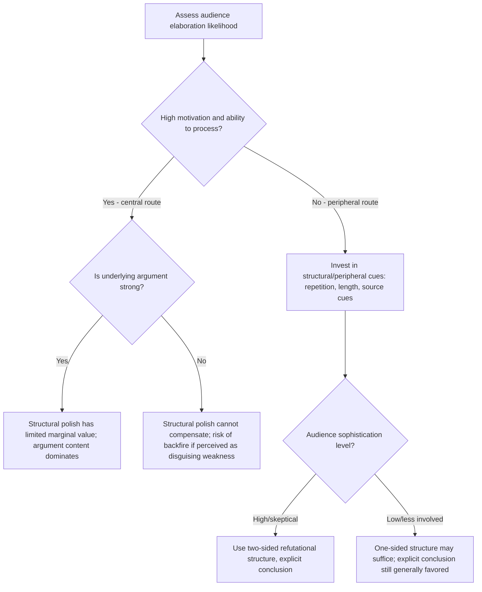

## Message Structure and Argument Strength

### Definition and Scope

**Message structure** refers to the formal organization of a persuasive communication — the ordering, framing, and presentation format of its component claims — independent of the specific content of those claims. **Argument strength** refers to the perceived cogency, evidentiary support, and logical soundness of the claims themselves, as evaluated by the message recipient. These are analytically distinct but interacting dimensions: the same underlying argument can be made more or less persuasive purely through structural choices, and the same structural choice can produce different effects depending on whether the underlying argument is strong or weak.

### Theoretical Foundation: The Elaboration Likelihood Model

The dominant theoretical framework for understanding when message structure versus argument content drives persuasion is the **Elaboration Likelihood Model (ELM)** (Petty & Cacioppo, 1986), which posits two routes to attitude change:

**Key Points**

- **Central route processing**: Occurs when the audience has both the motivation and ability to think carefully about message content — under central-route conditions, argument strength is the dominant driver of persuasion, and structural/peripheral cues matter comparatively little.
- **Peripheral route processing**: Occurs when motivation or ability to elaborate is low — under peripheral-route conditions, structural and surface cues (message length, source attractiveness, number of arguments presented, repetition) drive persuasion largely independent of argument quality, since the audience is not deeply processing the content itself.
- **Practical implication for message design**: A campaign's audience elaboration likelihood (driven by involvement, personal relevance, and prior knowledge) should determine whether design effort is invested primarily in strengthening argument content (central-route audiences) or in structural/peripheral execution quality (peripheral-route audiences).

### Defining Argument Strength

Argument strength is formally defined in the ELM literature not as an objective, message-inherent property but as **a function of the arguments a recipient generates in response to the message** — a "strong" argument is one that predominantly elicits favorable cognitive responses (agreement, supportive thoughts) when a motivated recipient elaborates on it, while a "weak" argument predominantly elicits counterarguing or unfavorable thoughts.

**Key Points**

- **Evidentiary support**: Claims backed by specific data, statistics, or verifiable sources are generally perceived as stronger than unsupported assertions, though the specific evidentiary threshold that constitutes "strong" varies by audience expertise and involvement.
- **Claim-evidence-warrant structure**: Effective argument construction (drawing on classical Toulmin argumentation theory) links a claim to supporting evidence via an explicit or implicit warrant (the reasoning connecting evidence to claim) — arguments with a clear, audience-acceptable warrant are processed as stronger than those requiring the audience to independently construct the connecting logic.
- **Vividness vs. statistical evidence**: Research on evidence type effects has produced mixed findings regarding whether vivid, narrative/case-based evidence or dry statistical/base-rate evidence produces stronger persuasion — vivid evidence often produces stronger short-term attitude and emotional impact, while statistical evidence may produce more durable belief change under high-elaboration conditions, though the relative effectiveness is moderated by topic and audience involvement rather than following a single universal pattern. [Inference] Given the mixed empirical picture on vividness versus statistical evidence across studies, message designers should treat this as a testable design variable specific to their context rather than assume a universal superiority of either evidence type.

### Message Structure Variables

#### 1. Message Sidedness: One-Sided vs. Two-Sided Arguments

**Key Points**

- **One-sided messages** present only supporting arguments for the advocated position, omitting counterarguments or competitor comparisons.
- **Two-sided messages** acknowledge counterarguments or limitations (sometimes including a competitor's advantage) before refuting them or contextualizing them as outweighed by the overall case — a structure associated with **inoculation theory** (McGuire, 1961), in which pre-exposing an audience to a weakened counterargument builds resistance to subsequent, stronger counter-persuasion from competitors or skeptical sources.
- **Moderating condition — audience sophistication**: Two-sided messages tend to outperform one-sided messages with more educated, skeptical, or already-aware audiences (since acknowledging a limitation increases perceived source credibility and honesty), while one-sided messages can be equally or more effective with less sophisticated or less involved audiences, where introducing a counterargument risks simply introducing doubt without the sophistication to appreciate the refutation.
- **Refutational vs. non-refutational two-sided messages**: A critical structural distinction — a two-sided message that raises a counterargument *and* refutes it is generally more persuasive than one that raises a counterargument without refutation, since an unrefuted counterargument can leave a lingering doubt rather than building resistance.

#### 2. Conclusion Explicitness: Explicit vs. Implicit Conclusions

**Key Points**

- **Explicit conclusion messages** directly state the intended takeaway or recommended action ("Therefore, X is the better choice").
- **Implicit conclusion messages** present the supporting evidence or narrative and allow the audience to draw the conclusion themselves.
- Meta-analytic findings generally favor explicit conclusions for maximizing persuasion, since audiences frequently fail to draw the intended conclusion on their own or draw an unintended one — implicit conclusions carry a documented risk of individual variance in the inferred takeaway.
- **Exception — highly involved or skeptical audiences**: Implicit conclusions can outperform explicit ones when the audience is motivated to process the message and may perceive an overly explicit "hard sell" conclusion as intrusive on their own reasoning process, triggering reactance.

#### 3. Order of Arguments: Primacy vs. Recency

**Key Points**

- **Primacy effects**: In many message contexts, arguments presented first receive disproportionate weight and memorability, particularly when audience attention is expected to decline over the course of the message.
- **Recency effects**: Arguments presented last can receive disproportionate weight when there is a delay between message exposure and the judgment/decision point, since the most recently processed information is more accessible in memory at decision time.
- **Practical structuring implication**: Placing the strongest argument first is a common default heuristic given typical declining-attention patterns in advertising contexts (especially short-format ads), though the primacy/recency balance is contingent on message length, delay to decision, and the specific memory and judgment task involved.

#### 4. Repetition and Message Length

**Key Points**

- **Repetition and the mere exposure effect**: Repeated exposure to a message or stimulus has been shown to increase liking and perceived truth independent of argument content (the "mere exposure effect," Zajonc, 1968, and the related "illusory truth effect" for repeated claims) — a structural/peripheral-route mechanism rather than a central-route argument-strength effect.
- **Wear-out and diminishing returns**: Repetition effects on liking and persuasion follow a curvilinear pattern — moderate repetition increases familiarity and positive affect, but excessive repetition can produce tedium, irritation, and even reactance against the message ("advertising wear-out"), meaning there is an empirically-supported optimal repetition range rather than a monotonic "more repetition is always better" relationship.
- **Message length as a peripheral cue**: Under low-elaboration conditions, longer messages (more arguments presented, regardless of individual argument quality) can produce a "quantity implies quality" heuristic effect — a documented peripheral-route mechanism distinct from central-route argument evaluation, meaning message length can persuade a low-involvement audience even without corresponding gains in genuine argument strength.

### Interaction Between Structure and Argument Strength

A core ELM finding with direct message-design implications: peripheral cues (structural features) have their largest independent effect on persuasion specifically when argument strength is weak or ambiguous, or when elaboration likelihood is low. Under high-elaboration conditions with genuinely strong arguments, structural embellishment adds comparatively little, and under high-elaboration conditions with genuinely weak arguments, structural polish cannot compensate — a motivated, high-ability audience will counterargue against weak content regardless of its presentation quality, and in some documented cases, evident "packaging" attempting to disguise weak content can trigger heightened scrutiny and more negative response than presenting the same weak argument plainly.

### Example: Same Argument, Two Structural Executions

**Weak structure**: An ad for a productivity app lists ten minor features in rapid succession with no explicit conclusion, leaving the audience to infer why the product is superior — under low elaboration, this may rely purely on a "quantity implies quality" peripheral heuristic and risks the audience failing to draw any specific conclusion.

**Stronger structure**: The same ad opens with its single strongest claim (time saved per week, backed by a specific study or user statistic — a primacy-weighted, evidence-supported claim), acknowledges a common objection ("some worry a new tool means a learning curve"), refutes it directly (a two-sided refutational structure), and closes with an explicit stated conclusion and recommended action. This restructuring changes none of the underlying facts about the product but applies primacy ordering, two-sided refutation, evidentiary support, and explicit conclusion — the structural variables covered above — to the identical underlying argument content.

### Boundary Conditions and Moderators

**Key Points**

- **Prior attitude and involvement**: Audiences with strong prior attitudes (especially attitudes opposed to the advocated position) tend to counterargue more actively regardless of message structure, meaning structural techniques such as two-sided refutation are more consistently valuable for attitude-discrepant or skeptical audiences than for already-favorable ones.
- **Channel and format constraints**: Structural options are constrained by format — a six-second video ad cannot deploy an extended two-sided refutational argument the way a long-form print or content-marketing piece can, meaning structural strategy must be matched to the format's available elaboration time and space.
- **Cultural variation in argumentation norms**: Preferences for direct/explicit versus indirect/implicit conclusion styles and for confrontational versus harmonious two-sided argumentation have been documented to vary across cultural communication norms (e.g., high-context vs. low-context communication cultures), meaning message structure recommendations derived from one cultural context should not be assumed to transfer without adaptation. [Inference] This follows from well-established cross-cultural communication research, though the specific structural adaptations optimal for any given market pairing would require market-specific testing rather than a generic assumption.
- **Regulatory and disclosure considerations**: Some categories (pharmaceutical, financial services) have specific regulatory requirements regarding balanced disclosure of risks/side effects, which effectively mandate a form of two-sided structure regardless of persuasion-optimality considerations. [Unverified] Specific disclosure requirements vary substantially by jurisdiction, category, and are subject to regulatory change; verify current requirements before implementation.

### Related Topics

- Elaboration Likelihood Model and dual-process persuasion theory
- Advertising appeals: rational, emotional, moral
- Inoculation theory and resistance to persuasion
- Mere exposure effect and the illusory truth effect
- Source credibility and endorser effects in advertising
- Persuasion Knowledge Model and consumer skepticism
- Advertising wear-out and repetition scheduling
- Toulmin argumentation model