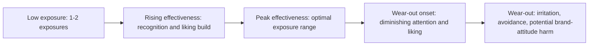
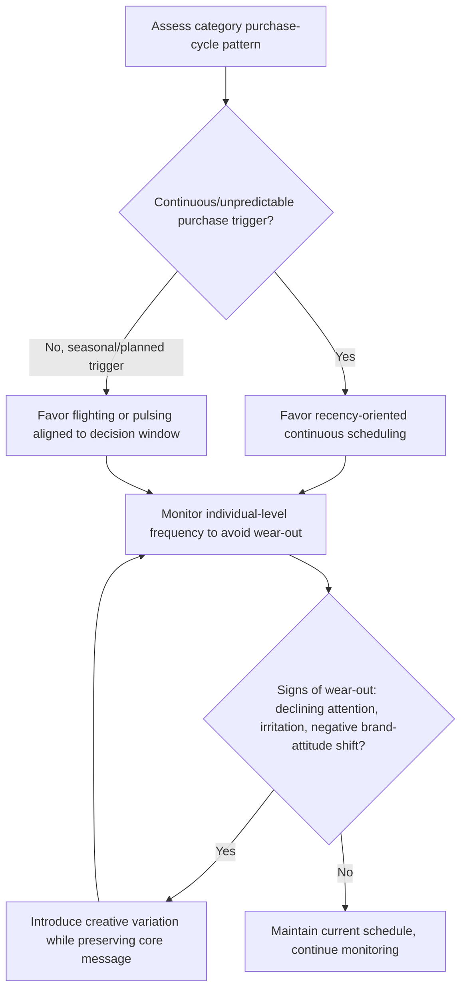

## Repetition, Wear-Out, and Recency Effects

### Definitions

**Repetition** refers to the repeated exposure of an audience to the same or substantially similar advertising message over time. **Wear-out** refers to the documented decline in advertising effectiveness — reduced attention, liking, and persuasive impact — that occurs after a certain threshold of repeated exposure to the same execution, distinguishing repetition's early beneficial effects from its later diminishing and potentially negative effects. **Recency effects** in this context refer to the media-planning and cognitive-psychology finding that advertising exposure closest in time to a purchase decision carries disproportionate influence on that decision, informing scheduling strategy independent of the total repetition volume.

### Theoretical Foundation: The Mere Exposure Effect

The foundational psychological mechanism underlying repetition's early positive effects is the **mere exposure effect** (Zajonc, 1968), which demonstrated that repeated exposure to a stimulus increases liking for that stimulus independent of any conscious recognition or cognitive evaluation of its content — a purely exposure-driven affective mechanism operating largely outside deliberate processing.

**Key Points**

- **Processing fluency as the underlying mechanism**: The leading explanatory account for mere exposure holds that repeated exposure increases perceptual/processing fluency (the stimulus becomes easier and faster to process), and this fluency is misattributed by the audience as positive affect or preference — a well-established finding in fluency-affect research.
- **Curvilinear function**: Mere exposure effects on liking are not monotonic — liking increases with repetition up to a point but then plateaus and can reverse into satiation or irritation with continued exposure, which is the direct theoretical link to advertising wear-out.
- **Illusory truth effect**: A related mechanism specific to factual/claim-based repetition — repeated exposure to a claim increases its perceived truthfulness independent of its actual accuracy or the presence of supporting evidence (Hasher, Goldstein & Toppino, 1977), relevant to repeated advertising claims about product attributes or performance.

### The Wear-Out Curve

Advertising wear-out is typically modeled as an inverted-U or declining function of cumulative exposure (often operationalized as exposure frequency or "effective frequency" within a campaign period), with three broadly recognized phases:

**Key Points**

- **Phase 1 — building recognition**: Initial exposures build basic stimulus recognition and message comprehension, particularly important for unfamiliar brands or complex messages, where a single exposure may be insufficient for the message to register or be processed.
- **Phase 2 — the effective frequency plateau**: A range of exposure frequency associated with peak persuasive impact — historically debated in media planning practice (e.g., the long-referenced but contested "rule of three" heuristic proposing three exposures as a minimum effective threshold), though contemporary research treats optimal frequency as highly contingent on message complexity, category familiarity, and competitive clutter rather than a fixed universal number. [Unverified] Specific optimal-frequency figures vary substantially across studies, media context, and time period; the classical "rule of three" and similar fixed-frequency heuristics from earlier media-planning literature should be treated as historically influential rules of thumb rather than empirically fixed constants for contemporary media environments.
- **Phase 3 — wear-out and potential wear-in reversal**: Beyond the effective frequency range, continued exposure produces diminishing marginal returns and eventually negative returns — increased irritation, tune-out, and in some documented cases measurable harm to brand attitude, not merely a plateau in benefit.
- **Creative variation as a wear-out mitigation strategy**: Varying the specific execution (different visuals, scenarios, or creative treatments) while maintaining the same core message and branding has been shown to extend the effective exposure range before wear-out onset, since novelty in surface execution can refresh processing fluency benefits without requiring the audience to learn an entirely new message.

### Moderators of Wear-Out Onset

**Key Points**

- **Message complexity**: More complex messages requiring more processing to fully comprehend tend to tolerate more repetition before wear-out onset, since additional exposures continue to yield comprehension gains for longer; simple messages reach their comprehension ceiling faster and wear out sooner.
- **Involvement level**: Low-involvement audiences (who are not deeply engaging with message content) tend to show faster wear-out for a fixed execution, since the peripheral, exposure-driven liking mechanism saturates relatively quickly without the sustained interest that comes from central-route engagement with content.
- **Ad likability and entertainment value**: More entertaining or likable initial executions have been associated with slower wear-out onset, consistent with the idea that a positive initial affective response provides a larger "buffer" before satiation effects dominate.
- **Media context and clutter**: Advertising wear-out has been found to interact with the broader competitive and media clutter environment — a message repeated frequently within a highly cluttered media environment may wear out faster (or be recognized less clearly in the first place) than the same repetition schedule in a lower-clutter environment.

### Recency Effects and Media Scheduling Theory

Recency planning theory, most associated with Erwin Ephron's work in media planning (1990s), proposed a specific strategic implication distinct from wear-out management: because many product categories have continuous, rolling purchase cycles (someone is "in the market" on any given day), the media planning objective should prioritize achieving broad reach with minimal but continuous frequency close to the point of purchase decision, rather than concentrating heavy frequency into short bursts (a "flighting" or "pulsing" pattern).

**Key Points**

- **Recency planning vs. traditional effective-frequency planning**: This represents a genuine strategic divergence in media planning philosophy — effective-frequency approaches (see Phase 2 above) argue for reaching a smaller audience with sufficient repeated frequency to build comprehension and persuasion, while recency planning argues for reaching the broadest possible audience with continuous but minimal frequency, on the theory that a single well-timed exposure closest to the purchase decision often outperforms the marginal value of additional frequency built up earlier and further from the decision point.
- **Category purchase-cycle dependency**: Recency planning's applicability is contingent on the category having a continuous, unpredictable purchase trigger (e.g., many packaged goods, where "who needs this today" cannot be precisely predicted) versus categories with more predictable, seasonal, or planned purchase cycles (e.g., major durable goods, tax preparation services), where concentrated flighting timed to the predictable decision window may be more appropriate than continuous minimal-frequency reach.
- **Interaction with wear-out**: Recency-oriented continuous scheduling (lower frequency per individual, spread over more time) is generally more wear-out-resistant than concentrated flighting (higher frequency per individual in a shorter window), since it inherently limits how many times a given individual encounters the specific execution within a compressed timeframe.

### Media Scheduling Pattern Comparison

| Pattern | Description | Wear-Out Risk | Best-Fit Category Context |
| --- | --- | --- | --- |
| Continuous | Steady advertising presence at a constant (often lower) frequency throughout a period | Lower — frequency per individual stays modest | Continuous/rolling purchase-cycle categories (recency-planning-aligned) |
| Flighting | Concentrated bursts of advertising separated by periods of no advertising | Higher within bursts — frequency spikes for a shorter audience segment | Seasonal categories, product launches, planned promotional windows |
| Pulsing | A continuous baseline presence with periodic intensity increases | Moderate — combines continuous reach with targeted frequency boosts | Categories with both a baseline demand and predictable seasonal peaks |

### Decision Framework: Repetition and Scheduling Strategy

### Example: Contrasting Category Applications

A fast-moving consumer packaged good (e.g., a snack brand) with continuous, unpredictable daily purchase triggers across its audience is a strong candidate for recency-oriented continuous scheduling — broad reach at modest, sustained frequency, since any given day could be someone's purchase-trigger moment and concentrated bursts would leave long gaps of zero presence for a rolling audience. A tax-preparation service, by contrast, has a highly predictable, concentrated seasonal decision window — a flighting strategy concentrating higher frequency in the weeks immediately preceding the relevant filing deadline aligns media investment with the actual decision window rather than spreading it thin across months when the category is not top-of-mind for most of the audience.

### Boundary Conditions and Moderators

**Key Points**

- **Individual difference in exposure tolerance**: Wear-out onset thresholds are documented to vary across individuals based on general need-for-cognition, category involvement, and prior brand attitude, meaning aggregate wear-out curves represent an average across a heterogeneous audience rather than a fixed threshold applicable to every individual.
- **Digital/programmatic frequency capping**: Contemporary digital advertising infrastructure allows for individual-level frequency capping (limiting how many times a specific user sees a specific ad within a period), providing a direct technical mitigation for wear-out that was not available in traditional broadcast-era media planning, where frequency could only be managed at the aggregate/audience level.
- **Cross-channel frequency measurement challenges**: As advertising spans multiple channels and devices, accurately measuring true cumulative individual-level frequency (as opposed to per-channel frequency) remains a persistent measurement challenge, complicating precise wear-out and effective-frequency management in fragmented, omnichannel media environments. [Inference] This measurement challenge is a reasonable extension of well-documented cross-device attribution difficulties (see Showrooming, Webrooming, and Channel-Switching Behavior) into the frequency-management domain specifically, though the precise practical impact on wear-out management in any given campaign would depend on the specific measurement infrastructure available.
- **Negative wear-out and brand harm**: In documented cases, severe advertising wear-out has been associated with measurable negative shifts in brand attitude, not merely reduced ad recall or engagement — meaning wear-out mismanagement carries a genuine brand-equity risk beyond simple media efficiency loss.

### Related Topics

- Message structure and argument strength
- Advertising appeals: rational, emotional, moral
- Illusory truth effect and repeated-claim persuasion
- Media planning: effective frequency vs. recency theory
- Processing fluency and its effects on preference and judgment
- Programmatic advertising and individual-level frequency capping
- Brand attitude formation and measurement
- Elaboration Likelihood Model and dual-process persuasion theory