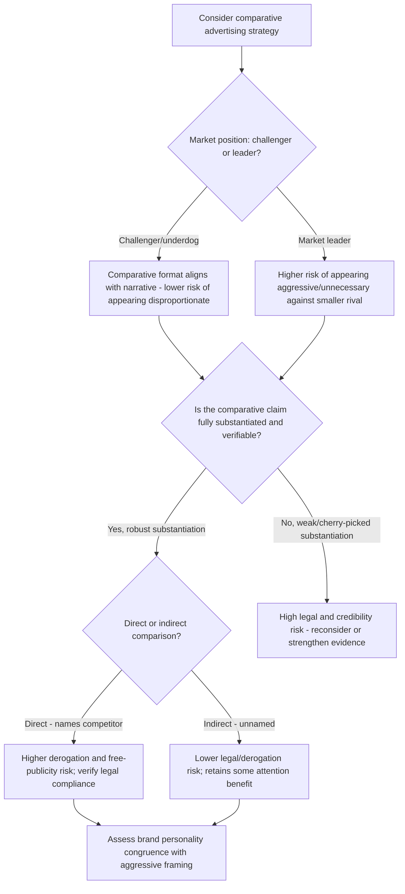

## Comparative Advertising and Its Risks

### Definition and Classification

**Comparative advertising** is a persuasive message format that explicitly names, references, or unambiguously identifies a competitor (or a class of competitors) and asserts a claim of superiority or difference relative to that competitor on one or more attributes. It is typically classified into three types based on directness of comparison:

**Key Points**

- **Direct comparative advertising**: Explicitly names the competitor brand (e.g., "Brand X outperforms Brand Y on Z").
- **Indirect comparative advertising**: References a competitor without naming it explicitly, using terms like "the leading brand" or "other leading detergents" while remaining identifiable to the audience.
- **Non-comparative advertising**: Makes claims about the advertised brand's attributes without any explicit or implicit reference to a specific competitor, serving as the baseline against which comparative advertising's distinct effects are measured in research.

### Theoretical Foundation

Comparative advertising's effects are best understood as an application of both **argument strength/message structure theory** (see Message Structure and Argument Strength) and **source credibility theory**, since a comparative claim simultaneously makes a rational argument and implicitly asserts something about the credibility and fairness of the advertiser making it.

**Key Points**

- **Attention and elaboration effects**: Comparative ads have been shown in meta-analytic research (Grewal, Kavanoor, Fern, Costley & Barnes, 1997, a foundational meta-analysis of comparative advertising effects) to generate higher levels of message and brand awareness and greater cognitive elaboration than non-comparative ads, largely because the comparative format is a less common, more distinctive structure that captures attention through novelty and implicit conflict framing.
- **Two-sided-adjacent structure**: A comparative ad functions structurally similar to a one-sided argument about relative superiority, but it inherently invites the audience to consider the omitted competitor's perspective — creating an elaboration dynamic that shares some properties with two-sided messaging (see Message Structure and Argument Strength) even though the ad itself presents only the advertiser's side.
- **Source derogation risk**: Because comparative advertising directly attacks or diminishes a named competitor, it can trigger negative attributions about the advertiser's motives (perceived as aggressive, defensive, or insecure) — a source-credibility risk not present in non-comparative advertising, where no explicit rival is named to raise questions about the advertiser's fairness.

### Documented Effectiveness Patterns

**Key Points**

- **Awareness and attention gains**: The most consistently replicated finding across comparative advertising research is increased message and brand awareness relative to non-comparative formats, attributable to the format's distinctiveness and the inherent interest generated by direct rivalry framing.
- **Mixed effects on brand attitude and purchase intention**: Unlike the relatively consistent awareness effect, comparative advertising's effects on brand attitude and purchase intention are considerably more mixed and moderator-dependent across studies, meaning comparative format alone does not reliably produce superior persuasion outcomes — it reliably produces superior attention/awareness outcomes, which is a narrower claim.
- **Underdog and market-position moderation**: Comparative advertising has been found to be more effective for challenger or lesser-known brands attacking an established market leader than for an already-dominant brand attacking a smaller competitor — the format aligns naturally with an underdog narrative and can appear disproportionate, arrogant, or unnecessary when used by a dominant player against a minor competitor.
- **Credibility of the comparative claim**: Perceived believability of the specific comparative claim is a strong moderator of persuasive effect — comparative claims perceived as exaggerated, cherry-picked, or unfair (e.g., comparing on a narrow attribute favorable to the advertiser while ignoring attributes favorable to the competitor) can produce skepticism that undermines the format's attention advantage.

### Risks of Comparative Advertising

#### 1. Legal Risk: Defamation, False Advertising, and Trademark Claims

**Key Points**

- Comparative claims that are false, misleading, or unsubstantiated expose the advertiser to legal liability under false advertising, unfair competition, and (in some jurisdictions) trademark dilution or disparagement statutes — a risk category entirely absent from non-comparative advertising, which makes no claims about a competitor requiring substantiation.
- Many jurisdictions impose specific substantiation and fairness requirements on comparative claims beyond the general truthfulness standards applied to non-comparative advertising (e.g., EU Comparative Advertising Directive-style frameworks generally require that comparisons be objective, verifiable, and not misleading, and that they compare goods meeting the same needs). [Unverified] Specific legal frameworks, substantiation standards, and enforcement practices for comparative advertising vary significantly by jurisdiction and are subject to change; verify current requirements in the relevant jurisdiction before implementation, particularly given that comparative advertising legality and permitted format vary considerably across different national advertising law regimes.
- Litigation risk itself carries a cost independent of ultimate legal outcome — even a successfully defended comparative advertising claim can generate negative press, competitor countersuits, and reputational costs during the dispute period.

#### 2. Source Derogation and Perceived Aggression

**Key Points**

- Audiences can attribute negative dispositional traits (aggressive, insecure, unfair) to advertisers using comparative formats, particularly when the comparison is perceived as an attack rather than an informative contrast — this risk is generally higher for direct comparative advertising (naming the competitor) than indirect comparative advertising.
- This risk interacts with brand personality strategy: brands with an established playful, irreverent, or challenger brand personality can sometimes deploy aggressive comparative advertising congruently with their existing positioning, while brands with an established premium, trustworthy, or understated brand personality risk a values-inconsistency backlash from the same tactic.

#### 3. Free Publicity for the Competitor

**Key Points**

- By naming a competitor, comparative advertising inherently increases that competitor's exposure and top-of-mind awareness among the advertiser's audience — a documented risk termed the "free advertising" effect, where audience members who were previously unaware of or indifferent to the named competitor may become newly aware of it as a viable alternative.
- This risk is particularly acute when comparing against a less well-known competitor (increasing its visibility disproportionately) versus comparing against an already-dominant market leader (where the marginal awareness gain to the leader from being named is smaller, since audience awareness of a market leader is typically already near-ceiling).

#### 4. Retaliatory Comparative Advertising and Escalation

**Key Points**

- Comparative advertising can trigger retaliatory comparative campaigns from the named competitor, escalating into extended public rivalry ("ad wars") that can shift category-level advertising norms and increase overall marketing costs for all category participants without a clear net winner.
- Prolonged public advertising rivalries carry a documented risk of audience fatigue and category-level brand attitude erosion if perceived as excessive or juvenile rather than informative.

#### 5. Consumer Skepticism and Persuasion Knowledge Activation

**Key Points**

- Comparative advertising's overtly persuasive, competitive framing can activate audience **persuasion knowledge** (per the Persuasion Knowledge Model — see Related Topics) more readily than non-comparative formats, since the adversarial structure makes the advertiser's self-interested motive more salient, potentially triggering more scrutiny and counterarguing than a less overtly competitive message would.

### Risk-Benefit Decision Framework

### Example: Contrasting Strategic Fit

A newer, smaller software company launching a direct comparative campaign against the dominant enterprise incumbent in its category ("Unlike [Incumbent], we don't lock you into annual contracts") aligns comparative advertising with an underdog/challenger narrative, is likely to generate strong attention and awareness gains for the smaller brand, and carries comparatively lower "punching down" risk given the market position asymmetry. The same comparative tactic deployed by the dominant incumbent against a minor new entrant would risk appearing disproportionate and could inadvertently grant the smaller competitor significant free publicity and legitimacy it would not otherwise have received — illustrating the market-position moderator's practical significance in comparative strategy selection.

### Boundary Conditions and Moderators

**Key Points**

- **Category norms**: Some categories (e.g., mobile telecommunications, quick-service restaurants, over-the-counter pharmaceuticals in some markets) have well-established comparative advertising norms where the format is expected and less likely to trigger negative source attributions, while comparative advertising in categories without this norm may appear more unusual and risk-laden.
- **Cultural and regulatory variation**: Comparative advertising is more culturally and legally normalized in some markets (e.g., the United States has historically permitted relatively aggressive comparative advertising) than in others, where either cultural communication norms (preference for indirect, non-confrontational messaging) or specific legal restrictions substantially limit the format's use. [Unverified] Given the wide jurisdictional variation in comparative advertising law and cultural acceptance, market-specific legal and cultural review is essential before deploying comparative advertising in any new market, rather than assuming a strategy validated in one market transfers directly.
- **Attribute selection integrity**: Comparative claims perceived as comparing on a narrow, cherry-picked attribute favorable to the advertiser while ignoring attributes favorable to the competitor carry both a credibility risk (skepticism) and, in stricter regulatory regimes, a potential compliance risk if the comparison is deemed materially misleading despite being technically accurate on the narrow attribute cited.

### Related Topics

- Message structure and argument strength
- Advertising appeals: rational, emotional, moral
- Persuasion Knowledge Model and consumer skepticism
- Source credibility and endorser effects in advertising
- Brand personality and positioning strategy
- Challenger brand strategy and market-position-based marketing
- False advertising and consumer protection law
- Trademark and unfair competition law in marketing