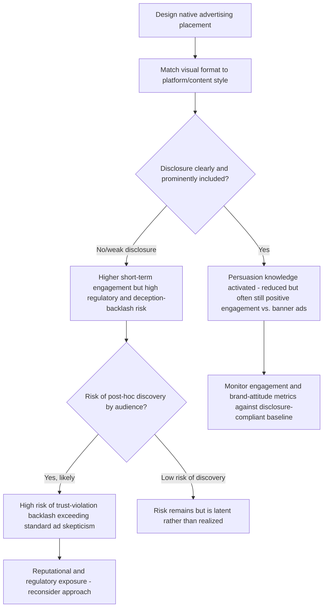

## Native Advertising and Sponsored Content Perception

### Definitions

**Native advertising** is a form of paid media that matches the visual design, format, and functional experience of the surrounding editorial or user-generated content in which it appears, such that it is intended to be consumed as part of the natural content flow rather than recognized as a distinctly separate advertising unit (in contrast to display banners, pre-roll video, or other formats that are visually and structurally distinct from surrounding content). **Sponsored content** is a closely related and often overlapping term referring specifically to content pieces (articles, videos, social posts) that are commissioned or paid for by a brand but presented in the style and voice of the platform's organic content.

### Theoretical Foundation: Persuasion Knowledge and Disclosure

The central theoretical lens for understanding native advertising's psychological effects is the **Persuasion Knowledge Model (PKM)** (Friestad & Wright, 1994), which holds that consumers develop and deploy "persuasion knowledge" — beliefs about how advertisers attempt to influence them — and that this knowledge is activated by cues signaling persuasive intent, prompting more critical, resistant processing once activated.

**Key Points**

- **Recognition as the activating trigger**: Persuasion knowledge activation is contingent on the audience first *recognizing* that a persuasion attempt is occurring — native advertising's defining characteristic (blending with organic content) is specifically designed to delay or reduce this recognition relative to clearly-marked advertising formats.
- **The disclosure paradox**: This creates a documented tension at the core of native advertising ethics and regulation — the same design property that makes native advertising effective (reduced recognition of persuasive intent, leading to processing similar to organic content) is also what makes it potentially deceptive, since audiences who do not recognize an ad as an ad may extend it the same credibility and lower scrutiny they would extend to genuine editorial content.
- **Effects of successful disclosure avoidance**: When native advertising is not recognized as advertising, research has generally found it receives more favorable evaluation and is processed with less counterarguing/skepticism than the same content clearly labeled as an ad — a direct empirical demonstration of persuasion knowledge's moderating role, and the core reason native advertising is commercially attractive relative to clearly-marked formats.

### Disclosure Effects on Native Advertising Effectiveness

**Key Points**

- **Disclosure reduces but does not eliminate effectiveness**: Explicit sponsorship disclosure ("Sponsored," "Paid Partnership," "Advertisement") has been consistently shown in research to activate persuasion knowledge and reduce the favorability gap between native ads and clearly-marked ads, though native advertising with disclosure still often outperforms traditional banner-style advertising on engagement metrics, since the format's integration with the platform experience retains some benefit independent of the disclosure-driven skepticism increase.
- **Disclosure timing and prominence**: The specific placement, wording, and visual prominence of disclosure labels substantially affects how much persuasion knowledge is activated — subtle, easily-overlooked disclosure (e.g., small gray text) produces weaker skepticism activation than prominent, unambiguous disclosure, a finding directly relevant to the regulatory debate over minimum disclosure standards (see Regulatory Landscape below).
- **Perceived deception backlash**: When audiences discover native advertising's sponsored nature *after* having processed it as organic content (rather than being disclosed upfront), research and industry case studies have documented a backlash effect — a feeling of having been misled — that can produce more negative brand and publisher attitudes than either a clearly-disclosed native ad or a conventional, clearly-marked advertisement would have generated, since the retroactive discovery adds a trust-violation dimension beyond ordinary advertising skepticism.

### Native Advertising Format Taxonomy

**Key Points**

- **In-feed native ads**: Ad units formatted to match the visual style of a social media or content feed (e.g., a sponsored post appearing within an Instagram or news feed), the most common contemporary native format.
- **Content recommendation widgets**: "You may also like" or "Around the web" style content units appearing at the end of articles, blending paid and organic recommended content within the same visual module.
- **Branded/sponsored editorial content**: Full articles or video content commissioned by a brand and published under a publisher's editorial-style formatting, sometimes written by the publisher's own staff (paid by the brand) or the publisher's commercial content studio.
- **Influencer and creator sponsored content**: Content created by an individual creator/influencer, paid or gifted by a brand, presented within the creator's normal content style and distribution channel — a rapidly growing native advertising subcategory with its own specific disclosure norms and regulatory attention (e.g., FTC endorsement guidelines requiring clear and conspicuous disclosure of material connections between creators and brands).

### The Content-Advertising Congruence Spectrum

**Key Points**

- **High format congruence, low content distinctiveness risk**: Native ads that closely match platform format but clearly communicate their commercial nature through content framing (e.g., an obviously promotional headline despite native visual styling) balance integration benefits against lower deception risk.
- **High format congruence, high content ambiguity**: Native ads designed to closely mimic both the format *and* the informational/entertainment tone of organic content (appearing to be genuine editorial or user content in substance, not just visual style) maximize the disclosure-paradox risk described above and are the primary target of stricter regulatory and platform-policy scrutiny.
- [Inference] This spectrum suggests that native advertising risk is not fully captured by format matching alone — the degree to which content tone and framing also mimics organic content independently affects both persuasion knowledge activation and ethical/regulatory risk, though isolating the independent contribution of format versus content congruence in specific empirical studies is not something this reference can state with precision.

### Regulatory Landscape

**Key Points**

- Regulatory bodies in multiple jurisdictions (e.g., the U.S. Federal Trade Commission's native advertising and endorsement guidance, similar frameworks in the EU and UK under unfair commercial practices and advertising standards regulation) generally require that native advertising and sponsored content be clearly and conspicuously disclosed such that a reasonable consumer would recognize it as advertising before engaging with the content.
- Influencer and creator sponsored content is subject to specific disclosure requirements in many jurisdictions (e.g., requiring hashtags or labels such as "#ad" or "Paid Partnership" to be clear, unavoidable, and not buried among unrelated hashtags), reflecting regulatory recognition that this format carries particularly high disclosure-ambiguity risk given the personal, trust-based nature of the creator-audience relationship.
- [Unverified] Specific disclosure wording requirements, placement standards, and enforcement practices vary meaningfully by jurisdiction, platform, and are subject to ongoing regulatory revision as native and influencer advertising formats continue to evolve rapidly; verify current requirements in the relevant jurisdiction and platform before implementation.

### Native Advertising Effectiveness and Risk Decision Framework

### Example: Contrasting Disclosure Approaches

A skincare brand sponsors a beauty influencer's video reviewing several products, including the brand's own, without any disclosure that the brand paid for inclusion or provided the product — if audience members later discover the payment arrangement (e.g., through public reporting or the brand's own disclosure elsewhere), the backlash-from-discovery effect described above is likely to produce disproportionate negative sentiment toward both the influencer and brand, compounding ordinary advertising skepticism with a specific trust-violation reaction. In contrast, the same collaboration with a clear, prominent "Paid Partnership" label displayed at the video's outset activates persuasion knowledge upfront, likely reducing initial engagement somewhat relative to the fully undisclosed version, but avoids the compounding discovery-based backlash risk and the associated regulatory exposure.

### Boundary Conditions and Moderators

**Key Points**

- **Platform and audience sophistication**: Audiences with higher general media literacy and native-advertising exposure history show faster persuasion knowledge activation even absent explicit disclosure (they have learned to recognize native ad formatting cues from repeated exposure), somewhat narrowing — though not eliminating — the effectiveness gap between disclosed and undisclosed native advertising over time as a market matures and native formats become more familiar.
- **Content quality as a moderator**: Native/sponsored content that provides genuine informational or entertainment value independent of its promotional function has been associated with more favorable audience response even after disclosure-driven persuasion knowledge activation, compared to sponsored content that is purely promotional in substance — content quality can partially offset, though not eliminate, the skepticism increase from disclosure.
- **Category and topic sensitivity**: Categories involving health, financial, or other high-stakes decisions carry elevated regulatory and ethical scrutiny for native advertising specifically because the disclosure-ambiguity risk compounds with the real-world consequences of a consumer making a high-stakes decision based on content they mistakenly believed was independent editorial or peer content rather than paid promotion.
- **Publisher trust spillover**: Because native advertising is presented within a publisher or platform's own content environment, perceived deception in native advertising can damage trust in the hosting publisher/platform itself, not solely the advertised brand — a distinct risk dimension from traditional display advertising, where the publisher is more clearly understood by audiences to be a separate, uninvolved party from the ad content itself.

### Related Topics

- Persuasion Knowledge Model and consumer skepticism
- Advertising appeals: rational, emotional, moral
- Message structure and argument strength
- Influencer marketing and endorsement disclosure regulation
- Source credibility and endorser effects in advertising
- Comparative advertising and its risks
- Digital advertising regulation and consumer protection law
- Content marketing strategy and brand journalism