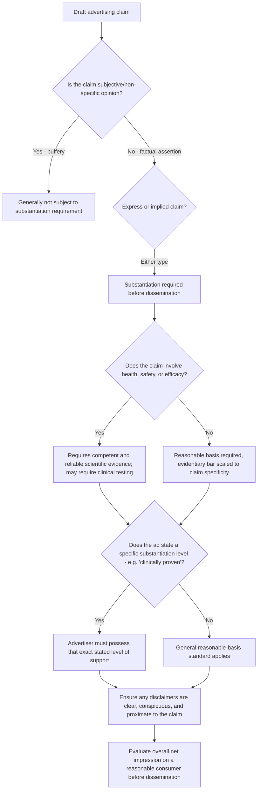

## Regulatory Constraints on Advertising Claims

### Definition and Scope

Regulatory constraints on advertising claims are the body of law, agency guidance, and self-regulatory standards that govern what an advertiser may assert about a product or service, requiring that claims be truthful, non-misleading, and — for claims of a factual/objective nature — supported by adequate evidence before dissemination. In the United States, primary jurisdiction rests with the **Federal Trade Commission (FTC)** under Section 5 of the FTC Act, which prohibits "unfair or deceptive acts or practices in or affecting commerce." Most developed markets maintain analogous frameworks (e.g., the UK's Advertising Standards Authority/CAP Code, the EU's Unfair Commercial Practices Directive), sharing similar core principles of truthfulness, substantiation, and clear disclosure even where specific mechanisms and enforcement bodies differ.

### The Doctrine of Substantiation

**Key Points**

- **Core legal principle**: It has long been held by the FTC and U.S. courts that an advertisement is deceptive where it contains objective or factual claims and the advertiser lacks a reasonable basis for making them — this is the foundational "substantiation doctrine," originating from *Pfizer, Inc.*, 81 F.T.C. 23 (1972), and remains the operative legal standard.
- **Pre-claim substantiation requirement**: Advertisers must possess a reasonable basis for a claim *before* it is disseminated, not develop supporting evidence retroactively after the claim has already run — developing substantiation after making a claim is generally not sufficient to satisfy the doctrine, since the requirement is forward-looking rather than a defense constructed after the fact.
- **Reasonable basis standard**: A "reasonable basis" means objective evidence supporting the claim, with the type and amount of evidence required depending on the specific claim made — this creates a variable, claim-contingent evidentiary threshold rather than a single fixed evidentiary bar applicable to every advertising claim.
- **Self-imposed substantiation levels**: If an advertisement itself claims a specific level of substantiation (e.g., "two out of three doctors recommend," "clinically proven," "tests show"), the advertiser must actually possess that specific level of support — the ad's own framing of its evidentiary basis becomes a binding component of the substantiation requirement, meaning overstating the rigor of one's own evidence within the ad compounds rather than merely accompanies the underlying substantiation risk.

### Types of Claims and Differentiated Substantiation Burdens

Advertising claims are generally categorized based on their factual character, with materially different substantiation requirements attaching to each category:

**Key Points**

- **Puffery**: Exaggerated, subjective, non-specific statements of opinion (e.g., "the best coffee in the world") that a reasonable consumer would not interpret as a literal factual assertion — puffery is generally not subject to substantiation requirements and is largely immune from deceptive-advertising challenge precisely because it is not treated as a factual claim at all.
- **Express claims**: Direct, explicit factual assertions (e.g., "reduces cavities by 40%") — these require substantiation, and the specificity of the numeric or comparative claim generally raises the evidentiary bar correspondingly.
- **Implied claims**: Assertions not stated directly but reasonably inferred by consumers from the ad's overall content, imagery, or context — implied claims carry the same substantiation obligation as express claims, and critically, liability is determined by **what reasonable consumers understand the advertisement to communicate, not by the advertiser's subjective intent** — a consumer-perception-driven standard rather than an advertiser-intent-driven one.
- **Comparative and superiority claims**: Claims asserting relative advantage over a competitor (see Comparative Advertising and Its Risks) require particularly rigorous proof, often demanding industry-standard testing methodology to substantiate the specific comparative assertion made.
- **Establishment claims**: Claims that explicitly reference having been proven by tests or studies (e.g., "clinically shown to...") obligate the advertiser to possess the specific level and type of substantiation the advertisement itself represents — a direct extension of the self-imposed substantiation level principle above.

### Heightened Substantiation for Health and Safety Claims

**Key Points**

- Advertisements making health, safety, or efficacy claims require a higher evidentiary standard than general product claims, generally requiring **"competent and reliable scientific evidence"** — defined as tests, analyses, research, or studies conducted and evaluated objectively by qualified professionals, using procedures generally accepted in the relevant field, to yield accurate and reliable results.
- For claims involving disease prevention, risk reduction, or similarly serious health representations, well-controlled human clinical testing is often the expected evidentiary standard, reflecting the elevated consumer-harm risk if such claims prove false.
- This heightened standard has been the subject of continued and active FTC enforcement attention — in April 2023 the FTC sent Notices of Penalty Offenses to hundreds of advertisers of over-the-counter drugs, homeopathic products, dietary supplements, and functional foods, reminding them of the substantiation and endorsement obligations and signaling the availability of civil penalties for future violations by companies that received notice. [Unverified] Specific penalty amounts and the current enforcement posture are subject to ongoing regulatory activity and should be verified against current FTC guidance for any time-sensitive compliance determination.

### Disclosure and Disclaimer Standards

**Key Points**

- **Clear and conspicuous standard**: Qualifying information, disclaimers, and disclosures must be presented clearly and conspicuously enough that a reasonable consumer would actually notice and understand them — guidance specifies that advertisers should use clear and unambiguous language, place qualifying information close to (proximate to) the claim being qualified, and avoid small type or distracting elements that could undercut the disclosure's effectiveness.
- **Disclaimers cannot cure a false claim**: A critical limiting principle — a disclaimer or disclosure can clarify or narrow the scope of a claim, but it cannot contradict the claim or rescue an otherwise false or misleading assertion; a disclaimer is a clarification mechanism, not an escape valve for an underlying deceptive claim.
- **Net impression doctrine**: Deceptiveness is evaluated based on the **overall net impression** an advertisement creates for a reasonable consumer encountering it in realistic conditions — not on a literal, isolated parsing of individual words or claims in the ad. This means an advertisement can be found deceptive even if every individual factual statement within it is technically true, if the combined visual, verbal, and contextual impression misleads a reasonable consumer.

### Regulatory Claims Assessment Framework

### Comparative and Endorsement-Specific Constraints

**Key Points**

- Comparative superiority claims (see Comparative Advertising and Its Risks) generally carry a heightened substantiation burden precisely because they simultaneously make an assertion about the advertiser's own product and an implicit or explicit assertion about a competitor's inferiority — a dual-claim structure requiring evidence sufficient to support both halves of the comparison.
- Endorsements and testimonials (including creator/influencer sponsored content — see Native Advertising and Sponsored Content Perception) are subject to specific FTC Endorsement Guides requiring that endorsements reflect the honest opinions of the endorser, that any material connection (payment, free product, employment relationship) between the endorser and advertiser be clearly and conspicuously disclosed, and that the underlying advertised claims themselves still meet ordinary substantiation requirements independent of the endorsement format.
- [Unverified] The FTC's Endorsement Guides and related enforcement priorities have been subject to periodic review and rulemaking; current specific requirements for a given format (e.g., influencer disclosure wording, hashtag placement standards) should be verified against current FTC guidance given the pace of format evolution in this space.

### Example: Applying the Framework to a Sample Claim

Consider an advertisement stating "Clinical studies show our supplement reduces joint pain by 50%, and it's the #1 doctor-recommended brand." This contains at least three distinct claims requiring separate substantiation: (1) an express health-efficacy claim ("reduces joint pain by 50%") requiring competent and reliable scientific evidence, likely including controlled clinical testing given the specific numeric and health-related nature of the assertion; (2) an establishment claim ("clinical studies show") obligating the advertiser to possess studies of the type and rigor the phrase implies to a reasonable consumer; and (3) a comparative/superiority claim ("#1 doctor-recommended") requiring specific survey or market-data substantiation proportionate to that particular assertion. A disclaimer in small print stating "results not typical" would not cure a false or unsubstantiated version of the 50% claim, since a disclaimer cannot contradict or rescue an underlying deceptive assertion under the doctrine described above.

### Cross-Jurisdictional Considerations

**Key Points**

- While the FTC framework is a widely referenced model, most developed advertising markets maintain broadly analogous truthfulness, substantiation, and clear-disclosure principles, though the specific enforcement bodies, penalty structures, and procedural mechanisms differ meaningfully by jurisdiction (e.g., self-regulatory bodies such as the National Advertising Division (NAD) operate alongside government regulators in the U.S. advertising ecosystem, while other markets rely more heavily on either government regulators or industry self-regulation as the primary enforcement mechanism).
- Claims relating to environmental/sustainability benefits (see Advertising Appeals: Rational, Emotional, Moral, regarding greenwashing risk) and health/wellness benefits are consistently identified across jurisdictions as elevated-scrutiny categories warranting particular substantiation rigor, reflecting convergent regulatory concern about consumer vulnerability and potential harm magnitude in these specific claim categories.
- [Unverified] Specific claim substantiation standards, disclosure requirements, and penalty structures vary meaningfully across jurisdictions and are subject to ongoing legal and regulatory development; advertisers operating across multiple markets should verify current, jurisdiction-specific requirements rather than assuming a single framework (such as the FTC's) applies uniformly worldwide.

### Related Topics

- Comparative advertising and its risks
- Native advertising and sponsored content perception
- Advertising appeals: rational, emotional, moral (greenwashing and moral-claim substantiation)
- FTC Endorsement Guides and influencer disclosure requirements
- Health and wellness product marketing compliance
- Net impression doctrine and reasonable consumer standard
- Self-regulatory advertising review (e.g., National Advertising Division)
- Cross-border advertising compliance strategy